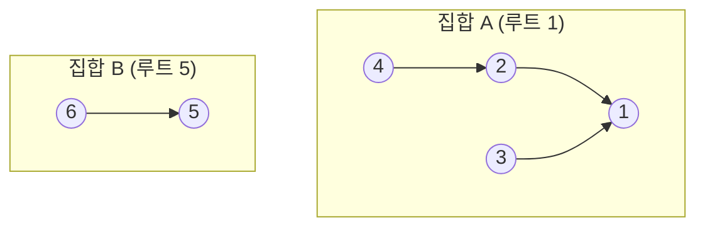
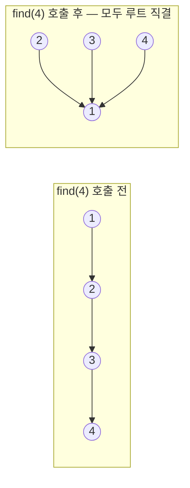

# 유니온파인드 (Union-Find / 분리 집합, Disjoint Set Union)

> **오늘의 주제: 유니온파인드 (Union-Find / DSU)**
> "이 두 원소가 같은 그룹(집합)에 속하는가?"를 거의 O(1)로 답하는 자료구조.
> 그래프의 **연결성 판별**, **사이클 탐지**, 그리고 **크루스칼 MST**의 핵심 부품이다.

---

## 1. 무엇을 푸는가 — 언제 쓰는가

원소들을 **여러 개의 서로소 집합(disjoint set)** 으로 관리하면서, 두 가지 연산을 빠르게 한다.

- **find(x)** : x가 속한 집합의 **대표(루트)** 를 찾는다.
- **union(a, b)** : a가 속한 집합과 b가 속한 집합을 **하나로 합친다**.

다음 신호가 보이면 유니온파인드를 의심하라.

- "두 노드가 **연결되어 있는가**?" / "같은 그룹인가?"
- 간선을 추가하다가 **사이클이 생기는 순간** 잡아내기
- **연결 요소(컴포넌트)의 개수** 세기
- **크루스칼 알고리즘**으로 최소 신장 트리(MST) 만들기

핵심 직관: 각 집합을 **트리**로 표현하고, 트리의 **루트가 곧 집합의 ID**다.
두 원소의 루트가 같으면 같은 집합, 다르면 다른 집합.



위 그림에서 `find(4)`는 4→2→1 을 타고 올라가 루트 **1**을 반환한다.
`find(6)`은 **5**. 루트가 다르므로 4와 6은 다른 집합이다.

---

## 2. 왜 빠른가 — 두 가지 최적화

순진하게 구현하면 트리가 한 줄로 길어져(편향) find가 O(N)까지 느려진다.
아래 **두 최적화**를 같이 쓰면 한 연산이 거의 상수 시간 = **O(α(N))** 이 된다.
(α는 애커만 함수의 역함수로, 현실의 N에서는 사실상 4 이하)

### (1) 경로 압축 (Path Compression)
find를 하는 김에, 거쳐간 모든 노드를 **루트에 직접 연결**해버린다.
다음 find부터는 한 번에 루트로 점프한다.

```python
def find(x):
    if parent[x] != x:
        parent[x] = find(parent[x])  # 올라가면서 부모를 루트로 갱신
    return parent[x]
```

### (2) 랭크/크기 기반 합치기 (Union by Rank / Size)
union할 때 **작은 트리를 큰 트리 밑에** 붙인다. 트리 높이가 덜 자란다.



> **주의점**: 경로 압축만 써도 실전 코테는 대부분 통과한다.
> 다만 재귀 find는 정점이 많으면 `sys.setrecursionlimit` 을 올리거나 **반복문 버전**을 쓰자.

---

## 3. Python 템플릿

```python
import sys
input = sys.stdin.readline
sys.setrecursionlimit(10**6)

def find(x):
    if parent[x] != x:
        parent[x] = find(parent[x])   # 경로 압축
    return parent[x]

def union(a, b):
    ra, rb = find(a), find(b)
    if ra == rb:
        return False                  # 이미 같은 집합 (사이클!)
    if rank[ra] < rank[rb]:            # 랭크 작은 쪽을 밑으로
        ra, rb = rb, ra
    parent[rb] = ra
    if rank[ra] == rank[rb]:
        rank[ra] += 1
    return True

n = int(input())
parent = list(range(n + 1))           # 자기 자신을 부모로 초기화
rank = [0] * (n + 1)
```

**반복문 버전 find (재귀 깊이 걱정 없음):**
```python
def find(x):
    root = x
    while parent[root] != root:
        root = parent[root]
    while parent[x] != root:          # 경로 압축
        parent[x], x = root, parent[x]
    return root
```

---

## 4. 대표 예제

### 예제 1 — 백준 1717 「집합의 표현」

n+1개의 원소(0..n). 두 종류의 질의를 처리한다.
- `0 a b` : a가 속한 집합과 b가 속한 집합을 합친다 (union)
- `1 a b` : a와 b가 같은 집합이면 `YES`, 아니면 `NO`

**핵심 아이디어**: union/find를 그대로 호출. `1` 질의는 두 루트가 같은지만 비교.

```python
import sys
input = sys.stdin.readline
sys.setrecursionlimit(10**6)

def find(x):
    if parent[x] != x:
        parent[x] = find(parent[x])
    return parent[x]

def union(a, b):
    ra, rb = find(a), find(b)
    if ra != rb:
        parent[rb] = ra

n, m = map(int, input().split())
parent = list(range(n + 1))

out = []
for _ in range(m):
    op, a, b = map(int, input().split())
    if op == 0:
        union(a, b)
    else:
        out.append("YES" if find(a) == find(b) else "NO")
print('\n'.join(out))
```

- **시간복잡도**: 질의당 거의 O(α(N)) → 전체 **O(M·α(N))**
- **자주 하는 실수**:
  - 결과를 매번 `print` 하면 느리다 → 리스트에 모아 `'\n'.join` 으로 한 번에 출력
  - `parent`를 `0..n` 까지 n+1개로 잡아야 함 (인덱스 off-by-one 주의)

### 예제 2 — 백준 1976 「여행 가자」

도시 N개, 여행 계획에 M개 도시가 등장. 연결 정보(인접 행렬)가 주어질 때
**계획의 모든 도시가 같은 집합**이면 `YES`.

**핵심 아이디어**: 연결된 도시끼리 전부 union → 계획 도시들의 루트가 **모두 같은지** 확인.

```python
import sys
input = sys.stdin.readline

def find(x):
    if parent[x] != x:
        parent[x] = find(parent[x])
    return parent[x]

n = int(input())
m = int(input())
parent = list(range(n + 1))

for i in range(1, n + 1):
    row = list(map(int, input().split()))
    for j in range(n):
        if row[j] == 1:
            a, b = find(i), find(j + 1)
            if a != b:
                parent[b] = a

plan = list(map(int, input().split()))
root = find(plan[0])
print("YES" if all(find(c) == root for c in plan) else "NO")
```

- **핵심 포인트**: "다 같은 그룹인가?"는 **첫 원소의 루트**와 나머지를 비교하면 끝.
- **시간복잡도**: 인접행렬 union이 O(N²), 확인이 O(M).

---

## 5. 한눈에 정리

- **자료구조**: `parent[]` 배열 하나. 루트 = `parent[x] == x` 인 노드.
- **find**: 루트까지 올라가며 **경로 압축**.
- **union**: 두 루트를 잇되, **이미 같은 루트면 사이클** (크루스칼에서 이 간선은 버린다).
- **연결 요소 개수**: `sum(1 for i in nodes if find(i) == i)` — 루트의 개수.
- **다음 주제로의 연결**: 간선을 가중치 오름차순 정렬 + "union이 성공할 때만 채택" = **크루스칼 MST**.

```python
# 사이클 판정 / 연결 요소 세기 핵심
if find(a) != find(b):
    union(a, b)          # 새 간선 채택
else:
    # find(a) == find(b) → 이 간선을 더하면 사이클
    pass
components = sum(1 for i in range(1, n + 1) if find(i) == i)
```
