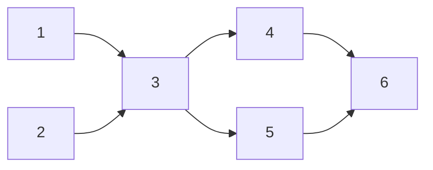
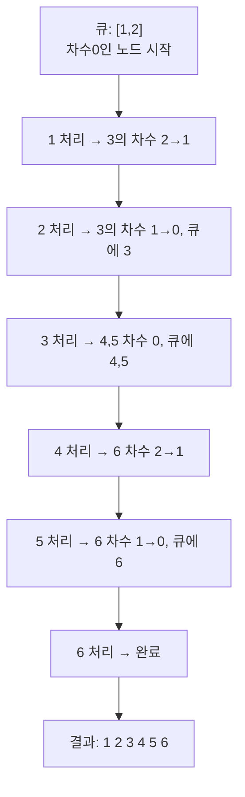

# 오늘의 주제: 위상정렬 (Topological Sort)

> **DAG(사이클 없는 방향 그래프)** 의 정점들을, 모든 간선 `u → v` 에 대해 `u`가 `v`보다 앞에 오도록 일렬로 줄 세우는 알고리즘.
> "선행 작업 → 후행 작업" 순서가 있는 문제(선수과목, 작업 스케줄링, 빌드 순서)의 핵심 도구.

---

## 1. 언제 쓰나?

- **순서 제약**이 "A를 B보다 먼저"처럼 **방향**으로 주어질 때
- 예: 선수과목 이수 순서, 빌드 의존성, 줄 세우기, 작업 우선순위
- 전제 조건: **방향 그래프 + 사이클 없음(DAG)**
  - 사이클이 있으면 위상정렬 **불가능** (서로가 서로의 선행이 되어 모순)

---

## 2. 핵심 아이디어 — Kahn 알고리즘 (BFS 기반)

핵심은 **진입차수(indegree)**: 어떤 노드로 들어오는 간선의 개수.

> **진입차수가 0인 노드 = 지금 당장 처리해도 되는 노드** (앞에 와야 할 선행이 없음)

1. 모든 노드의 진입차수를 센다.
2. 진입차수가 0인 노드를 전부 큐에 넣는다.
3. 큐에서 하나 꺼내 결과에 추가 → 그 노드가 가리키던 이웃들의 진입차수를 1 감소.
4. 감소 결과 진입차수가 0이 된 이웃을 큐에 넣는다.
5. 큐가 빌 때까지 반복.

### 왜 동작하는가? (정당성)
- 진입차수 0인 노드는 **남은 어떤 노드보다 먼저 와도 제약을 어기지 않는다.**
- 그 노드를 빼면, 그것에 의존하던 노드들의 "선행 조건"이 하나 충족됨 → 차수 감소.
- 이 과정을 반복하면 항상 "지금 가능한 것"부터 차례로 배치 → 유효한 순서 완성.

### 사이클 판정 (중요 부수효과)
- 정렬 결과에 포함된 노드 수가 **전체 노드 수보다 적으면** → 사이클 존재 (위상정렬 실패).
- 사이클 안의 노드들은 진입차수가 영원히 0이 되지 못해 큐에 못 들어감.

---

## 3. 동작 그림

다음 의존 관계(`A → B`: A가 B보다 먼저)를 위상정렬하는 과정:



진입차수 초기값: `1:0, 2:0, 3:2, 4:1, 5:1, 6:2`



> 답이 여러 개일 수 있음(예: `2 1 3 ...` 도 유효). 큐에 동시에 여러 노드가 있을 때 어떤 걸 먼저 빼느냐에 따라 갈림.

---

## 4. 예제 1 — 백준 2252 줄 세우기

**문제**: N명의 학생 키 비교 결과 M개(`A B` = A가 B보다 앞)가 주어질 때, 가능한 줄 순서 하나를 출력.

전형적인 위상정렬 기본 문제.

```python
import sys
from collections import deque
input = sys.stdin.readline

N, M = map(int, input().split())
graph = [[] for _ in range(N + 1)]
indegree = [0] * (N + 1)

for _ in range(M):
    a, b = map(int, input().split())
    graph[a].append(b)      # a → b (a가 앞)
    indegree[b] += 1

queue = deque(i for i in range(1, N + 1) if indegree[i] == 0)
result = []

while queue:
    cur = queue.popleft()
    result.append(cur)
    for nxt in graph[cur]:
        indegree[nxt] -= 1
        if indegree[nxt] == 0:
            queue.append(nxt)

print(*result)
```

- **시간복잡도**: O(V + E) — 모든 노드·간선을 한 번씩만 처리
- **핵심**: 간선 방향 = "먼저 오는 쪽 → 나중 오는 쪽". indegree 0부터 빼나간다.

---

## 5. 예제 2 — 백준 1766 문제집

**문제**: 1~N번 문제. "문제 A를 B보다 먼저 풀어야 한다" 제약 M개.
조건 만족하면서 **번호가 작은 문제를 가능한 먼저** 풀고 싶다 → 출력 순서를 정하라.

핵심 변화: **여러 답 중 "번호 작은 것 우선"** → 큐 대신 **최소 힙(우선순위 큐)** 사용.

```python
import sys, heapq
input = sys.stdin.readline

N, M = map(int, input().split())
graph = [[] for _ in range(N + 1)]
indegree = [0] * (N + 1)

for _ in range(M):
    a, b = map(int, input().split())
    graph[a].append(b)
    indegree[b] += 1

heap = [i for i in range(1, N + 1) if indegree[i] == 0]
heapq.heapify(heap)
result = []

while heap:
    cur = heapq.heappop(heap)   # 가능한 것 중 가장 작은 번호
    result.append(cur)
    for nxt in graph[cur]:
        indegree[nxt] -= 1
        if indegree[nxt] == 0:
            heapq.heappush(heap, nxt)

print(*result)
```

- **핵심 아이디어**: "여러 정답 중 사전순/번호순 최소"를 원하면 `deque` → `heapq` 로만 바꾸면 됨.
- **시간복잡도**: O((V + E) log V) — 힙 연산 때문에 log 붙음.

---

## 6. Python 템플릿

```python
from collections import deque

def topological_sort(n, graph, indegree):
    queue = deque(i for i in range(1, n + 1) if indegree[i] == 0)
    order = []
    while queue:
        cur = queue.popleft()
        order.append(cur)
        for nxt in graph[cur]:
            indegree[nxt] -= 1
            if indegree[nxt] == 0:
                queue.append(nxt)
    # 사이클 판정: 모든 노드를 못 담았으면 DAG가 아님
    if len(order) != n:
        return None      # 사이클 존재 → 위상정렬 불가
    return order
```

---

## 7. 자주 하는 실수

- **방향 헷갈림**: "A가 B보다 먼저" → 간선은 `A → B`, 그리고 `indegree[B] += 1`. 거꾸로 넣으면 답이 뒤집힘.
- **시작 큐 누락**: 진입차수 0인 노드를 **전부** 넣어야 함 (하나만 넣지 않기).
- **사이클 미검사**: 사이클 가능성이 있는 문제는 `len(order) != n` 체크 필수.
- **자기 노드 indegree 감소 잊음**: 이웃의 indegree만 줄인다. 현재 노드는 이미 결과에 들어감.
- **출력 형식**: 보통 공백 구분(`print(*result)`) 또는 줄바꿈. 문제 지문 확인.

---

## 8. 한 줄 요약

> **진입차수 0인 노드부터 꺼내며 이웃 차수를 깎는다.**
> 순서가 여럿이면 `deque`, 사전순 최소가 필요하면 `heapq`.
> 다 못 꺼냈으면 사이클.
