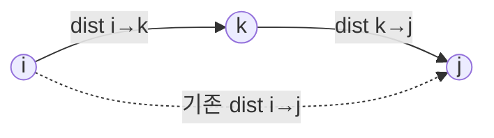

# 오늘의 주제: 플로이드-워셜 (Floyd-Warshall) — 모든 쌍 최단경로

> 한 정점에서가 아니라 **모든 정점 쌍 (i, j)** 사이의 최단경로를 한 번에 구한다.
> 다익스트라가 "한 출발점 → 나머지 전부"였다면, 플로이드-워셜은 "전부 → 전부".

---

## 1. 언제 쓰나

- 정점 수 `V`가 작을 때 (보통 **V ≤ 400~500**). `O(V³)`이라 그 이상은 무리.
- 모든 정점 쌍의 최단거리가 필요할 때 (예: 임의의 두 도시 간 거리표).
- **음수 간선이 있어도 동작** (음수 사이클만 없으면 OK). 다익스트라는 음수 간선에서 깨진다.

## 2. 핵심 아이디어 — "거쳐 가는 정점"을 하나씩 허용

DP의 정의가 전부다.

```
dist[i][j] = i에서 j로 가는 최단거리
```

`k`번 정점을 **경유지로 허용**했을 때를 단계적으로 갱신한다:

```
dist[i][j] = min( dist[i][j],            # k를 안 거침
                  dist[i][k] + dist[k][j] ) # k를 거침
```

`k`를 1번부터 V번까지 차례로 "경유 가능 집합"에 넣으면서 갱신하면,
모든 정점을 경유지로 고려한 진짜 최단거리가 나온다.

### 왜 동작하는가 (정당성)
- `k` 루프가 가장 바깥에 있는 게 **핵심**.
- "정점 1..k만 경유지로 쓸 때 i→j 최단거리"가 단계마다 정확히 유지되는 귀납.
- k번째 단계에서 i→j 경로는 (k를 안 씀) 또는 (i→k→j, 둘 다 1..k-1만 경유) 둘 중 하나로 나뉜다.
  뒤 항은 이미 이전 단계에서 올바르게 계산돼 있으므로 그대로 합치면 된다.


> 두 경로 중 더 짧은 것을 택한다: `min(직행, i→k→j)`

## 3. 시간 / 공간 복잡도
- 시간: **O(V³)** (삼중 루프)
- 공간: **O(V²)** (거리 행렬)

## 4. Python 템플릿

```python
INF = float('inf')

def floyd_warshall(n, edges):
    # 1-indexed 정점 가정
    dist = [[INF] * (n + 1) for _ in range(n + 1)]
    for i in range(1, n + 1):
        dist[i][i] = 0
    for u, v, w in edges:
        dist[u][v] = min(dist[u][v], w)  # 중복 간선은 최소값만

    for k in range(1, n + 1):            # 경유지 k (★ 가장 바깥)
        for i in range(1, n + 1):
            if dist[i][k] == INF:        # 가지치기: i→k 없으면 스킵
                continue
            dik = dist[i][k]
            row_k = dist[k]
            row_i = dist[i]
            for j in range(1, n + 1):
                if dik + row_k[j] < row_i[j]:
                    row_i[j] = dik + row_k[j]
    return dist
```

> 음수 사이클 판정: 갱신 후 어떤 `dist[i][i] < 0`이면 음수 사이클 존재.

---

## 5. 대표 예제 ① — BOJ 11404 플로이드

도시 n개, 버스 m개(시작·도착·비용). 모든 도시 쌍 (A, B) 최단 비용을 출력.
- 같은 노선이 여러 개일 수 있으니 **간선 입력 시 min** 처리 필수.
- 도달 불가는 `0` 출력.

```python
import sys
input = sys.stdin.readline
INF = float('inf')

n = int(input())
m = int(input())
dist = [[INF] * (n + 1) for _ in range(n + 1)]
for i in range(1, n + 1):
    dist[i][i] = 0

for _ in range(m):
    a, b, c = map(int, input().split())
    dist[a][b] = min(dist[a][b], c)   # ★ 중복 간선 최소값

for k in range(1, n + 1):
    for i in range(1, n + 1):
        if dist[i][k] == INF:
            continue
        for j in range(1, n + 1):
            if dist[i][k] + dist[k][j] < dist[i][j]:
                dist[i][j] = dist[i][k] + dist[k][j]

out = []
for i in range(1, n + 1):
    row = [0 if dist[i][j] == INF else dist[i][j] for j in range(1, n + 1)]
    out.append(' '.join(map(str, row)))
print('\n'.join(out))
```

## 6. 대표 예제 ② — BOJ 11403 경로 찾기 (도달 가능성)

가중치 없는 방향그래프에서 i→j 경로 존재 여부(1/0).
거리 대신 **불리언 도달 행렬**에 플로이드 골격을 그대로 적용.

```python
import sys
input = sys.stdin.readline

n = int(input())
g = [list(map(int, input().split())) for _ in range(n)]  # 0/1 인접행렬

for k in range(n):
    for i in range(n):
        if g[i][k]:                       # i→k 가능할 때만
            for j in range(n):
                if g[k][j]:               # i→k→j 가능 → i→j 가능
                    g[i][j] = 1

print('\n'.join(' '.join(map(str, row)) for row in g))
```

---

## 7. 자주 하는 실수
- **루프 순서**: `k`가 반드시 **가장 바깥**. i, j를 바깥에 두면 틀린 답. 외우지 말고 "경유지를 하나씩 늘린다"로 이해.
- 중복 간선을 덮어쓰기(`=`)로 넣어 더 큰 비용이 남는 경우 → 반드시 `min`.
- 자기 자신 `dist[i][i] = 0` 초기화 빠뜨림.
- INF끼리 더해 오버플로/거짓 갱신 → `if dist[i][k] == INF: continue` 가지치기로 방지.
- V가 크면(>500) 플로이드 금지. 다익스트라 V번 또는 다른 접근.

## 8. 다익스트라 vs 플로이드-워셜
- 단일 출발 + 양수 간선 → **다익스트라** `O(E log V)`
- 모든 쌍 + 작은 V + 음수 간선 허용 → **플로이드-워셜** `O(V³)`
- 모든 쌍인데 V가 크고 간선 희소 → 다익스트라 V번이 더 빠를 수 있음
