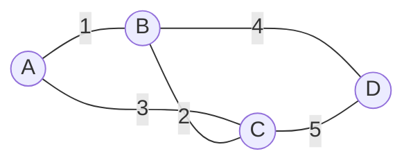

# 오늘의 주제: 최소 스패닝 트리 (MST) — 크루스칼 알고리즘

> 언어: **Python**
> 선행 개념: [유니온파인드(분리 집합)](2026-06-12-유니온파인드.md) — MST의 핵심 부품

---

## 1. 스패닝 트리란?

- **스패닝 트리(Spanning Tree)**: 그래프의 모든 정점을 연결하되 **사이클이 없는** 부분 그래프.
  - 정점 V개 → 간선은 정확히 **V-1개**. 하나라도 더 넣으면 사이클이 생긴다.
- **최소 스패닝 트리(MST)**: 그런 스패닝 트리 중 **간선 가중치 합이 최소**인 것.
- 쓰임새: "모든 도시를 최소 비용으로 도로 연결", "모든 컴퓨터를 최소 케이블로 네트워크" 같은 **전체 연결 최소 비용** 문제.



위 그래프에서 MST는 A-B(1), B-C(2), B-D(4) → 합 **7**. (A-C(3), C-D(5)는 사이클을 만들어 버려진다.)

---

## 2. 크루스칼 알고리즘 (Kruskal)

핵심 한 줄: **간선을 가중치 오름차순으로 정렬하고, 사이클을 안 만드는 간선만 차례로 채택한다.**

1. 모든 간선을 가중치 기준 **오름차순 정렬**.
2. 가장 싼 간선부터 본다.
3. 그 간선의 두 끝점이 **이미 같은 집합**이면(= 연결돼 있으면) → 추가 시 사이클 → **버린다**.
4. 다른 집합이면 → **채택**하고 두 집합을 `union`.
5. 채택한 간선이 **V-1개**가 되면 종료.

> "같은 집합인지" 판정과 "합치기"가 바로 **유니온파인드**다. 그래서 MST = 정렬 + 유니온파인드.

### 왜 동작하는가 (정당성)

**그리디가 최적인 이유 — 컷(cut) 성질**: 어떤 방식으로 정점을 두 그룹으로 나눠도, 그 두 그룹을 잇는 간선들 중 **가장 가벼운 간선은 반드시 어떤 MST에 포함**된다. 크루스칼은 매번 "두 집합을 처음 잇는 가장 싼 간선"을 고르므로 이 성질을 그대로 따른다. 이미 연결된 정점을 잇는 간선은 컷을 가로지르지 않으므로 버려도 손해가 없다.

### 시간복잡도

- 간선 정렬: **O(E log E)** — 이 부분이 지배적.
- 유니온파인드 연산: 거의 O(1) (역아커만 함수).
- 전체 **O(E log E)**. 간선 수가 많지 않은 희소 그래프에서 특히 강하다.

---

## 3. Python 템플릿

```python
import sys
input = sys.stdin.readline

def find(x):
    while parent[x] != x:
        parent[x] = parent[parent[x]]  # 경로 압축
        x = parent[x]
    return x

def union(a, b):
    ra, rb = find(a), find(b)
    if ra == rb:
        return False        # 이미 같은 집합 → 사이클
    parent[rb] = ra
    return True

V, E = map(int, input().split())
parent = list(range(V + 1))

edges = []
for _ in range(E):
    a, b, w = map(int, input().split())
    edges.append((w, a, b))

edges.sort()                # 가중치 오름차순 (튜플 첫 원소 기준)

total, cnt = 0, 0
for w, a, b in edges:
    if union(a, b):         # 사이클 안 생기면 채택
        total += w
        cnt += 1
        if cnt == V - 1:    # 간선 V-1개 모으면 완성
            break

print(total)
```

---

## 4. 대표 예제

### 예제 1 — 백준 1197 최소 스패닝 트리

가장 기본형. 정점 V, 간선 E와 각 간선 `(a, b, 가중치)`가 주어지고 MST 가중치 합을 출력.

- **핵심 아이디어**: 간선을 `(w, a, b)` 튜플로 저장 → `sort()` → 위 템플릿 그대로.
- **시간복잡도**: O(E log E). (V ≤ 10,000, E ≤ 100,000)
- 위 템플릿이 그대로 정답.

### 예제 2 — 백준 1922 네트워크 연결

N개의 컴퓨터를 연결하는 데 드는 **최소 비용**. 같은 두 컴퓨터 사이에 여러 회선이 있을 수 있다.

```python
import sys
input = sys.stdin.readline

def find(x):
    while parent[x] != x:
        parent[x] = parent[parent[x]]
        x = parent[x]
    return x

n = int(input())
m = int(input())
parent = list(range(n + 1))

edges = []
for _ in range(m):
    a, b, c = map(int, input().split())
    edges.append((c, a, b))
edges.sort()

total = 0
for c, a, b in edges:
    ra, rb = find(a), find(b)
    if ra != rb:            # 다른 집합일 때만 연결
        parent[rb] = ra
        total += c

print(total)
```

- **포인트**: 중복 간선(같은 a, b에 비용만 다른 것)이 있어도 정렬 후 싼 것이 먼저 채택되고 비싼 건 자동으로 사이클 판정에 걸려 버려진다 → **따로 전처리할 필요 없음**.

---

## 5. 자주 하는 실수

- **간선 정렬을 빼먹음** → 크루스칼이 아니라 그냥 아무 간선 선택이 됨. 반드시 `sort()`.
- **튜플 순서 실수**: `(w, a, b)`처럼 **가중치를 맨 앞**에 둬야 `sort()`가 가중치 기준으로 정렬한다. `(a, b, w)`로 넣고 정렬하면 엉뚱한 기준이 된다.
- **union에서 루트끼리 합치지 않음**: `parent[b] = a`가 아니라 `parent[find(b)] = find(a)`. 루트가 아닌 노드를 붙이면 트리가 깨진다. (템플릿처럼 `union` 안에서 `find`로 루트를 구해 합칠 것.)
- **종료 조건**: 간선 V-1개를 채택하면 끝. 안 걸어도 답은 같지만, 큰 입력에서 시간 절약.
- **parent 크기**: 정점이 1-indexed면 `range(V+1)`로 잡기. 0-indexed면 `range(V)`.

---

## 보너스 — 프림(Prim) vs 크루스칼

- **크루스칼**: 간선 중심. 간선을 정렬해 싼 것부터. 간선이 적은 **희소 그래프**에 유리. (구현이 직관적)
- **프림**: 정점 중심. 한 정점에서 시작해 우선순위 큐로 가장 싼 간선을 확장 (다익스트라와 닮음). 간선이 빽빽한 **밀집 그래프**에 유리.
- 코딩테스트에선 **유니온파인드만 있으면 되는 크루스칼**이 압도적으로 자주 쓰인다.
