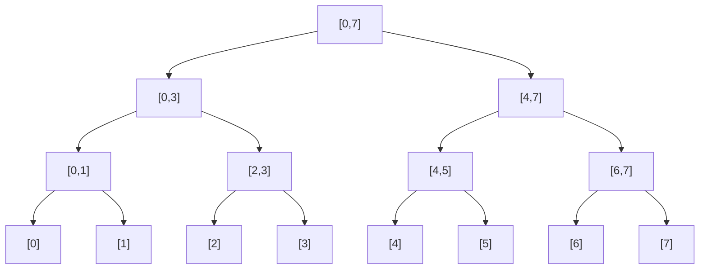

# 오늘의 주제: 세그먼트 트리 (Segment Tree)

> **구간 합/최솟값/최댓값 같은 "구간 질의 + 점 갱신"을 둘 다 O(log N)에 처리하는 자료구조.**

## 왜 필요한가

배열에서 두 가지 연산이 섞여 들어올 때를 생각해 보자.

1. **구간 질의(query)**: "i번째부터 j번째까지의 합은?"
2. **점 갱신(update)**: "k번째 값을 v로 바꿔라"

| 방법 | 구간 질의 | 점 갱신 |
|------|-----------|---------|
| 단순 배열 | O(N) | O(1) |
| 누적 합(prefix sum) | O(1) | **O(N)** (갱신 시 뒤를 전부 다시 계산) |
| **세그먼트 트리** | **O(log N)** | **O(log N)** |

→ **갱신이 자주 일어나면서 구간 질의도 많은 경우** 세그먼트 트리가 정답. 누적 합은 값이 안 바뀔 때만 유리하다.

## 핵심 아이디어

- 배열 구간을 **이진 트리**로 쪼갠다. 루트는 전체 구간 `[0, N-1]`, 자식은 절반씩, 리프는 원소 1개.
- 각 노드는 **자기 담당 구간의 합(또는 min/max)** 을 들고 있다.
- 부모 = 왼쪽 자식 + 오른쪽 자식 → 갱신은 리프에서 루트까지 경로(높이 log N)만 고치면 된다.
- 질의는 "찾는 구간에 완전히 포함되면 그 노드 값을 바로 쓰고, 걸치면 양쪽으로 내려간다" → 방문 노드 O(log N).

### 구간 [0,7]의 분할 구조



질의 `[2,5]` 라면 → `[2,3]`(완전 포함, 즉시 사용) + `[4,5]`(완전 포함, 즉시 사용) 두 노드만 더하면 끝. 8개 원소를 다 더하지 않는다.

## 왜 O(log N)인가 (정당성)

트리 높이는 `⌈log₂ N⌉`. 질의 시 각 레벨에서 "걸치는" 노드는 좌우 끝 최대 2개뿐이라, 전체 방문 노드 수가 레벨 수에 비례 → O(log N). 갱신은 리프→루트 단일 경로라 정확히 높이만큼 → O(log N).

---

## 예제 1: 백준 2042 - 구간 합 구하기

수가 N개. 중간에 값이 바뀌고, 임의 구간의 합을 여러 번 물어본다. 전형적인 "갱신 + 구간 질의" 문제.

### 핵심 아이디어
- 합 세그먼트 트리. `merge = a + b`, 항등원 = 0.
- update: 리프 값을 새 값으로 바꾸고 부모들을 다시 합산.
- query: 구간 합.

### Python 풀이 (재귀, 배열 기반)

```python
import sys
input = sys.stdin.readline

def build(node, start, end):
    if start == end:
        tree[node] = arr[start]
        return tree[node]
    mid = (start + end) // 2
    tree[node] = build(node*2, start, mid) + build(node*2+1, mid+1, end)
    return tree[node]

def update(node, start, end, idx, val):
    if idx < start or end < idx:      # 범위 밖이면 무시
        return
    if start == end:                  # 리프 도달
        tree[node] = val
        return
    mid = (start + end) // 2
    update(node*2, start, mid, idx, val)
    update(node*2+1, mid+1, end, idx, val)
    tree[node] = tree[node*2] + tree[node*2+1]   # 자식 합으로 갱신

def query(node, start, end, left, right):
    if right < start or end < left:   # 겹침 없음 → 항등원
        return 0
    if left <= start and end <= right:  # 완전 포함 → 그대로 사용
        return tree[node]
    mid = (start + end) // 2          # 걸침 → 양쪽 합
    return query(node*2, start, mid, left, right) + \
           query(node*2+1, mid+1, end, left, right)

n, m, k = map(int, input().split())
arr = [int(input()) for _ in range(n)]
tree = [0] * (4 * n)                  # 안전하게 4N
build(1, 0, n-1)

for _ in range(m + k):
    a, b, c = map(int, input().split())
    if a == 1:                        # b번째 값을 c로 변경
        update(1, 0, n-1, b-1, c)
    else:                             # b..c 구간 합 출력
        print(query(1, 0, n-1, b-1, c-1))
```

### 시간복잡도
- build: O(N), update / query: 각 O(log N)
- 전체: O(N + (M+K) log N)

---

## 예제 2: 백준 2357 - 최솟값과 최댓값

구간 합 대신 **구간 min/max**. 합 트리에서 `merge`와 항등원만 바꾸면 똑같이 동작한다는 게 핵심.

```python
import sys
input = sys.stdin.readline
INF = float('inf')

def build(node, s, e):
    if s == e:
        mn[node] = mx[node] = arr[s]; return
    m = (s + e) // 2
    build(node*2, s, m); build(node*2+1, m+1, e)
    mn[node] = min(mn[node*2], mn[node*2+1])
    mx[node] = max(mx[node*2], mx[node*2+1])

def q_min(node, s, e, l, r):
    if r < s or e < l: return INF      # 항등원: min은 +무한대
    if l <= s and e <= r: return mn[node]
    m = (s + e) // 2
    return min(q_min(node*2, s, m, l, r), q_min(node*2+1, m+1, e, l, r))

def q_max(node, s, e, l, r):
    if r < s or e < l: return -INF     # 항등원: max는 -무한대
    if l <= s and e <= r: return mx[node]
    m = (s + e) // 2
    return max(q_max(node*2, s, m, l, r), q_max(node*2+1, m+1, e, l, r))

n, m = map(int, input().split())
arr = [int(input()) for _ in range(n)]
mn = [0]*(4*n); mx = [0]*(4*n)
build(1, 0, n-1)
for _ in range(m):
    a, b = map(int, input().split())
    print(q_min(1, 0, n-1, a-1, b-1), q_max(1, 0, n-1, a-1, b-1))
```

**포인트**: 세그먼트 트리는 "결합법칙이 성립하는 연산(합·min·max·gcd·xor 등)"이면 무엇이든 같은 골격으로 쓴다. 바꾸는 건 `merge`와 `항등원`뿐.

---

## 자주 하는 실수

- **트리 배열 크기**: `4 * n` 으로 잡는 게 안전하다. `2 * n` 은 N이 2의 거듭제곱이 아닐 때 인덱스 초과.
- **인덱스 0/1 혼동**: 문제 입력은 보통 1-indexed. 내부는 0-indexed로 쓰면 query/update 호출 시 `-1` 꼭 붙이기.
- **자료형**: 구간 합이 int 범위를 넘을 수 있음 → Python은 무한정수라 안전하지만, 다른 언어에선 long 필수.
- **항등원 실수**: min 질의의 겹침 없음 반환값을 0으로 두면 음수 데이터에서 오답. min은 `+INF`, max는 `-INF`.
- **재귀 깊이**: N이 매우 크면 `sys.setrecursionlimit` 상향. PyPy 사용 권장.

## Python 템플릿 (합 세그먼트 트리)

```python
import sys
input = sys.stdin.readline

class SegTree:
    def __init__(self, data):
        self.n = len(data)
        self.tree = [0] * (4 * self.n)
        self._build(data, 1, 0, self.n - 1)

    def _build(self, data, node, s, e):
        if s == e:
            self.tree[node] = data[s]; return self.tree[node]
        m = (s + e) // 2
        self.tree[node] = self._build(data, node*2, s, m) + \
                          self._build(data, node*2+1, m+1, e)
        return self.tree[node]

    def update(self, idx, val, node=1, s=0, e=None):
        if e is None: e = self.n - 1
        if idx < s or e < idx: return
        if s == e: self.tree[node] = val; return
        m = (s + e) // 2
        self.update(idx, val, node*2, s, m)
        self.update(idx, val, node*2+1, m+1, e)
        self.tree[node] = self.tree[node*2] + self.tree[node*2+1]

    def query(self, l, r, node=1, s=0, e=None):
        if e is None: e = self.n - 1
        if r < s or e < l: return 0
        if l <= s and e <= r: return self.tree[node]
        m = (s + e) // 2
        return self.query(l, r, node*2, s, m) + \
               self.query(l, r, node*2+1, m+1, e)
```

## 언제 쓰나 — 한 줄 요약

> **"값이 바뀌면서(점 갱신) 구간 질의(합/min/max/gcd)가 반복"** 되면 세그먼트 트리. 값이 고정이면 누적 합으로 충분.
> 구간 전체를 한 번에 갱신해야 하면 → **Lazy Propagation**(다음 단계 주제)으로 확장.
