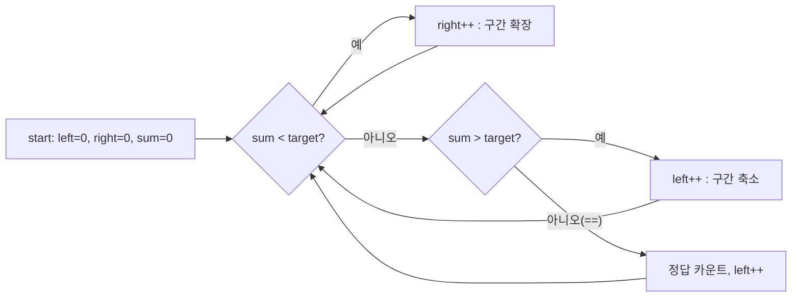

# 오늘의 주제: 투 포인터 / 슬라이딩 윈도우 (Two Pointers / Sliding Window)

> 언어: **Python**

배열·수열에서 "구간(부분 배열)"을 다룰 때, 두 개의 인덱스(포인터)를 움직여
**중첩 반복(O(N²))을 한 번의 선형 스캔(O(N))으로** 줄이는 기법.

---

## 1. 핵심 아이디어

두 포인터 `left`, `right`로 구간 `[left, right]`를 표현하고,
**조건에 따라 한쪽 포인터만 전진**시켜 모든 유효 구간을 빠짐없이 훑는다.

대표적으로 두 가지 패턴이 있다.

### 패턴 A — 같은 방향 (슬라이딩 윈도우)
정렬되지 않아도 OK. 구간 합/길이 조건을 만족시키며 윈도우를 늘였다 줄인다.
- 합이 목표보다 **작으면** `right`를 늘려 구간을 키운다.
- 합이 목표보다 **크면** `left`를 늘려 구간을 줄인다.
- 합이 **같으면** 정답 처리 후 한 칸 이동.



### 패턴 B — 양쪽 끝에서 좁히기 (정렬 후)
**정렬된** 배열에서 양 끝 `left=0`, `right=n-1`을 안쪽으로 모으며 두 값의 합을 조절.
- 합이 목표보다 작으면 `left++` (더 큰 값으로)
- 합이 목표보다 크면 `right--` (더 작은 값으로)

### 왜 O(N)인가?
각 포인터는 **되돌아가지 않고** 한 방향으로만 이동한다.
`left`, `right`가 각각 최대 N번 전진하므로 전체 이동 횟수는 2N → **O(N)**.

### 언제 쓰나 / 주의점
- "연속 구간의 합/곱/길이" 조건, "정렬된 배열에서 두 수의 합" 류에 강력.
- 단조성(monotonicity)이 핵심: *right를 늘리면 합이 증가*처럼 **한 방향으로만 변해야** 윈도우 논리가 성립.
- 음수가 섞이면 "합이 단조 증가" 가정이 깨질 수 있음 → 이땐 누적합+해시 등 다른 접근.

---

## 2. 예제 ①: 백준 2003 — 수들의 합 2

길이 N 수열에서 **연속 부분합이 정확히 M**인 경우의 수를 세기. (모든 원소 양수)

### 핵심 아이디어
양수만 있으므로 윈도우 합은 단조적 → 슬라이딩 윈도우(패턴 A).

### 시간복잡도
O(N) — `left`, `right` 각각 최대 N번 이동.

### 자주 하는 실수
- `right`를 끝까지 보낸 뒤 `left`만 줄이는 무한루프 방지: **종료 조건을 `left == n`** 으로.
- 합이 같을 때 카운트하고 `left`를 전진시키지 않으면 같은 구간을 반복 카운트.

```python
import sys
input = sys.stdin.readline

n, m = map(int, input().split())
arr = list(map(int, input().split()))

left = right = 0
cur = 0
cnt = 0
while True:
    if cur >= m:          # 합이 크거나 같으면 왼쪽 축소
        cur -= arr[left]
        left += 1
    elif right == n:      # 더 늘릴 수 없으면 종료
        break
    else:                 # 합이 작으면 오른쪽 확장
        cur += arr[right]
        right += 1
    if cur == m:
        cnt += 1
print(cnt)
```

---

## 3. 예제 ②: 백준 2470 — 두 용액

서로 다른 두 수의 합이 **0에 가장 가까운** 쌍 찾기. (정렬 후 양끝 좁히기, 패턴 B)

### 핵심 아이디어
정렬하면 합의 부호로 어느 쪽을 움직일지 결정 가능.
합이 음수면 `left++`(키우고), 양수면 `right--`(줄이고), 절댓값 최소를 갱신.

### 시간복잡도
정렬 O(N log N) + 스캔 O(N) = **O(N log N)**.

### 자주 하는 실수
- `abs(합)` 최소 갱신을 **부호 판정과 별도로** 매 스텝 비교할 것.
- `left < right` 조건으로 서로 다른 두 용액 보장.

```python
import sys
input = sys.stdin.readline

n = int(input())
a = sorted(map(int, input().split()))

left, right = 0, n - 1
best = float('inf')
ans = (a[0], a[-1])
while left < right:
    s = a[left] + a[right]
    if abs(s) < best:
        best = abs(s)
        ans = (a[left], a[right])
    if s < 0:
        left += 1
    elif s > 0:
        right -= 1
    else:
        break          # 정확히 0이면 더 볼 필요 없음
print(*ans)
```

---

## 4. Python 템플릿

```python
# 패턴 A: 슬라이딩 윈도우 (연속 구간 합 == target, 양수 배열)
def count_subarrays(arr, target):
    left = right = cur = cnt = 0
    n = len(arr)
    while True:
        if cur >= target:
            cur -= arr[left]; left += 1
        elif right == n:
            break
        else:
            cur += arr[right]; right += 1
        if cur == target:
            cnt += 1
    return cnt

# 패턴 B: 정렬 후 양끝 투 포인터 (두 수의 합 == target 존재 여부)
def has_pair(arr, target):
    arr = sorted(arr)
    left, right = 0, len(arr) - 1
    while left < right:
        s = arr[left] + arr[right]
        if s == target:
            return True
        elif s < target:
            left += 1
        else:
            right -= 1
    return False
```

---

## 5. 한 줄 요약
- **연속 구간** 문제 → 같은 방향 슬라이딩 윈도우 (양수/단조성 전제)
- **정렬된 두 수의 합** 문제 → 양끝에서 좁히기
- 포인터는 되돌아가지 않는다 → 그래서 **O(N)** (또는 정렬 포함 O(N log N))
- 추가 연습: 백준 1644(소수의 연속합), 11003(슬라이딩 윈도우 + 덱)
