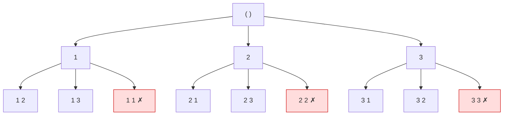

# 백트래킹 (Backtracking)

> **오늘의 주제: 백트래킹 (Backtracking)**
> 완전탐색을 하되, "가능성 없는 가지는 즉시 잘라낸다(가지치기, pruning)"는 전략.

---

## 1. 백트래킹이란?

가능한 모든 경우를 **DFS로 탐색**하면서, 조건을 만족할 수 없다고 판단되는 순간
그 가지(branch)를 더 내려가지 않고 **되돌아오는(backtrack)** 기법이다.

- 본질은 **DFS(깊이 우선 탐색) + 가지치기(pruning)**
- "완전탐색이지만, 답이 될 수 없는 후보는 일찍 버려서 탐색 공간을 줄인다"
- 순열·조합·부분집합 생성, N-Queen, 스도쿠, 미로 경로 수 세기 등에 사용

### 왜 동작하는가 (정당성)
모든 후보를 빠짐없이 만들어보되, **이미 제약을 위반한 부분 해(partial solution)**는
그 뒤에 무엇을 붙여도 정답이 될 수 없으므로 버려도 안전하다.
→ 정답을 놓치지 않으면서 탐색량만 줄인다.

### 언제 쓰나
- "조건을 만족하는 **모든 경우의 수**" 또는 "**하나의 해**"를 찾을 때
- 입력 크기가 작고(보통 N ≤ 15~20 수준), 제약 조건으로 가지치기가 잘 될 때

### 주의점
- 가지치기가 없으면 그냥 지수 시간 완전탐색 → **시간 초과**. 가지치기가 핵심.
- 상태를 바꿨으면(`방문 체크`, `사용 표시`) 되돌아올 때 **반드시 원복**해야 한다.

---

## 핵심 구조 (탐색 트리)


> 빨간 노드 = 가지치기로 잘려나가는 후보(이미 쓴 숫자 재사용 등).

---

## 2. 예제 1: N과 M (1) — 백준 15649

1~N 중 **중복 없이 M개**를 골라 만든 모든 수열을 사전순으로 출력.
(순열 생성의 가장 기본형)

### 핵심 아이디어
- 깊이 = 지금까지 고른 개수. 깊이가 M이면 완성된 수열 출력.
- `used[]`로 이미 쓴 숫자를 표시 → **가지치기**(이미 쓴 수는 건너뜀).
- 한 단계 내려갔다 돌아오면 `used`를 다시 `False`로 **원복**.

```python
import sys
input = sys.stdin.readline

N, M = map(int, input().split())
used = [False] * (N + 1)
path = []
out = []

def backtrack():
    if len(path) == M:                 # 종료 조건: M개 다 골랐다
        out.append(' '.join(map(str, path)))
        return
    for num in range(1, N + 1):
        if used[num]:                  # 가지치기: 이미 쓴 수
            continue
        used[num] = True               # 상태 변경
        path.append(num)
        backtrack()                    # 다음 깊이로
        path.pop()                     # ↓ 원복 (핵심!)
        used[num] = False

backtrack()
print('\n'.join(out))
```

- **시간복잡도**: O(N P M) (순열의 개수). N, M이 작아 가능.
- **자주 하는 실수**:
  - `path.pop()` / `used[num] = False` **원복 누락** → 다음 가지가 오염됨.
  - 출력이 많을 때 `print`를 매번 호출하면 느림 → 리스트에 모아 한 번에 출력.

### 조합 버전(N과 M (2), 15650)
중복 없는 **조합**은 "다음엔 더 큰 수만" 고르면 됨 → `start` 인덱스만 추가:

```python
def backtrack(start):
    if len(path) == M:
        out.append(' '.join(map(str, path)))
        return
    for num in range(start, N + 1):    # start부터 → 오름차순 보장
        path.append(num)
        backtrack(num + 1)             # 다음은 num보다 큰 수만
        path.pop()
```

---

## 3. 예제 2: N-Queen — 백준 9663

N×N 체스판에 퀸 N개를 서로 공격하지 못하게 놓는 경우의 수.
(백트래킹의 대표 문제. 가지치기 효과가 극적으로 큼.)

### 핵심 아이디어
- 한 **행에 퀸 하나씩** 놓는다 → 행 충돌은 자동 해결, 열/대각선만 검사.
- `col` 배열에 `col[r] = 놓은 열`을 기록.
- 충돌 검사: 같은 열(`col[r]==c`) 또는 같은 대각선(`|행차| == |열차|`).
- 한 행에 둘 곳이 없으면 그 가지는 죽음 → 자동으로 되돌아감.

```python
import sys
input = sys.stdin.readline

N = int(input())
col = [0] * N
count = 0

def is_safe(r, c):
    for prev in range(r):              # 위쪽 행들과만 비교
        if col[prev] == c:             # 같은 열
            return False
        if abs(col[prev] - c) == abs(prev - r):  # 같은 대각선
            return False
    return True

def backtrack(r):
    global count
    if r == N:                         # N개 모두 배치 성공
        count += 1
        return
    for c in range(N):
        if is_safe(r, c):              # 가지치기: 안전한 칸만
            col[r] = c
            backtrack(r + 1)
            # col[r]은 다음 c에서 덮어쓰므로 별도 원복 불필요

backtrack(0)
print(count)
```

- **시간복잡도**: 최악 O(N!) 이지만 가지치기로 실제 탐색량은 훨씬 적음.
  (N=14까지는 파이썬으로 시간 내 가능 / 그 이상은 비트마스킹 최적화 필요)
- **빠른 검사(비트마스킹) 팁**: 열/↘대각선/↙대각선을 세 개의 정수 비트로 관리하면
  `is_safe`가 O(1) → 훨씬 빠름.

```python
# 비트마스킹 버전 (열 cols, ↘대각 diag1, ↙대각 diag2)
def solve(r, cols, d1, d2):
    global count
    if r == N:
        count += 1; return
    avail = ((1 << N) - 1) & ~(cols | d1 | d2)   # 놓을 수 있는 칸들
    while avail:
        bit = avail & (-avail)                    # 가장 낮은 후보 비트
        avail -= bit
        solve(r + 1, cols | bit, (d1 | bit) << 1, (d2 | bit) >> 1)
```

---

## 4. 백트래킹 일반 템플릿

```python
def backtrack(상태):
    if 정답_조건(상태):        # 완성된 해
        결과_저장(상태)
        return
    for 선택 in 가능한_선택들:
        if not 유효한가(선택):  # ← 가지치기 (제약 위반이면 건너뜀)
            continue
        선택_적용(선택)         # 상태 변경
        backtrack(다음_상태)
        선택_취소(선택)         # ★ 원복 — 빼먹으면 버그
```

---

## 5. 한눈 요약

| 항목 | 내용 |
|------|------|
| 정체 | DFS + **가지치기** |
| 쓸 때 | 모든 경우의 수 / 하나의 해, 입력 작을 때(N≤~20) |
| 핵심 1 | **종료 조건**을 명확히 (깊이/완성 여부) |
| 핵심 2 | **가지치기**로 불가능한 가지 일찍 차단 |
| 핵심 3 | 상태 변경 후 **반드시 원복** |
| 대표 문제 | N과 M(15649), N-Queen(9663), 스도쿠 |

---

## 관련 노트
- [BFS/DFS](../README.md#bfs--dfs) — 백트래킹의 토대인 DFS
- 순열/조합은 `itertools.permutations / combinations` 로도 가능하지만,
  **가지치기가 필요한 문제**는 직접 백트래킹을 짜야 한다.
