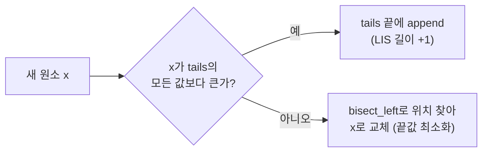

# 최장 증가 부분 수열 (LIS, Longest Increasing Subsequence)

> **오늘의 주제: 최장 증가 부분 수열 (LIS)** — DP 기본형 O(N²)과 이분탐색 최적화 O(N log N)를 함께 정리.

---

## 1. 문제 정의

수열에서 **순서를 유지**하면서(연속일 필요는 없음) 원소들을 골라, 그 부분 수열이 **계속 증가**하도록 만들 때 가장 긴 길이를 구한다.

```
원소: 10  20  10  30  20  50
              ↑       ↑       ↑       ↑
LIS:  10  20      30      50   → 길이 4
```

핵심: **"부분 수열(subsequence)"** 이라 연속이 아니어도 되고, 인덱스 순서만 지키면 된다.

---

## 2. 왜 동작하는가 — 두 가지 접근

### (A) DP O(N²) — 직관적, "끝나는 위치" 기준

`dp[i]` = **i번째 원소를 마지막으로 사용하는** 증가 수열의 최대 길이.

- 점화식: `dp[i] = max(dp[j] + 1)`  (단, `j < i` 이고 `a[j] < a[i]`)
- 정당성: i에서 끝나는 LIS는 반드시 그 앞의 더 작은 원소 j에서 끝나는 LIS에 a[i]를 붙인 것. 모든 j를 보면 최적이 보장됨.
- 답은 `max(dp)` (LIS는 어디서든 끝날 수 있으므로).

### (B) 이분탐색 O(N log N) — "길이별 마지막 최솟값" 기준

`tails[k]` = **길이 k+1짜리 증가 수열의 마지막 원소가 가질 수 있는 최솟값**.

- `tails`는 항상 정렬 상태를 유지한다(증명: 더 긴 수열의 끝이 더 작을 수 없음).
- 새 원소 x가 오면 `tails`에서 **x 이상인 첫 위치**를 찾아 교체(`bisect_left`).
  - 그 위치가 끝이면 → LIS 길이가 1 늘어남 (append).
  - 중간이면 → 같은 길이를 더 작은 끝값으로 갱신(미래에 더 길게 이어붙일 여지 확보).
- **주의: `tails` 배열 자체는 실제 LIS가 아니다.** 길이(`len(tails)`)만 정답이다.



---

## 3. 대표 예제

### 예제 1 — 백준 11053 가장 긴 증가하는 부분 수열 (O(N²))

```python
import sys
input = sys.stdin.readline

n = int(input())
a = list(map(int, input().split()))

dp = [1] * n  # 자기 자신만으로도 길이 1
for i in range(n):
    for j in range(i):
        if a[j] < a[i]:
            dp[i] = max(dp[i], dp[j] + 1)

print(max(dp))
```

- **시간복잡도:** O(N²) — N ≤ 1,000 정도까지 OK.

### 예제 2 — 백준 12015 가장 긴 증가하는 부분 수열 2 (O(N log N))

N ≤ 1,000,000 → O(N²)는 시간 초과. 이분탐색 필수.

```python
import sys
from bisect import bisect_left
input = sys.stdin.readline

n = int(input())
a = list(map(int, input().split()))

tails = []
for x in a:
    pos = bisect_left(tails, x)   # x 이상인 첫 위치
    if pos == len(tails):
        tails.append(x)           # 길이 증가
    else:
        tails[pos] = x            # 끝값 최소화
print(len(tails))
```

- **시간복잡도:** O(N log N).
- **엄격히 증가(strict)** → `bisect_left`. **같은 값 허용(non-decreasing)** → `bisect_right`.

---

## 4. 자주 하는 실수

- `dp` 초깃값을 0으로 두기 → 각 원소 자신이 길이 1이므로 **1로 초기화**해야 한다.
- 답을 `dp[n-1]`로 출력 → LIS는 마지막 원소에서 끝난다는 보장이 없다. **`max(dp)`**.
- O(N log N)에서 `tails`를 실제 수열로 착각 → 길이만 정답. (실제 수열 복원은 별도 역추적 필요)
- strict/non-strict 혼동 → `bisect_left`(strict) vs `bisect_right`(중복 허용) 구분.
- 가장 긴 **감소** 부분 수열이면 → 배열을 뒤집거나 부호를 반전해서 같은 로직 재사용.

---

## 5. Python 템플릿

```python
from bisect import bisect_left

def lis_length(a):
    tails = []
    for x in a:
        pos = bisect_left(tails, x)   # 중복 허용 시 bisect_right
        if pos == len(tails):
            tails.append(x)
        else:
            tails[pos] = x
    return len(tails)
```

실제 LIS 수열 복원이 필요하면, 각 원소가 들어간 위치(pos)를 따로 저장해 두었다가 뒤에서부터 역추적한다.
