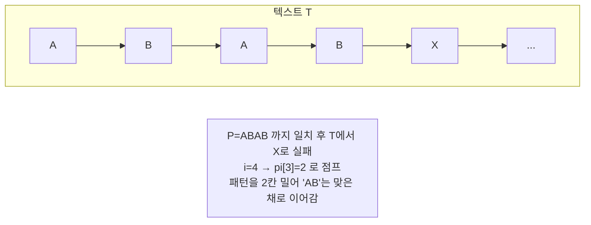

# 오늘의 주제: KMP 문자열 매칭 (Knuth–Morris–Pratt)

긴 텍스트 `T`(길이 N) 안에서 패턴 `P`(길이 M)가 등장하는 모든 위치를 찾는 알고리즘.
단순 비교는 매 위치마다 패턴을 다시 대보므로 **O(N·M)**. KMP는 실패한 지점에서 패턴을
"얼마나 건너뛸 수 있는지" 미리 계산해 두어 **O(N+M)** 에 해결한다.

---

## 핵심 아이디어 — 왜 빨라지는가

단순 매칭은 한 글자 틀리면 텍스트 포인터를 1칸 뒤로 되돌려 처음부터 다시 비교한다.
하지만 패턴 내부에 **접두사이면서 접미사인 부분(border)** 이 있다면, 이미 일치시킨 정보를
버리지 않고 그만큼 패턴만 밀어서 비교를 이어갈 수 있다.

- **실패 함수(failure function, `pi` 배열)**: `pi[i]` = `P[0..i]` 의 부분문자열 중
  "**접두사 == 접미사**" 가 되는 **가장 긴 길이**(자기 자신 제외).
- 매칭 도중 `T[j] != P[i]` 로 실패하면, `i`를 0으로 되돌리지 않고 `i = pi[i-1]` 로 점프.
  → 이미 맞춰둔 접두사 부분은 다시 비교할 필요가 없다는 게 정당성의 핵심.

예) `P = "ABABC"` → `pi = [0,0,1,2,0]`
- `pi[2]` (`"ABA"`): 접두사·접미사 일치 = `"A"` → 길이 1
- `pi[3]` (`"ABAB"`): `"AB"` 일치 → 길이 2



---

## 실패 함수 만드는 법 (패턴 vs 자기 자신 매칭)

`pi` 배열 자체도 "패턴을 패턴에 대고 KMP" 하는 방식으로 만든다.

```mermaid
flowchart TD
    S([i=1, j=0 시작]) --> C{P[i] == P[j]?}
    C -- 같음 --> M["j+=1; pi[i]=j; i+=1"] --> L{i < M?}
    C -- 다르고 j>0 --> B["j = pi[j-1] 로 점프"] --> C
    C -- 다르고 j==0 --> Z["pi[i]=0; i+=1"] --> L
    L -- yes --> C
    L -- no --> E([완성])
```

---

## 대표 예제 1 — 백준 1786 찾기

`T` 안에서 `P`가 나타나는 **횟수**와 **모든 시작 위치(1-indexed)** 를 출력.

```python
import sys
input = sys.stdin.readline

def get_pi(p):
    m = len(p)
    pi = [0] * m
    j = 0                       # 현재까지 일치한 접두사 길이
    for i in range(1, m):
        while j > 0 and p[i] != p[j]:
            j = pi[j - 1]       # 실패 → border 만큼 점프
        if p[i] == p[j]:
            j += 1
            pi[i] = j
    return pi

def kmp(t, p):
    pi = get_pi(p)
    res = []
    j = 0
    for i in range(len(t)):
        while j > 0 and t[i] != p[j]:
            j = pi[j - 1]
        if t[i] == p[j]:
            if j == len(p) - 1:         # 패턴 끝까지 일치 → 발견
                res.append(i - len(p) + 2)   # 1-indexed 시작 위치
                j = pi[j]               # 겹치는 다음 매칭 위해 점프
            else:
                j += 1
    return res

T = input().rstrip('\n')
P = input().rstrip('\n')
ans = kmp(T, P)
print(len(ans))
print(' '.join(map(str, ans)))
```

- **시작 위치 계산**: `i`에서 패턴 끝(`len(p)-1`)이 일치했으므로 시작은 `i - (M-1)`,
  여기에 1-indexed라 +1 → `i - M + 2`.
- 패턴을 다 찾은 뒤 `j = pi[j]` 로 점프해야 `"AAA"` 안의 `"AA"` 같은 **겹치는 매칭**도 잡는다.

---

## 대표 예제 2 — 백준 1305 광고 (응용)

화면에 흐르는 광고의 보이는 부분 길이 `L`과 문자열 `s`가 주어질 때,
**가능한 가장 짧은 광고 원본 길이**를 구하는 문제 = `s` 자기 자신의 실패 함수 한 방.

```python
import sys
input = sys.stdin.readline
L = int(input())
s = input().rstrip('\n')

pi = [0] * L
j = 0
for i in range(1, L):
    while j > 0 and s[i] != s[j]:
        j = pi[j - 1]
    if s[i] == s[j]:
        j += 1
        pi[i] = j

print(L - pi[L - 1])   # 전체 길이 - 가장 긴 (접두사=접미사) = 반복 주기
```

- **핵심 통찰**: 보이는 문자열의 "가장 긴 border"를 빼면 반복 주기가 나온다.
  광고가 주기적으로 반복된다는 성질을 실패 함수로 바로 환산하는 전형 패턴.

---

## 시간복잡도

| 단계 | 복잡도 |
|------|--------|
| 실패 함수 `get_pi` | O(M) |
| 본 매칭 `kmp` | O(N) |
| **전체** | **O(N + M)** |

`while` 루프가 중첩돼 보여도, `j`는 한 번에 최대 1씩만 증가하고 감소만 일으키므로
전체 `j` 감소 횟수 ≤ 증가 횟수. 평균이 아니라 **확정 선형**이다.

---

## 자주 하는 실수

- `pi[i]` 정의에서 **자기 자신(전체 길이)은 제외** — border는 진부분문자열이어야 함.
- 실패 시 `j = 0` 으로 리셋 ❌ → `j = pi[j-1]` 로 점프 ⭕ (리셋하면 그냥 O(N·M)).
- 패턴 발견 후 `j`를 그대로 두면 다음 글자에서 인덱스 초과. 반드시 `j = pi[j]` 로 점프.
- `input()` 끝의 개행/공백: `readline` 쓸 땐 `.rstrip('\n')` 로 패턴 길이 오염 방지.
- 1-indexed / 0-indexed 출력 요구사항 헷갈리지 말 것 (1786은 1-indexed).

---

## Python 템플릿 (복붙용)

```python
def get_pi(p):
    pi = [0] * len(p)
    j = 0
    for i in range(1, len(p)):
        while j > 0 and p[i] != p[j]:
            j = pi[j - 1]
        if p[i] == p[j]:
            j += 1
            pi[i] = j
    return pi

def kmp(t, p):
    pi = get_pi(p)
    occ, j = [], 0
    for i in range(len(t)):
        while j > 0 and t[i] != p[j]:
            j = pi[j - 1]
        if t[i] == p[j]:
            if j == len(p) - 1:
                occ.append(i - len(p) + 1)  # 0-indexed 시작
                j = pi[j]
            else:
                j += 1
    return occ
```
