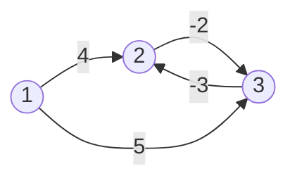

# 오늘의 주제: 벨만-포드 (Bellman-Ford) — 음수 간선 최단경로 & 음수 사이클 탐지

> 단일 출발점 최단경로인데 **간선 가중치가 음수일 수 있을 때** 쓰는 알고리즘.
> 다익스트라는 음수 간선에서 깨지고, 플로이드는 모든 쌍을 구한다.
> 벨만-포드는 **단일 출발점 + 음수 간선 + 음수 사이클 판정**까지 가능하다.

---

## 1. 왜 다익스트라로는 안 되는가

다익스트라는 "한 번 확정한 노드의 거리는 더 줄어들지 않는다"는 **그리디 가정**에 기댄다.
음수 간선이 있으면 이미 확정한 노드도 나중에 더 짧아질 수 있어서 이 가정이 깨진다.

벨만-포드는 그리디 대신 **모든 간선을 V-1번 반복 완화(relax)** 한다.
탐욕적 확정이 없으니 음수 간선이 있어도 안전하다.

---

## 2. 핵심 아이디어: 완화(relaxation)를 V-1번

- **완화**: 간선 (u → v, 가중치 w)에 대해 `dist[v] > dist[u] + w` 이면 `dist[v] = dist[u] + w`.
- 최단경로는 사이클이 없으면 **최대 V-1개의 간선**으로 이루어진다.
  → 모든 간선을 한 바퀴(=1 라운드) 완화하면 "간선 1개 더 쓴 최단경로"가 확정된다.
  → V-1 라운드를 돌면 모든 최단경로가 확정된다.

### 음수 사이클 판정 (벨만-포드의 진짜 무기)

V-1 라운드 후에도 **여전히 완화가 일어나면** = 거리가 계속 줄어든다는 뜻
= 음의 가중치 사이클이 존재한다. → V번째 라운드에서 갱신되면 "음수 사이클 있음".



위 그래프에서 2↔3 은 `-2 + -3 = -5` 짜리 음수 사이클.
돌수록 거리가 무한히 작아지므로 "최단경로 없음(-∞)"이 된다. 벨만-포드는 이걸 잡아낸다.

---

## 3. 시간복잡도

- **O(V · E)** — 라운드 V-1번 × 매 라운드 간선 E개 완화.
- 다익스트라 O(E log V)보다 느리다. **음수 간선이 없으면 다익스트라를 쓴다.**
- 정점 수가 작고(수백~수천) 음수 간선/사이클 판정이 필요할 때가 벨만-포드의 자리.

---

## 4. 대표 예제 1 — 백준 11657 타임머신

음수 간선 포함 단일 출발점 최단경로 + 음수 사이클이면 `-1`.

**핵심 아이디어**
- 1번 노드에서 출발, 모든 노드까지 최단거리 출력.
- V-1번 완화 후 한 번 더(V번째) 돌려서 갱신되면 음수 사이클 → `-1`.
- 단, **출발점에서 도달 불가능한 노드(`dist == INF`)는 완화 대상에서 제외**해야 한다.
  (`INF + 음수`가 줄어든 걸 사이클로 오인하면 안 됨)

```python
import sys
input = sys.stdin.readline
INF = float('inf')

def bellman_ford():
    N, M = map(int, input().split())
    edges = [tuple(map(int, input().split())) for _ in range(M)]  # (u, v, w)

    dist = [INF] * (N + 1)
    dist[1] = 0

    for i in range(N):                 # V-1번 + 마지막 1번(=V번) → 사이클 검사
        for u, v, w in edges:
            if dist[u] == INF:         # 도달 못 한 노드는 건너뜀 (중요!)
                continue
            if dist[u] + w < dist[v]:
                dist[v] = dist[u] + w
                if i == N - 1:         # V번째에도 갱신 → 음수 사이클
                    print(-1)
                    return

    for v in range(2, N + 1):
        print(dist[v] if dist[v] != INF else -1)

bellman_ford()
```

- **시간복잡도**: O(V·E)
- 출력: 2~N번 노드 거리. 도달 불가면 `-1`.

---

## 5. 대표 예제 2 — 백준 1865 웜홀

"출발해서 한 바퀴 돌아 시간이 역행(=음수 사이클)할 수 있는가?" → **음수 사이클 존재 여부만** 판정.

**핵심 아이디어**
- 도로는 양방향(가중치 +), 웜홀은 단방향(가중치 −).
- 시작점이 정해져 있지 않으므로 **모든 노드를 동시에 출발점으로** 둔다.
  → `dist`를 전부 0으로 초기화하면 한 번에 모든 시작점을 고려하는 효과.
- V번 완화에서 갱신되면 음수 사이클 존재 → `YES`.

```python
import sys
input = sys.stdin.readline
INF = float('inf')

def has_negative_cycle(N, edges):
    dist = [0] * (N + 1)               # 모든 노드를 출발점으로 → 전부 0
    for i in range(N):
        updated = False
        for u, v, w in edges:
            if dist[u] + w < dist[v]:
                dist[v] = dist[u] + w
                updated = True
                if i == N - 1:         # V번째에도 갱신 → 음수 사이클
                    return True
        if not updated:                # 갱신 없으면 조기 종료
            break
    return False

TC = int(input())
for _ in range(TC):
    N, M, W = map(int, input().split())
    edges = []
    for _ in range(M):                 # 도로: 양방향, 가중치 +
        s, e, t = map(int, input().split())
        edges.append((s, e, t))
        edges.append((e, s, t))
    for _ in range(W):                 # 웜홀: 단방향, 가중치 -
        s, e, t = map(int, input().split())
        edges.append((s, e, -t))
    print("YES" if has_negative_cycle(N, edges) else "NO")
```

- **시간복잡도**: 테스트케이스당 O(V·E)
- `dist`를 0으로 초기화하는 트릭이 핵심 — 도달성과 무관하게 사이클만 본다.

---

## 6. 자주 하는 실수

- **도달 불가 노드 완화**: `dist[u] == INF`인데 완화하면 잘못된 음수 사이클 판정. 반드시 `continue`.
- **사이클 검사 라운드 누락**: V-1번만 돌고 끝내면 음수 사이클을 못 잡는다. **V번째 라운드**가 검사용.
- **방향 헷갈림**: 단방향/양방향 간선을 edges 리스트에 올바르게 넣었는지 확인 (웜홀=단방향 음수).
- **다익스트라로 충분한데 벨만-포드 사용**: 음수 간선이 없으면 O(E log V)가 훨씬 빠르다.
- **모든 시작점 문제에서 `dist=INF` 초기화**: 1865처럼 사이클만 보는 문제는 `dist=0`으로 둬야 한다.

---

## 7. Python 템플릿

```python
INF = float('inf')

def bellman_ford(N, edges, start):
    """edges: [(u, v, w), ...], 노드 1..N. 음수 사이클 있으면 None 반환."""
    dist = [INF] * (N + 1)
    dist[start] = 0
    for i in range(N):                 # V-1 완화 + V번째 사이클 검사
        for u, v, w in edges:
            if dist[u] != INF and dist[u] + w < dist[v]:
                dist[v] = dist[u] + w
                if i == N - 1:         # V번째에도 갱신 → 음수 사이클
                    return None
    return dist
```

---

## 8. 한 줄 요약 비교

- **다익스트라**: 음수 간선 X, 단일 출발점, O(E log V) — 가장 빠름.
- **벨만-포드**: 음수 간선 O, 단일 출발점, 음수 사이클 판정 가능, O(V·E).
- **플로이드-워셜**: 모든 쌍 최단경로, 음수 간선 O, O(V³).
