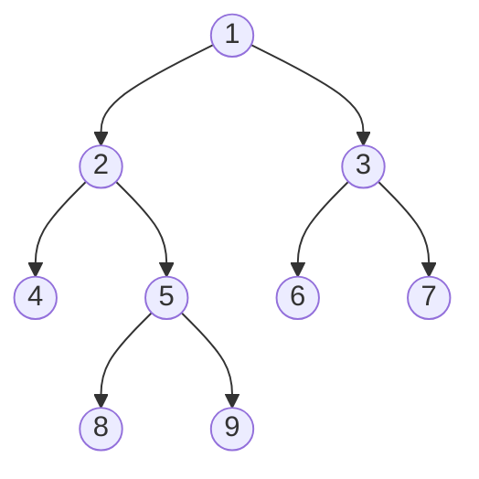

# 오늘의 주제: 최소 공통 조상 (LCA, Lowest Common Ancestor)

> 루트 있는 트리에서 두 노드 u, v의 **가장 가까운 공통 조상**을 찾는 문제.
> "두 정점의 거리", "경로상의 정보 질의" 같은 트리 문제의 핵심 부품이다.
> 질의가 많아지면 단순 방법은 터지므로 **희소 테이블(binary lifting)** 로 O(log N)에 답한다.

---

## 1. LCA란 무엇인가



- `LCA(8, 9) = 5` (둘 다 5의 자식)
- `LCA(4, 9) = 2` (4는 2의 자식, 9는 5→2 아래)
- `LCA(8, 7) = 1` (서로 다른 서브트리 → 루트에서 만남)

핵심 통찰: **두 노드를 같은 깊이로 맞춘 뒤, 함께 위로 올라가면 처음 만나는 지점**이 LCA다.

---

## 2. 기본 아이디어 (단순 O(N) per query)

1. DFS/BFS로 각 노드의 **깊이(depth)** 와 **부모(parent)** 를 기록.
2. 두 노드 중 더 깊은 쪽을 **깊이가 같아질 때까지** 부모로 올린다.
3. 이제 깊이가 같으니, **둘이 같아질 때까지** 동시에 한 칸씩 올린다.

질의 1개당 최악 O(N). 질의가 적으면(11437처럼 N≤50000, 질의도 적당) 통과한다.

---

## 3. 희소 테이블 (Binary Lifting) — O(log N) per query

한 칸씩 올리면 느리다. **2^k 칸씩 점프**할 수 있게 미리 표를 만든다.

- `up[k][v]` = 노드 v의 **2^k번째 조상**.
- 점화식: `up[k][v] = up[k-1][ up[k-1][v] ]`
  (2^k = 2^(k-1) 두 번 = "절반 점프 후 또 절반 점프")

### 질의 처리

1. 깊이 차이 `d = depth[u] - depth[v]` 를 **이진수로 분해**해서 한 번에 점프 (깊은 쪽을 올림).
2. 깊이가 같아졌는데 u==v면 그게 LCA.
3. 아니면 `k`를 큰 값부터 줄이며, `up[k][u] != up[k][v]` 일 때만 둘 다 점프.
   (조상이 *같아지기 직전*까지만 올라감)
4. 마지막에 `up[0][u]` (= 공통 부모)가 LCA.

### 시간복잡도

- 전처리: `O(N log N)` (표 크기 log N × N)
- 질의: `O(log N)` per query

---

## 4. 대표 예제 ① — 백준 11437 LCA (기본형)

> N개 노드 트리에서 M개 질의 (u, v)의 LCA 출력. N ≤ 50,000.

**핵심 아이디어**: 깊이/부모 구해두고, 깊이 맞춘 뒤 같이 올리기.

```python
import sys
from collections import deque
input = sys.stdin.readline

def solve():
    N = int(input())
    graph = [[] for _ in range(N + 1)]
    for _ in range(N - 1):
        a, b = map(int, input().split())
        graph[a].append(b)
        graph[b].append(a)

    depth = [0] * (N + 1)
    parent = [0] * (N + 1)
    visited = [False] * (N + 1)

    # BFS로 depth, parent 세팅 (재귀 깊이 문제 회피)
    q = deque([1]); visited[1] = True
    while q:
        cur = q.popleft()
        for nxt in graph[cur]:
            if not visited[nxt]:
                visited[nxt] = True
                depth[nxt] = depth[cur] + 1
                parent[nxt] = cur
                q.append(nxt)

    def lca(u, v):
        # 1) 깊이 맞추기
        while depth[u] > depth[v]:
            u = parent[u]
        while depth[v] > depth[u]:
            v = parent[v]
        # 2) 같이 올라가기
        while u != v:
            u = parent[u]
            v = parent[v]
        return u

    M = int(input())
    out = []
    for _ in range(M):
        u, v = map(int, input().split())
        out.append(str(lca(u, v)))
    print('\n'.join(out))

solve()
```

---

## 5. 대표 예제 ② — 백준 11438 LCA 2 (희소 테이블 필수)

> 11437과 같지만 N ≤ 100,000, M ≤ 100,000. 한 칸씩 올리면 O(NM)=10^10 → **시간 초과**.
> binary lifting으로 질의당 O(log N).

```python
import sys
from collections import deque
input = sys.stdin.readline

def solve():
    N = int(input())
    graph = [[] for _ in range(N + 1)]
    for _ in range(N - 1):
        a, b = map(int, input().split())
        graph[a].append(b)
        graph[b].append(a)

    LOG = 17  # 2^17 = 131072 > 100000
    depth = [0] * (N + 1)
    up = [[0] * (N + 1) for _ in range(LOG)]  # up[k][v] = v의 2^k번째 조상

    # BFS로 depth와 직계 부모 up[0] 세팅
    visited = [False] * (N + 1)
    q = deque([1]); visited[1] = True
    while q:
        cur = q.popleft()
        for nxt in graph[cur]:
            if not visited[nxt]:
                visited[nxt] = True
                depth[nxt] = depth[cur] + 1
                up[0][nxt] = cur
                q.append(nxt)

    # 희소 테이블 채우기
    for k in range(1, LOG):
        for v in range(1, N + 1):
            up[k][v] = up[k - 1][up[k - 1][v]]

    def lca(u, v):
        if depth[u] < depth[v]:
            u, v = v, u
        # 1) u를 v와 같은 깊이까지: 깊이차를 2^k 단위로 점프
        diff = depth[u] - depth[v]
        for k in range(LOG):
            if diff & (1 << k):
                u = up[k][u]
        if u == v:
            return u
        # 2) 큰 점프부터: 조상이 같아지기 직전까지만 올림
        for k in range(LOG - 1, -1, -1):
            if up[k][u] != up[k][v]:
                u = up[k][u]
                v = up[k][v]
        return up[0][u]

    M = int(input())
    out = []
    for _ in range(M):
        a, b = map(int, input().split())
        out.append(str(lca(a, b)))
    sys.stdout.write('\n'.join(out) + '\n')

solve()
```

### 응용: 두 정점 사이의 거리 (백준 1761)
가중치 트리에서 루트로부터의 거리 `dist[v]` 를 미리 구해두면
`dist(u, v) = dist[u] + dist[v] - 2 * dist[LCA(u,v)]`.

---

## 6. 시간복잡도 정리

| 방식 | 전처리 | 질의당 | 적합한 상황 |
|------|--------|--------|-------------|
| 단순(한 칸씩) | O(N) | O(N) | N·M 작을 때 (11437) |
| 희소 테이블 | O(N log N) | O(log N) | 질의 많을 때 (11438) |

---

## 7. 자주 하는 실수

- **재귀 DFS로 depth/parent 세팅 시 재귀 깊이 초과** — N=10만이면 트리가 일자(skewed)일 때 터진다.
  → `sys.setrecursionlimit(...)` 키우거나 **BFS(반복문)** 로 세팅하는 게 안전.
- **`LOG` 크기 부족**: `2^LOG > N` 이어야 한다. N=10만이면 LOG=17 이상.
- **2단계 점프에서 `up[k][u] == up[k][v]` 일 때 올리면 안 됨** — 그러면 LCA를 지나쳐 버린다.
  반드시 **다를 때만** 점프하고, 마지막에 `up[0][u]` 를 반환.
- **깊이 맞추기 전에 누가 더 깊은지 정렬**(swap)을 빠뜨리면 점프 방향이 틀어진다.
- **루트의 부모를 0/자기자신**으로 두는 컨벤션을 표 전체에서 일관되게 유지.

---

## 8. 핵심 한 줄 요약

> **깊이를 맞추고(이진 점프) → 조상이 갈라지는 경계까지 같이 올린 뒤 → 그 부모가 LCA.**
> 질의가 많으면 `up[k][v] = up[k-1][up[k-1][v]]` 희소 테이블로 O(log N).
