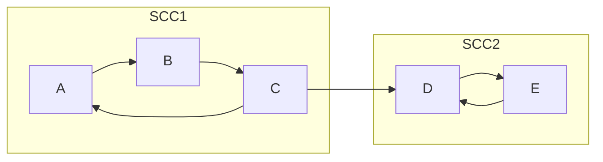

# 오늘의 주제: 강한 연결 요소 (SCC, Strongly Connected Component) — Tarjan 알고리즘

> **방향 그래프**에서, 서로 오갈 수 있는 정점들을 한 덩어리로 묶은 것이 SCC다.
> 같은 SCC 안의 두 정점 u, v는 `u → v` 경로도 있고 `v → u` 경로도 있다.
> 위상정렬은 사이클이 없는 DAG 전용이었다 → 사이클이 있는 그래프를 "압축"해서 DAG로 바꾸는 도구가 SCC다.

---

## 1. SCC가 뭐고, 왜 쓰는가

- **정의**: 방향 그래프에서 "서로 도달 가능한" 정점들의 최대 집합.
  - 같은 SCC ⟺ `u→v` 경로와 `v→u` 경로가 **둘 다** 존재.
- **핵심 성질**: 각 SCC를 정점 하나로 뭉치면(축약, condensation) 그래프는 항상 **사이클 없는 DAG**가 된다.
  - → 사이클 있는 방향 그래프 문제를 "SCC로 압축 → 위상정렬/DAG-DP"로 푸는 패턴이 매우 강력.
- **대표 활용**: 2-SAT, 위상정렬 전처리, "강하게 묶인 그룹 세기"(도미노/팀짜기 류).


위 그림에서 `{A,B,C}`, `{D,E}`가 각각 하나의 SCC. 둘을 점으로 압축하면 `SCC1 → SCC2` 단방향 DAG가 된다.

---

## 2. Tarjan 알고리즘 — DFS 한 번으로 끝낸다

DFS를 돌면서 두 값을 관리한다.

- `id[v]` (= 방문 순서, discovery time): v를 처음 방문한 시각. 한 번 정하면 안 바뀜.
- `low[v]` (= low-link): v에서 **DFS 트리 간선 + 역방향 간선 1개**로 도달 가능한 정점 중 가장 작은 `id`.

그리고 방문 중인 정점을 **스택**에 쌓아둔다.

### 왜 동작하는가 (정당성)
- DFS 도중 만나는 간선은 트리 간선 / 역방향(back) / 순방향 / 교차(cross) 간선으로 나뉜다.
- `low[v]`는 "v가 자기 조상이나 같은 SCC 멤버에게 되돌아갈 수 있는 최소 id"를 추적한다.
- **`low[v] == id[v]` 인 순간**, v는 자기 SCC의 **루트**(가장 먼저 방문된 정점)다.
  - 그 위로 더 거슬러 올라갈 수 없다는 뜻이니, 지금까지 스택에 쌓인 것 중 **v까지**가 하나의 SCC.
  - 그래서 스택에서 v가 나올 때까지 pop → 한 SCC 완성.

### 핵심 포인트
- **간선 (u→w) 처리 분기**:
  - w 미방문 → 재귀 DFS 후 `low[u] = min(low[u], low[w])` (트리 간선)
  - w가 **스택 안에 있음** → `low[u] = min(low[u], id[w])` (역방향, 같은 SCC 후보)
  - w가 방문됐지만 **스택에 없음** → 이미 끝난 다른 SCC → **무시** (이게 자주 하는 실수 포인트)
- 시간복잡도 **O(V + E)** — DFS 한 번.

---

## 3. 대표 예제 1 — BOJ 2150 Strongly Connected Component

방향 그래프에서 SCC를 모두 구하고, **SCC 개수**와 각 SCC의 정점들을(각 SCC 내부는 오름차순, SCC들은 첫 정점 기준 정렬) 출력.

```python
import sys
input = sys.stdin.readline
sys.setrecursionlimit(10**6)

def solve():
    V, E = map(int, input().split())
    graph = [[] for _ in range(V + 1)]
    for _ in range(E):
        a, b = map(int, input().split())
        graph[a].append(b)

    id = [0] * (V + 1)      # 0 = 미방문
    low = [0] * (V + 1)
    on_stack = [False] * (V + 1)
    stack = []
    sccs = []
    timer = [1]             # 방문 순서 카운터 (리스트로 클로저 공유)

    def dfs(u):
        id[u] = low[u] = timer[0]
        timer[0] += 1
        stack.append(u)
        on_stack[u] = True

        for w in graph[u]:
            if id[w] == 0:                 # 트리 간선
                dfs(w)
                low[u] = min(low[u], low[w])
            elif on_stack[w]:              # 역방향 (같은 SCC 후보)
                low[u] = min(low[u], id[w])
            # 방문했지만 스택에 없으면 → 끝난 SCC → 무시

        if low[u] == id[u]:               # u가 SCC 루트
            comp = []
            while True:
                x = stack.pop()
                on_stack[x] = False
                comp.append(x)
                if x == u:
                    break
            comp.sort()
            sccs.append(comp)

    for v in range(1, V + 1):
        if id[v] == 0:
            dfs(v)

    sccs.sort(key=lambda c: c[0])         # SCC들 첫 원소 기준 정렬
    out = [str(len(sccs))]
    for comp in sccs:
        out.append(' '.join(map(str, comp)) + ' -1')
    print('\n'.join(out))

solve()
```

- **시간복잡도**: O(V + E)
- **자주 하는 실수**:
  - 역방향 간선에서 `low[w]`가 아니라 `id[w]`를 써야 한다 (스택 멤버는 아직 SCC 미완성이라 low가 변동 중).
  - `on_stack` 체크 없이 모든 방문 정점을 `min`에 넣으면 **이미 끝난 SCC와 잘못 합쳐진다**.
  - `recursionlimit` 안 풀면 깊은 그래프에서 RecursionError.

---

## 4. 대표 예제 2 — BOJ 4196 도미노 (SCC 축약 → indegree 0 세기)

도미노를 한 줄 세워두고 일부를 손으로 넘길 때, **최소 몇 개를 손으로 넘겨야 전부 쓰러지나**.

핵심: SCC로 압축하면 DAG가 된다. 같은 SCC는 하나만 넘기면 다 쓰러진다.
→ 축약 DAG에서 **진입차수(indegree)가 0인 SCC의 개수**가 답.

```python
# ... SCC 번호(scc_id[v])를 구한 뒤 ...
indeg = [0] * scc_count
for u in range(1, V + 1):
    for w in graph[u]:
        if scc_id[u] != scc_id[w]:        # 다른 SCC로 가는 간선만
            indeg[scc_id[w]] += 1
answer = sum(1 for c in range(scc_count) if indeg[c] == 0)
```

- **아이디어**: 들어오는 간선이 없는 SCC는 아무도 안 밀어주므로 직접 넘겨야 한다.
- **응용 패턴**: "그룹으로 묶고 → 축약 DAG에서 위상 성질 이용" — 2-SAT, 최소 정점 추가 문제 등으로 확장.

---

## 5. Python 템플릿 (SCC 번호 매기기용)

```python
import sys
input = sys.stdin.readline
sys.setrecursionlimit(10**6)

def tarjan_scc(V, graph):                  # graph: 1-indexed 인접리스트
    id = [0] * (V + 1); low = [0] * (V + 1)
    on_stack = [False] * (V + 1)
    scc_id = [-1] * (V + 1)
    stack = []; timer = [1]; cnt = [0]

    def dfs(u):
        id[u] = low[u] = timer[0]; timer[0] += 1
        stack.append(u); on_stack[u] = True
        for w in graph[u]:
            if id[w] == 0:
                dfs(w); low[u] = min(low[u], low[w])
            elif on_stack[w]:
                low[u] = min(low[u], id[w])
        if low[u] == id[u]:
            while True:
                x = stack.pop(); on_stack[x] = False
                scc_id[x] = cnt[0]
                if x == u: break
            cnt[0] += 1

    for v in range(1, V + 1):
        if id[v] == 0:
            dfs(v)
    return cnt[0], scc_id                   # (SCC 개수, 정점별 SCC 번호)
```

> 참고: Tarjan은 SCC 번호를 **위상 역순**으로 매긴다(먼저 완성된 SCC가 작은 번호).
> DAG-DP를 SCC 번호 오름차순으로 돌면 자연스럽게 위상순서 비슷하게 처리된다.

---

## 요약

- SCC = 방향 그래프에서 서로 오갈 수 있는 최대 정점 집합. 압축하면 항상 **DAG**.
- **Tarjan**: DFS 한 번, `id`/`low`/스택. `low[v]==id[v]`면 SCC 루트 → 스택 pop. **O(V+E)**.
- 역방향 간선은 `id[w]`로 갱신하고, **스택에 없는(끝난) SCC는 무시**가 정당성의 핵심.
- 실전 패턴: SCC 축약 → 축약 DAG에서 위상정렬/indegree 분석(도미노, 2-SAT 등).
