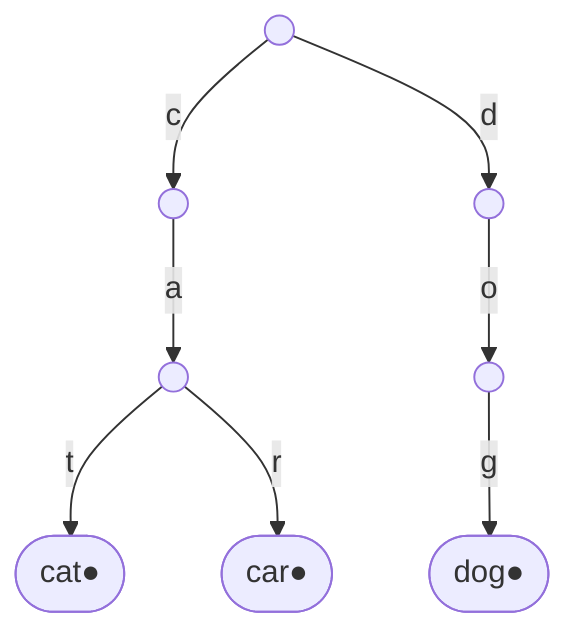

# 오늘의 주제: 트라이 (Trie, 접두사 트리)

> 문자열들을 **글자 단위로 갈라지는 트리**에 저장하는 자료구조.
> 루트에서 어떤 노드까지 내려오는 경로 = 하나의 접두사(prefix)다.
> KMP가 "한 패턴을 본문에서 빠르게 찾기"였다면, 트라이는 "여러 문자열을 한꺼번에 담고 접두사로 빠르게 질의하기"에 강하다.

---

## 1. 트라이가 뭐고, 왜 쓰는가

- **정의**: 각 간선이 한 글자를 의미하는 트리. 한 노드는 "루트에서 여기까지 내려온 글자열(=접두사)"을 대표한다.
- **핵심 성질**: 길이 `L`인 문자열의 삽입·탐색이 **저장된 문자열 개수와 무관하게** `O(L)`. (이진탐색트리처럼 다른 단어 수에 영향받지 않음)
- **언제 쓰나**
  - 사전(set/dict)에 "이 단어 있어?"를 넘어 **"이 접두사로 시작하는 단어 있어?"**를 물을 때.
  - 자동완성, 전화번호부 일관성 검사(한 번호가 다른 번호의 접두사인지), 문자열 집합에서 접두사 매칭.
  - XOR 최대/최소 (비트를 글자로 보는 **이진 트라이**) 같은 변형 문제.


`cat`, `car`, `dog`를 넣은 트라이. `●`(끝 표시)가 붙은 노드가 "여기서 끝나는 단어가 있다"는 뜻. `ca`는 노드로 존재하지만 끝 표시가 없으니 단어는 아니고 접두사일 뿐.

---

## 2. 구조와 핵심 포인트

노드 하나가 가지는 정보:

- **자식 맵**: `글자 → 다음 노드`. (소문자 26개면 배열, 일반 문자면 dict)
- **끝 표시(`end`)**: 이 노드에서 끝나는 단어가 있는지. 없으면 접두사로만 존재하는 것.

> ⚠️ **가장 흔한 실수**: 끝 표시를 안 두면 `app`을 넣은 뒤 `search("ap")`가 `True`로 나온다.
> "단어가 있다"와 "접두사가 있다"는 **반드시 구분**해야 한다.

- 삽입: 루트에서 글자 따라 내려가며 없는 자식은 만들고, 마지막 노드에 `end = True`.
- 탐색(단어): 끝까지 내려간 뒤 `end`가 `True`인지 확인.
- 탐색(접두사): 끝까지 내려갈 수 있으면 `True` (`end` 안 봄).

---

## 3. Python 템플릿 — dict 기반 트라이

```python
class Trie:
    def __init__(self):
        self.root = {}  # 글자 -> 하위 dict, '$': 단어 끝 표시

    def insert(self, word):
        node = self.root
        for ch in word:
            node = node.setdefault(ch, {})
        node['$'] = True

    def search(self, word):          # 정확히 그 단어가 있는가
        node = self.root
        for ch in word:
            if ch not in node:
                return False
            node = node[ch]
        return '$' in node

    def starts_with(self, prefix):   # 그 접두사로 시작하는 단어가 있는가
        node = self.root
        for ch in prefix:
            if ch not in node:
                return False
            node = node[ch]
        return True
```

- `setdefault(ch, {})`: 자식이 없으면 만들고, 어느 쪽이든 그 자식을 돌려준다. → 분기 없이 한 줄로 삽입.
- `'$'`처럼 글자로 안 나오는 키를 끝 표시로 쓰면 노드 클래스 없이 dict만으로 충분.

---

## 4. 대표 예제

### 예제 1 — BOJ 5052 전화번호 목록

> 전화번호 목록이 **일관성**이 있는지 판별. 어떤 번호가 다른 번호의 **접두사**이면 일관성 없음(NO).
> 예: `911`, `91125426` → `911`이 뒤 번호의 접두사 → NO.

**핵심 아이디어**: 트라이에 번호를 넣으면서 두 가지를 잡는다.
1. 내려가는 도중 **이미 끝난 단어**(`$`)를 만나면 → 지금 번호의 접두사가 이미 존재.
2. 새 단어를 다 넣었는데 **그 노드에 자식이 더 있으면** → 이 단어가 다른 번호의 접두사.

길이 정렬 같은 트릭 없이도 깔끔하게 잡힌다.

```python
import sys
input = sys.stdin.readline

def solve():
    n = int(input())
    nums = [input().strip() for _ in range(n)]
    root = {}
    consistent = True
    for num in nums:
        node = root
        for i, ch in enumerate(num):
            if '$' in node:          # 도중에 끝난 단어 만남 → 접두사 존재
                consistent = False
                break
            node = node.setdefault(ch, {})
        else:                        # break 없이 끝까지 감
            if node:                 # 끝 노드에 자식 존재 → 내가 누군가의 접두사
                consistent = False
            node['$'] = True
        if not consistent:
            break
    print("YES" if consistent else "NO")

t = int(input())
for _ in range(t):
    solve()
```

- `for ... else`: `break` 없이 루프가 끝났을 때만 `else` 블록 실행 → "도중에 접두사 충돌 없었음"을 자연스럽게 표현.
- **시간복잡도**: 전체 글자 수를 `S`라 하면 `O(S)`.

### 예제 2 — BOJ 14425 문자열 집합

> 집합 S(단어 N개)에 들어 있는 단어가, 검사할 M개 문자열 중 몇 개인지 세기.

**핵심 아이디어**: `set`으로도 풀리지만, 트라이로 `insert` 후 `search`로 정확 매칭 카운트. (접두사 질의로 확장될 때 트라이가 진가를 발휘)

```python
import sys
input = sys.stdin.readline

n, m = map(int, input().split())
root = {}
for _ in range(n):
    node = root
    for ch in input().strip():
        node = node.setdefault(ch, {})
    node['$'] = True

cnt = 0
for _ in range(m):
    node = root
    ok = True
    for ch in input().strip():
        if ch not in node:
            ok = False
            break
        node = node[ch]
    if ok and '$' in node:
        cnt += 1
print(cnt)
```

---

## 5. 복잡도와 주의점 정리

| 연산 | 시간 | 비고 |
|------|------|------|
| 삽입 | `O(L)` | L = 단어 길이 |
| 탐색 | `O(L)` | 저장된 단어 수와 무관 |
| 전체 구축 | `O(S)` | S = 모든 글자 수 합 |

- **메모리**: 노드마다 자식 맵 → 단어가 많고 길면 메모리 큼. PyPy/메모리 제한 빡센 문제는 dict 오버헤드 주의 (필요하면 26칸 배열).
- **재귀 금지 경향**: 트라이 순회는 보통 반복문으로 충분. 깊이가 단어 길이라 깊지 않음.
- **이진 트라이 변형**: 수를 30비트 정도로 보고 비트를 글자처럼 넣으면 "두 수 XOR 최대" 류를 `O(비트수)`에 해결.
- **끝 표시 필수**: 단어 vs 접두사 구분 안 하면 거의 모든 문제에서 틀린다. (1번 다시 강조)

---

## 한 줄 요약

> 트라이 = 접두사를 공유시켜 글자 트리에 담는 사전.
> "이 접두사로 시작하는 단어 있어?"를 `O(길이)`에 답한다. 끝 표시(`$`)로 단어와 접두사를 꼭 구분하라.
