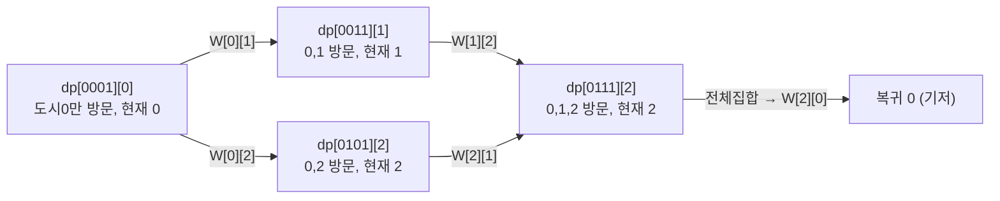

# 오늘의 주제: 비트마스킹 DP (Bitmask DP) — 외판원 순회 / TSP

> **한 줄 요약**: "어떤 원소들을 이미 방문/선택했는가"를 **정수 하나의 비트**로 표현해, 부분집합을 DP 상태로 쓰는 기법. 집합이 작을 때(보통 **N ≤ 20**) 강력하다.

---

## 1. 왜 비트마스크인가

`{0, 2, 3}` 처럼 "방문한 정점 집합"을 상태로 쓰고 싶을 때, 집합을 `set`이나 `frozenset`으로 들고 다니면 DP 테이블의 키로 쓰기 무겁다.
대신 **각 비트 1개 = 원소 1개**로 보면 집합 하나가 정수 하나가 된다.

```
집합 {0, 2, 3}  →  비트  ...01101  →  정수 13
                         3 2   0
```

- 원소 `i`가 집합에 있다 = `i`번째 비트가 1
- 전체 원소 N개 → 가능한 부분집합은 `2^N` 개 → 정수 `0 ~ 2^N - 1` 로 1:1 대응
- 그래서 DP 상태로 `dp[mask][...]` 형태를 쓸 수 있다. 이게 비트마스킹 DP의 핵심.

### 꼭 외우는 비트 연산

```python
visited | (1 << i)      # i번째 원소를 집합에 추가
visited & ~(1 << i)     # i번째 원소를 집합에서 제거
visited & (1 << i)      # i번째 원소가 있나? (0이 아니면 있음)
visited == (1 << N) - 1 # 모든 원소를 다 방문했나? (전체집합)
bin(visited).count("1") # 켜진 비트 수 (집합 크기)
```

> ⚠️ **주의**: `&`, `|`는 비교 연산자(`==`)보다 우선순위가 **낮다**.
> `if visited & (1 << i) == 0:` 은 `visited & ((1<<i)==0)` 으로 잘못 묶인다. 꼭 괄호 → `if (visited & (1 << i)) == 0:`

---

## 2. 대표 예제 — 외판원 순회 (BOJ 2098, TSP)

**문제**: N개 도시. 임의의 한 도시에서 출발해 **모든 도시를 정확히 한 번씩** 방문하고 출발 도시로 **돌아오는** 최소 비용. (`W[i][j]`는 i→j 비용, 0이면 길 없음.) N ≤ 16.

### 핵심 아이디어

- 출발 도시는 어디든 답이 같으므로 **0번 도시 고정**.
- 상태 `dp[visited][cur]` = "지금까지 `visited` 집합의 도시를 방문했고, 현재 `cur`에 있을 때, 남은 도시를 모두 돌고 0으로 복귀하는 최소 비용".
- 점화식:
  ```
  dp[visited][cur] = min ( W[cur][nxt] + dp[visited | (1<<nxt)][nxt] )
                     단, nxt 는 아직 visited 에 없고 W[cur][nxt] != 0
  ```
- 종료(기저): `visited == 전체집합` 이면 → `W[cur][0]` (시작점으로 복귀). 길 없으면 불가능(INF).

> **왜 `cur`도 상태에 필요한가?** 남은 경로의 비용은 "어디까지 방문했나(visited)"뿐 아니라 "지금 어느 도시에 서 있나(cur)"에 따라 달라지기 때문. 두 정보가 모여야 미래 비용이 결정된다 → DP의 무후효성(Markov 성질).

### 상태 전이 그림



### Python 풀이 (top-down 메모이제이션)

```python
import sys
input = sys.stdin.readline
sys.setrecursionlimit(1 << 20)
INF = float("inf")

N = int(input())
W = [list(map(int, input().split())) for _ in range(N)]
FULL = (1 << N) - 1
dp = [[-1] * N for _ in range(1 << N)]   # -1 = 아직 계산 안 함

def solve(visited, cur):
    if visited == FULL:                  # 모두 방문 → 시작점(0)으로 복귀
        return W[cur][0] if W[cur][0] else INF
    if dp[visited][cur] != -1:
        return dp[visited][cur]
    best = INF
    for nxt in range(N):
        if visited & (1 << nxt):         # 이미 방문
            continue
        if W[cur][nxt] == 0:             # 길 없음
            continue
        best = min(best, W[cur][nxt] + solve(visited | (1 << nxt), nxt))
    dp[visited][cur] = best
    return best

print(solve(1, 0))                        # 0번 도시 방문 상태에서 0에서 출발
```

- **시간복잡도**: 상태 `2^N · N` 개, 각 상태에서 전이 `N` 번 → **O(2^N · N²)**. N=16이면 약 1700만 → 충분.
- **공간복잡도**: O(2^N · N).

### 자주 하는 실수

- 기저에서 **시작점 복귀 비용 `W[cur][0]`** 을 빼먹기. TSP는 "돌아오는" 비용까지 포함해야 한다.
- `W[cur][nxt] == 0`(길 없음)을 비용 0으로 착각해 더해버리기 → 반드시 `continue`.
- INF를 너무 작게 잡아 정상 경로와 섞이기. `float("inf")`나 충분히 큰 값 사용.
- 비트 연산 우선순위 괄호 누락 (위 ⚠️ 참고).
- 출발점을 여러 개로 돌리며 중복 계산 → **0 하나로 고정**하면 끝.

---

## 3. 두 번째 예제 — 비트마스크 할당(assignment) DP

**유형**: N명에게 N개의 일을 1:1로 배정, `cost[i][j]` = i번째 사람이 j번째 일을 할 때 비용. **총비용 최소화**. (외판원과 형제 같은 패턴.)

핵심: `i`번째 사람을 처리할 차례 = `bin(mask).count("1")` (이미 배정된 일의 개수와 사람 인덱스가 일치). 그래서 상태는 **mask 하나**면 충분하다.

```python
from functools import lru_cache
INF = float("inf")
# cost[i][j], N명/​N일

@lru_cache(maxsize=None)
def assign(mask):
    i = bin(mask).count("1")     # 지금 배정할 사람 번호
    if i == N:
        return 0
    best = INF
    for j in range(N):           # i가 맡을 일 j 고르기
        if mask & (1 << j):      # 이미 누가 맡은 일
            continue
        best = min(best, cost[i][j] + assign(mask | (1 << j)))
    return best

print(assign(0))
```

- 상태 `2^N`, 전이 `N` → **O(2^N · N)**. (외판원보다 N배 가볍다 — `cur`가 mask에서 유도되기 때문.)
- 외판원과 차이: 여기선 "현재 위치"가 따로 필요 없어 상태에서 빠진다.

---

## 4. 비트마스크 DP 템플릿 & 체크리스트

```python
# 부분집합을 상태로 쓰는 일반형 (top-down)
dp = {}
def f(mask, *extra):
    if mask == FULL:            # 기저: 전체집합 처리 완료
        return base_value
    key = (mask, *extra)
    if key in dp:
        return dp[key]
    best = INF                  # 또는 0 / -INF (문제에 맞게)
    for i in range(N):
        if mask & (1 << i):     # 이미 쓴 원소 스킵
            continue
        # i를 선택했을 때의 전이
        best = optimize(best, value(i) + f(mask | (1 << i), next_extra))
    dp[key] = best
    return best
```

**언제 쓰나 (시그널)**
- "모든 것을 한 번씩 방문/배정/선택" + **N ≤ 20** 정도
- 외판원 순회, 작업 할당, 집합 분할/커버, 비트로 표현 가능한 좁은 상태
- N이 20을 넘으면 `2^N`이 폭발 → 다른 접근(그리디/다른 DP/분기한정) 고려

**부분집합 순회 트릭** (한 mask의 모든 부분집합을 도는 고급 패턴):
```python
sub = mask
while sub:
    # sub 는 mask의 부분집합
    sub = (sub - 1) & mask
# 전체 비용 O(3^N) (각 원소가 '밖/부분/전체' 3가지)
```

---

## 참고 문제

- BOJ 2098 외판원 순회 (TSP 기본형) — 위 풀이
- 할당(assignment) 유형: N명↔N일 1:1 최소비용 배정 — 3절 템플릿
- 일반화: "모든 원소를 한 번씩 방문/선택"하며 N ≤ 20 이면 비트마스크 DP 후보
