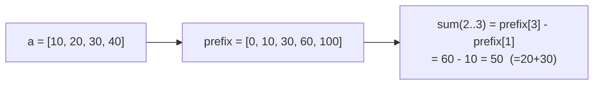
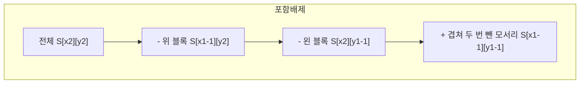

# 오늘의 주제: 누적합 / 구간합 (Prefix Sum)

> 언어: **Python**

배열에서 **"구간 [l, r]의 합"을 여러 번 물어볼 때**, 매번 더하면 질의 1개당 O(N)이라
질의 Q개에 O(NQ)가 든다. 미리 누적합을 한 번(O(N)) 만들어 두면
**각 질의를 O(1)** 로 답할 수 있다. 코테에서 가장 자주 쓰는 전처리 기법.

---

## 1. 핵심 아이디어 (1D)

`prefix[i]` = 원소 `a[0..i-1]`의 합 (즉 앞에서 i개의 합).

```
prefix[0] = 0
prefix[i] = prefix[i-1] + a[i-1]
```

그러면 **구간 합 [l, r] (1-indexed, 양끝 포함)** 은 단 한 번의 뺄셈으로 나온다:

```
sum(l..r) = prefix[r] - prefix[l-1]
```

`prefix[0]=0` 이라는 **더미(보초) 한 칸**이 `l=1`일 때 `prefix[0]`을 빼주는 경계를
깔끔하게 처리해 준다. 이게 누적합의 핵심 트릭.



### 왜 동작하는가
`prefix[r]`은 1~r의 합, `prefix[l-1]`은 1~(l-1)의 합.
앞부분을 빼면 정확히 l~r 구간만 남는다. **겹치는 앞부분을 상쇄**시키는 원리.

- 전처리: O(N) / 질의: O(1) / 공간: O(N)
- 단, **값이 자주 바뀌면(점 갱신)** 매번 누적합을 다시 만들어야 하므로 부적합 →
  그땐 **세그먼트 트리 / 펜윅 트리**를 쓴다. 누적합은 "갱신 없는 정적 배열" 전용.

---

## 2. 대표 예제 ① — 백준 11659 구간 합 구하기 4

수 N개와 질의 M개. 각 질의 `i j`에 대해 i~j번째 수의 합을 출력.

### 핵심 아이디어
- 누적합 배열을 1-indexed로 만들고 `prefix[j] - prefix[i-1]`.
- 입력이 크므로 `sys.stdin` 으로 빠르게 읽는다.

```python
import sys
input = sys.stdin.readline

n, m = map(int, input().split())
a = list(map(int, input().split()))

prefix = [0] * (n + 1)
for i in range(1, n + 1):
    prefix[i] = prefix[i - 1] + a[i - 1]

out = []
for _ in range(m):
    i, j = map(int, input().split())
    out.append(prefix[j] - prefix[i - 1])  # 구간 [i, j] 합

print('\n'.join(map(str, out)))
```

- 시간복잡도: 전처리 O(N) + 질의 O(M) = **O(N+M)**
- 자주 하는 실수: `prefix[j] - prefix[i]` 로 쓰면 a[i-1]이 빠진다 → 반드시 `i-1`.

---

## 3. 대표 예제 ② — 백준 11660 구간 합 구하기 5 (2D 누적합)

N×N 표에서 (x1,y1)~(x2,y2) 직사각형 영역의 합을 M번 질의.

### 핵심 아이디어 — 포함배제
`S[i][j]` = (1,1)부터 (i,j)까지 직사각형 전체의 합.

```
S[i][j] = a[i][j] + S[i-1][j] + S[i][j-1] - S[i-1][j-1]
```

위쪽 영역과 왼쪽 영역을 더하면 **왼쪽-위 모서리가 두 번** 들어가므로 한 번 뺀다.
질의(직사각형 [x1,y1]~[x2,y2]) 역시 같은 포함배제로:

```
ans = S[x2][y2] - S[x1-1][y2] - S[x2][y1-1] + S[x1-1][y1-1]
```



```python
import sys
input = sys.stdin.readline

n, m = map(int, input().split())
S = [[0] * (n + 1) for _ in range(n + 1)]

for i in range(1, n + 1):
    row = list(map(int, input().split()))
    for j in range(1, n + 1):
        S[i][j] = row[j - 1] + S[i - 1][j] + S[i][j - 1] - S[i - 1][j - 1]

out = []
for _ in range(m):
    x1, y1, x2, y2 = map(int, input().split())
    out.append(S[x2][y2] - S[x1 - 1][y2] - S[x2][y1 - 1] + S[x1 - 1][y1 - 1])

print('\n'.join(map(str, out)))
```

- 시간복잡도: 전처리 O(N²) + 질의 O(M) = **O(N²+M)**
- 자주 하는 실수: 질의식에서 `+ S[x1-1][y1-1]` 빠뜨리기(겹친 부분 보정), 인덱스 1-기준 헷갈림.

---

## 4. 응용 — "구간에 +v 더하기"는 차분(Imos) 배열

반대로 **점 질의 없이 구간 갱신만 여러 번** 한 뒤 마지막에 전체를 보는 문제라면,
누적합의 역연산인 **차분 배열**을 쓴다. 구간 [l,r]에 v를 더할 때:

```python
diff[l]   += v
diff[r+1] -= v
# 모든 갱신 후 누적합을 한 번 취하면 최종 배열 완성
acc = 0
for i in range(n):
    acc += diff[i]
    a[i] = acc
```

각 구간 갱신이 O(1), 마지막 복원이 O(N). (겹치는 예약/온도 누적 등에 자주 등장)

---

## 5. Python 템플릿 정리

```python
# 1D 누적합 (1-indexed, 더미 prefix[0]=0)
prefix = [0] * (n + 1)
for i in range(1, n + 1):
    prefix[i] = prefix[i - 1] + a[i - 1]
seg = lambda l, r: prefix[r] - prefix[l - 1]   # 구간 [l, r] 합

# 2D 누적합
S = [[0] * (n + 1) for _ in range(n + 1)]
for i in range(1, n + 1):
    for j in range(1, n + 1):
        S[i][j] = g[i-1][j-1] + S[i-1][j] + S[i][j-1] - S[i-1][j-1]
rect = lambda x1, y1, x2, y2: \
    S[x2][y2] - S[x1-1][y2] - S[x2][y1-1] + S[x1-1][y1-1]
```

### 한 줄 요약
- **정적 배열 + 구간합 질의 다수** → 누적합 (전처리 O(N), 질의 O(1))
- **구간 갱신 다수 + 마지막 한 번 조회** → 차분(Imos) 배열
- **갱신과 질의가 섞임** → 세그먼트 트리 / 펜윅 트리
