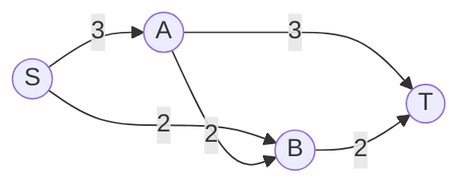
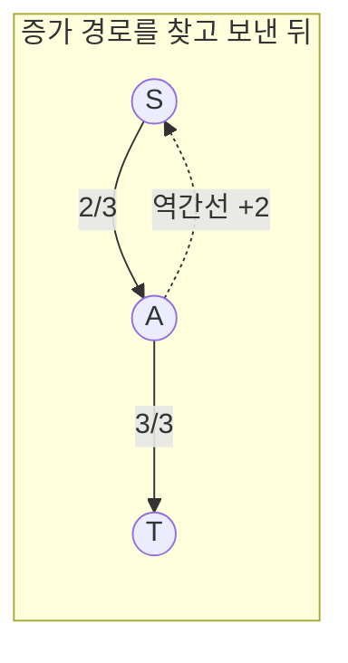
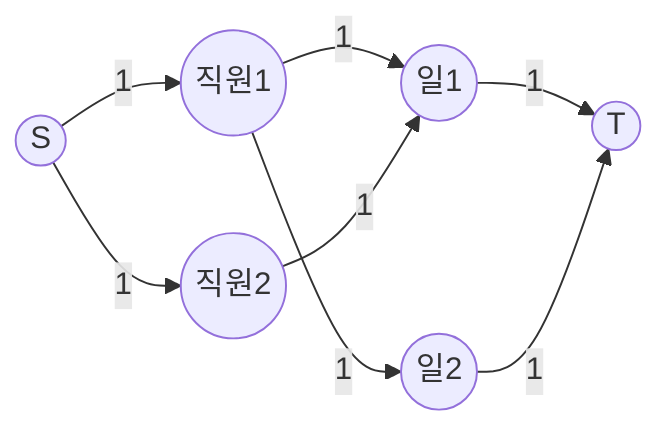

# 오늘의 주제: 네트워크 유량 (최대 유량, Maximum Flow)

> **한 줄 요약**: 소스(source)에서 싱크(sink)까지 간선 용량을 넘지 않으면서 흘려보낼 수 있는 **최대 흐름**을 구한다. 핵심은 *잔여 용량(residual)* 그래프 위에서 *증가 경로(augmenting path)* 를 반복해 찾는 것.

---

## 1. 어떤 문제인가

각 간선에 **용량(capacity)** 이 정해진 방향 그래프가 있고, 정해진 **소스 S → 싱크 T** 로 최대한 많은 양을 흘려보내고 싶다.

- 파이프(간선)마다 단위 시간당 보낼 수 있는 물의 양(용량)이 정해져 있음
- 각 정점은 **들어온 양 = 나간 양** (보존 법칙, S/T 제외)
- 목표: S에서 나가는(=T로 들어오는) 총량을 최대화



위 그래프의 최대 유량은 **4** (S→A→T 로 3 중 일부, S→B→T 등 조합). 단순 그리디로는 안 되고, **잘못 보낸 흐름을 되돌리는 장치**가 필요하다.

---

## 2. 핵심 아이디어 — 잔여 그래프와 역간선

### 왜 동작하는가 (정당성)
그냥 경로를 찾아 흘리는 그리디는 **초반에 잘못된 경로를 선택하면 최적해를 놓친다**. 이를 고치는 장치가 **역간선(reverse edge)**:

- 간선 u→v 에 흐름 f를 보내면 → **잔여 용량**이 `cap - f` 만큼 남고
- 동시에 역방향 v→u 에 `+f` 만큼의 잔여 용량이 생긴다 (= "되돌릴 수 있는 양")
- 이후 증가 경로가 역간선을 타면, 이전에 보낸 흐름을 **취소·재배치**하는 효과

> **포드-풀커슨 정리**: 더 이상 증가 경로가 없으면 = 최대 유량. 그리고 **최대 유량 = 최소 컷(min-cut)** (max-flow min-cut 정리).

### Edmonds-Karp = BFS로 증가 경로 찾기
- 증가 경로를 **BFS(최단 경로)** 로 찾는 포드-풀커슨 구현
- 시간복잡도 **O(V · E²)** — 경로를 BFS로 찾으면 증가 횟수가 O(VE)로 보장됨
- 구현이 단순하고, 코테에서 정점·간선 수가 작으면(수백~수천) 충분히 통과



---

## 3. 대표 예제 ① — 백준 6086 최대 유량

소문자/대문자 알파벳 정점(A~Z, a~z) 사이에 파이프가 있고, **A → Z** 로 흐를 수 있는 최대 유량을 구한다.
주의: 같은 두 정점 사이에 파이프가 **여러 개** 주어질 수 있음 → 용량을 **누적**해야 한다. 또 파이프는 **양방향**(무방향)으로 사용 가능.

### 핵심 아이디어
- 정점을 0~51 인덱스로 매핑 (`ord` 활용)
- 인접 행렬 `cap[u][v]` 에 용량 누적, **무방향이므로 양쪽 다** 더함
- BFS로 증가 경로를 찾으며 경로상 최소 잔여 용량(bottleneck)만큼 흘림
- 흘린 만큼 정방향 차감, 역방향 가산

```python
import sys
from collections import deque

input = sys.stdin.readline

def ch2idx(c):
    # A~Z: 0~25, a~z: 26~51
    return ord(c) - ord('A') if c.isupper() else ord(c) - ord('a') + 26

def main():
    N = int(input())
    SIZE = 52
    cap = [[0] * SIZE for _ in range(SIZE)]
    for _ in range(N):
        a, b, c = input().split()
        u, v = ch2idx(a), ch2idx(b)
        cap[u][v] += int(c)   # 같은 간선 여러 번 → 누적
        cap[v][u] += int(c)   # 무방향 파이프

    source, sink = ch2idx('A'), ch2idx('Z')
    total = 0

    while True:
        # BFS로 증가 경로 탐색, parent[v] = u
        parent = [-1] * SIZE
        parent[source] = source
        q = deque([source])
        while q:
            cur = q.popleft()
            for nxt in range(SIZE):
                if parent[nxt] == -1 and cap[cur][nxt] > 0:
                    parent[nxt] = cur
                    q.append(nxt)
        if parent[sink] == -1:
            break  # 더 이상 증가 경로 없음 → 종료

        # 경로상 최소 잔여 용량(bottleneck) 찾기
        flow = float('inf')
        v = sink
        while v != source:
            u = parent[v]
            flow = min(flow, cap[u][v])
            v = u

        # 잔여 그래프 갱신: 정방향 -, 역방향 +
        v = sink
        while v != source:
            u = parent[v]
            cap[u][v] -= flow
            cap[v][u] += flow
            v = u

        total += flow

    print(total)

main()
```

- **시간복잡도**: O(V·E²) (Edmonds-Karp). 여기선 V=52라 매우 빠름.
- **bottleneck**: 한 경로로 보낼 수 있는 양 = 경로상 가장 좁은 간선의 잔여 용량.

---

## 4. 대표 예제 ② — 이분 매칭 (백준 11375 열혈강호)

최대 유량의 가장 흔한 응용. **N명의 직원 ↔ M개의 일** 을 최대한 많이 매칭한다.

### 유량으로의 변환
- 가상의 **소스 S → 각 직원** (용량 1)
- **각 직원 → 가능한 일** (용량 1)
- **각 일 → 싱크 T** (용량 1)
- → 이 그래프의 최대 유량 = 최대 매칭 수



전용 알고리즘(쾨니그, DFS 기반 증가 경로)이 더 간결하다:

```python
import sys
sys.setrecursionlimit(10**6)
input = sys.stdin.readline

def dfs(u):
    for v in adj[u]:           # 직원 u가 할 수 있는 일들
        if visited[v]:
            continue
        visited[v] = True
        # 일 v가 비었거나, v를 맡던 직원이 다른 일로 양보 가능하면
        if match[v] == -1 or dfs(match[v]):
            match[v] = u
            return True
    return False

N, M = map(int, input().split())
adj = [[] for _ in range(N + 1)]
for u in range(1, N + 1):
    data = list(map(int, input().split()))
    adj[u] = data[1:]          # 첫 수는 개수

match = [-1] * (M + 1)         # match[일] = 직원
result = 0
for u in range(1, N + 1):
    visited = [False] * (M + 1)
    if dfs(u):
        result += 1

print(result)
```

- **시간복잡도**: O(V·E) — 각 직원마다 한 번씩 증가 경로 탐색.
- 핵심: `match[v]`가 이미 차 있어도 **그 직원을 다른 일로 밀어낼 수 있으면**(`dfs(match[v])`) 자리를 빼앗는다. 이게 곧 "역간선으로 흐름 되돌리기"와 같은 원리.

---

## 5. 자주 하는 실수

- **역간선을 안 만든다** → 그리디가 돼서 최적해를 못 찾음. *반드시* `cap[v][u] += flow`.
- 무방향 그래프(6086)에서 한쪽 방향만 용량 설정 → 틀림. 양쪽 다 더해야.
- 같은 정점 쌍에 간선이 여러 개일 때 **덮어쓰기(=)** 하면 틀림 → **누적(+=)**.
- 이분 매칭에서 `visited`를 **각 직원 탐색마다 새로** 초기화하지 않으면 무한 양보 발생.
- `dfs(match[v])` 재귀 → 재귀 깊이 큰 경우 `setrecursionlimit` 필수.

---

## 6. Python 템플릿 — Edmonds-Karp (인접 리스트 + 용량 딕셔너리)

정점 수가 많을 땐 인접 행렬 대신 리스트로:

```python
from collections import deque, defaultdict

class MaxFlow:
    def __init__(self, n):
        self.n = n
        self.cap = defaultdict(lambda: defaultdict(int))
        self.adj = defaultdict(set)

    def add_edge(self, u, v, c):
        self.cap[u][v] += c
        self.adj[u].add(v)
        self.adj[v].add(u)        # 역간선 탐색용

    def max_flow(self, s, t):
        total = 0
        while True:
            parent = {s: s}
            q = deque([s])
            while q and t not in parent:
                u = q.popleft()
                for v in self.adj[u]:
                    if v not in parent and self.cap[u][v] > 0:
                        parent[v] = u
                        q.append(v)
            if t not in parent:
                break
            # bottleneck
            f, v = float('inf'), t
            while v != s:
                f = min(f, self.cap[parent[v]][v]); v = parent[v]
            v = t
            while v != s:
                u = parent[v]
                self.cap[u][v] -= f
                self.cap[v][u] += f
                v = u
            total += f
        return total
```

---

## 한눈에 보기

| 항목 | 내용 |
|------|------|
| 언제 쓰나 | 소스→싱크 최대 흐름, 이분 매칭, 최소 컷, 정점 분리(용량 1) 문제 |
| 핵심 장치 | 잔여 그래프 + **역간선**(흐름 되돌리기) |
| Edmonds-Karp | BFS로 증가 경로, **O(V·E²)** |
| 이분 매칭 | DFS 증가 경로, **O(V·E)** — 더 간결 |
| 대표 정리 | 최대 유량 = 최소 컷 (max-flow min-cut) |
