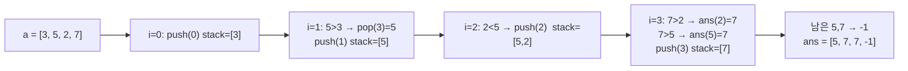
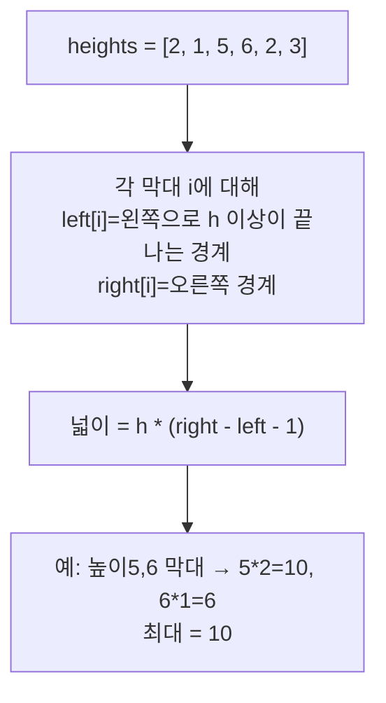

# 오늘의 주제: 단조 스택 (Monotonic Stack)

> 언어: **Python**

스택을 쓰되 **항상 증가(또는 감소) 순서를 유지**하도록 관리하는 기법.
"각 원소의 오른쪽/왼쪽에서 자기보다 큰(작은) **첫 번째 원소**를 찾아라" 류의 문제를
**전체 O(N)** 에 푼다. 단순 이중 반복문이면 O(N²)인 걸 한 줄짜리 스택으로 줄이는 게 핵심.

대표 적용: **오큰수(NGE, Next Greater Element)**, **히스토그램 최대 직사각형**,
빗물 받기, 주식 span, 단조 큐(슬라이딩 윈도우 최댓값)의 사촌.

---

## 1. 핵심 아이디어

스택에 **인덱스**를 쌓는다. 새 원소를 보기 전에,
**스택 top이 "지금 들어올 규칙"을 깨면 pop** 한다. 그 pop되는 순간이 바로
"이 원소의 답이 확정되는 순간"이다.

오큰수(오른쪽에서 자기보다 큰 첫 수)를 예로 들면:

- 스택에는 **아직 답을 못 찾은 인덱스**들이 **값 내림차순**으로 쌓여 있다.
- 새 값 `a[i]`가 스택 top의 값보다 **크면** → top은 드디어 오른쪽 큰 수를 만났다 → pop하며 답 = `a[i]`.
- 더 이상 크지 않을 때까지 반복 pop → 그 다음 `i`를 push.



### 왜 O(N)인가 (정당성)
각 인덱스는 **스택에 정확히 한 번 push, 최대 한 번 pop** 된다.
while 안쪽 pop이 많아 보여도 전체 합산하면 ≤ N번. → **분할상환(amortized) O(N)**.

### 왜 동작하는가
스택을 **단조(내림차순)** 로 유지하면, top은 항상 "현재까지 답을 못 받은 것 중
가장 최근/가장 작은" 후보다. 새 값이 그걸 넘기면 그 후보의 답이 그 자리에서 확정된다.
**한 번 답을 받으면 다시 볼 필요가 없다** → 그래서 pop해서 버려도 안전.

---

## 2. 예제 ① 백준 17298 — 오큰수 (NGE)

수열의 각 원소에 대해 **오른쪽에 있으면서 자신보다 큰 수 중 가장 왼쪽 수**.
없으면 -1.

### 핵심 아이디어
- 스택에 **인덱스**를 쌓고 값 내림차순 유지.
- `a[i]`가 `a[stack[-1]]`보다 크면 pop하며 `ans[pop] = a[i]`.

```python
import sys
input = sys.stdin.readline

n = int(input())
a = list(map(int, input().split()))
ans = [-1] * n
stack = []  # 인덱스 저장 (a 값 내림차순)

for i in range(n):
    while stack and a[stack[-1]] < a[i]:
        ans[stack.pop()] = a[i]
    stack.append(i)

print(*ans)
```

- 시간 O(N), 공간 O(N).
- **자주 하는 실수**: 값이 아니라 **인덱스**를 쌓아야 답을 어디에 채울지 안다.
  `<` 대신 `<=`로 쓰면 "같은 값"도 큰 수로 잘못 처리됨(문제 정의상 더 커야 함).

---

## 3. 예제 ② 백준 6549 — 히스토그램에서 가장 큰 직사각형

높이 배열에서, 막대들을 잘라 만들 수 있는 **최대 넓이 직사각형**.
각 막대를 높이로 하는 직사각형이 **왼쪽/오른쪽으로 얼마나 뻗을 수 있나**를 구하면 된다.

### 핵심 아이디어
- 스택을 **높이 오름차순**으로 유지(증가 단조 스택).
- 새 막대가 top보다 **낮으면** → top 막대는 더 못 뻗는다 → pop하며 넓이 계산.
- pop된 막대의 높이 `h`, 폭 = 현재 위치 `i`와 "그 아래 남은 인덱스" 사이 거리.
- 끝에 **보초값 0**을 붙이면 스택에 남은 막대를 자동으로 전부 정산해 깔끔하다.



```python
import sys
input = sys.stdin.readline

while True:
    data = list(map(int, input().split()))
    if data[0] == 0:
        break
    n, heights = data[0], data[1:]
    heights.append(0)        # 보초: 남은 스택 전부 정산
    stack = []               # 인덱스, 높이 오름차순
    best = 0
    for i, h in enumerate(heights):
        while stack and heights[stack[-1]] > h:
            top = stack.pop()
            height = heights[top]
            # 폭: 새 위치 i 직전까지, 스택 아래 막대 다음부터
            width = i if not stack else i - stack[-1] - 1
            best = max(best, height * width)
        stack.append(i)
    print(best)
```

- 시간 O(N), 공간 O(N).
- **자주 하는 실수**:
  - 폭 계산에서 `i - stack[-1] - 1`의 `-1`을 빠뜨림(경계 막대는 폭에서 제외).
  - 스택이 빈 경우 폭은 `i`(왼쪽 끝까지 전부 뻗음).
  - 넓이는 int 범위 주의(높이·너비 큰 입력 → Python은 자동 빅정수라 안전).

---

## 4. Python 템플릿

```python
# 오른쪽에서 "자기보다 큰 첫 원소" 인덱스 (없으면 -1)
def next_greater(a):
    n = len(a)
    res = [-1] * n
    stack = []                      # 인덱스, 값 내림차순
    for i in range(n):
        while stack and a[stack[-1]] < a[i]:
            res[stack.pop()] = i    # 인덱스로 답 채움 (값이면 a[i])
        stack.append(i)
    return res
```

- 방향 바꾸기: **왼쪽**에서 찾으려면 `range(n-1, -1, -1)`로 거꾸로 순회.
- 작은 수 찾기(NSE): 비교 부호를 `>`로 뒤집기.
- "같으면 포함" 여부에 따라 `<`/`<=` 선택 — 문제 정의를 꼭 확인.

---

## 정리

| 패턴 | 스택 단조성 | 언제 pop |
|------|------------|----------|
| 오른쪽 큰 수(NGE) | 값 내림차순 | 새 값이 top보다 클 때 |
| 오른쪽 작은 수(NSE) | 값 오름차순 | 새 값이 top보다 작을 때 |
| 히스토그램 최대 직사각형 | 높이 오름차순 | 새 높이가 낮을 때(정산) |

**한 줄 요약**: "각 원소의 가장 가까운 더 큰/작은 이웃"을 묻는 문제면
이중 루프 대신 **단조 스택으로 O(N)**. 인덱스를 쌓고, 규칙 깨는 순간 pop하며 답 확정.
