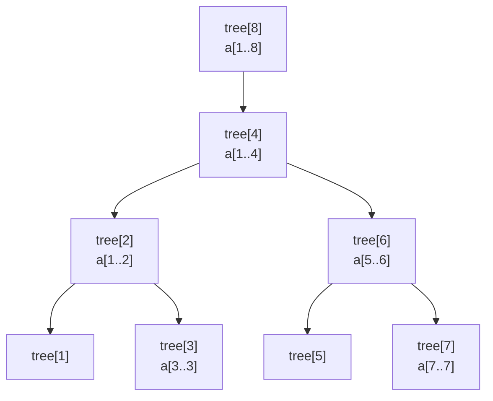

# 펜윅 트리 (Fenwick Tree / Binary Indexed Tree, BIT)

> **오늘의 주제: 펜윅 트리(BIT)** — 구간 합을 `O(log N)`에 갱신·질의하는 가장 간결한 자료구조.
> 세그먼트 트리와 같은 일을 하지만, 코드가 훨씬 짧고 상수가 작다. **"점 갱신 + 구간 합"** 이면 거의 항상 BIT가 정답.

언어: **Python**

---

## 1. 왜 쓰는가 / 언제 쓰는가

배열에서 다음 두 연산을 **둘 다 빠르게** 하고 싶을 때:

- 한 원소를 갱신 (`a[i] += v`)
- 구간 합 질의 (`a[l..r]`의 합)

| 방법 | 갱신 | 구간 합 |
|------|------|---------|
| 그냥 배열 | O(1) | O(N) |
| 누적합(prefix sum) | O(N) (전체 재계산) | O(1) |
| **펜윅 트리** | **O(log N)** | **O(log N)** |

→ **갱신이 자주 일어나는데 구간 합도 자주 물어보면** 누적합은 망한다. 그때 BIT.

세그먼트 트리도 같은 복잡도지만, BIT는:
- 코드가 10줄 안팎으로 짧다 (실수 줄어듦)
- 상수가 작아 더 빠르다
- 단점: "구간 최솟값/최댓값" 같은 비가역 연산엔 부적합 → 그건 세그먼트 트리.

---

## 2. 핵심 아이디어 — 왜 동작하는가

BIT는 1-indexed 배열 `tree[]`를 쓴다. `tree[i]`는 **인덱스 `i`에서 끝나는, 길이 `(i & -i)`인 구간의 합**을 담는다.

여기서 `i & -i`는 **i의 최하위 비트(LSB)** 하나만 남긴 값이다. 예: `12 = 1100₂` → `12 & -12 = 4`.
즉 `tree[12]`는 `a[9..12]`의 합을 담는다.



- **prefix 합 `sum(1..i)`**: `i`에서 시작해 LSB를 빼며 내려간다 (`i -= i & -i`). 겹치지 않는 구간들을 모아 더함.
- **갱신 `update(i, v)`**: `i`를 포함하는 모든 노드로 올라간다 (`i += i & -i`).

각 경로의 길이는 비트 수만큼 → **O(log N)**. 이게 정당성의 핵심.

---

## 3. Python 템플릿

```python
class BIT:
    def __init__(self, n):
        self.n = n
        self.tree = [0] * (n + 1)        # 1-indexed

    def update(self, i, delta):           # a[i] += delta
        while i <= self.n:
            self.tree[i] += delta
            i += i & -i                   # 상위 노드로

    def query(self, i):                   # sum(a[1..i])
        s = 0
        while i > 0:
            s += self.tree[i]
            i -= i & -i                   # 하위로
        return s

    def range_query(self, l, r):          # sum(a[l..r])
        return self.query(r) - self.query(l - 1)
```

> **주의:** BIT는 **1-indexed**가 자연스럽다. `i & -i`는 i가 0이면 0이 되어 무한루프/누락이 생기므로 인덱스는 1부터 시작.

---

## 4. 예제 1 — BOJ 2042 구간 합 구하기

> 수열에서 값 변경과 구간 합 질의가 섞여 들어온다. (N≤1e6, 질의 많음)

### 핵심 아이디어
점 갱신은 **델타(증분)** 로 처리해야 한다. `a[i]`를 새 값 `b`로 바꾸려면 `update(i, b - a[i])` 후 `a[i] = b`. 그냥 `update(i, b)` 하면 누적되어 틀린다 — **가장 흔한 실수.**

```python
import sys
input = sys.stdin.readline

n, m, k = map(int, input().split())
a = [0] * (n + 1)
bit = BIT(n)
for i in range(1, n + 1):
    a[i] = int(input())
    bit.update(i, a[i])

for _ in range(m + k):
    cmd, x, y = map(int, input().split())
    if cmd == 1:                 # x번째를 y로 변경
        bit.update(x, y - a[x])  # 델타로!
        a[x] = y
    else:                        # x..y 구간 합
        print(bit.range_query(x, y))
```

- **시간복잡도:** 초기화 O(N log N), 각 연산 O(log N) → 전체 O((N+M+K) log N)

---

## 5. 예제 2 — BOJ 1517 버블 소트 (전치 수 / inversion count)

> 버블 소트의 swap 횟수 = 수열의 **inversion**(i<j인데 a[i]>a[j]) 개수. BIT의 진짜 강력함이 드러나는 곳.

### 핵심 아이디어
값을 **왼쪽부터** 하나씩 BIT에 넣으면서, "지금 넣는 값보다 **큰 값이 이미 몇 개 들어왔는지**"를 센다. 그 개수가 이 원소가 만드는 inversion이다.

- "값"을 인덱스로 쓰는 BIT → 값의 범위가 크면 **좌표 압축** 필요.
- `query(전체) - query(현재값)` = 나보다 큰 값들의 개수.

```python
import sys
input = sys.stdin.readline

n = int(input())
a = list(map(int, input().split()))

# 좌표 압축: 값 -> 1..n 순위
rank = {v: i + 1 for i, v in enumerate(sorted(a))}

bit = BIT(n)
inv = 0
for v in a:
    r = rank[v]
    inv += bit.query(n) - bit.query(r)  # 이미 들어온 것 중 r보다 큰 개수
    bit.update(r, 1)

print(inv)
```

- **시간복잡도:** O(N log N) — N²의 버블 소트를 직접 돌리지 않고 횟수만 센다.
- inversion 개수는 N≤5e5에서 최대 약 1.25e11 → **파이썬은 자동 빅인티저라 안전**(C++였다면 long long 필수).

---

## 6. 자주 하는 실수

- **0-index 그대로 사용** → `i & -i`가 0에서 멈춰 누락/무한루프. 항상 1-indexed.
- **값 교체를 델타가 아니라 절대값으로 update** → 누적되어 오답 (예제 1).
- **좌표 압축 빼먹음** → 값 범위가 크면 `tree` 배열 메모리 폭발.
- **구간 합을 `query(r)-query(l)`로** 계산 → `l-1`이어야 한다. off-by-one 단골.

---

## 7. 한 줄 요약

> **점 갱신 + 구간 합** = 펜윅 트리. `i & -i`로 올라가면 갱신, 내려가면 합. 짧고 빠르다.
> 구간 최소/최대가 필요하면 세그먼트 트리로.
