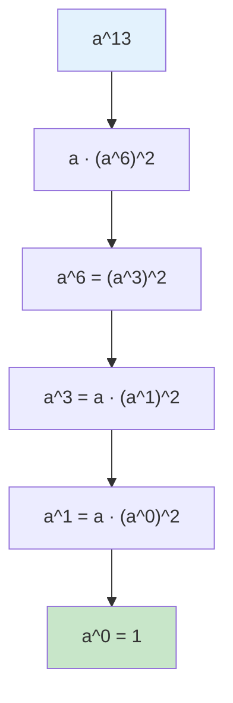

# 오늘의 주제: 분할 정복을 이용한 거듭제곱 (Fast Power / 행렬 거듭제곱)

> `a^n`을 **O(n)** 이 아니라 **O(log n)** 에 계산하는 기법.
> 핵심은 "지수를 절반으로 쪼개고, 한 번 계산한 결과를 재사용"하는 것.
> 모듈러 지수(1629), 행렬 거듭제곱(10830), 피보나치 수 6(11444) 등에서 똑같은 뼈대를 쓴다.

---

## 1. 왜 동작하는가 — 지수 분할의 정당성

거듭제곱은 지수의 **덧셈을 곱셈으로** 분해할 수 있다.

$$
a^n =
\begin{cases}
1 & (n = 0)\\
(a^{n/2})^2 & (n \text{ 짝수})\\
a \cdot (a^{(n-1)/2})^2 & (n \text{ 홀수})
\end{cases}
$$

- 한 번 재귀를 내려갈 때마다 지수 `n`이 **절반**이 된다 → 재귀 깊이 `log₂ n`.
- 각 단계에서 곱셈은 상수 번(제곱 1번, 홀수면 추가 곱 1번)이므로 전체 **O(log n)** 번의 곱셈.
- 단순 반복 `a*a*...*a` 는 O(n) — n이 10억이면 절대 안 끝난다. 그래서 분할 정복이 필수.



> 13 → 6 → 3 → 1 → 0. 5단계만에 도달 (= ⌊log₂13⌋+1). 곱셈 횟수가 13번이 아니라 logn번임에 주목.

---

## 2. 모듈러 지수 — 백준 1629 곱셈

`A^B mod C` 를 구한다. `A, B, C ≤ 2,147,483,647` 이라 `B`가 약 21억 → O(B) 불가, O(log B) 필수.

### 핵심 아이디어
- `(x · y) mod C = ((x mod C) · (y mod C)) mod C` — 곱할 때마다 mod를 취해 오버플로/거대수 방지.
- Python은 큰 정수를 지원하지만, **매 단계 mod를 취해야** 수가 폭발하지 않고 빠르다.

### 반복(iterative) 풀이 — 가장 안전한 템플릿
```python
import sys
input = sys.stdin.readline

A, B, C = map(int, input().split())

def power(base, exp, mod):
    result = 1
    base %= mod
    while exp > 0:
        if exp & 1:          # 지수의 현재 비트가 1이면
            result = result * base % mod
        base = base * base % mod   # base 를 제곱
        exp >>= 1            # 다음 비트로
    return result

print(power(A, B, C))
```
- **시간복잡도**: O(log B)
- 사실 Python엔 내장 `pow(A, B, C)` 가 있고 동일하게 O(log B)로 동작한다. **실전에선 `print(pow(A, B, C))` 한 줄이면 끝** — 단, 원리는 알아야 행렬 버전으로 확장 가능하다.

---

## 3. 행렬 거듭제곱 — 백준 10830 행렬 제곱

`N×N` 행렬 `A`에 대해 `A^B mod 1000` 을 출력. `B ≤ 100,000,000,000` 이라 역시 O(log B).

### 핵심 아이디어
- 스칼라 거듭제곱의 "곱셈"을 **행렬 곱셈**으로 바꾸기만 하면 똑같은 분할 정복이 성립.
- 항등원은 1이 아니라 **단위행렬(I)**. (`result`의 초기값을 단위행렬로!)
- 행렬 곱은 결합법칙이 성립하므로 `(A^k)^2` 분해가 그대로 유효.

```python
import sys
input = sys.stdin.readline
MOD = 1000

def mat_mul(X, Y, n):
    Z = [[0] * n for _ in range(n)]
    for i in range(n):
        for k in range(n):          # k를 가운데 두면 캐시 친화적
            if X[i][k] == 0:
                continue
            for j in range(n):
                Z[i][j] = (Z[i][j] + X[i][k] * Y[k][j]) % MOD
    return Z

def mat_pow(A, B, n):
    # 단위행렬로 초기화 (스칼라의 1에 해당)
    result = [[1 if i == j else 0 for j in range(n)] for i in range(n)]
    while B > 0:
        if B & 1:
            result = mat_mul(result, A, n)
        A = mat_mul(A, A, n)
        B >>= 1
    return result

N, B = map(int, input().split())
A = [list(map(int, input().split())) for _ in range(N)]
A = [[x % MOD for x in row] for row in A]   # 입력값이 1000 이상일 수 있음 → 먼저 mod

ans = mat_pow(A, B, N)
print('\n'.join(' '.join(map(str, row)) for row in ans))
```
- **시간복잡도**: 행렬 곱 1회가 O(N³), 곱셈을 O(log B)번 → **O(N³ log B)**

### 활용: 피보나치 수 6 (11444)
점화식이 선형이면 행렬로 표현해 O(log n)에 n번째 항을 구한다.

$$
\begin{pmatrix} F_{n+1} \\ F_{n} \end{pmatrix}
=\begin{pmatrix} 1 & 1 \\ 1 & 0 \end{pmatrix}^{n}
\begin{pmatrix} F_{1} \\ F_{0} \end{pmatrix}
\;\Rightarrow\;
\begin{pmatrix} 1 & 1 \\ 1 & 0 \end{pmatrix}^{n}
=\begin{pmatrix} F_{n+1} & F_{n} \\ F_{n} & F_{n-1} \end{pmatrix}
$$

→ `mat_pow([[1,1],[1,0]], n)` 의 `[0][1]` 원소가 `F_n`. n이 10^17이어도 즉시 계산.

---

## 4. 자주 하는 실수

- **항등원 초기화 실수**: 스칼라는 `result = 1`, **행렬은 단위행렬**. 0행렬로 시작하면 결과가 전부 0.
- **mod를 입력 직후에 안 함**: 10830은 입력 원소가 1000 이상일 수 있다. 처음에 `% MOD` 안 하면 첫 곱부터 값이 달라진다.
- **`B == 0` 처리**: 행렬 0제곱은 단위행렬이어야 한다. 위 템플릿은 while을 한 번도 안 돌고 `result`(단위행렬)를 그대로 반환 → 자동으로 맞다.
- **재귀 깊이**: 재귀로 짜면 깊이 log n이라 문제없지만, 반복 버전이 더 안전하고 빠르다.
- **음수/0 지수**: 코테에선 지수가 음수면 모듈러 역원이 필요(별개 주제). 기본 템플릿은 `exp ≥ 0` 가정.

---

## 5. Python 템플릿 (반복식, 스칼라 · 행렬 공용 뼈대)

```python
# 스칼라: a^n mod m
def power(base, exp, mod):
    result = 1
    base %= mod
    while exp > 0:
        if exp & 1:
            result = result * base % mod
        base = base * base % mod
        exp >>= 1
    return result
# 실전 한 줄: pow(base, exp, mod)

# 행렬: A^n mod m  (A 는 n×n 리스트)
def mat_pow(A, p, n, mod):
    R = [[int(i == j) for j in range(n)] for i in range(n)]  # 단위행렬
    while p:
        if p & 1:
            R = mat_mul(R, A, n, mod)
        A = mat_mul(A, A, n, mod)
        p >>= 1
    return R
```

**한 줄 요약**: 지수를 이진수로 보고 비트를 훑으며, `base`를 계속 제곱하면서 비트가 1인 자리에만 곱한다 — 스칼라든 행렬이든 "곱셈"과 "항등원"만 바꾸면 동일하게 동작한다.
