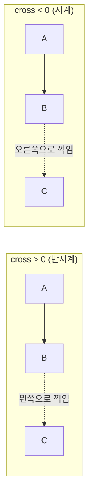
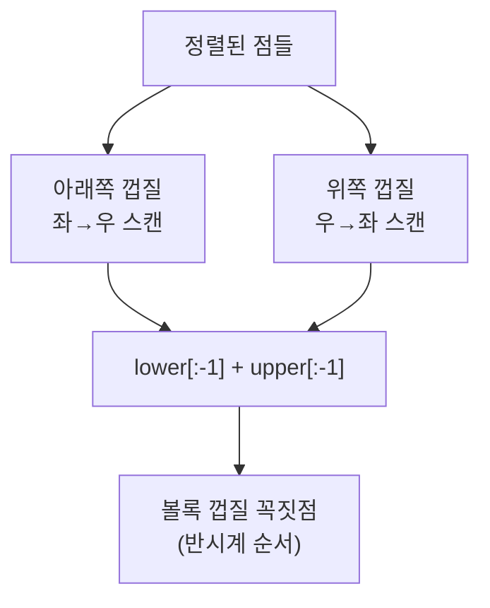

# CCW와 볼록 껍질 (Convex Hull)

> **오늘의 주제: CCW(외적 방향 판별)와 그것을 기반으로 한 선분 교차 · 다각형 넓이 · 볼록 껍질**

기하 문제의 90%는 "세 점이 어느 쪽으로 꺾이는가?"라는 하나의 질문으로 귀결된다. 그 질문의 답이 **CCW(Counter-ClockWise)** 이고, 여기서 선분 교차 판정, 다각형 넓이, 볼록 껍질이 전부 파생된다. 부동소수점 없이 **정수 연산만으로** 처리하는 게 핵심이다.

---

## 1. CCW — 모든 기하의 뿌리

세 점 A, B, C가 있을 때, A→B→C로 이동하면 **반시계(왼쪽)** 로 꺾이는가, **시계(오른쪽)** 로 꺾이는가, 아니면 **일직선**인가?

벡터 AB와 AC의 **외적(cross product)** 부호로 판별한다.

```
cross = (B.x - A.x) * (C.y - A.y) - (B.y - A.y) * (C.x - A.x)
```

| cross 부호 | 의미 |
|-----------|------|
| `> 0` | 반시계(CCW), C가 AB 왼쪽 |
| `< 0` | 시계(CW), C가 AB 오른쪽 |
| `= 0` | 세 점이 일직선(collinear) |



**왜 외적인가?** 외적 `AB × AC`의 z성분 크기는 두 벡터가 만드는 **평행사변형의 부호 있는 넓이**다. 부호가 곧 회전 방향이고, 절댓값의 절반이 삼각형 ABC의 넓이다. 하나의 식이 방향과 넓이를 동시에 준다.

```python
def ccw(a, b, c):
    # a, b, c: (x, y) 튜플
    cross = (b[0]-a[0])*(c[1]-a[1]) - (b[1]-a[1])*(c[0]-a[0])
    if cross > 0: return 1     # 반시계
    if cross < 0: return -1    # 시계
    return 0                    # 일직선
```

> **주의점**: 좌표가 크면(±10^9) 곱셈에서 오버플로가 날 수 있는 언어가 있으나, **파이썬은 정수 무한 정밀도라 안전**하다. `float` 좌표라면 `eps`(예: 1e-9)로 부호를 판정해야 한다.

---

## 2. 파생 ① — 다각형 넓이 (신발끈 공식)

CCW의 부호 있는 넓이를 이어붙이면 **신발끈 공식(shoelace)** 이 된다. 다각형 꼭짓점을 순서대로 돌며 외적을 누적:

```python
def polygon_area(points):
    n = len(points)
    s = 0
    for i in range(n):
        x1, y1 = points[i]
        x2, y2 = points[(i+1) % n]
        s += x1*y2 - x2*y1
    return abs(s) / 2
```

- 시간복잡도 **O(N)**. 점 순서가 CCW면 `s>0`, CW면 `s<0` → `abs`로 방향 무관하게 넓이.

---

## 3. 파생 ② — 두 선분의 교차 판정

선분 AB와 CD가 교차하는가? **CCW 네 번**으로 판정한다.

```python
def segment_intersect(a, b, c, d):
    ab = ccw(a, b, c) * ccw(a, b, d)   # C, D가 직선 AB의 서로 반대편?
    cd = ccw(c, d, a) * ccw(c, d, b)   # A, B가 직선 CD의 서로 반대편?
    if ab == 0 and cd == 0:
        # 네 점이 일직선 → 구간 겹침 검사
        a, b = min(a, b), max(a, b)
        c, d = min(c, d), max(c, d)
        return a <= d and c <= b
    return ab <= 0 and cd <= 0
```

- **일반적인 경우**: 두 곱이 모두 음수면 확실히 교차, 0이면 끝점이 상대 선분 위에 닿음.
- **자주 하는 실수**: 일직선(모두 collinear)일 때 좌표 구간 겹침을 따로 검사하지 않아 틀림. 위처럼 정렬 후 `a <= d and c <= b`로 처리.

---

## 4. 파생 ③ — 볼록 껍질 (Convex Hull, Andrew's Monotone Chain)

주어진 점들을 **모두 감싸는 최소 볼록 다각형**의 꼭짓점을 구한다. 고무줄로 못들을 감싸는 이미지.

**Andrew의 모노톤 체인**: 점을 정렬한 뒤, 아래쪽 껍질과 위쪽 껍질을 각각 스택으로 만든다. 새 점을 넣을 때 **반시계로 꺾이지 않으면(우회전·직선) 이전 점을 pop**.

```python
def convex_hull(points):
    points = sorted(set(points))       # x, 그다음 y 기준 정렬 + 중복 제거
    if len(points) <= 2:
        return points

    def build(pts):
        hull = []
        for p in pts:
            # 마지막 두 점 + p 가 반시계(>0)가 아닐 때 pop
            while len(hull) >= 2 and ccw(hull[-2], hull[-1], p) <= 0:
                hull.pop()
            hull.append(p)
        return hull

    lower = build(points)              # 아래쪽 껍질
    upper = build(points[::-1])        # 위쪽 껍질 (역순으로 같은 로직)
    return lower[:-1] + upper[:-1]     # 양 끝 중복 제거
```

- 시간복잡도 **O(N log N)** (정렬이 지배). 이후 스택 처리는 O(N).
- `<= 0`으로 하면 **일직선 위의 점을 껍질에서 제외**(꼭짓점만). 경계 위 점까지 포함하려면 `< 0`.



---

## 대표 예제

### 예제 1 — 백준 11758 CCW

세 점이 주어질 때 방향을 판별해 `1`(반시계) / `-1`(시계) / `0`(일직선) 출력.

```python
import sys
input = sys.stdin.readline

def ccw(a, b, c):
    cross = (b[0]-a[0])*(c[1]-a[1]) - (b[1]-a[1])*(c[0]-a[0])
    return (cross > 0) - (cross < 0)   # 1, 0, -1 로 압축

p = [tuple(map(int, input().split())) for _ in range(3)]
print(ccw(p[0], p[1], p[2]))
```

- **핵심 아이디어**: 외적 부호 하나로 끝. `(x>0)-(x<0)`은 부호를 −1/0/1로 만드는 관용구.
- **시간복잡도**: O(1).

### 예제 2 — 백준 1708 볼록 껍질

N개의 점을 감싸는 볼록 껍질을 이루는 **꼭짓점의 개수** 출력.

```python
import sys
input = sys.stdin.readline

def ccw(a, b, c):
    return (b[0]-a[0])*(c[1]-a[1]) - (b[1]-a[1])*(c[0]-a[0])

def convex_hull(points):
    points = sorted(set(points))
    if len(points) <= 2:
        return points
    def build(pts):
        hull = []
        for p in pts:
            while len(hull) >= 2 and ccw(hull[-2], hull[-1], p) <= 0:
                hull.pop()
            hull.append(p)
        return hull
    lower = build(points)
    upper = build(points[::-1])
    return lower[:-1] + upper[:-1]

n = int(input())
pts = [tuple(map(int, input().split())) for _ in range(n)]
print(len(convex_hull(pts)))
```

- **핵심 아이디어**: 모노톤 체인. 정렬 후 아래/위 껍질을 스택으로 조립.
- **시간복잡도**: O(N log N).
- **자주 하는 실수**: 중복 좌표 제거(`set`) 누락, 껍질 병합 시 양 끝점 중복 미제거.

---

## Python 템플릿

```python
# CCW: 방향 판별 (외적 부호)
def ccw(a, b, c):
    return (b[0]-a[0])*(c[1]-a[1]) - (b[1]-a[1])*(c[0]-a[0])

# 선분 교차
def seg_cross(a, b, c, d):
    ab = (lambda x: (x>0)-(x<0))(ccw(a,b,c)) * (lambda x:(x>0)-(x<0))(ccw(a,b,d))
    cd = (lambda x: (x>0)-(x<0))(ccw(c,d,a)) * (lambda x:(x>0)-(x<0))(ccw(c,d,b))
    if ab == 0 and cd == 0:
        a, b, c, d = *sorted((a,b)), *sorted((c,d))
        return a <= d and c <= b
    return ab <= 0 and cd <= 0

# 볼록 껍질 (Andrew monotone chain)
def convex_hull(points):
    points = sorted(set(points))
    if len(points) <= 2: return points
    def build(pts):
        h = []
        for p in pts:
            while len(h) >= 2 and ccw(h[-2], h[-1], p) <= 0:
                h.pop()
            h.append(p)
        return h
    lo, up = build(points), build(points[::-1])
    return lo[:-1] + up[:-1]
```

---

## 핵심 요약

- **CCW = 외적 부호**. 방향 판별과 삼각형 넓이를 한 식으로 준다. 정수 좌표면 오차 걱정 없다.
- **선분 교차** = CCW 4번 + collinear일 때 구간 겹침 검사.
- **다각형 넓이** = 신발끈(외적 누적)의 절댓값 / 2.
- **볼록 껍질** = 정렬 후 모노톤 체인, `ccw <= 0`일 때 pop. O(N log N).
- 부동소수점을 피하고 **정수 외적**으로 버티는 게 기하 문제의 생존 전략.
