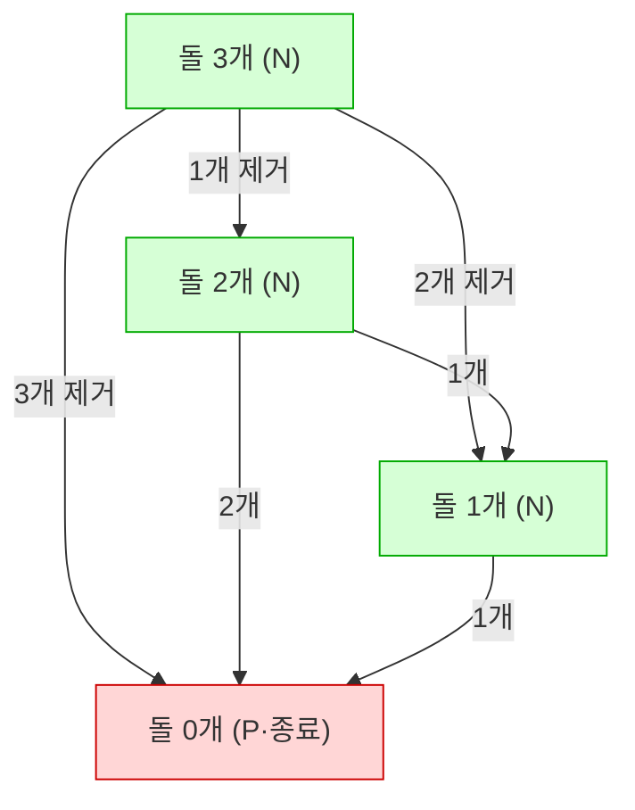

# 오늘의 주제: 게임 이론 — 님(Nim) 게임과 스프라그–그런디 정리

> **한 줄 요약**: "두 명이 번갈아 두고, 못 두면 지는" 공정 게임(Impartial Game)은 각 상태에 **그런디 수(Grundy number)** 를 매길 수 있고,
> 여러 게임을 동시에 하는 경우 **그런디 수들의 XOR** 로 승패가 결정된다.

---

## 1. 어떤 문제에 쓰나?

- 두 플레이어가 **번갈아** 수를 둔다.
- 두 플레이어가 쓸 수 있는 수가 **완전히 동일**하다 (누구 차례인지만 다름 → *공정 게임, impartial*).
- **더 이상 둘 수 없는 사람이 진다** (Normal play).
- 둘 다 **최적으로** 플레이한다.

→ "선공이 이기는가/지는가?"를 묻는 문제라면 게임 이론을 의심하자.
(체스처럼 흑/백이 다른 말을 쓰는 게임은 *비공정 게임*이라 이 이론이 그대로 적용되지 않음.)

---

## 2. 핵심 개념 1: 이기는 상태 vs 지는 상태

- **P-position (Previous player wins = 지금 둘 사람이 짐)**: 여기서 시작하면 진다.
- **N-position (Next player wins = 지금 둘 사람이 이김)**: 여기서 시작하면 이긴다.

규칙:
- 더 이상 못 두는 **종료 상태 = P-position** (내 차례에 못 두니 내가 짐).
- 어떤 상태에서 **P-position으로 가는 수가 하나라도 있으면 → N-position** (상대를 지는 자리로 밀어넣으면 됨).
- 모든 수가 **N-position으로만 가면 → P-position** (뭘 해도 상대가 이김).


위 그림: 한 번에 1~3개 제거 가능한 게임. 돌 0개(P)로 직접 갈 수 있으므로 3·2·1개는 모두 N-position → **선공 승**.

---

## 3. 핵심 개념 2: 그런디 수 (Grundy Number / nimber)

상태 하나에 정수를 매긴다.

```
grundy(state) = mex{ grundy(next) : next는 state에서 갈 수 있는 상태 }
```

- **mex** (minimum excludant) = 집합에 **없는 가장 작은 0 이상의 정수**.
  - `mex{} = 0`, `mex{0} = 1`, `mex{0,1,3} = 2`, `mex{1,2} = 0`
- **grundy = 0 ⇔ P-position (지는 자리)**, `grundy > 0 ⇔ N-position (이기는 자리)`.

왜 mex인가? 그런디 수가 `g`인 상태는 "돌이 `g`개인 님 더미"와 완전히 동등하게 행동한다.
mex를 쓰면 0..g-1 의 모든 값으로 가는 수가 존재(님 더미에서 줄이는 것과 동일)하고, g 자신으로 가는 수는 없음이 보장된다.

---

## 4. 핵심 정리: 스프라그–그런디 (Sprague–Grundy)

> **여러 개의 독립적인 공정 게임을 동시에 진행할 때, 전체의 그런디 수 = 각 게임 그런디 수의 XOR.**
> **전체 XOR == 0 이면 후공 승(선공 패), != 0 이면 선공 승.**

이것이 **님 게임**의 정체다. 님은 "여러 더미에서 원하는 만큼 가져가는" 게임인데,
더미 하나의 그런디 수가 곧 돌 개수이므로 전체 = `a1 ^ a2 ^ ... ^ an`.

**정당성(직관)**: XOR != 0 이면 최상위 켜진 비트를 이용해 항상 XOR을 0으로 만드는 수가 존재(상대에게 P-position을 넘김).
XOR == 0 이면 어떤 수를 둬도 XOR이 0이 아니게 되어(상대에게 N-position이 넘어감) 진다.

---

## 5. 예제 1 — 돌 게임 / 님 게임 (BOJ 11866 유형·님 표준형)

**문제 요약**: 여러 더미에 돌이 있고, 번갈아 한 더미에서 1개 이상 가져간다. 마지막 돌을 가져가는 사람이 승리. 선공 승패는?

**핵심 아이디어**: 표준 님 → 모든 더미 개수의 XOR.

```python
import sys

def solve():
    input = sys.stdin.readline
    n = int(input())
    piles = list(map(int, input().split()))
    x = 0
    for p in piles:
        x ^= p
    print("First" if x != 0 else "Second")

solve()
```

- **시간복잡도**: O(N).
- **자주 하는 실수**: "마지막을 가져가면 지는(misère)" 변형과 헷갈리기. misère 님은 규칙이 살짝 다름(아래 주의점).

---

## 6. 예제 2 — 일반 게임의 그런디 수 계산 (BOJ 11871 "님 게임 나임" 계열)

**문제 요약**: 한 번에 특정 개수(예: 1, 3, 4개)만 가져갈 수 있는 게임이 여러 더미로 주어진다. 선공 승패?

이런 "가져갈 수 있는 개수가 제한된" 게임은 XOR만으로 안 되고 **각 더미의 그런디 수를 DP로 구한 뒤 XOR** 해야 한다.

```python
import sys

def solve():
    data = sys.stdin.read().split()
    idx = 0
    moves = [1, 3, 4]          # 한 번에 가져갈 수 있는 개수
    MAX = 100001
    grundy = [0] * MAX
    for s in range(1, MAX):    # 돌 s개일 때 그런디 수
        reachable = set()
        for m in moves:
            if s - m >= 0:
                reachable.add(grundy[s - m])
        # mex 계산
        g = 0
        while g in reachable:
            g += 1
        grundy[s] = g

    t = int(data[idx]); idx += 1
    for _ in range(t):
        n = int(data[idx]); idx += 1
        piles = list(map(int, data[idx:idx + n])); idx += n
        x = 0
        for p in piles:
            x ^= grundy[p]
        print("first" if x != 0 else "second")

solve()
```

- **핵심 아이디어**: `grundy[s] = mex{ grundy[s-m] : m ∈ moves }`, 최종 답은 더미별 그런디 수의 XOR.
- **시간복잡도**: 전처리 O(MAX × |moves|), 쿼리당 O(N).
- **자주 하는 실수**:
  - `s - m >= 0` 경계 체크 누락 → 음수 인덱스로 잘못된 값 참조.
  - 그런디를 각 더미마다 매번 다시 계산 → 전처리로 한 번만.

---

## 7. Python 템플릿 — 임의 게임의 그런디 수 (메모이제이션)

```python
import sys
from functools import lru_cache
sys.setrecursionlimit(1_000_000)

@lru_cache(maxsize=None)
def grundy(state):
    nexts = get_next_states(state)   # 이 상태에서 갈 수 있는 상태들
    if not nexts:                    # 종료 상태
        return 0
    seen = {grundy(ns) for ns in nexts}
    g = 0
    while g in seen:                 # mex
        g += 1
    return g

# 게임 여러 개 합칠 때: XOR
total = 0
for st in independent_games:
    total ^= grundy(st)
print("First" if total != 0 else "Second")
```

---

## 8. 자주 하는 실수 & 주의점 정리

- **misère(마지막 가져가면 짐) 님**: 모든 더미가 1개면 규칙이 뒤집힌다.
  일반적으로: 더미 중 2개 이상인 게 하나라도 있으면 표준 님과 동일(XOR판정), 전부 1개면 더미 수의 홀짝으로 판정.
- **비공정 게임(체스·바둑 등)** 은 스프라그–그런디로 못 푼다. 두 플레이어의 이동 규칙이 같아야 한다.
- **독립성**: XOR로 합치려면 게임들이 서로 **영향을 주지 않아야** 한다.
- `grundy > 0` 이 무조건 "돌이 많다"는 뜻이 아니다. **0이냐 아니냐**만 승패에 의미 있다.
- 상태 공간이 크면 `lru_cache`가 메모리 폭발할 수 있으니 배열 DP로 바꾸자.

---

## 9. 복습 체크리스트

- [ ] P/N-position 정의를 말로 설명할 수 있다.
- [ ] mex 계산을 손으로 할 수 있다.
- [ ] 표준 님 = 개수들의 XOR임을 안다.
- [ ] 이동이 제한된 게임은 그런디 DP + XOR로 푼다.
- [ ] XOR == 0 → 선공 패 임을 기억한다.
