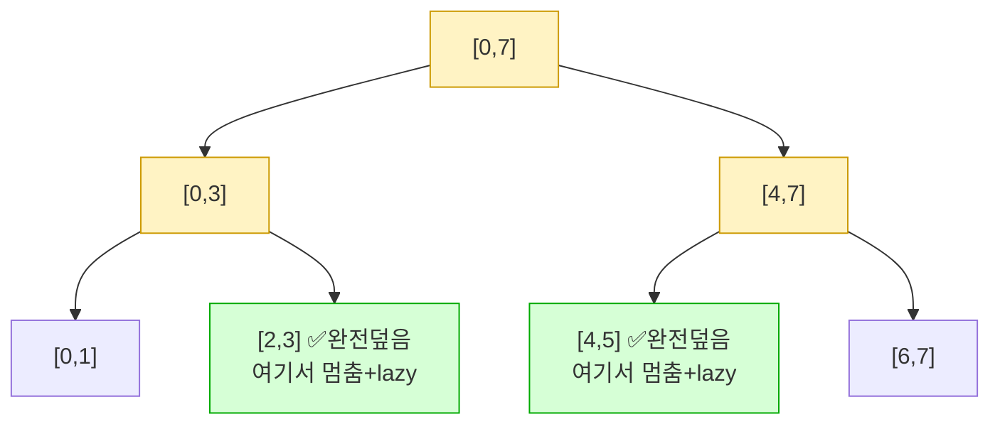

# 오늘의 주제: 세그먼트 트리 레이지 프로퍼게이션 (Lazy Propagation)

> **한 줄 요약**: "구간 갱신 + 구간 질의"를 둘 다 **O(log N)** 에 처리한다. 갱신을 즉시 리프까지 내려보내지 않고 **"나중에 처리하라"는 예약(lazy)** 을 노드에 붙여 두는 것이 핵심.

---

## 왜 필요한가

일반 세그먼트 트리는 **점 갱신**만 O(log N)이다. 그런데 이런 쿼리가 섞여 들어오면?

1. **구간 갱신**: "l부터 r까지 전부 +v 해라"
2. **구간 질의**: "l부터 r까지의 합은?"

구간 갱신을 리프마다 하나씩 고치면 한 번에 **O(N)** → 갱신이 많으면 터진다.

| 방법 | 구간 질의 | 구간 갱신 |
|------|-----------|-----------|
| 단순 배열 | O(N) | O(N) |
| 누적 합 | O(1) | O(N) |
| 기본 세그먼트 트리 | O(log N) | **O(N log N)** (리프마다 점 갱신) |
| **레이지 세그먼트 트리** | **O(log N)** | **O(log N)** |

→ **구간 단위 갱신과 구간 질의가 둘 다 자주** 나오면 레이지가 정답.

## 핵심 아이디어

세그먼트 트리 질의는 "찾는 구간에 **완전히 포함되는 노드**"에서 멈춘다. 갱신도 똑같이 하면 된다.

- 갱신 구간이 어떤 노드 구간을 **완전히 덮으면**, 그 노드에만 반영하고 **자식으로 안 내려간다.**
- 대신 "이 노드의 자식들은 아직 이 갱신을 못 받았다"는 표시를 **lazy 배열**에 적어 둔다.
- 나중에 그 노드를 **지나가야 할 때만**(더 깊이 내려가야 할 때) 자식에게 밀린 갱신을 **전파(push down)** 한다.

> **게으르게 미룬다** → 실제로 필요할 때만 내려보낸다. 그래서 이름이 *lazy*.

### 구간 갱신 `[2,5] += v` 의 전파 모습



`[2,5]` 는 `[2,3]` 과 `[4,5]` 두 노드로 완전히 쪼개진다. **리프 4개를 직접 안 고치고** 이 두 노드에만 값을 반영 + lazy를 남긴다 → O(log N).

## 왜 맞는가 (정당성)

핵심 불변식 하나만 지키면 된다:

> **어떤 노드의 저장값(sum)은 항상 정확하다. 단, 그 노드의 lazy는 "자식들에게 아직 안 내려간 갱신"이다.**

- 노드를 **더 깊이 방문하기 직전에** 반드시 `push_down` 을 호출 → 자식의 sum이 정확해진 뒤에 내려간다.
- 그래서 어느 순간 어떤 노드를 봐도 그 노드의 sum은 신뢰할 수 있다.
- 방문 노드는 갱신/질의 모두 O(log N)개 → 전체 O(log N).

**주의**: 구간 합에서 "구간 += v" 는 자식 sum에 `v * (구간 길이)` 를 더해야 한다. lazy는 "원소 하나당 더할 값"으로 관리하고, 전파할 때 길이를 곱한다.

---

## 예제 1: 백준 10999 - 구간 합 구하기 2

구간 `[l,r]` 에 `v` 를 더하는 갱신과, 구간 `[l,r]` 합을 구하는 질의가 섞여 들어온다. **구간 갱신 + 구간 합**의 정석 문제.

### 핵심 아이디어
- `tree[node]` = 담당 구간의 실제 합.
- `lazy[node]` = 이 노드 자식들에게 아직 안 내려간 "원소당 더할 값".
- 갱신/질의 진입 시 항상 `push_down` 먼저.

### 시간복잡도
- 갱신 O(log N), 질의 O(log N). 쿼리 M개면 O((N + M) log N).

### 자주 하는 실수
- **길이 곱하기 누락**: 구간 합에서 lazy 전파 시 `sum += lazy * 구간길이`. 이걸 빼먹으면 값이 어긋난다.
- **push_down 위치**: 자식으로 재귀 **내려가기 직전**에 해야 한다. 리프(`start==end`)에서는 자식이 없으니 전파 불필요.
- **자료형**: 합이 크므로 파이썬은 상관없지만, 갱신값 × 길이 오버플로 주의(타 언어).

### 파이썬 풀이

```python
import sys
input = sys.stdin.readline

def build(node, start, end):
    if start == end:
        tree[node] = arr[start]
        return
    mid = (start + end) // 2
    build(node*2, start, mid)
    build(node*2+1, mid+1, end)
    tree[node] = tree[node*2] + tree[node*2+1]

def push_down(node, start, end):
    if lazy[node] == 0:
        return
    mid = (start + end) // 2
    for child, s, e in ((node*2, start, mid), (node*2+1, mid+1, end)):
        tree[child] += lazy[node] * (e - s + 1)   # 길이만큼 곱해서 반영
        lazy[child] += lazy[node]                 # 자식에게 예약 전달
    lazy[node] = 0

def update(node, start, end, l, r, val):
    if r < start or end < l:          # 완전히 벗어남
        return
    if l <= start and end <= r:       # 완전히 덮음 → 여기서 멈춤
        tree[node] += val * (end - start + 1)
        lazy[node] += val
        return
    push_down(node, start, end)       # 내려가기 전 전파
    mid = (start + end) // 2
    update(node*2, start, mid, l, r, val)
    update(node*2+1, mid+1, end, l, r, val)
    tree[node] = tree[node*2] + tree[node*2+1]

def query(node, start, end, l, r):
    if r < start or end < l:
        return 0
    if l <= start and end <= r:
        return tree[node]
    push_down(node, start, end)
    mid = (start + end) // 2
    return query(node*2, start, mid, l, r) + query(node*2+1, mid+1, end, l, r)

N, M, K = map(int, input().split())
arr = [int(input()) for _ in range(N)]
tree = [0] * (4 * N)
lazy = [0] * (4 * N)
build(1, 0, N-1)

out = []
for _ in range(M + K):
    q = list(map(int, input().split()))
    if q[0] == 1:                     # b~c 구간에 d 더하기
        _, b, c, d = q
        update(1, 0, N-1, b-1, c-1, d)
    else:                             # b~c 구간 합
        _, b, c = q
        out.append(query(1, 0, N-1, b-1, c-1))
print('\n'.join(map(str, out)))
```

> 재귀 깊이 때문에 `sys.setrecursionlimit(10**6)` 이 필요할 수 있다.

---

## 예제 2: 백준 16975 - 수열과 쿼리 21

구간 `[l,r]` 에 `k` 더하기 + **한 점** `x` 의 값 구하기. 질의가 "점"이라 더 단순하지만, 레이지 감을 잡기 좋은 문제.

### 핵심 아이디어
- 구간 갱신은 위와 동일.
- 점 질의는 루트에서 그 리프까지 내려가며 만나는 lazy(또는 경로상의 갱신)를 합치면 된다.
- 위 예제 1의 코드로 `query(1,0,N-1,x-1,x-1)` 하면 그대로 점 질의가 된다(길이 1 구간).

### 자주 하는 실수
- 점 질의를 "그냥 tree[leaf]" 로 읽으면 **경로에 걸린 lazy를 놓친다.** 반드시 `push_down` 을 타고 내려가며 읽어야 한다.

### 파이썬 풀이 (예제 1 코드 재사용 + 입력만 교체)

```python
# build / push_down / update / query 는 예제 1과 동일
N = int(input())
arr = list(map(int, input().split()))
tree = [0] * (4 * N)
lazy = [0] * (4 * N)
build(1, 0, N-1)

M = int(input())
out = []
for _ in range(M):
    q = list(map(int, input().split()))
    if q[0] == 1:                 # i~j 에 k 더하기
        _, i, j, k = q
        update(1, 0, N-1, i-1, j-1, k)
    else:                         # x 위치 값
        _, x = q
        out.append(query(1, 0, N-1, x-1, x-1))
print('\n'.join(map(str, out)))
```

---

## Python 템플릿 (구간 합 + 구간 += 레이지 세그트리)

```python
import sys
input = sys.stdin.readline
sys.setrecursionlimit(10**6)

class LazySeg:
    def __init__(self, data):
        self.n = len(data)
        self.tree = [0] * (4 * self.n)
        self.lazy = [0] * (4 * self.n)
        self._build(data, 1, 0, self.n - 1)

    def _build(self, data, node, s, e):
        if s == e:
            self.tree[node] = data[s]; return
        m = (s + e) // 2
        self._build(data, node*2, s, m)
        self._build(data, node*2+1, m+1, e)
        self.tree[node] = self.tree[node*2] + self.tree[node*2+1]

    def _push(self, node, s, e):
        if self.lazy[node] == 0: return
        m = (s + e) // 2
        for c, cs, ce in ((node*2, s, m), (node*2+1, m+1, e)):
            self.tree[c] += self.lazy[node] * (ce - cs + 1)
            self.lazy[c] += self.lazy[node]
        self.lazy[node] = 0

    def update(self, l, r, val, node=1, s=0, e=None):
        if e is None: e = self.n - 1
        if r < s or e < l: return
        if l <= s and e <= r:
            self.tree[node] += val * (e - s + 1)
            self.lazy[node] += val; return
        self._push(node, s, e)
        m = (s + e) // 2
        self.update(l, r, val, node*2, s, m)
        self.update(l, r, val, node*2+1, m+1, e)
        self.tree[node] = self.tree[node*2] + self.tree[node*2+1]

    def query(self, l, r, node=1, s=0, e=None):
        if e is None: e = self.n - 1
        if r < s or e < l: return 0
        if l <= s and e <= r: return self.tree[node]
        self._push(node, s, e)
        m = (s + e) // 2
        return self.query(l, r, node*2, s, m) + self.query(l, r, node*2+1, m+1, e)
```

---

## 한 장 요약

- **언제**: 구간 갱신 + 구간 질의가 둘 다 잦을 때.
- **핵심**: 갱신을 자식까지 안 내려보내고 노드에 **lazy로 예약** → 더 깊이 갈 때만 `push_down`.
- **불변식**: 노드 sum은 항상 정확, lazy는 "자식이 못 받은 갱신".
- **최다 실수**: ① 구간 합은 `lazy × 구간길이`, ② push_down은 내려가기 직전, ③ 점 질의도 push_down 타고 내려가기.
- **복잡도**: 갱신·질의 모두 **O(log N)**.
