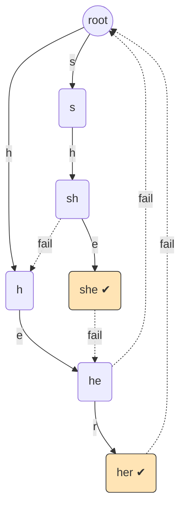

# 오늘의 주제: 아호-코라식 (Aho-Corasick) — 다중 패턴 매칭

> 여러 개의 패턴을 **한 번의 텍스트 순회(O(N))** 로 동시에 찾는 알고리즘.
> **트라이 + KMP 실패 함수**를 결합한 구조라서, 두 주제를 알고 있으면 자연스럽게 확장된다.

---

## 1. 언제 쓰나

- 패턴이 **여러 개**이고, 긴 텍스트에서 그 패턴들이 등장하는지/몇 번 나오는지 알고 싶을 때.
- KMP는 패턴 1개당 O(N). 패턴이 K개면 O(K·N)이 되어 느리다.
- 아호-코라식은 패턴 전체 길이 합 M으로 자동자(automaton)를 만들고, 텍스트를 **O(N + 매칭 수)** 로 한 번만 훑는다.

전체 시간복잡도: **O(M + N + Z)** (M=패턴 길이 합, N=텍스트 길이, Z=총 매칭 개수)

---

## 2. 핵심 아이디어 — "실패 링크(fail link)"

트라이를 따라가다 **다음 글자가 없어서 막히면**, 처음부터 다시 시작하는 대신
**지금까지 매칭된 접미사(suffix) 중 트라이에 존재하는 가장 긴 접두사(prefix)** 로 점프한다.

이 점프 목적지가 바로 **fail 링크**. KMP의 실패 함수와 정확히 같은 개념을 트라이 위로 일반화한 것.

- `fail[node]` = "루트~node 문자열의 진짜 접미사" 중, 트라이에 존재하는 **가장 긴 것**의 노드.
- **BFS**로 깊이 1부터 순서대로 계산한다 (부모의 fail을 이미 알아야 자식 fail을 구할 수 있으므로).

### 왜 동작하나 (정당성)

- 텍스트를 읽으며 현재 노드는 항상 "텍스트의 현재 위치에서 끝나는 접미사 중 트라이의 최장 접두사"를 가리킨다.
- 글자 `c`가 오면: 자식 `go[node][c]`가 있으면 그리로, 없으면 `fail[node]`로 내려가 다시 시도 → 이 과정이 KMP의 실패 함수 이동과 동일해 **불변식이 유지**된다.
- 어떤 패턴이 현재 위치에서 끝나면, 그 패턴의 끝 노드는 현재 노드의 **fail 체인 위**에 반드시 있다 → `output` 링크로 수집.

### 구조 시각화



- `she`의 마지막 노드(SHE)에서 fail은 `he`(HE)로 간다: "she"의 접미사 "he"가 트라이에 존재하기 때문.
- 그래서 텍스트에서 "she"를 매칭한 순간, output 링크를 타고 "he"도 함께 매칭됐음을 알 수 있다.

---

## 3. 대표 예제 ①: BOJ 9250 — 문자열 집합 판정

문제: 집합 S의 문자열이 하나 이상 **부분 문자열**로 포함된 질의 문자열이면 `YES`.

### 핵심 아이디어
- S의 모든 문자열로 아호-코라식 자동자를 만든다.
- 각 질의 문자열을 자동자에 흘려보내며, 이동 중 **output이 있는 노드**를 한 번이라도 밟으면 `YES`.

```python
import sys
from collections import deque
input = sys.stdin.readline

class AhoCorasick:
    def __init__(self):
        self.go = [{}]          # go[node][char] -> next node
        self.fail = [0]
        self.out = [False]      # 이 노드에서 끝나는 패턴 존재?

    def add(self, word):
        cur = 0
        for ch in word:
            if ch not in self.go[cur]:
                self.go[cur][ch] = len(self.go)
                self.go.append({})
                self.fail.append(0)
                self.out.append(False)
            cur = self.go[cur][ch]
        self.out[cur] = True

    def build(self):
        q = deque()
        for nxt in self.go[0].values():   # 깊이 1의 fail은 루트(0)
            self.fail[nxt] = 0
            q.append(nxt)
        while q:
            cur = q.popleft()
            for ch, nxt in self.go[cur].items():
                # fail 링크 계산: 부모의 fail을 따라가며 ch로 갈 곳 탐색
                f = self.fail[cur]
                while f and ch not in self.go[f]:
                    f = self.fail[f]
                self.fail[nxt] = self.go[f].get(ch, 0) if f or ch in self.go[0] else 0
                if self.fail[nxt] == nxt:
                    self.fail[nxt] = 0
                # output 전파: fail이 패턴 끝이면 나도 매칭 가능
                self.out[nxt] = self.out[nxt] or self.out[self.fail[nxt]]
                q.append(nxt)

    def search(self, text):
        cur = 0
        for ch in text:
            while cur and ch not in self.go[cur]:
                cur = self.fail[cur]
            cur = self.go[cur].get(ch, 0)
            if self.out[cur]:
                return True
        return False

ac = AhoCorasick()
n = int(input())
for _ in range(n):
    ac.add(input().rstrip())
ac.build()
q = int(input())
res = []
for _ in range(q):
    res.append("YES" if ac.search(input().rstrip()) else "NO")
print('\n'.join(res))
```

- **시간복잡도**: 전처리 O(M), 질의 전체 O(총 텍스트 길이). 매우 빠르다.
- **자주 하는 실수**: `search`에서 output 전파를 build 때 미리 해두지 않으면, fail 체인을 매번 따라가야 해서 느려진다. → build에서 `out[nxt] |= out[fail[nxt]]`로 **미리 접어두는 것**이 핵심.

---

## 4. 대표 예제 ②: BOJ 10256 — 돌연변이 (매칭 횟수 세기)

문제: DNA 텍스트에서 마커와 그 **변이(부분 구간 뒤집기)** 들이 총 몇 번 등장하는지 센다.
→ 가능한 모든 변이 문자열을 패턴으로 넣고, **텍스트를 훑으며 매칭 개수 카운트**하는 전형적 응용.

```python
def count_matches(ac, text):
    cur, total = 0, 0
    for ch in text:
        while cur and ch not in ac.go[cur]:
            cur = ac.fail[cur]
        cur = ac.go[cur].get(ch, 0)
        # cnt[cur] = 이 노드에서 끝나는 패턴 수 (fail 전파 포함)
        total += ac.cnt[cur]
    return total
```

- `out`을 bool 대신 **정수 카운트 `cnt`** 로 두고, build에서 `cnt[nxt] += cnt[fail[nxt]]`로 전파하면 "밟을 때마다 몇 개 매칭"을 O(1)에 얻는다.
- 여러 패턴이 한 위치에서 동시에 끝날 수 있으므로 **fail 체인 전체를 접어두는 전파가 필수**.

---

## 5. Python 템플릿 (요약)

```python
from collections import deque

def build_ac(patterns):
    go = [{}]; fail = [0]; cnt = [0]
    for w in patterns:                       # 1) 트라이 삽입
        cur = 0
        for ch in w:
            if ch not in go[cur]:
                go[cur][ch] = len(go); go.append({}); fail.append(0); cnt.append(0)
            cur = go[cur][ch]
        cnt[cur] += 1
    q = deque(go[0].values())                # 2) BFS로 fail + output 전파
    while q:
        cur = q.popleft()
        for ch, nxt in go[cur].items():
            f = fail[cur]
            while f and ch not in go[f]:
                f = fail[f]
            fail[nxt] = go[f].get(ch, 0) if nxt != go[f].get(ch, 0) else 0
            cnt[nxt] += cnt[fail[nxt]]        # 핵심: 매칭 수 미리 접기
            q.append(nxt)
    return go, fail, cnt
```

---

## 6. 체크리스트 / 주의점

- fail 링크는 **반드시 BFS(깊이 오름차순)** 로 계산 — 부모·얕은 노드의 fail이 먼저 확정돼야 한다.
- 깊이 1 노드의 fail은 항상 루트(0).
- output(패턴 끝) 정보는 build 단계에서 **fail 체인을 따라 미리 누적**해두어야 매칭이 O(1). 안 그러면 최악 O(M) 낭비.
- KMP는 아호-코라식의 **패턴 1개짜리 특수 케이스**다. 실패 함수 = 트라이가 일직선일 때의 fail 링크.
- Python에서 `go`를 dict 리스트로 두면 메모리 절약. 알파벳이 고정(예: 26)이고 속도가 급하면 고정 크기 배열 + `goto`(막힌 전이 미리 채우기)로 while 루프까지 제거 가능.

---

## 관련 개념

- [트라이 (Trie)](2026-06-24-트라이.md) — 아호-코라식의 뼈대
- [KMP 문자열 매칭](2026-06-20-KMP문자열매칭.md) — fail 링크의 1차원 버전
