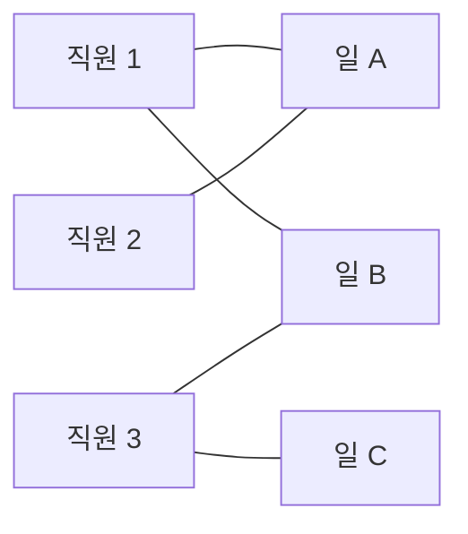

# 오늘의 주제: 이분 매칭 (Bipartite Matching)

> 두 그룹(집합 A, B)이 있고, "A의 원소는 B의 특정 원소들하고만 짝지을 수 있다"는 제약 아래
> **서로 겹치지 않게 최대한 많은 짝을 만드는** 문제. (한 명은 최대 한 명하고만 매칭)

축사 배정, 작업 할당, 열혈강호(직원-일 배정) 같은 문제가 전형적. 네트워크 유량의 특수 케이스지만,
**증가 경로(augmenting path) DFS** 하나만 알면 훨씬 간단하게 풀린다.

---

## 1. 언제 쓰나

- 원소를 두 그룹으로 나눌 수 있고
- "왼쪽 하나 ↔ 오른쪽 하나"로 **1:1** 매칭을 최대화
- 대표: BOJ 2188 축사 배정, 11375 열혈강호, 1017 소수 쌍(그래프를 이분으로 나눈 뒤)

> 핵심 직관: 각 왼쪽 정점이 "내 자리 하나 달라"고 요청하고,
> 이미 찬 자리는 **기존 주인을 다른 자리로 밀어낼 수 있으면** 양보받는다. 이 "밀어내기"가 곧 증가 경로.

---

## 2. 그래프 구조



- 왼쪽(A): 직원, 오른쪽(B): 일
- 간선: "이 직원이 이 일을 할 수 있다"
- 목표: 간선을 골라 **한 직원 한 일씩, 최대 개수**로 매칭

---

## 3. 핵심 아이디어 — 증가 경로 DFS

각 왼쪽 정점 `u`에 대해 `dfs(u)`를 호출:

1. `u`와 연결된 오른쪽 정점 `v`를 순회
2. `v`가 **비어 있으면** → 바로 `match[v] = u`, 성공
3. `v`가 이미 `match[v]`에게 점유됐으면 → **그 주인 `match[v]`를 다른 자리로 옮길 수 있는지** 재귀(`dfs(match[v])`)
   - 옮길 수 있으면 `v`를 `u`가 차지, 성공
4. 모든 `v`에서 실패하면 `u`는 이번엔 매칭 실패

한 번의 `dfs`에서 같은 오른쪽 정점을 다시 방문하지 않도록 `visited` 배열로 무한루프 차단.

> **왜 동작하나 (정당성):** 매번 "증가 경로"를 찾아 매칭을 1개씩 늘린다. 더 이상 증가 경로가
> 없으면 그때가 최대 매칭 — 이건 유량 최대-최소 컷 정리(쾨니그 정리)로 보장된다.
> 그리디하게 밀어내도 최적을 놓치지 않는 이유가 이거다.

---

## 4. Python 템플릿

```python
import sys
input = sys.stdin.readline
sys.setrecursionlimit(10**6)

def bipartite_matching(N, adj):
    # adj[u] = u가 연결 가능한 오른쪽 정점 리스트 (u: 1..N)
    match = [0] * (M + 1)   # match[v] = v를 점유한 왼쪽 정점 (0=빔)

    def dfs(u):
        for v in adj[u]:
            if visited[v]:
                continue
            visited[v] = True
            # v가 비었거나, v의 주인을 다른 곳으로 옮길 수 있으면
            if match[v] == 0 or dfs(match[v]):
                match[v] = u
                return True
        return False

    result = 0
    for u in range(1, N + 1):
        visited = [False] * (M + 1)   # u마다 새로 초기화!
        if dfs(u):
            result += 1
    return result
```

**주의:** `visited`는 **왼쪽 정점 `u` 하나를 처리할 때마다 새로 초기화**한다.
(한 번의 증가 경로 탐색 안에서만 재방문 금지)

---

## 5. 예제 — BOJ 2188 축사 배정

N마리 소, M개의 축사. 각 소는 원하는 축사 목록이 있고, 한 칸엔 한 마리. **최대 몇 마리 배정?**

```python
import sys
input = sys.stdin.readline
sys.setrecursionlimit(10**6)

def dfs(u):
    for v in adj[u]:
        if visited[v]:
            continue
        visited[v] = True
        if match[v] == 0 or dfs(match[v]):
            match[v] = u
            return True
    return False

N, M = map(int, input().split())
adj = [[] for _ in range(N + 1)]
for u in range(1, N + 1):
    data = list(map(int, input().split()))
    adj[u] = data[1:]           # data[0]은 개수

match = [0] * (M + 1)
ans = 0
for u in range(1, N + 1):
    visited = [False] * (M + 1)
    if dfs(u):
        ans += 1
print(ans)
```

- **시간복잡도:** O(V·E). 정점 수 × 간선 수. 코테 범위(수백~수천 정점)에선 충분히 빠름.
- **핵심 아이디어:** 각 소마다 증가 경로 1회 탐색 → 매칭 +1 시도.

---

## 6. 자주 하는 실수

- **`visited` 초기화 위치**: `u` 루프 **안쪽**에서 매번 초기화해야 한다. 밖에서 한 번만 하면 틀림.
- **인덱스 오프셋**: 왼쪽/오른쪽 정점 번호 범위를 헷갈려 `match` 배열 크기를 잘못 잡는 경우.
- **재귀 깊이**: 정점 많으면 `sys.setrecursionlimit` 필수. 안 하면 RecursionError.
- **양방향 착각**: 간선은 "왼→오" 방향만 순회. `match[v]`는 오른쪽→왼쪽 역참조용.
- **쾨니그 정리 활용 문제**: 최소 정점 커버 = 최대 매칭, 최대 독립 집합 = (전체 정점 − 최대 매칭). 변형 문제에서 자주 나옴.

---

## 7. 한 줄 요약

> **비면 차지, 차 있으면 기존 주인을 밀어내 본다.** 증가 경로 DFS로 매칭을 1개씩 늘리면 그게 최대 매칭.
