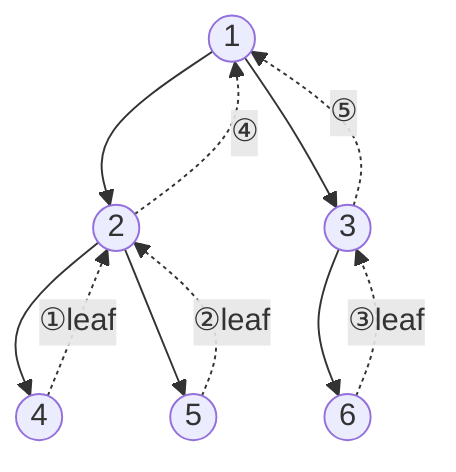

# 오늘의 주제: 트리 DP (Tree DP)

> 트리 구조 위에서 **자식의 DP 값을 모아 부모의 DP 값을 만드는** 점화식 설계.
> "각 정점을 루트로 하는 서브트리"를 하나의 부분 문제로 보는 것이 핵심.

---

## 1. 핵심 아이디어

일반 DP는 배열 인덱스가 부분 문제였다면, 트리 DP는 **서브트리**가 부분 문제다.

- `dp[v]` = 정점 `v`를 루트로 하는 서브트리만 고려했을 때의 답
- 리프에서 시작해 **아래에서 위로(post-order)** 값을 합친다
- 보통 정점마다 "이 정점을 **선택했을 때 / 선택 안 했을 때**" 같은 **상태 2개 이상**을 둔다

> **왜 동작하는가?**
> 트리는 사이클이 없어서, 서브트리끼리 서로 **독립**이다.
> 부모의 답은 오직 자식 서브트리들의 답에만 의존 → 최적 부분 구조가 자연스럽게 성립한다.

### 언제 쓰나
- "트리에서 조건을 만족하는 정점 부분집합의 최대/최소" (독립집합, 지배집합 등)
- 서브트리 크기·합·개수 세기
- 트리의 지름, 각 정점까지 거리 합(리루팅)

### 탐색 순서 (mermaid)
자식을 먼저 계산하고 → 부모로 값을 올린다.



---

## 2. 대표 예제 ①: 트리의 최대 독립 집합

**문제**: 트리가 주어질 때, **서로 인접하지 않는** 정점들을 최대 몇 개 고를 수 있는가?
(예: 회사에서 직속 상사–부하가 동시에 뽑히면 안 될 때 최대 인원)

### 핵심 아이디어
정점 `v`에 대해 두 상태:
- `dp[v][0]` = `v`를 **안 뽑을 때** 서브트리 최댓값
- `dp[v][1]` = `v`를 **뽑을 때** 서브트리 최댓값

점화식 (자식 `c`에 대해):
- `dp[v][1] += dp[c][0]`  → 나를 뽑으면 자식은 못 뽑음
- `dp[v][0] += max(dp[c][0], dp[c][1])` → 나를 안 뽑으면 자식은 자유

답 = `max(dp[root][0], dp[root][1])`

### 시간복잡도
- 각 간선을 한 번씩만 처리 → **O(N)**

```python
import sys
input = sys.stdin.readline
sys.setrecursionlimit(300000)

def solve():
    N = int(input())
    adj = [[] for _ in range(N + 1)]
    for _ in range(N - 1):
        a, b = map(int, input().split())
        adj[a].append(b)
        adj[b].append(a)

    dp = [[0, 0] for _ in range(N + 1)]  # [안뽑음, 뽑음]

    def dfs(v, parent):
        dp[v][1] = 1          # 나를 뽑음
        dp[v][0] = 0          # 나를 안 뽑음
        for c in adj[v]:
            if c == parent:
                continue
            dfs(c, v)
            dp[v][1] += dp[c][0]
            dp[v][0] += max(dp[c][0], dp[c][1])

    dfs(1, 0)
    print(max(dp[1][0], dp[1][1]))

solve()
```

---

## 3. 대표 예제 ②: 백준 2533 사회망 서비스(SNS) — 얼리어답터

**문제**: 트리에서 각 정점은 얼리어답터이거나 아니다.
모든 **간선의 양 끝** 중 적어도 하나는 얼리어답터여야 한다(=최소 정점 지배).
얼리어답터 **최소 인원**은?

### 핵심 아이디어 (독립집합의 쌍대 = 최소 정점 커버)
- `dp[v][0]` = `v`가 얼리어답터가 **아닐 때** 서브트리 최소 인원
- `dp[v][1]` = `v`가 얼리어답터**일 때** 최소 인원

점화식:
- `v`가 얼리어답터가 아니면 → **모든 자식은 반드시 얼리어답터**
  `dp[v][0] += dp[c][1]`
- `v`가 얼리어답터면 → 자식은 둘 중 작은 쪽
  `dp[v][1] += min(dp[c][0], dp[c][1])`

답 = `min(dp[root][0], dp[root][1])`

### 시간복잡도: **O(N)**

```python
import sys
input = sys.stdin.readline
sys.setrecursionlimit(1_000_001)

def solve():
    N = int(input())
    adj = [[] for _ in range(N + 1)]
    for _ in range(N - 1):
        a, b = map(int, input().split())
        adj[a].append(b)
        adj[b].append(a)

    dp = [[0, 0] for _ in range(N + 1)]  # [아님, 얼리어답터]
    visited = [False] * (N + 1)

    # 재귀 깊이 회피용 반복 DFS (post-order)
    def dfs(root):
        stack = [(root, 0)]
        order = []
        visited[root] = True
        while stack:
            v, p = stack.pop()
            order.append((v, p))
            for c in adj[v]:
                if not visited[c]:
                    visited[c] = True
                    stack.append((c, v))
        for v, p in reversed(order):     # 자식 먼저 처리됨
            dp[v][0] = 0
            dp[v][1] = 1
            for c in adj[v]:
                if c == p:
                    continue
                dp[v][0] += dp[c][1]
                dp[v][1] += min(dp[c][0], dp[c][1])

    dfs(1)
    print(min(dp[1][0], dp[1][1]))

solve()
```

> N이 최대 100만이라 파이썬 재귀 DFS는 스택 오버플로/속도 문제로 터지기 쉽다.
> → **반복 DFS로 post-order를 만든 뒤** 역순으로 DP를 채우는 패턴을 익혀두면 안전하다.

---

## 4. 자주 하는 실수

- **부모로 되돌아가는 간선 처리 누락**: 무방향 인접 리스트라 `c == parent`를 반드시 걸러야 무한 재귀 방지.
- **상태 정의 혼동**: `dp[v][1]`이 "v를 뽑음"인지 "v를 뽑지 않음"인지 처음에 못 박아두고 점화식을 맞출 것.
- **재귀 한도**: N이 크면 `setrecursionlimit`으로도 부족/느림 → 반복 DFS 권장.
- **초기값**: "뽑음/포함" 상태의 리프 기본값(1 등)을 빼먹으면 전부 0으로 새어나감.
- 루트를 고정(보통 1)하고 방향을 부여해 서브트리를 정의한다는 점 잊지 말기.

---

## 5. Python 템플릿 (반복 DFS post-order + 2상태 트리 DP)

```python
import sys
input = sys.stdin.readline
sys.setrecursionlimit(1_000_001)

def tree_dp(N, adj, root=1):
    dp = [[0, 0] for _ in range(N + 1)]
    visited = [False] * (N + 1)
    stack = [(root, 0)]
    order = []
    visited[root] = True
    while stack:                       # 1) post-order 순서 수집
        v, p = stack.pop()
        order.append((v, p))
        for c in adj[v]:
            if not visited[c]:
                visited[c] = True
                stack.append((c, v))
    for v, p in reversed(order):       # 2) 아래→위로 DP
        dp[v][1] = 1                   # v 선택 시 기본값(문제마다 조정)
        for c in adj[v]:
            if c == p:
                continue
            dp[v][1] += dp[c][0]                 # 선택 규칙
            dp[v][0] += max(dp[c][0], dp[c][1])  # 미선택 규칙
    return dp[root]
```

- **틀은 그대로**, `dp[v][0/1]` 점화식만 문제에 맞게 갈아끼우면 대부분의 기본 트리 DP를 커버한다.
- 서브트리 크기/합이 필요하면 같은 post-order 루프에서 `size[v] += size[c]` 식으로 함께 누적하면 된다.
