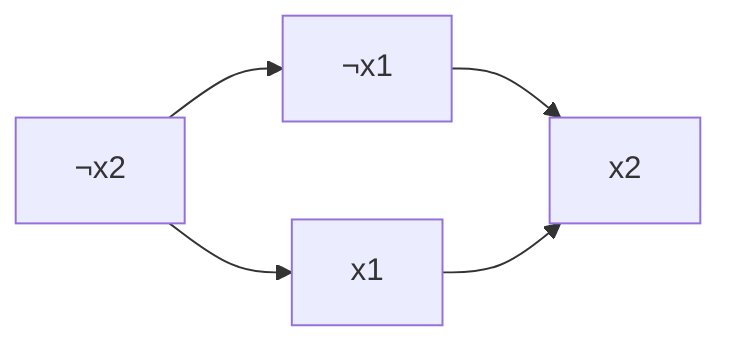

# 2-SAT (2-Satisfiability / 함의 그래프 + SCC)

> **오늘의 주제: 2-SAT — 각 변수에 참/거짓을 배정해 논리식(2-CNF)을 만족시키는 문제를, 함의 그래프의 SCC로 O(V+E)에 푼다.**

---

## 1. 문제가 뭔가

부울 변수 `x1, x2, ..., xn` (각각 참/거짓) 이 있고, 다음 형태의 **절(clause)** 여러 개가 주어진다.

```
(a ∨ b) ∧ (¬a ∨ c) ∧ (¬b ∨ ¬c) ∧ ...
```

- 각 절은 **리터럴 2개의 OR** (2-CNF, "2"는 절당 리터럴 수)
- 전체는 절들의 AND
- **모든 절을 동시에 참으로** 만드는 변수 배정이 존재하는가? 존재하면 하나를 출력.

> 일반 SAT(절당 리터럴 3개 이상, 3-SAT)는 NP-완전이지만, **2-SAT은 다항 시간**에 풀린다. 이 갭이 핵심.

---

## 2. 핵심 아이디어 — OR을 함의(→) 두 개로 바꾼다

논리 등가:  `(a ∨ b)  ≡  (¬a → b) ∧ (¬b → a)`

> "a가 거짓이면 b는 반드시 참이어야 하고, b가 거짓이면 a는 반드시 참이어야 한다."

즉 **절 하나가 방향 간선 2개**를 만든다. 이렇게 만든 방향 그래프를 **함의 그래프(implication graph)** 라고 한다.

- 정점: 각 변수 `xi` 마다 두 개 — `xi(참)` 노드와 `¬xi(거짓)` 노드
- 간선: 각 절 `(u ∨ v)` 에서 `¬u → v`, `¬v → u`

### 정당성 (왜 SCC로 판정되나)

함의는 **추이적**이다. `A → B`, `B → C` 이면 `A → C`.
만약 `xi` 와 `¬xi` 가 **같은 SCC**에 있다면:

- `xi → ... → ¬xi` (xi가 참이면 xi가 거짓이어야 함) **모순**
- `¬xi → ... → xi` 도 동시에 성립 → 어느 값을 줘도 모순

> **판정 정리:** 어떤 변수 `xi`에 대해 `xi`와 `¬xi`가 같은 SCC에 속하면 **해가 없다**. 하나도 그런 변수가 없으면 **해가 존재한다.**

### 해 복원 (위상 순서 = SCC 역순)

Tarjan/Kosaraju로 SCC를 구하면 **SCC 번호가 위상 역순**으로 매겨진다(뒤에 발견된 SCC가 위상적으로 앞).
각 변수에 대해:

> `SCC번호[xi] < SCC번호[¬xi]` 이면 `xi = 참`, 아니면 `xi = 거짓`.
> (위상적으로 **뒤에 오는(=나중에 함의되는) 쪽**을 참으로 선택 — 함의를 거스르지 않음)

Tarjan 기준 SCC 번호는 발견 역순이므로 "번호가 작을수록 위상적으로 뒤"라는 관례를 쓴다. 아래 템플릿이 그 관례를 따른다.

---

## 3. 인덱스 인코딩 (자주 하는 실수 1순위)

변수 `i (1..n)` 를 정점 번호로 매핑할 때 흔한 규칙:

```
참(xi)   = 2*i
거짓(¬xi) = 2*i + 1        # 정점 0..2n+1 사용
```

- 부정 뒤집기: `not_v = v XOR 1` (짝↔홀 토글)
- 문제 입력이 부호로 리터럴을 줄 때(`+i` / `-i`):
  - `+i` → 노드 `2*i`
  - `-i` → 노드 `2*i+1`
- 절 `(u ∨ v)` 추가 = 간선 `¬u→v`, `¬v→u` 두 개.

> **실수 포인트:** `¬u → v` 에서 `¬u`는 `u XOR 1`, 도착은 `v` 그대로. 방향을 헷갈리면 전부 틀린다. "u가 거짓(¬u)이면 v가 참" 문장으로 매번 검산.

---

## 4. 함의 그래프 예시 (그림)

절 `(x1 ∨ x2) ∧ (¬x1 ∨ x2)` 의 함의 그래프:

- `(x1 ∨ x2)` → `¬x1→x2`, `¬x2→x1`
- `(¬x1 ∨ x2)` → `x1→x2`, `¬x2→¬x1`



`x2`로 들어가는 간선만 있고 나가는 게 없음 → `x2`는 자연스럽게 **참**으로 몰림.
`x1`과 `¬x1`이 같은 SCC에 없으므로 **해 존재** (예: `x1=거짓, x2=참`).

---

## 5. 대표 예제

### 예제 A — 백준 11280 "2-SAT - 3" (해 존재 여부만)

절 M개가 리터럴 부호쌍으로 주어짐. 만족 가능하면 1, 아니면 0.

```python
import sys
sys.setrecursionlimit(1 << 20)
input = sys.stdin.readline

def add_clause(u, v):        # (u ∨ v): ¬u→v, ¬v→u
    graph[u ^ 1].append(v)
    graph[v ^ 1].append(u)

def node(x):                 # 리터럴 부호 → 노드 번호
    return 2 * abs(x) + (0 if x > 0 else 1)

N, M = map(int, input().split())
V = 2 * (N + 1)
graph = [[] for _ in range(V)]
for _ in range(M):
    a, b = map(int, input().split())
    add_clause(node(a), node(b))

# --- Tarjan SCC ---
scc_id = [-1] * V
low = [0] * V; num = [0] * V
visited = [False] * V
stack = []; idx = [1]; cnt = [0]

def tarjan(u):
    num[u] = low[u] = idx[0]; idx[0] += 1
    stack.append(u); visited[u] = True
    for w in graph[u]:
        if num[w] == 0:
            tarjan(w); low[u] = min(low[u], low[w])
        elif visited[w]:
            low[u] = min(low[u], num[w])
    if low[u] == num[u]:
        while True:
            t = stack.pop(); visited[t] = False
            scc_id[t] = cnt[0]
            if t == u: break
        cnt[0] += 1

for v in range(2, V):
    if num[v] == 0:
        tarjan(v)

ok = 1
for i in range(1, N + 1):
    if scc_id[2 * i] == scc_id[2 * i + 1]:   # xi와 ¬xi가 같은 SCC
        ok = 0; break
print(ok)
```

- **핵심 아이디어:** 절→간선 2개, SCC 후 `xi`와 `¬xi` 같은 컴포넌트면 모순.
- **시간복잡도:** 정점 O(N), 간선 O(M) → **O(N + M)**.

### 예제 B — 백준 11281 "2-SAT - 4" (실제 배정까지 출력)

만족 가능하면 첫 줄 1, 둘째 줄에 `x1..xn`의 0/1 배정. 위의 코드에 복원만 추가:

```python
if ok:
    res = []
    for i in range(1, N + 1):
        # Tarjan은 위상 역순으로 번호 부여 → 번호 작은 쪽이 위상상 '뒤'
        res.append(1 if scc_id[2 * i] < scc_id[2 * i + 1] else 0)
    print(1)
    print(*res)
else:
    print(0)
```

> **주의:** Kosaraju로 구현하면 SCC 번호 방향 관례가 반대일 수 있다. 쓰는 SCC 알고리즘의 "번호 = 위상 몇 번째"를 반드시 확인하고 부등호 방향을 맞춰야 한다.

---

## 6. 자주 하는 실수 체크리스트

- **간선 방향 반대로:** `(u∨v)`는 `¬u→v`, `¬v→u`. `u→v`가 아니다.
- **부정 토글 실수:** `v ^ 1`은 v가 짝수(참노드)일 때만 올바르게 홀수(거짓노드)로 간다. 인코딩을 `2i / 2i+1`로 고정해라.
- **재귀 깊이:** 정점이 2×10^5까지 → `setrecursionlimit` 필수, 혹은 반복(iterative) Tarjan.
- **해 복원 부등호:** SCC 번호 매김 방향에 따라 `<` / `>` 가 뒤집힌다. 작은 예제로 검산.
- **강제 배정 트릭:** "xi는 반드시 참" 조건은 절 `(xi ∨ xi)` = 간선 `¬xi→xi` 하나로 표현.

---

## 7. 언제 쓰나 — 실전 모델링 신호

"각 대상이 **두 상태 중 하나**를 고르고, 쌍 사이 제약이 **'둘 중 적어도 하나'** 형태"면 2-SAT을 의심.

- "A와 B 중 적어도 하나는 참" → `(A ∨ B)`
- "A면 B" (함의 그대로) → `(¬A ∨ B)`
- "A와 B는 동시에 참일 수 없다" → `(¬A ∨ ¬B)`
- "A와 B는 값이 같아야 한다" → `(A∨¬B) ∧ (¬A∨B)`

대표 응용: 스케줄 상충 배치, 좌우 택일 배치(간판/좌표 겹침), 논리 퍼즐, 그래프 2색과 결합된 제약 등.

---

## 8. 한 줄 요약 템플릿

```python
# (u ∨ v) 절 추가 — 인코딩: 참=2i, 거짓=2i+1, 부정=XOR 1
def add_clause(u, v):
    graph[u ^ 1].append(v)   # ¬u → v
    graph[v ^ 1].append(u)   # ¬v → u
# SCC 후: scc_id[2i]==scc_id[2i+1] 이면 UNSAT
# 아니면 xi = (scc_id[2i] < scc_id[2i+1])   # Tarjan(위상 역순) 기준
```
