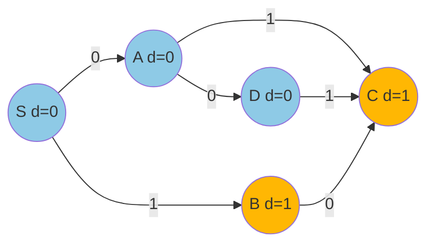

# 0-1 BFS (덱을 이용한 최단경로)

> **오늘의 주제: 0-1 BFS — 간선 가중치가 0 또는 1뿐일 때 O(V+E)로 푸는 최단경로**

---

## 왜 이걸 쓰나

간선 가중치가 **0 또는 1** 두 종류뿐인 그래프에서 최단경로를 구할 때,
다익스트라(우선순위 큐, `O(E log V)`)를 쓰지 않고
**덱(deque)** 하나로 **`O(V+E)`** 에 해결하는 기법이다.

핵심 아이디어:
- 일반 BFS는 "모든 간선 가중치가 1"이라 큐에 넣는 순서 = 거리 순서가 자동 보장된다.
- 가중치가 0/1이면 이 순서가 깨진다. 하지만 **가중치 0 간선은 덱 앞(appendleft)**, **가중치 1 간선은 덱 뒤(append)** 로 넣으면 덱 안이 항상 거리 오름차순으로 유지된다.
- 그래서 우선순위 큐 없이도 "가장 가까운 정점부터" 꺼내는 성질이 유지된다.

### 언제 쓰나 (코테 신호)
- "벽을 부수는 최소 횟수" → 벽 통과 = 가중치 1, 빈칸 이동 = 가중치 0
- "순간이동(0초)과 걷기(1초)" 같은 이분화된 비용
- 방향 전환/특정 이동만 비용이 드는 격자 문제

---

## 정당성 (왜 맞는가)

불변식: **덱에 들어있는 거리 값들은 최대 2종류(`d`, `d+1`)이고 항상 정렬 상태다.**

- 현재 거리 `d`인 정점 `u`를 꺼낸다.
- 가중치 0 간선으로 가는 `v`는 거리 `d` → **앞에 넣어** 같은 레벨에서 먼저 처리.
- 가중치 1 간선으로 가는 `v`는 거리 `d+1` → **뒤에 넣어** 다음 레벨로.

이 규칙이 "덱 앞쪽일수록 거리 작음"을 깨지 않으므로,
정점을 꺼내는 순간의 `dist`가 곧 최단거리로 확정된다. (다익스트라의 그리디 정당성과 동일 구조)



> 파란색(거리 0)은 덱 앞으로, 주황색(거리 1)은 덱 뒤로. 같은 색끼리 뭉쳐 처리된다.

---

## 대표 예제 1 — 백준 13549 숨바꼭질 3

수빈이는 위치 `n`에서 동생 `k`로 이동한다.
- `x-1`, `x+1`: **1초** (가중치 1)
- `x*2`: **0초** (순간이동, 가중치 0)

최소 시간을 구하라. 전형적인 0-1 BFS.

```python
import sys
from collections import deque

def solve():
    n, k = map(int, input().split())
    MAX = 100_001
    INF = float('inf')
    dist = [INF] * MAX
    dq = deque([n])
    dist[n] = 0

    while dq:
        x = dq.popleft()
        if x == k:
            print(dist[x]); return
        # 가중치 0: 순간이동 (앞으로 넣기)
        nx = x * 2
        if 0 <= nx < MAX and dist[x] < dist[nx]:
            dist[nx] = dist[x]
            dq.appendleft(nx)
        # 가중치 1: 걷기 (뒤로 넣기)
        for nx in (x - 1, x + 1):
            if 0 <= nx < MAX and dist[x] + 1 < dist[nx]:
                dist[nx] = dist[x] + 1
                dq.append(nx)

solve()
```

- **핵심 아이디어:** `*2`는 비용 0이라 덱 앞으로, `±1`은 비용 1이라 덱 뒤로.
- **시간복잡도:** `O(V+E)` = `O(MAX)`. 다익스트라의 `log` 계수가 사라진다.
- **자주 하는 실수:**
  - 이미 방문한 정점을 다시 `appendleft` 하면 같은 정점이 덱에 여러 번 들어간다. 반드시 **`dist` 갱신이 실제로 일어날 때만** 넣기.
  - 꺼낼 때 `dist`가 이미 더 작아졌을 수 있으니, 목표 도달 판정은 "꺼내는 시점"에 하는 게 안전.

---

## 대표 예제 2 — 백준 1261 알고스팟 (벽 부수기 최소 개수)

`0`은 빈 방, `1`은 벽. `(0,0)`에서 `(N-1,M-1)`까지 갈 때 부숴야 하는 **벽의 최소 개수**.
- 빈 방으로 이동: 가중치 0
- 벽을 부수고 이동: 가중치 1

```python
import sys
from collections import deque

def solve():
    input = sys.stdin.readline
    M, N = map(int, input().split())          # 가로 M, 세로 N
    g = [list(map(int, input().rstrip())) for _ in range(N)]
    INF = float('inf')
    dist = [[INF] * M for _ in range(N)]
    dq = deque([(0, 0)])
    dist[0][0] = 0

    while dq:
        r, c = dq.popleft()
        for dr, dc in ((1, 0), (-1, 0), (0, 1), (0, -1)):
            nr, nc = r + dr, c + dc
            if 0 <= nr < N and 0 <= nc < M:
                w = g[nr][nc]                  # 벽이면 1, 빈방이면 0
                if dist[r][c] + w < dist[nr][nc]:
                    dist[nr][nc] = dist[r][c] + w
                    if w == 0:
                        dq.appendleft((nr, nc))
                    else:
                        dq.append((nr, nc))
    print(dist[N - 1][M - 1])

solve()
```

- **핵심 아이디어:** 도착 칸의 값(0/1)이 곧 간선 가중치. 격자에서 그대로 0-1 BFS 적용.
- **시간복잡도:** `O(N*M)`.
- **주의:** 입력이 `가로 M, 세로 N` 순서로 들어오는 문제가 많다. 인덱싱 헷갈리지 말 것.

---

## Python 템플릿

```python
from collections import deque

def zero_one_bfs(adj, src, n):
    # adj[u] = [(v, w), ...],  w는 0 또는 1
    INF = float('inf')
    dist = [INF] * n
    dist[src] = 0
    dq = deque([src])
    while dq:
        u = dq.popleft()
        for v, w in adj[u]:
            if dist[u] + w < dist[v]:
                dist[v] = dist[u] + w
                dq.appendleft(v) if w == 0 else dq.append(v)
    return dist
```

---

## 한 줄 요약

- 간선 가중치가 **0/1뿐**이면 우선순위 큐 대신 **덱**으로 `O(V+E)`.
- **0 간선 → appendleft, 1 간선 → append.** 이 규칙 하나가 전부다.
- 다익스트라의 특수/고속 버전이라고 이해하면 된다.
