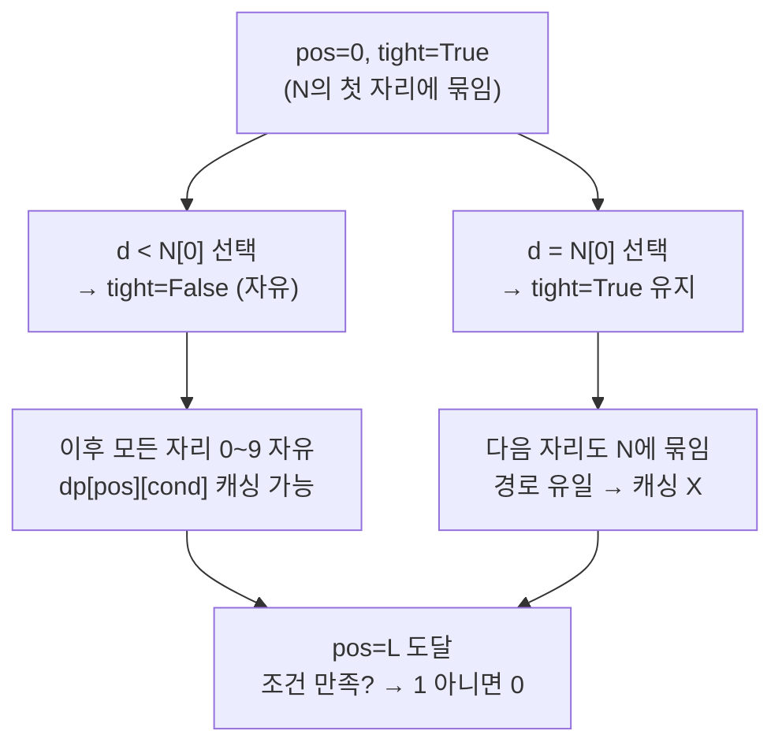

# 오늘의 주제: 자릿수 DP (Digit DP)

> **한 줄 요약**: `[0, N]` 범위 안에서 "각 자릿수 조건을 만족하는 수의 개수"를 세는 문제를,
> **맨 앞자리부터 한 자리씩 채워 나가며** 상태(`위치`, `타이트 여부`, `추가 조건`)로 메모이제이션하는 기법.

구간 `[A, B]`에서 조건을 만족하는 수의 개수는 하나도 빠짐없이 세야 하는데,
`B`가 `10^18`쯤 되면 하나씩 세는 건 불가능하다. 자릿수 DP는 **자릿수 개수(≈18)** 에만
비례하는 시간으로 이걸 해결한다. 핵심은 두 가지: **`f(B) - f(A-1)`** 로 구간을 쪼개고,
**"지금까지 N과 똑같이 채워 왔는가(tight)"** 라는 상태를 들고 다니는 것.

---

## 1. 왜 동작하는가 — 핵심 아이디어 3가지

### ① 구간은 누적함수의 뺄셈으로
`count(A, B) = f(B) - f(A-1)` 여기서 `f(x)` = `0 이상 x 이하`에서 조건 만족 개수.
→ **상한 하나만 처리하는 함수** `f`만 잘 만들면 된다.

### ② 앞자리부터 채우되 "tight" 상태를 기억
숫자 `N = d_0 d_1 ... d_{L-1}` 을 앞에서부터 한 자리씩 정한다.
`pos`번째 자리에 놓을 수 있는 값의 **상한**은:

- 지금까지 앞자리를 **N과 똑같이(=tight)** 채워 왔다면 → 이번 자리는 `0 ~ N[pos]` 까지만.
- 앞에서 **한 번이라도 N보다 작은 값**을 놓았다면(=free) → 이번 자리는 `0 ~ 9` 자유.

이 `tight` 한 비트가 "N을 넘지 않는다"는 제약을 자연스럽게 걸어 준다.

### ③ tight가 풀리면 상태가 겹친다 → 메모이제이션
free 상태에서는 앞에 무엇이 왔든 "남은 자리 수"와 "추가 조건 상태"만 같으면
경우의 수가 **완전히 동일**하다. 그래서 `dp[pos][cond]` 로 캐싱하면 재계산이 사라진다.
(tight 상태는 경로가 유일해서 캐싱하지 않는 게 보통이다.)



---

## 2. 대표 예제 ① — 백준 2704 유형: "각 자릿수 합이 특정 값" 세기 (기본형)

> `0 ~ N` 중에서 **모든 자릿수의 합이 정확히 K**인 수의 개수를 구하라. (`N ≤ 10^18`)

### 핵심 아이디어
- 상태: `(pos, tight, digit_sum)` — 지금 자리, N에 묶였는지, 지금까지 자릿수 합.
- free(`tight=False`)일 때만 `dp[pos][digit_sum]` 캐싱.
- 종료: `pos == L` 이면 `digit_sum == K` 인지 검사.

```python
import sys
from functools import lru_cache
sys.setrecursionlimit(10**6)

def count_upto(N, K):
    digits = list(map(int, str(N)))
    L = len(digits)

    @lru_cache(maxsize=None)
    def dp(pos, s, tight):
        if pos == L:
            return 1 if s == K else 0
        total = 0
        hi = digits[pos] if tight else 9          # 이번 자리 상한
        for d in range(hi + 1):
            if s + d > K:                          # 가지치기 (선택)
                break
            total += dp(pos + 1, s + d, tight and d == hi)
        return total

    return dp(0, 0, True)

# f(B) - f(A-1) 로 구간 [A, B]
# print(count_upto(B, K) - count_upto(A - 1, K))
print(count_upto(int(input()), int(input())))
```

- **시간복잡도**: 상태 `pos(L) × s(≤9L) × tight(2)`, 각 상태 전이 10 → `O(L² · 10)`. `L≈19`라 순식간.
- `lru_cache` 는 `tight=True` 경로도 캐싱하지만 그 경로는 매 자리 유일해서 낭비가 미미하다.
  엄밀히 하려면 `tight`를 캐시 키에서 빼고 free일 때만 별도 테이블에 저장한다.

---

## 3. 대표 예제 ② — 백준 2038 유형: "숫자 4나 8을 포함하지 않는 수" (조건형)

> `1 ~ N` 중 각 자릿수에 **4와 8이 하나도 없는** 수의 개수. (일명 '길한 수')

### 핵심 아이디어
- 조건이 "특정 자릿수 금지"라 **추가 상태가 필요 없다**. `(pos, tight)` 만으로 충분.
- 자리 후보에서 4, 8만 빼면 끝.

```python
import sys
from functools import lru_cache
sys.setrecursionlimit(10**6)

def lucky_upto(N):
    if N < 0:
        return 0
    digits = list(map(int, str(N)))
    L = len(digits)
    BAD = {4, 8}

    @lru_cache(maxsize=None)
    def dp(pos, tight):
        if pos == L:
            return 1                # 0 도 하나로 셈 (필요시 마지막에 -1)
        total = 0
        hi = digits[pos] if tight else 9
        for d in range(hi + 1):
            if d in BAD:
                continue
            total += dp(pos + 1, tight and d == hi)
        return total

    return dp(0, True)

N = int(input())
print(lucky_upto(N) - 1)            # 0 제외
```

- **시간복잡도**: `O(L · 10)`. 상태가 `(pos, tight)` 뿐이라 극도로 가볍다.
- "0 포함/제외", "선행 0(leading zero) 처리"는 문제마다 다르다. 위처럼 **끝에서 보정**하거나
  `started`(첫 유효자리 등장 여부) 상태를 하나 더 두는 방식이 있다.

---

## 4. 자주 하는 실수

- **`A-1` 을 안 뺀다**: `count(A,B)=f(B)-f(A-1)`. `A` 자체 포함 여부를 놓치면 딱 1 틀린다.
- **leading zero 혼동**: `007` 같은 게 실제로는 `7`이다. "자릿수 개수", "특정 숫자 등장" 류 조건은
  선행 0을 세면 안 된다. → `started` 상태를 추가하거나, 자릿수별로 길이를 나눠 처리.
- **tight를 캐시 키에 넣고도 초기화를 안 함**: 서로 다른 `N`으로 `dp`를 재호출할 때
  `lru_cache`가 이전 N의 값을 물고 있으면 오답. 매 `count_upto` 호출마다 **내부에서 dp를 새로 정의**
  하거나 `dp.cache_clear()` 를 호출한다. (위 코드는 클로저로 매번 새로 정의해 안전.)
- **상한 `hi` 를 항상 9로**: tight일 때 상한은 `N[pos]` 다. 이걸 놓치면 N을 넘는 수까지 세어 과다 카운트.
- **재귀 한도**: 파이썬 기본 재귀 한도(1000)로도 `L≈19`면 충분하지만, 다른 재귀와 겹치면
  `setrecursionlimit` 로 넉넉히.

---

## 5. Python 템플릿 (복붙용)

```python
import sys
from functools import lru_cache
sys.setrecursionlimit(10**6)

def solve_upto(N):
    """0 이상 N 이하에서 조건을 만족하는 수의 개수."""
    if N < 0:
        return 0
    digits = list(map(int, str(N)))
    L = len(digits)

    @lru_cache(maxsize=None)
    def dp(pos, state, tight):
        # pos  : 지금 채우는 자리 (0..L)
        # state: 문제별 추가 상태 (자릿수 합, 이전 자리 값, mod 나머지 등)
        # tight: 아직 N과 똑같이 채워 왔는가
        if pos == L:
            return 1 if is_valid(state) else 0
        res = 0
        hi = digits[pos] if tight else 9
        for d in range(hi + 1):
            nstate = transit(state, d)      # 상태 전이 (문제별)
            res += dp(pos + 1, nstate, tight and d == hi)
        return res

    return dp(0, INIT_STATE, True)

# 구간 [A, B]:  answer = solve_upto(B) - solve_upto(A - 1)
```

**변형 포인트**: `state` 자리에 무엇을 넣느냐가 문제의 전부다.
자릿수 합 / 특정 값 등장 여부 / `mod M` 나머지 / 이전 자리(인접 조건) / 사용한 숫자 집합(비트마스크) 등.

---

## 언제 쓰나
- "구간 `[A, B]`에서 **조건 만족하는 수의 개수**" + 상한이 `10^9` 이상으로 클 때 → 거의 자릿수 DP.
- 조건이 **각 자릿수를 보고 판단**되는 형태(합/자릿수/나머지/인접관계)일 때 특히 잘 맞는다.
- 반대로 "N번째로 작은 수 찾기"는 자릿수 DP의 카운팅을 **이분/그리디로 감싸서** 해결한다.
