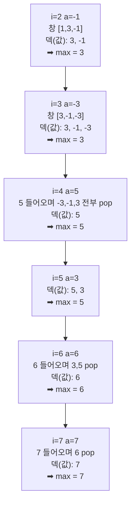

# 오늘의 주제: 슬라이딩 윈도우 최댓값 (Monotonic Deque)

> 고정 크기 창(window)을 배열 위로 한 칸씩 밀면서, **매 창의 최댓값(또는 최솟값)** 을 전체 O(N)에 구하는 기법.
> 핵심 자료구조는 **단조 덱(monotonic deque)** — 값이 단조 감소(최댓값용) 하도록 유지되는 인덱스 큐다.

---

## 왜 필요한가

창 크기 `k`, 배열 길이 `N`일 때 순진하게 매 창마다 최댓값을 다시 스캔하면 **O(N·k)**.
`N=10^6`, `k=10^5` 같은 입력이면 그대로 시간 초과다.

단조 덱을 쓰면 각 원소가 덱에 **정확히 한 번 들어가고 한 번 나오므로** 전체 **O(N)** 에 끝난다.

- 단조 **스택**(오큰수·히스토그램, 이미 다룸)은 한쪽 끝만 쓴다.
- 단조 **덱**은 **양쪽 끝**을 쓴다: 뒤(back)로 넣고 조건에 안 맞는 걸 뒤에서 빼고, 창을 벗어난 원소는 앞(front)에서 뺀다.

---

## 핵심 아이디어 (최댓값 기준)

덱에는 **값이 아니라 인덱스**를 저장한다. 두 가지 불변식을 유지한다.

1. **창 범위 유지 (front)**: 덱 맨 앞 인덱스가 현재 창의 왼쪽 경계 `i-k+1` 보다 작으면 → 창을 벗어났으니 `popleft`.
2. **단조성 유지 (back)**: 새 원소 `a[i]` 를 넣기 전에, 덱 맨 뒤에 있는 인덱스의 값이 `a[i]` **이하**면 → 그 인덱스는 앞으로 절대 답이 될 수 없으니 `pop`. (더 오른쪽에 있으면서 값도 크거나 같으니 완전히 지배당함)

이 두 규칙 덕분에 덱은 **항상 값 내림차순**을 유지하고, **맨 앞 인덱스가 곧 현재 창의 최댓값 위치**가 된다.

> 정당성 포인트: "나보다 나중에 들어오고, 값이 나 이상인" 원소가 나타나면 나는 영원히 최댓값 후보에서 탈락한다. 그래서 뒤에서 미련 없이 버려도 정답을 놓치지 않는다.

### 덱 상태 변화 예시

`a = [1, 3, -1, -3, 5, 3, 6, 7]`, `k = 3` 일 때, 새 원소가 들어올 때마다 뒤에서 작은 값들이 밀려나고 맨 앞이 최댓값이 된다.



핵심: **덱은 언제나 내림차순**, 맨 앞이 그 창의 답. 각 원소는 back으로 1번 push, 1번 pop → 상각 O(1).

---

## 시간 · 공간 복잡도

- **시간 O(N)** — 각 인덱스 push/pop 각 1회 (상각 분석).
- **공간 O(k)** — 덱에는 최대 한 창 크기만큼의 인덱스만 남는다.

---

## 대표 예제 1 — 슬라이딩 윈도우 최댓값 (LeetCode 239)

`nums`와 `k`가 주어질 때, 크기 `k` 창을 왼쪽부터 오른쪽으로 밀며 각 창의 최댓값을 배열로 반환.

### 핵심 아이디어
- 덱에 **인덱스**를 저장, 값 내림차순 유지.
- 매 스텝: (1) 창 벗어난 앞 인덱스 제거 → (2) 뒤에서 작은 값 제거 후 push → (3) `i >= k-1` 이면 맨 앞 값 기록.

```python
from collections import deque

def max_sliding_window(nums, k):
    dq = deque()          # 값 내림차순을 유지하는 '인덱스' 덱
    res = []
    for i, x in enumerate(nums):
        # 1) 창 왼쪽 경계를 벗어난 인덱스 제거
        if dq and dq[0] <= i - k:
            dq.popleft()
        # 2) 뒤에서 x 이하인 값들은 지배당하므로 제거
        while dq and nums[dq[-1]] <= x:
            dq.pop()
        dq.append(i)
        # 3) 첫 창이 완성된 시점부터 답 기록
        if i >= k - 1:
            res.append(nums[dq[0]])
    return res

# max_sliding_window([1,3,-1,-3,5,3,6,7], 3) -> [3,3,5,5,6,7]
```

### 자주 하는 실수
- 값 대신 인덱스를 안 넣으면 **창 범위 판정을 못 한다**. 반드시 인덱스 저장.
- `nums[dq[-1]] <= x` 에서 `<` 만 쓰면 같은 값이 덱에 쌓여도 정답은 맞지만, 최솟값 인덱스 등을 원할 땐 등호 처리 방향에 주의.
- `i >= k-1` 조건을 빠뜨려 창이 덜 찼는데 답을 기록하는 실수.

---

## 대표 예제 2 — 최솟값 찾기 (백준 11003)

수열 `A`와 `L`이 주어질 때, 각 `i`에 대해 `D[i] = min(A[j])  (i-L+1 ≤ j ≤ i)` 를 출력. `N ≤ 5,000,000`.

### 핵심 아이디어
- 최댓값 코드에서 **부등호만 뒤집으면(`>=`)** 최솟값 버전이 된다.
- N이 매우 크므로 **입력을 `sys.stdin` 으로 빠르게 읽고**, 출력도 한 번에 모아서 처리해야 시간 초과를 피한다.

```python
import sys
from collections import deque

def main():
    input = sys.stdin.buffer.read().split()
    n, L = int(input[0]), int(input[1])
    a = input[2:2 + n]                 # bytes 그대로 두고 필요할 때 int 변환

    dq = deque()                       # (값, 인덱스) — 값 오름차순 유지
    out = []
    for i in range(n):
        x = int(a[i])
        # 창 벗어난 앞 원소 제거
        if dq and dq[0][1] <= i - L:
            dq.popleft()
        # 뒤에서 x 이상인 값 제거 (최솟값이므로 큰 값이 지배당함)
        while dq and dq[-1][0] >= x:
            dq.pop()
        dq.append((x, i))
        out.append(str(dq[0][0]))      # 맨 앞이 현재 창의 최솟값
    sys.stdout.write(' '.join(out))

main()
```

### 자주 하는 실수
- `input()` 을 5백만 번 호출하면 무조건 TLE → `sys.stdin.buffer.read()` 한 방에 읽기.
- 결과를 매번 `print` 하면 느림 → 리스트에 모아 `' '.join` 후 한 번 출력.

---

## Python 템플릿 (복붙용)

```python
from collections import deque

def sliding_window(nums, k, want_max=True):
    """각 크기 k 창의 최댓값(want_max) 또는 최솟값 리스트 반환. 전체 O(N)."""
    dq = deque()  # 인덱스 저장, 값이 (max면 내림차순 / min이면 오름차순)
    res = []
    for i, x in enumerate(nums):
        if dq and dq[0] <= i - k:          # 창 벗어난 앞 제거
            dq.popleft()
        if want_max:
            while dq and nums[dq[-1]] <= x: # 지배당하는 뒤 원소 제거
                dq.pop()
        else:
            while dq and nums[dq[-1]] >= x:
                dq.pop()
        dq.append(i)
        if i >= k - 1:
            res.append(nums[dq[0]])
    return res
```

---

## 언제 쓰나 — 신호 포착

- "**고정 길이 연속 구간**의 최대/최소" → 단조 덱 1순위.
- 창 크기가 **가변**이면서 최대/최소가 필요하면 → 단조 덱 + 투 포인터 조합.
- "구간 합"이면 → 슬라이딩 윈도우/누적합, "구간 최댓값을 여러 번 랜덤 질의"면 → 세그먼트 트리/희소 테이블. **덱은 창이 한 방향으로 미끄러질 때** 최강.

## 한 줄 요약
> 인덱스를 담은 **내림차순 덱**을 유지하라. 앞에서 창 밖을 버리고, 뒤에서 지배당한 값을 버리면, **맨 앞이 곧 그 창의 최댓값**이고 전체가 O(N)이다.
