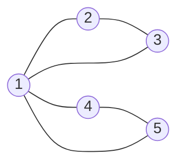

# 오늘의 주제: 오일러 경로 / 오일러 회로 (Hierholzer 알고리즘)

> 코테 언어: **Python**

그래프의 **모든 간선을 정확히 한 번씩** 지나는 경로/회로를 찾는 문제.
DFS의 응용으로, "한붓그리기"의 알고리즘 버전이다.

- **오일러 경로 (Eulerian Path)**: 모든 간선을 한 번씩 지나는 경로 (시작 ≠ 끝 허용)
- **오일러 회로 (Eulerian Circuit)**: 시작점으로 다시 돌아오는 오일러 경로

---

## 1. 왜 동작하는가 — 존재 조건 (핵심)

간선을 지날 때마다 정점을 "들어갔다 나온다". 즉 방문할 때마다 차수(degree)를 2씩 소모한다.
따라서 **홀수 차수 정점은 경로의 끝점밖에 될 수 없다.**

### 무방향 그래프
| 종류 | 조건 |
|------|------|
| 오일러 **회로** | 모든 정점의 차수가 **짝수** + (간선 있는 정점들이) **연결** |
| 오일러 **경로** | 홀수 차수 정점이 **정확히 0개 또는 2개** + 연결 |

- 홀수 정점 2개면 그 둘이 각각 시작/끝이 된다.

### 방향 그래프
| 종류 | 조건 |
|------|------|
| 오일러 **회로** | 모든 정점에서 `in == out` + 연결(강연결에 준함) |
| 오일러 **경로** | 한 정점만 `out-in=1`(시작), 한 정점만 `in-out=1`(끝), 나머지 `in==out` |

> **주의점**: 차수 조건만 보면 안 되고, 간선이 있는 정점들이 **하나의 연결요소**에 있어야 한다.
> 고립된 두 사이클은 차수는 다 짝수지만 오일러 회로가 없다.

---

## 2. Hierholzer 알고리즘 — 어떻게 찾는가

아이디어: **DFS로 내려가다 막히면(더 쓸 간선이 없으면) 그 정점을 결과에 확정**한다.
막힌 정점을 결과 스택에 쌓고, 되돌아오면서 아직 안 쓴 간선이 있으면 다시 파고든다.
결과를 **뒤집으면** 오일러 경로가 된다.

- 각 간선은 한 번만 쓰므로 전체 **O(V + E)**.
- 재귀는 깊이가 E까지 갈 수 있어 파이썬에선 **스택 기반 반복 구현**이 안전하다.



위 그래프: 모든 정점 차수 짝수(1은 4, 나머지 2) → 오일러 회로 존재.
예: `1 → 2 → 3 → 1 → 4 → 5 → 1`

---

## 3. 대표 예제 — 백준 1199 오일러 회로

무방향 그래프(인접 행렬, 다중 간선 가능)가 주어지고 **항상 오일러 회로가 존재**한다고 보장.
실제 회로 순서를 출력하라.

### 핵심 아이디어
- 인접 행렬 `g[u][v]` = u–v 간선 개수. 간선 쓸 때 `g[u][v]`, `g[v][u]` 둘 다 감소.
- Hierholzer 반복 구현: `cur = 스택 top`. 안 쓴 간선 있으면 그쪽으로 전진, 없으면 pop 하며 결과에 기록.

### Python 풀이

```python
import sys
input = sys.stdin.readline

def solve():
    n = int(input())
    g = [list(map(int, input().split())) for _ in range(n)]

    def hierholzer(start):
        stack = [start]
        circuit = []
        while stack:
            u = stack[-1]
            for v in range(n):
                if g[u][v] > 0:          # 아직 안 쓴 간선
                    g[u][v] -= 1
                    g[v][u] -= 1         # 무방향: 양쪽 감소
                    stack.append(v)
                    break
            else:                        # 더 쓸 간선 없음 → 확정
                circuit.append(stack.pop())
        return circuit[::-1]             # 뒤집어야 실제 경로

    path = hierholzer(0)
    print(' '.join(str(v + 1) for v in path))

solve()
```

- **시간복잡도**: 인접 행렬이면 O(V·E), 인접 리스트면 O(V+E).
- 위 코드는 `for v in range(n)`를 매번 도므로 정점이 크면 인접 리스트 + 포인터로 최적화.

---

## 4. 인접 리스트 최적화 템플릿 (권장)

간선이 많을 때는 각 정점마다 "다음에 볼 간선 인덱스" 포인터를 두어 재방문 비용을 없앤다.

```python
import sys
from collections import defaultdict

def euler_path(graph, start, edge_count):
    # graph[u] = [(v, edge_id), ...]  (무방향이면 반대쪽도 넣기)
    used = [False] * edge_count
    ptr = defaultdict(int)           # 정점별 다음 간선 포인터
    stack = [start]
    circuit = []
    while stack:
        u = stack[-1]
        adv = False
        while ptr[u] < len(graph[u]):
            v, eid = graph[u][ptr[u]]
            ptr[u] += 1
            if not used[eid]:
                used[eid] = True     # 무방향이면 같은 eid 공유
                stack.append(v)
                adv = True
                break
        if not adv:
            circuit.append(stack.pop())
    return circuit[::-1]
```

- 무방향 간선은 정방향/역방향을 **같은 `edge_id`** 로 넣어 한 번만 쓰게 한다.
- 전체 **O(V + E)**.

---

## 5. 자주 하는 실수

- **결과를 뒤집지 않음** → Hierholzer는 막힌 순서로 쌓이므로 `[::-1]` 필수.
- **연결성 검사 누락** → 차수만 맞고 그래프가 쪼개져 있으면 회로 없음.
- **홀수 정점 개수** → 무방향 경로는 0개 또는 2개일 때만. 그 외엔 불가능.
- **시작점 선택 오류** → 오일러 *경로*는 홀수 차수 정점(방향이면 out-in=1)에서 시작해야 함. 회로는 아무 정점이나 OK.
- **재귀 DFS 사용** → E가 크면 파이썬 재귀 한계로 터짐. 반복 구현 사용.
- **다중 간선/자기 루프** → 개수를 세서 처리(위 1199처럼 행렬 값 감소).

---

## 6. 한 줄 정리

> 차수로 **존재 여부**를 판정하고, Hierholzer(막히면 쌓고 뒤집기)로 **실제 경로**를 O(V+E)에 복원한다.
