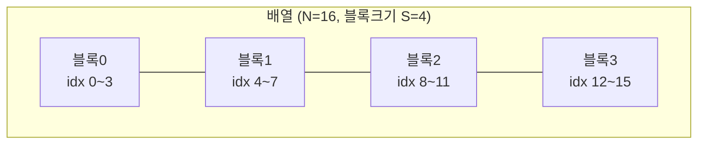
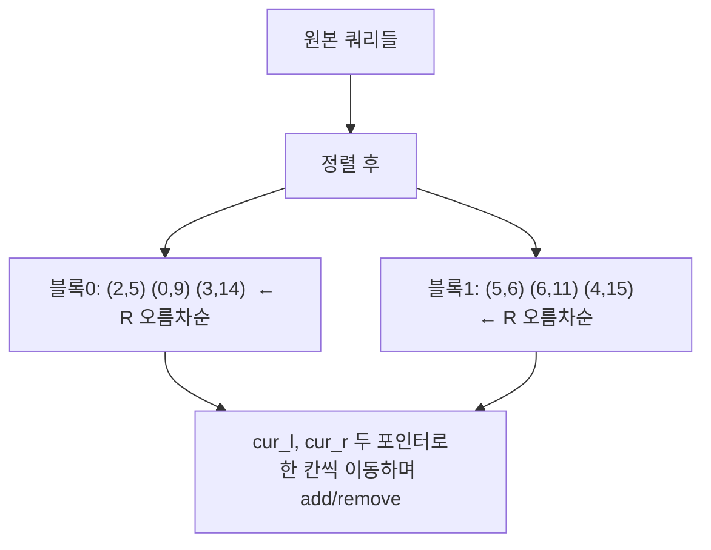

# 오늘의 주제: Mo's 알고리즘 (오프라인 쿼리 / 平方分割)

> **한 줄 요약**: 정답을 미리 다 모아두고(오프라인), 쿼리를 영리한 순서로 정렬해
> 구간 `[L, R]`을 조금씩 밀면서 답을 갱신한다. 세그먼트 트리로 어려운
> "구간 내 서로 다른 수의 개수" 같은 문제를 `O((N+Q)·√N)`에 푼다.

---

## 1. 언제 쓰는가

- **오프라인**이 허용될 때 (모든 쿼리를 미리 알 수 있음. 중간에 값 변경 없음)
- 구간 쿼리인데 **결과를 세그먼트/펜윅 트리로 합치기 어려운 경우**
  - 구간 내 **서로 다른 원소의 개수** (distinct count)
  - 구간 내 **어떤 값이 정확히 k번 등장하는지**
  - 구간에서 **가장 많이 등장하는 수의 빈도(최빈값 빈도)**
  - `mex`, 특정 조건을 만족하는 쌍의 수 등
- 핵심 조건: **`[L,R]`에서 원소 하나를 추가/제거할 때 `O(1)`(또는 아주 빠르게) 답을 갱신**할 수 있어야 한다.

세그먼트 트리는 "구간을 합칠 수 있는(결합법칙) 연산"에 강하고,
Mo's는 "한 칸씩 늘렸다 줄였다 하는 게 쉬운" 문제에 강하다. 서로 커버 영역이 다르다.

---

## 2. 핵심 아이디어 — 왜 √N인가

두 포인터 `cur_l, cur_r`을 들고 현재 구간의 답을 유지한다.
다음 쿼리 `[L, R]`로 이동할 때 포인터를 한 칸씩 옮기며 `add / remove`를 호출한다.

포인터 이동 횟수를 줄이려면 **쿼리를 잘 정렬**해야 한다.
배열을 크기 `S = √N`짜리 **블록**으로 나누고:

- **1순위: `L`이 속한 블록 번호 오름차순**
- **2순위: 같은 블록이면 `R` 오름차순**

이렇게 하면:
- `R` 포인터: 같은 블록 안에서는 계속 증가만 → 블록당 최대 `N` 이동, 블록 수 `√N` → **`O(N√N)`**
- `L` 포인터: 한 쿼리당 블록 폭 `√N` 안에서만 움직임 → **`O(Q√N)`**

합쳐서 **`O((N+Q)√N)`**.



쿼리 정렬 예시 (L의 블록으로 묶고, 그 안에서 R 오름차순):



---

## 3. 대표 예제 — 구간 내 서로 다른 수의 개수 (BOJ 13547 수열과 쿼리 5)

배열이 주어지고, 여러 쿼리 `[L, R]`에 대해 **구간에 존재하는 서로 다른 값의 개수**를 출력.

### 핵심 아이디어
- `cnt[v]` = 현재 구간에서 값 `v`의 등장 횟수
- `add(i)`: `cnt[a[i]]++`. 만약 `0 → 1`이 되면 distinct `+1`
- `remove(i)`: `cnt[a[i]]--`. 만약 `1 → 0`이 되면 distinct `-1`

각 연산이 `O(1)` → Mo's의 이상적인 대상.

```python
import sys
input = sys.stdin.readline

def main():
    n = int(input())
    a = [0] + list(map(int, input().split()))  # 1-indexed
    q = int(input())
    queries = []
    for i in range(q):
        l, r = map(int, input().split())
        queries.append((l, r, i))

    S = max(1, int(n ** 0.5))
    # 정렬: L의 블록 오름차순, 같은 블록이면 R 오름차순
    queries.sort(key=lambda x: (x[0] // S, x[1]))

    ans = [0] * q
    cnt = [0] * (1_000_001)   # 값의 범위에 맞게
    distinct = 0
    cur_l, cur_r = 1, 0       # 빈 구간 [1,0]

    for l, r, idx in queries:
        # 구간을 [l, r]에 맞추기 — 확장은 add, 축소는 remove
        while cur_r < r:
            cur_r += 1
            if cnt[a[cur_r]] == 0:
                distinct += 1
            cnt[a[cur_r]] += 1
        while cur_l > l:
            cur_l -= 1
            if cnt[a[cur_l]] == 0:
                distinct += 1
            cnt[a[cur_l]] += 1
        while cur_r > r:
            cnt[a[cur_r]] -= 1
            if cnt[a[cur_r]] == 0:
                distinct -= 1
            cur_r -= 1
        while cur_l < l:
            cnt[a[cur_l]] -= 1
            if cnt[a[cur_l]] == 0:
                distinct -= 1
            cur_l += 1
        ans[idx] = distinct

    sys.stdout.write('\n'.join(map(str, ans)))

main()
```

**시간복잡도**: `O((N + Q)√N)`
**주의**: 값의 범위가 크면 `cnt`를 좌표압축하거나 dict로. 위 예제는 값 ≤ 10^6 가정.

---

## 4. 이동 순서(4개 while)의 함정 — 확장을 먼저, 축소를 나중에

포인터를 옮기는 4개의 while 순서가 **정확성에 직접 영향**을 준다.
반드시 **구간을 넓히는 연산(add)을 먼저**, **좁히는 연산(remove)을 나중에** 해야 안전하다.

- `cur_r` 확장(`cur_r < r`) / `cur_l` 확장(`cur_l > l`)  → **먼저**
- `cur_r` 축소(`cur_r > r`) / `cur_l` 축소(`cur_l < l`)  → **나중**

이유: 구간이 잠깐 "음수 길이"가 되는 순간 `cnt`가 음수로 내려가는 등의 오염을 막기 위해서다.
확장 먼저 하면 항상 유효한(비어있지 않은) 상태를 유지한다.

---

## 5. 자주 하는 실수

- **오프라인이 아닌데 적용**: 중간에 값이 바뀌는 업데이트 쿼리가 있으면 그냥 Mo's는 못 씀
  (→ 시간 축을 넣는 **Mo's with updates**, 3차원 정렬 필요).
- **인덱스 원복 안 함**: 쿼리를 정렬했으니 답은 반드시 **원래 인덱스 `idx`**에 저장.
- **`input` 안 바꿈**: `sys.stdin.readline` 안 쓰면 큰 입력에서 TLE. 파이썬은 특히 상수가 크다.
- **while 순서 뒤바꿈**: 4번 항목. 축소를 먼저 하면 `cnt` 언더플로우/오답.
- **블록 크기**: `S = √N`이 기본. 이론상 `N/√Q`가 최적이지만 코테에선 `√N`으로 충분.
- **값 범위 큰데 배열 cnt**: 메모리 초과 → 좌표압축.

---

## 6. 파이썬 템플릿 (그대로 복붙용)

```python
import sys
input = sys.stdin.readline

def solve():
    n = int(input())
    a = [0] + list(map(int, input().split()))   # 1-indexed
    q = int(input())
    qs = []
    for i in range(q):
        l, r = map(int, input().split())
        qs.append((l, r, i))

    S = max(1, int(n ** 0.5))
    qs.sort(key=lambda x: (x[0] // S, x[1]))

    ans = [0] * q
    cur_l, cur_r = 1, 0
    # --- 문제별 상태 ---
    cnt = {}
    cur = 0

    def add(v):
        nonlocal cur
        c = cnt.get(v, 0)
        if c == 0: cur += 1
        cnt[v] = c + 1

    def remove(v):
        nonlocal cur
        c = cnt[v]
        if c == 1: cur -= 1
        cnt[v] = c - 1
    # -------------------

    for l, r, idx in qs:
        while cur_r < r: cur_r += 1; add(a[cur_r])   # 확장 먼저
        while cur_l > l: cur_l -= 1; add(a[cur_l])
        while cur_r > r: remove(a[cur_r]); cur_r -= 1 # 축소 나중
        while cur_l < l: remove(a[cur_l]); cur_l += 1
        ans[idx] = cur

    print('\n'.join(map(str, ans)))

solve()
```

> **참고(파이썬 상수 최적화)**: 함수 호출 오버헤드 때문에 `add/remove`를 인라인으로 펼치면
> 훨씬 빠르다. 3번 예제처럼 while 안에 직접 로직을 쓰는 걸 권장. PyPy가 아니면
> 정렬 홀버트(Hilbert) 순서·인라인화가 통과의 관건이 될 때가 많다.

---

## 요약
- **오프라인 + 한 칸 add/remove가 쉬운 구간 쿼리** → Mo's가 정답.
- 쿼리를 `(L//√N, R)`로 정렬 → 두 포인터로 밀며 답 갱신 → `O((N+Q)√N)`.
- while 순서는 **확장 먼저, 축소 나중**. 답은 **원래 인덱스에 저장**.
