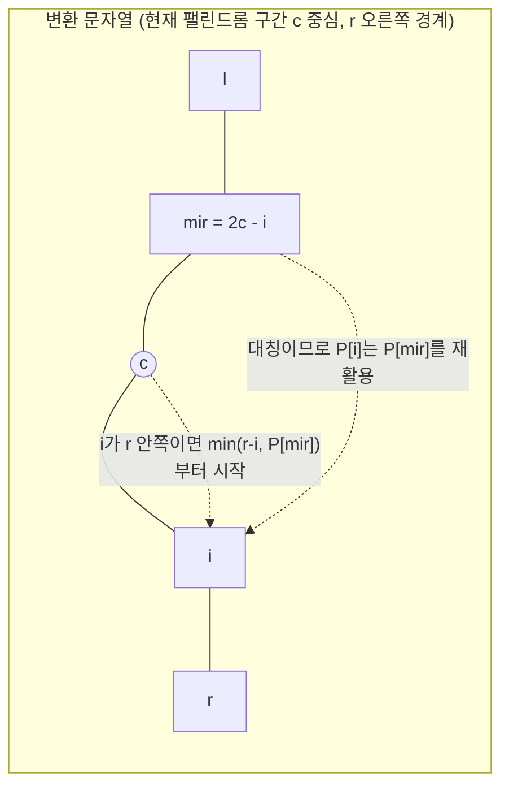

# 오늘의 주제: 매내처(Manacher) 알고리즘 — O(n) 팰린드롬

> 문자열의 **모든 위치를 중심으로 하는 최장 팰린드롬 반지름**을 선형 시간에 구한다.
> "가장 긴 팰린드롬 부분 문자열", "팰린드롬 개수 세기" 류 문제의 표준 해법.

---

## 1. 왜 필요한가

각 중심마다 좌우로 확장하며 팰린드롬을 세면 최악 O(n²) (예: `aaaa...a`).
매내처는 **이미 계산한 팰린드롬 정보를 대칭으로 재활용**해서 전체를 O(n)에 끝낸다.

- 최장 팰린드롬 부분 문자열: `max(P)` 로 즉시
- 부분 문자열 중 팰린드롬 개수: `sum((P[i]+1)//2)`
- 어떤 구간 `[l, r]` 이 팰린드롬인가? → 전처리 후 O(1) 판정 가능

---

## 2. 홀짝 통합 트릭 (핵심 전처리)

팰린드롬은 길이가 홀수(중심 1글자)일 수도, 짝수(중심 경계)일 수도 있다.
글자 사이사이에 **경계 문자 `#`** 를 끼워 넣으면 **모든 팰린드롬이 홀수 길이**가 되어 한 번에 처리된다.

```
원본:      a  b  a  b  a
변환(T): ^ # a # b # a # b # a # $
```

- 앞뒤 `^`, `$` 는 경계 밖 접근을 막는 보초(sentinel) — 확장 루프에서 인덱스 검사가 필요 없어짐.
- 변환 문자열 `T`의 길이는 `2n+3`. 여기서 구한 반지름 `P[i]` 는
  **원본에서의 실제 팰린드롬 길이와 정확히 같다** (`#` 개수 덕분).

---

## 3. 알고리즘 아이디어

현재까지 발견한 팰린드롬 중 **오른쪽 끝이 가장 먼** 것의 중심 `c` 와 오른쪽 경계 `r` 을 유지한다.
위치 `i`(단, `i < r`) 를 볼 때, `c` 기준 대칭점 `mir = 2*c - i` 의 값을 재활용한다.

```
P[i] = min(r - i, P[mir])   # 경계를 넘지 않는 만큼만 그대로 가져옴
```

그 다음 **경계 바깥은 직접 한 칸씩 확장**하고, 더 멀리 뻗었으면 `c, r` 을 갱신한다.



각 위치의 확장 총량은 `r` 이 뒤로 가지 않으므로(단조 증가), 전체 확장 횟수 합이 O(n) → **총 O(n)**.

---

## 4. Python 템플릿

```python
def manacher(s: str):
    # 홀짝 통합: 경계문자 삽입 + 양끝 보초
    T = '^#' + '#'.join(s) + '#$'
    n = len(T)
    P = [0] * n          # P[i] = i를 중심으로 한 팰린드롬 반지름(#포함)
    c = r = 0            # 현재 최우측 팰린드롬의 중심 c, 오른쪽 경계 r
    for i in range(1, n - 1):
        if i < r:
            P[i] = min(r - i, P[2 * c - i])   # 대칭점 재활용
        # 보초(^,$) 덕분에 경계 검사 없이 확장 가능
        while T[i + P[i] + 1] == T[i - P[i] - 1]:
            P[i] += 1
        if i + P[i] > r:                       # 더 멀리 뻗었으면 갱신
            c, r = i, i + P[i]
    return P   # P[i]는 원본 기준 팰린드롬 길이와 동일
```

- **최장 팰린드롬 길이**: `max(P)`
- **팰린드롬 개수(부분 문자열)**: `sum((v + 1) // 2 for v in P)`

---

## 5. 대표 예제

### 예제 1 — 가장 긴 팰린드롬 부분 문자열 (BOJ 13275)

문자열 `s`(최대 10만)에서 팰린드롬인 가장 긴 연속 부분 문자열의 길이.

```python
import sys
s = sys.stdin.readline().strip()

def manacher(s):
    T = '^#' + '#'.join(s) + '#$'
    P = [0] * len(T)
    c = r = 0
    for i in range(1, len(T) - 1):
        if i < r:
            P[i] = min(r - i, P[2 * c - i])
        while T[i + P[i] + 1] == T[i - P[i] - 1]:
            P[i] += 1
        if i + P[i] > r:
            c, r = i, i + P[i]
    return P

print(max(manacher(s)))
```

- **아이디어**: 반지름 `P[i]` 가 곧 원본 팰린드롬 길이 → `max` 하나면 끝.
- **시간복잡도**: O(n)

### 예제 2 — 팰린드롬 개수 세기 (BOJ 16163 류)

부분 문자열 중 팰린드롬인 것의 총 개수. 중심 `i` 는 길이 1,3,5,… 또는 2,4,6,… 팰린드롬을 `(P[i]+1)//2` 개 품는다.

```python
import sys
s = sys.stdin.readline().strip()
P = manacher(s)                       # 위 함수 재사용
print(sum((v + 1) // 2 for v in P))
```

- **핵심**: 반지름 `P[i]` 안에는 그 중심을 공유하는 팰린드롬이 `(P[i]+1)//2` 개 중첩되어 있다.

---

## 6. 자주 하는 실수

- **보초 문자 빼먹기**: `^`, `$` 없이 짜면 `while` 안에서 `i+P[i]+1` 이 범위를 벗어남. 보초는 절대 매칭되지 않는 서로 다른 문자여야 한다.
- **`P[i]` 초기값을 `min(r-i, P[mir])` 로 안 잡음**: 재활용을 빼먹으면 O(n²)로 퇴화.
- **`c, r` 갱신 조건**: `i + P[i] > r` 일 때만. `>=` 나 무조건 갱신하면 경계가 뒤로 밀려 논리 붕괴.
- **원본 인덱스 복원**: 변환 문자열의 중심 `i` → 원본 시작은 `(i - P[i]) // 2`. 위치가 필요하면 이 식을 기억.
- **입력 개행**: `.strip()` 안 하면 `\n` 이 팰린드롬 계산을 오염.

---

## 7. 한 줄 요약

> `#` 로 홀짝 통합 → 대칭 재활용(`min(r-i, P[mir])`) → 보초로 안전 확장.
> **O(n) 에 모든 중심의 팰린드롬 반지름**을 얻는다. 팰린드롬 문제의 만능키.
