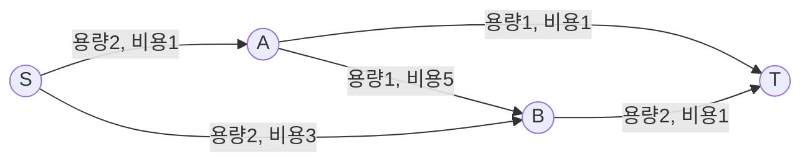
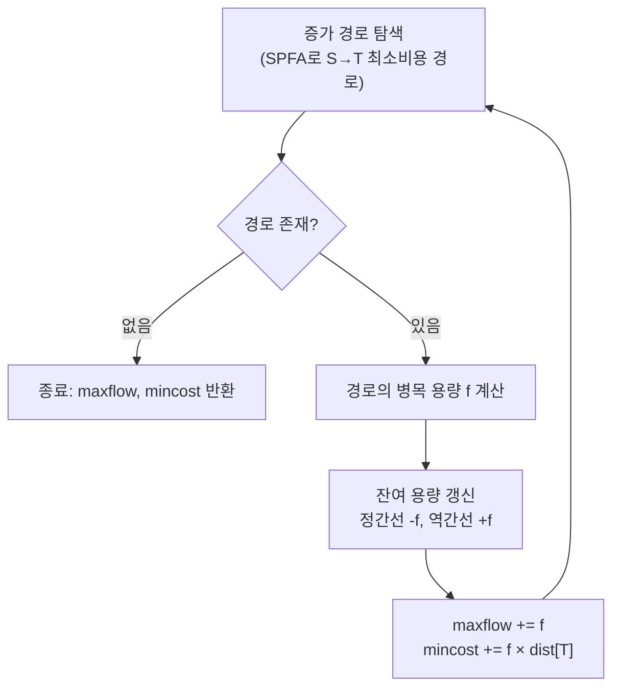

# 오늘의 주제: 최소 비용 최대 유량 (MCMF, Min-Cost Max-Flow)

> **한 줄 요약**: 유량을 **최대로** 흘리되, 그중에서 **드는 비용이 최소**가 되도록 흘린다. 최대 유량(Max-Flow)에 "간선마다 단위당 비용"이 추가된 문제. 핵심은 *증가 경로를 항상 최소 비용 경로로만* 고르는 것.

---

## 1. 어떤 문제인가

각 간선에 **용량(capacity)** 과 **단위 유량당 비용(cost)** 이 함께 붙어 있다. 소스 S → 싱크 T로 흘릴 수 있는 최대 유량을 구하되, 그 최대 유량을 만드는 여러 방법 중에서 **총비용(∑ 흐른 양 × 단위 비용)이 최소**인 것을 찾는다.

전형적인 응용:
- **가중치가 있는 이분 매칭** = 최소 비용으로 일꾼-작업 배정 (일의 만족도/비용 최적화)
- 물류: 각 경로에 운송비가 있을 때 최소 비용으로 물자 최대 수송
- K개의 서로 겹치지 않는 경로 중 비용 합 최소



싼 경로(S→A→T)를 먼저 채우고, 남는 유량은 그다음으로 싼 경로로 흘린다.

---

## 2. 핵심 아이디어 — "최단(=최소 비용) 경로로만 증가시킨다"

일반 최대 유량(Edmonds-Karp)은 증가 경로를 **BFS(간선 수 최소)** 로 찾았다. MCMF는 그 자리에 **최소 비용 경로**를 넣는다.

- 간선의 **비용을 거리(distance)** 로 보고, S→T 최소 비용 경로를 찾는다
- 그 경로의 **병목 용량(bottleneck)** 만큼 흘리고, `총비용 += bottleneck × 경로비용`
- 더 이상 S→T 경로가 없을 때까지 반복

### 왜 SPFA(벨만-포드류)를 쓰는가 — 음수 간선 때문
유량에는 **역간선**이 필수다(잘못 보낸 흐름을 되돌리는 장치). 역간선의 비용은 원간선의 **음수**(`-cost`)로 준다. 흐름을 취소하면 비용도 돌려받아야 하기 때문이다.

→ 그래프에 **음수 간선**이 생기므로 다익스트라를 그냥 못 쓴다. 그래서 **SPFA(큐 기반 벨만-포드)** 로 최소 비용 경로를 찾는다.

> **정당성**: "매 단계 최소 비용 경로로만 증가"시키면, 각 유량값(flow value)에서 항상 최소 비용을 유지한다. 최대 유량에 도달했을 때의 누적 비용이 곧 최소 비용 최대 유량이다. (음수 사이클이 없다는 전제 하에 성립.)



---

## 3. 대표 예제

### 예제 1) 열혈강호 2 — 가중치 이분 매칭 (BOJ 11408 유형)
N명의 직원, M개의 일. 직원 i가 일 j를 하면 비용 c가 든다. **가능한 많은 일을 처리**하되(=최대 매칭), 그중 **총비용을 최소**로.

- 모델링: `S → 각 직원(용량1, 비용0)`, `직원i → 일j(용량1, 비용 c_ij)`, `각 일 → T(용량1, 비용0)`
- MCMF를 돌리면 → maxflow = 최대 매칭 수, mincost = 그 매칭의 최소 비용

**핵심**: "최대 매칭 개수"와 "그 안에서의 최소 비용"을 한 번에 얻는 게 MCMF의 강점.

### 예제 2) K개의 최소 비용 경로
S→T로 정확히 K단위 유량을 흘릴 때의 최소 비용. S에서 나가는 초기 용량을 K로 제한하거나, 유량이 K에 도달하면 중단하도록 하면 된다.

---

## 4. Python 템플릿 (SPFA 기반 MCMF)

```python
import sys
from collections import deque
input = sys.stdin.readline
INF = float('inf')

class MCMF:
    def __init__(self, n):
        self.n = n
        self.graph = [[] for _ in range(n)]   # 각 노드의 간선 인덱스 목록
        self.edges = []                        # [to, cap, cost]

    def add_edge(self, u, v, cap, cost):
        # 정간선
        self.graph[u].append(len(self.edges)); self.edges.append([v, cap, cost])
        # 역간선 (용량 0, 비용 -cost)
        self.graph[v].append(len(self.edges)); self.edges.append([u, 0, -cost])

    def flow(self, s, t):
        maxflow = mincost = 0
        while True:
            dist = [INF] * self.n
            in_q = [False] * self.n
            prev_e = [-1] * self.n            # 각 노드로 오는 데 쓴 간선 인덱스
            dist[s] = 0
            dq = deque([s]); in_q[s] = True
            # --- SPFA: 최소 비용 경로 ---
            while dq:
                u = dq.popleft(); in_q[u] = False
                for ei in self.graph[u]:
                    v, cap, cost = self.edges[ei]
                    if cap > 0 and dist[u] + cost < dist[v]:
                        dist[v] = dist[u] + cost
                        prev_e[v] = ei
                        if not in_q[v]:
                            dq.append(v); in_q[v] = True
            if dist[t] == INF:               # 더 이상 증가 경로 없음
                break
            # --- 병목 용량 계산 (경로 역추적) ---
            f = INF; v = t
            while v != s:
                ei = prev_e[v]
                f = min(f, self.edges[ei][1])
                v = self.edges[ei ^ 1][0]     # 역간선의 to = 이전 노드
            # --- 유량 반영 ---
            v = t
            while v != s:
                ei = prev_e[v]
                self.edges[ei][1] -= f        # 정간선 용량 감소
                self.edges[ei ^ 1][1] += f    # 역간선 용량 증가
                v = self.edges[ei ^ 1][0]
            maxflow += f
            mincost += f * dist[t]
        return maxflow, mincost
```

**간선을 쌍(정/역)으로 넣으면 `ei ^ 1`로 짝 간선에 바로 접근**하는 게 핵심 트릭이다. `add_edge`를 정간선→역간선 순으로 넣었기 때문에 인덱스가 (0,1), (2,3), ... 짝을 이룬다.

사용 예 (가중치 이분 매칭):
```python
# 노드: 0=S, 1..N=직원, N+1..N+M=일, N+M+1=T
mc = MCMF(N + M + 2)
S, T = 0, N + M + 1
for i in range(1, N + 1):
    mc.add_edge(S, i, 1, 0)                    # S→직원
for j in range(1, M + 1):
    mc.add_edge(N + j, T, 1, 0)                # 일→T
# 직원 i가 일 j를 비용 c로 → mc.add_edge(i, N+j, 1, c)
maxflow, mincost = mc.flow(S, T)
```

---

## 5. 시간복잡도

- SPFA 한 번: 최악 O(V·E), 실전은 훨씬 빠름
- 증가 횟수: O(V·E)까지 가능 → 최악 O(V²·E²)
- 실제 코테 범위(정점·간선 수백~수천)에서는 충분히 통과한다. 유량이 큰 경우, 한 번의 증가에서 경로 병목만큼 한꺼번에 흘리므로 증가 횟수가 유량값에 비례해 크게 늘 수 있다는 점만 주의.

---

## 6. 자주 하는 실수

- **역간선 비용을 `-cost`로 안 줌** → 흐름 취소 시 비용이 안 돌아와 답이 틀린다. 가장 흔한 버그.
- **다익스트라를 그냥 사용** → 음수 간선(역간선) 때문에 오답. SPFA/벨만-포드 또는 존슨(Johnson) 포텐셜 기법 필요.
- **역간선 초기 용량을 0이 아닌 값으로** 설정 → 유량 보존이 깨진다. 정간선 cap, 역간선 0이 원칙.
- **`ei ^ 1` 짝 트릭을 쓰려면 add_edge에서 반드시 정/역을 연속으로** 넣어야 한다. 순서가 어긋나면 잘못된 간선을 갱신.
- **최소 비용만 구하고 최대 유량 조건을 놓침**: "최대 유량 중 최소 비용"이 문제 요구사항인지, "특정 유량 K일 때 최소 비용"인지 구분해서 종료 조건을 맞출 것.

---

## 7. 한 줄 정리

MCMF = **최대 유량 + 증가 경로를 항상 최소 비용(SPFA)으로**. 역간선 비용을 `-cost`로 두는 것만 지키면, 가중치 이분 매칭·최소 비용 수송 문제를 한 방에 푼다.
