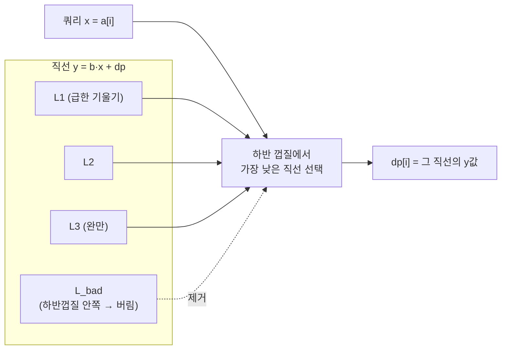

# 오늘의 주제: 컨벡스 헐 트릭 (Convex Hull Trick, CHT) — DP 최적화

> 언어: **Python**
> 한 줄 요약: `dp[i] = min_{j<i} ( dp[j] + b[j] * a[i] )` 처럼 **전이식이 쿼리 변수 `a[i]`에 대해 1차식**이면,
> 각 `j`를 직선으로 보고 "직선들의 하반 껍질(lower envelope)"에서 최솟값을 뽑아 **O(N²) → O(N)** 으로 줄인다.

---

## 1. 언제 쓰는가 — 형태 인식이 전부

DP 전이가 다음 꼴이면 CHT 후보다.

```
dp[i] = min ( dp[j] + b[j] * a[i] )     (j < i)
        j
```

`a[i]` 를 변수 `x` 로 보면, 각 `j` 는 직선

```
y = b[j] * x + dp[j]      (기울기 = b[j], 절편 = dp[j])
```

이고, `dp[i]` 는 **`x = a[i]` 에서 모든 직선 중 가장 낮은 값**이다.
즉 여러 직선 중 특정 x에서의 최솟값을 빠르게 구하는 문제로 바뀐다.

**핵심 통찰:** 특정 x에서 최솟값을 주는 직선들만 모으면 아래로 볼록한 **하반 껍질**을 이룬다.
안쪽에 묻힌(어떤 x에서도 최소가 안 되는) 직선은 버려도 된다.



---

## 2. 동작 원리 & 정당성

덱(deque)에 **하반 껍질을 이루는 직선만** 순서대로 유지한다.

- **직선 추가**: 새 직선 `L3` 를 넣을 때, 덱 끝의 `L2` 가 `L1`·`L3` 사이에서 쓸모없어지면(교점 순서가 뒤집히면) `L2` 를 뺀다.
  판정: `L2` 가 필요 없는 조건은
  `cross(L1, L3) ≤ cross(L1, L2)` — L1·L3의 교점이 L1·L2 교점보다 왼쪽이면 L2는 껍질 안쪽.
- **쿼리**: 쿼리 x가 **단조 증가**하면 앞쪽 직선은 다시 안 쓰이므로, 덱 앞에서 교점을 넘어선 직선을 pop 하며 포인터로 훑는다 → 전체 amortized O(N).

정당성: 기울기 순으로 정렬된 직선들의 minimum은 아래로 볼록(piecewise-linear convex) 함수라서, 각 직선이 최소가 되는 구간이 x축에서 서로 겹치지 않는 하나의 연속 구간이다. 그래서 교점 순서만 유지하면 껍질이 완성된다.

### 사용 조건 (전형적 O(N) 버전)
1. 추가되는 직선의 **기울기 `b[j]` 가 단조** (min이면 감소, max면 증가하게 세팅).
2. **쿼리 x `a[i]` 가 단조**.

둘 중 하나라도 단조가 아니면 → **덱 대신 이분 탐색**(O(N log N)) 또는 **Li Chao Tree**(임의 순서 삽입/쿼리, O(N log C)).

---

## 3. 대표 예제 — 백준 13263 "나무 자르기"

- 나무 N개. 높이 `a[i]`(증가, `a[0]=1`), 비용 계수 `b[i]`(감소, `b[N-1]=0`).
- 나무 i를 완전히 베려면 톱 충전이 필요. `dp[i]` = i번째 나무를 다 벨 때까지 최소 충전 비용.
- 전이: `dp[i] = min_{j<i} ( dp[j] + b[j] * a[i] )`, `dp[0] = 0`.

기울기 `b[j]` 는 감소, 쿼리 x = `a[i]` 는 증가 → **정석 CHT (min)**.

### 핵심 아이디어
- 직선 `L_j : y = b[j]·x + dp[j]` 를 하반 껍질에 추가.
- `dp[i]` = `x = a[i]` 에서 껍질의 최솟값.

### Python 풀이 (O(N))

```python
import sys
input = sys.stdin.readline

def solve():
    n = int(input())
    a = list(map(int, input().split()))
    b = list(map(int, input().split()))

    # 직선: (기울기 m, 절편 c) = (b[j], dp[j])
    # cross(l1, l2): 두 직선이 만나는 x
    def cross(l1, l2):
        m1, c1 = l1
        m2, c2 = l2
        # m1*x + c1 = m2*x + c2  ->  x = (c2 - c1) / (m1 - m2)
        return (c2 - c1) / (m1 - m2)

    dq = [(b[0], 0)]  # dp[0] = 0
    ptr = 0

    for i in range(1, n):
        x = a[i]
        # 쿼리 x 증가 → 앞쪽에서 최적 직선까지 포인터 전진
        if ptr >= len(dq):
            ptr = len(dq) - 1
        while ptr + 1 < len(dq) and cross(dq[ptr], dq[ptr + 1]) <= x:
            ptr += 1
        m, c = dq[ptr]
        dpi = m * x + c

        # 새 직선 (b[i], dp[i]) 추가 (기울기 감소 순)
        new = (b[i], dpi)
        while len(dq) >= 2 and cross(dq[-2], dq[-1]) >= cross(dq[-2], new):
            dq.pop()
            if ptr >= len(dq):     # 포인터가 잘려나간 위치면 되돌림
                ptr = len(dq) - 1
        dq.append(new)

    print(dpi)

solve()
```

> 정수 교점 비교로 안정성을 높이려면 `cross` 를 나눗셈 없이
> `(c2-c1)*(m1-m3) <= (c3-c1)*(m1-m2)` 꼴의 교차곱 부등식으로 바꾼다.
> (파이썬은 큰 정수를 그대로 다루니 오버플로 걱정은 없다.)

**시간복잡도:** 각 직선은 덱에 한 번 들어가고 한 번 나가며, 포인터도 한 방향 → **O(N)**.
정렬이 필요하면 O(N log N).

---

## 4. 재사용 템플릿 (min, 기울기 감소·쿼리 증가)

```python
class CHT:
    def __init__(self):
        self.dq = []      # (m, c) 기울기 감소 순
        self.ptr = 0

    @staticmethod
    def _cross(l1, l2):
        return (l2[1] - l1[1]) / (l1[0] - l2[0])

    def add(self, m, c):  # 기울기 m은 감소하는 순서로 넣기
        new = (m, c)
        dq = self.dq
        while len(dq) >= 2 and self._cross(dq[-2], dq[-1]) >= self._cross(dq[-2], new):
            dq.pop()
            if self.ptr >= len(dq):
                self.ptr = len(dq) - 1
        dq.append(new)

    def query(self, x):   # x는 증가하는 순서로 질의
        dq = self.dq
        if self.ptr >= len(dq):
            self.ptr = len(dq) - 1
        while self.ptr + 1 < len(dq) and self._cross(dq[self.ptr], dq[self.ptr + 1]) <= x:
            self.ptr += 1
        m, c = dq[self.ptr]
        return m * x + c
```

- **최댓값**을 원하면: 기울기를 증가 순으로 넣고 껍질 방향을 뒤집는다(부등호 반전). 또는 모든 값에 `-1`을 곱해 min으로 처리 후 결과 부호 복원.

---

## 5. 자주 하는 실수
- **min/max 껍질 방향 혼동**: min은 하반, max는 상반. 부등호 방향과 기울기 정렬 방향을 세트로 기억.
- **기울기 단조 조건 위반**: 기울기가 단조가 아니면 이 O(N) 코드는 틀린다 → 이분 탐색 버전이나 Li Chao Tree로.
- **쿼리 x 비단조**: 포인터 방식 대신 덱 전체에 대한 이분 탐색으로 질의(O(log N)).
- **기울기 동일한 직선**: 같은 기울기면 절편 작은 것(min)만 남겨야 함 — cross가 무한대/부호 이슈 나기 전에 처리.
- **포인터가 pop 위치보다 뒤로 밀림**: 직선 제거 시 `ptr`을 덱 크기 안으로 되돌려야 함(위 코드의 `if ptr >= len(dq)` 처리).

---

## 6. 확장 — 조건이 깨질 때
| 상황 | 방법 | 복잡도 |
|------|------|--------|
| 기울기 단조 + 쿼리 단조 | 덱 CHT (위 코드) | O(N) |
| 기울기 단조, 쿼리 비단조 | 덱 + 이분 탐색 | O(N log N) |
| 기울기·쿼리 모두 임의 | **Li Chao Tree** | O(N log C) |

Li Chao Tree는 값 범위를 세그먼트로 잡고 각 노드에 "그 구간에서 가장 낮은 직선"을 저장하는 방식으로, 삽입·쿼리를 임의 순서로 O(log C)에 처리한다. 조건이 까다로운 CHT 문제의 만능 대체제로 알아두면 좋다.
