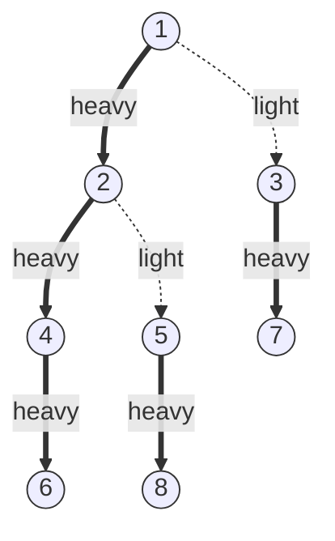

# HLD — 무거운-가벼운 분할 (Heavy-Light Decomposition)

> **오늘의 주제: HLD (Heavy-Light Decomposition)**
> 트리 위의 **경로 질의/갱신**(두 정점 u–v 사이 경로의 합·최댓값 등)을
> 세그먼트 트리로 처리할 수 있도록, 트리를 몇 개의 **연속한 체인**으로 분해하는 기법.
> **코테 언어는 Python.**

---

## 1. 왜 필요한가

세그먼트 트리는 **1차원 배열**의 구간 질의에 강하다. 그런데 트리에서
"정점 u와 v를 잇는 경로 위 값들의 합을 구하라", "그 경로의 모든 간선에 +k를 더하라"
같은 질의는 경로가 배열처럼 연속하지 않아 곧바로 쓸 수 없다.

**핵심 아이디어**: 트리를 **최대 O(log N)개의 세로 체인**으로 쪼갠다.
각 체인 안의 정점을 배열에서 **연속하게** 배치하면(오일러/DFS in-time),
u–v 경로는 "몇 개의 체인 구간"들의 합으로 표현된다.
경로가 지나는 체인 수가 O(log N)개이고, 각 체인 구간 질의가 O(log N)이므로
**질의 한 번당 O(log² N)**.

---

## 2. 무거운 간선 / 가벼운 간선

각 정점에서 자식 중 **서브트리 크기가 가장 큰 자식**으로 가는 간선을 **무거운(heavy) 간선**,
나머지를 **가벼운(light) 간선**이라 한다.

- 무거운 간선들을 이으면 트리가 **끊기지 않는 세로 체인**들로 덮인다.
- **정당성(왜 체인이 O(log N)개인가)**: 가벼운 간선을 타고 내려가면 서브트리 크기가
  **반 이하로 줄어든다**(더 큰 자식이 아니므로). 크기 N에서 반씩 줄면 최대 log N번.
  루트→임의 정점 경로에서 만나는 **가벼운 간선(=체인 전환)**은 O(log N)개.



굵은 `==` 이 무거운 간선(같은 체인), 점선 `-.` 이 가벼운 간선(체인 전환).
위 그림에서 체인은 `1-2-4-6`, `3-7`, `5-8` 로 분해된다.

---

## 3. 구성 단계 (2번의 DFS)

1. **dfs1 (크기 계산)**: 각 정점의 서브트리 크기 `size[]`, 부모 `par[]`, 깊이 `dep[]`,
   그리고 무거운 자식 `heavy[]`(가장 큰 서브트리 자식)를 구한다.
2. **dfs2 (체인 배치)**: 무거운 자식을 **먼저** 방문하며 DFS in-time `pos[]`를 매긴다.
   같은 체인의 정점은 `pos`가 연속하게 된다. `top[]`에는 그 정점이 속한 체인의 최상단을 기록.

이후 배열 `pos` 순서로 값을 세그먼트 트리에 올린다.

> 재귀 DFS는 파이썬에서 깊은 트리 시 `RecursionError` → **반복(iterative) DFS 권장** 또는
> `sys.setrecursionlimit` 상향 + `threading` 스택 확대.

---

## 4. 경로 질의 (u–v)

`top[u]` 와 `top[v]` 가 다른 동안, **체인 최상단이 더 깊은 쪽**을 끌어올린다.

```
while top[u] != top[v]:
    깊은 top 쪽(u라 하자) 처리: 세그 구간 [pos[top[u]], pos[u]] 질의
    u = par[top[u]]        # 한 체인 위로 점프
같은 체인이 됨 → [pos[u], pos[v]] 구간 질의   # (정점 기반이면 그대로, 간선 기반이면 +1)
```

- **정점 가중치**: 마지막에 `[min(pos[u],pos[v]), max(...)]` 전부 포함.
- **간선 가중치**: 간선을 "자식 정점"에 저장. 마지막 구간에서 **LCA 정점은 제외**
  (`pos`가 작은 쪽 +1). 그래서 코드에서 `+1` 처리에 주의.

---

## 5. 예제 1 — 백준 13510 트리와 쿼리 1

간선 가중치 트리. 두 질의: ① i번째 간선 가중치를 c로 변경, ② u–v 경로의 **최대 간선 가중치**.
→ **간선 기반 HLD + 최댓값 세그먼트 트리**.

- 핵심: 간선 (a,b) 를 **깊은 정점** 쪽에 저장. 경로 질의 시 LCA 정점은 간선이 아니므로 제외(+1).
- 시간복잡도: 질의당 **O(log² N)**, 총 **O((N+Q) log² N)**.
- 자주 하는 실수:
  - LCA 정점을 포함해 버려서 답이 커짐 → **간선 기반은 반드시 +1**.
  - dfs2에서 무거운 자식을 **먼저** 안 밟으면 체인이 연속하지 않음.

```python
import sys
input = sys.stdin.readline

def solve():
    N = int(input())
    g = [[] for _ in range(N + 1)]      # (이웃, 가중치, 간선인덱스)
    edges = []
    for i in range(N - 1):
        u, v, w = map(int, input().split())
        g[u].append((v, w, i)); g[v].append((u, w, i))
        edges.append((u, v, w))

    par = [0]*(N+1); dep = [0]*(N+1); size = [1]*(N+1)
    heavy = [0]*(N+1); ew = [0]*(N+1)   # ew[child] = 부모간선 가중치
    edge_child = [0]*(N-1)              # 간선 i가 저장된 자식 정점

    # ---- dfs1: 반복 DFS로 size/parent/depth/heavy ----
    order = []
    st = [(1, 0)]; visited=[False]*(N+1)
    while st:
        u, p = st.pop()
        if visited[u]: continue
        visited[u]=True; par[u]=p; order.append(u)
        for v,w,idx in g[u]:
            if v!=p:
                dep[v]=dep[u]+1; ew[v]=w; edge_child[idx]=v
                st.append((v,u))
    for u in reversed(order):           # 자식→부모 순으로 size 누적
        p=par[u]
        if p: size[p]+=size[u]
        # heavy 갱신
        if p and size[u] > size[heavy[p]]:
            heavy[p]=u

    # ---- dfs2: 체인 top / pos (무거운 자식 먼저) ----
    top=[0]*(N+1); pos=[0]*(N+1); timer=0
    # (정점, 체인top) 스택, 무거운 자식을 나중에 pop되도록 마지막에 push
    st=[(1,1)]
    base=[0]*(N+1)                      # pos순 초기값(가중치)
    while st:
        u, t = st.pop()
        top[u]=t; pos[u]=timer; base[timer]=ew[u]; timer+=1
        # 가벼운 자식들 먼저 push(나중에 처리), 무거운 자식 마지막 push(먼저 처리)
        light=[]
        for v,w,idx in g[u]:
            if v!=par[u] and v!=heavy[u]:
                light.append(v)
        for v in light:
            st.append((v, v))            # 새 체인 시작
        if heavy[u]:
            st.append((heavy[u], t))     # 같은 체인 유지 → 먼저 pop

    # ---- 최댓값 세그먼트 트리 ----
    sz=1
    while sz<N: sz<<=1
    seg=[0]*(2*sz)
    for i in range(N): seg[sz+i]=base[i]
    for i in range(sz-1,0,-1): seg[i]=max(seg[2*i],seg[2*i+1])
    def update(i,val):
        i+=sz; seg[i]=val; i>>=1
        while i: seg[i]=max(seg[2*i],seg[2*i+1]); i>>=1
    def query(l,r):                      # [l,r] 폐구간
        res=0; l+=sz; r+=sz+1
        while l<r:
            if l&1: res=max(res,seg[l]); l+=1
            if r&1: r-=1; res=max(res,seg[r])
            l>>=1; r>>=1
        return res

    def path_max(u,v):
        res=0
        while top[u]!=top[v]:
            if dep[top[u]]<dep[top[v]]: u,v=v,u
            res=max(res, query(pos[top[u]], pos[u]))
            u=par[top[u]]
        if u==v: return res
        if dep[u]>dep[v]: u,v=v,u
        res=max(res, query(pos[u]+1, pos[v]))   # 간선 기반 → LCA 제외(+1)
        return res

    out=[]
    Q=int(input())
    for _ in range(Q):
        a,b,c=map(int,input().split())
        if a==1:                          # 간선 b의 가중치를 c로
            update(pos[edge_child[b-1]], c)
        else:                             # b~c 경로 최대 간선
            out.append(str(path_max(b,c)))
    print('\n'.join(out))

solve()
```

---

## 6. 예제 2 — 백준 13511 트리와 쿼리 2 (경로 합 + k번째 정점)

같은 HLD 골격에서 **합 세그먼트 트리**로 바꾸면 "u–v 경로 가중치 합"을 O(log² N)에 얻는다.
`query`를 max→sum으로, `path_max`를 `path_sum`으로 바꾸면 끝(간선 기반 +1 동일).
"경로의 k번째 정점"은 LCA + 깊이 계산으로 위/아래 방향을 나눠 조상 점프(희소 테이블) 활용.

**핵심만 발췌 (합 버전 경로 질의):**

```python
def path_sum(u, v):
    res = 0
    while top[u] != top[v]:
        if dep[top[u]] < dep[top[v]]:
            u, v = v, u
        res += query(pos[top[u]], pos[u])   # 체인 구간 합
        u = par[top[u]]
    if u != v:
        if dep[u] > dep[v]:
            u, v = v, u
        res += query(pos[u] + 1, pos[v])    # 간선 기반: LCA 제외
    return res
```

---

## 7. 요약 · 체크리스트

- **쓸 때**: 트리 경로 위 구간 합/최대/갱신, 서브트리 질의(서브트리는 pos 연속이라 한 구간).
- **시간복잡도**: 전처리 O(N), 질의/갱신 **O(log² N)**.
- **정점 vs 간선**: 간선 가중치는 자식 정점에 저장하고 **경로 질의 시 LCA 정점 +1 제외**.
- **서브트리 질의**도 공짜: `[pos[u], pos[u] + size[u] - 1]` 한 구간.
- 파이썬은 **반복 DFS**로 재귀 한도 회피, 입력은 `sys.stdin`.
- LCA만 필요하면 HLD의 top 점프로도 O(log N) LCA를 구할 수 있다(희소 테이블 대체).
