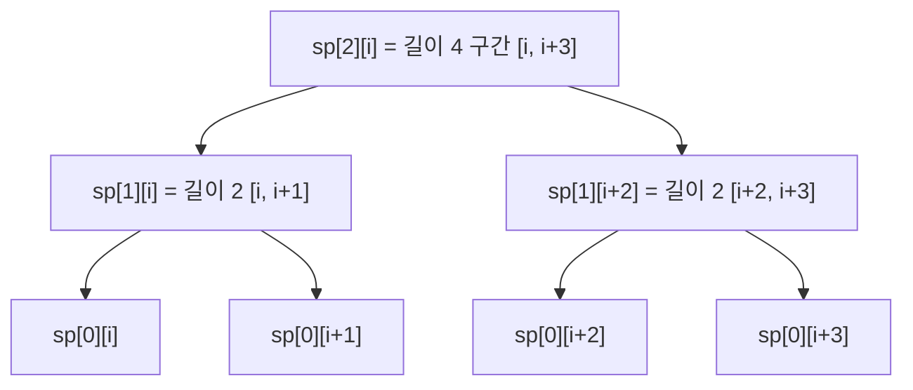

# 오늘의 주제: 희소 배열 (Sparse Table, 스파스 테이블)

> 언어: **Python**
> **변하지 않는(정적) 배열**에서 구간 질의를 O(1)/O(log N)에 답하는 전처리 기법. 세그먼트 트리보다 코드가 짧고 상수가 작다. 대신 **갱신이 없을 때만** 쓴다.

---

## 1. 핵심 아이디어 — "2의 거듭제곱 점프를 미리 계산해 둔다"

어떤 위치 `i`에서 **길이 2^j 만큼의 정보**를 미리 표 `sp[j][i]`에 채워두는 것이 전부다.

- `sp[0][i]` = 원소 하나 (길이 1)
- `sp[j][i]` = `i`부터 길이 `2^j` 구간의 답 = **길이 2^(j-1) 짜리 두 조각을 합친 것**

```
sp[j][i] = merge( sp[j-1][i], sp[j-1][i + 2^(j-1)] )
```

이 점화식이 **왜 성립하는가:** 길이 2^j 구간은 정확히 절반 지점에서 길이 2^(j-1) 짜리 두 구간으로 나뉜다. 각 절반은 이미 한 칸 아래 행에 계산돼 있으므로 O(1)에 합친다. 전처리는 `행 log N × 열 N` = **O(N log N)**.



---

## 2. 질의 두 방식 — 연산의 성질에 따라 갈린다

### (a) 멱등 연산 → O(1) 질의  (min, max, gcd, and, or)
겹쳐도 답이 안 변하는 연산(`min(x,x)=x`)이면, 구간 `[l, r]`을 **딱 맞는 두 조각으로 덮어서** 겹치는 걸 신경 안 써도 된다.

- 길이 `len = r - l + 1`, `k = floor(log2(len))`
- 답 = `merge( sp[k][l], sp[k][r - 2^k + 1] )` — 왼쪽 끝과 오른쪽 끝에서 각각 2^k 만큼. 가운데가 **겹쳐도** min/max/gcd는 결과가 같으니 OK.

> **주의:** 합(sum)은 멱등이 아니다 → 겹치면 두 번 더해져 틀린다. 합 구간질의는 **누적합**을 쓰거나, 아래 (b)처럼 겹치지 않게 log개 조각으로 나눠야 한다.

### (b) 결합만 되는 연산 → O(log N) 질의
길이를 이진 분해해 **겹치지 않는** 조각들로 이어붙인다. 함수 합성·이진 점프(다음 절)가 이 방식.

---

## 3. 대표 예제 1 — 정적 구간 최솟값 RMQ (백준 10868 최솟값)

N개 수, M개 질의. 각 질의 `[a, b]`의 최솟값. **갱신 없음** → 스파스 테이블의 정석.

```python
import sys
from math import log2

def main():
    input = sys.stdin.readline
    N, M = map(int, input().split())
    arr = [int(input()) for _ in range(N)]

    LOG = N.bit_length()            # 2^LOG > N 보장
    sp = [[0] * N for _ in range(LOG)]
    sp[0] = arr[:]                  # 길이 1
    for j in range(1, LOG):
        half = 1 << (j - 1)
        for i in range(N - (1 << j) + 1):
            sp[j][i] = min(sp[j-1][i], sp[j-1][i + half])

    # log2 테이블 미리 계산 (질의마다 log2 호출 안 하려고)
    lg = [0] * (N + 1)
    for x in range(2, N + 1):
        lg[x] = lg[x >> 1] + 1

    out = []
    for _ in range(M):
        a, b = map(int, input().split())
        l, r = a - 1, b - 1          # 0-indexed
        k = lg[r - l + 1]
        out.append(min(sp[k][l], sp[k][r - (1 << k) + 1]))
    print('\n'.join(map(str, out)))

main()
```

- **핵심 아이디어:** min은 멱등 → 두 조각이 겹쳐도 정답. 질의 O(1).
- **시간복잡도:** 전처리 O(N log N), 질의 O(1). 전체 O(N log N + M).
- **자주 하는 실수:**
  - `for i in range(N - (1<<j) + 1)` — 오른쪽 경계를 넘지 않게 상한을 줄여야 함. 안 그러면 인덱스 초과.
  - `lg` 테이블 없이 매 질의마다 `int(log2(...))` 호출 → 느리고 부동소수점 오차로 경계에서 틀릴 수 있음. **정수 테이블 권장.**

---

## 4. 대표 예제 2 — 함수 이진 점프 (백준 17435 합성함수와 쿼리)

`f: {1..M} → {1..M}` 가 주어지고, 질의 `(n, x)` = `f`를 **n번 합성**한 `f^n(x)`. n이 최대 5×10^8 → 하나씩 따라가면 TLE. **"위치의 스파스 테이블"** 로 2의 거듭제곱 점프를 미리 만든다.

```python
import sys

def main():
    input = sys.stdin.readline
    M = int(input())
    f = [0] + list(map(int, input().split()))   # 1-indexed

    LOG = 19                                     # 2^19 > 5e8
    up = [[0] * (M + 1) for _ in range(LOG)]
    up[0] = f[:]                                 # 1번 점프
    for j in range(1, LOG):
        for x in range(1, M + 1):
            up[j][x] = up[j-1][up[j-1][x]]       # 2^j 점프 = 2^(j-1) 두 번

    Q = int(input())
    out = []
    for _ in range(Q):
        n, x = map(int, input().split())
        for j in range(LOG):                     # n의 켜진 비트마다 점프
            if n & (1 << j):
                x = up[j][x]
        out.append(x)
    print('\n'.join(map(str, out)))

main()
```

- **핵심 아이디어:** `f^(2^j) = f^(2^(j-1)) ∘ f^(2^(j-1))`. n을 이진 분해해 켜진 비트만큼만 점프 → 질의 O(log n). 이게 **LCA의 이진 점프(binary lifting)와 완전히 같은 뼈대**다 (부모를 따라 올라가는 것 = f를 따라가는 것).
- **시간복잡도:** 전처리 O(M log N), 질의 O(log n).
- **자주 하는 실수:** LOG를 최댓값 n 기준으로 잡아야 함 (5×10^8 → 2^29 ≈ 5.4e8, 넉넉히 19~30). 배열 크기와 헷갈리지 말 것 — 여기 LOG는 **점프 횟수의 log**.

---

## 5. 언제 쓰나 — 세그먼트 트리와 비교

| | 스파스 테이블 | 세그먼트 트리 |
|---|---|---|
| 갱신 | ❌ (정적 전용) | ✅ O(log N) |
| min/max/gcd 질의 | **O(1)** | O(log N) |
| 합/구간갱신 | 부적합(멱등 아님) | ✅ |
| 코드 길이 | 짧음 | 김 |
| 메모리 | O(N log N) | O(N) |

**결론:** 배열이 안 변하고 min·max·gcd 같은 멱등 질의만 많다면 스파스 테이블이 가장 빠르고 단순하다. 갱신이 섞이면 세그먼트 트리로 가야 한다. 함수 합성·트리 조상 질의(LCA)는 스파스 테이블 뼈대(이진 점프)를 그대로 쓴다.

---

## Python 템플릿 (멱등 구간 질의 O(1))

```python
class SparseTable:
    def __init__(self, arr, op=min):
        self.op = op
        n = len(arr)
        self.lg = [0] * (n + 1)
        for x in range(2, n + 1):
            self.lg[x] = self.lg[x >> 1] + 1
        LOG = n.bit_length()
        self.sp = [arr[:]]
        for j in range(1, LOG):
            half = 1 << (j - 1)
            prev = self.sp[j - 1]
            self.sp.append([op(prev[i], prev[i + half])
                            for i in range(n - (1 << j) + 1)])

    def query(self, l, r):               # [l, r] 폐구간, 0-indexed
        k = self.lg[r - l + 1]
        return self.op(self.sp[k][l], self.sp[k][r - (1 << k) + 1])
```
