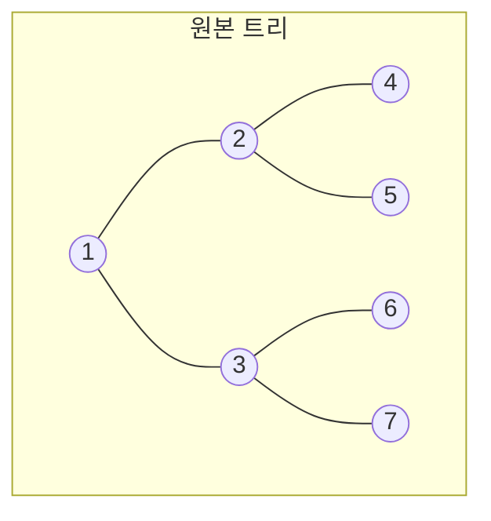
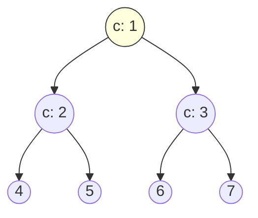

# 오늘의 주제: 센트로이드 분할 (Centroid Decomposition)

> 트리를 **무게중심(centroid)** 기준으로 재귀 분할해, "모든 경로"에 대한 질의를 $O(N \log N)$ 계열로 처리하는 분할 정복 기법.
> HLD·LCA·트리 DP가 "고정된 트리 위의 경로/서브트리"를 다뤘다면, 센트로이드 분할은 **트리 자체를 잘게 쪼개** 경로 문제를 정복한다.

---

## 1. 핵심 아이디어 — 왜 무게중심인가

트리에서 **모든 정점쌍 경로**를 생각하면 $O(N^2)$ 개다. 이걸 그대로 세면 느리다.
대신 이렇게 나눈다:

> 어떤 정점 $c$ 를 정하면, 트리의 모든 경로는 **(a) $c$ 를 지나는 경로** 또는 **(b) $c$ 를 제거했을 때 생기는 부분트리 안에 완전히 들어가는 경로** 둘 중 하나다.

- (a)는 "$c$ 를 지나는 경로"만 처리 → 각 정점에서 $c$ 까지 거리를 재서 조합.
- (b)는 각 부분트리에 대해 **재귀**.

이때 $c$ 를 **무게중심**으로 잡으면, $c$ 제거 후 생기는 모든 부분트리의 크기가 $\le N/2$ 가 보장된다. → 재귀 깊이 $O(\log N)$.

**무게중심 정의**: 그 정점을 지웠을 때 남는 최대 부분트리 크기가 최소가 되는 정점.
동치로 — 모든 부분트리 크기 $\le N/2$ 인 정점 (항상 존재, 최대 2개).

### 정당성 (재귀 깊이 log N)
매 단계에서 조각 크기가 절반 이하로 줄기 때문에, 한 정점이 속하는 센트로이드 트리의 깊이는 $O(\log N)$. 각 레벨에서 전체 정점을 한 번씩 훑으므로 총 작업량 $O(N \log N)$ (경로 처리 비용 제외).



위 트리(7개)의 무게중심은 1번. 지우면 {2,4,5}, {3,6,7} 두 조각(각 3개 ≤ 3)으로 나뉜다. 각 조각의 무게중심을 다시 고르면:



이렇게 만들어진 **센트로이드 트리**는 높이 $O(\log N)$ 이다.

---

## 2. 무게중심 찾기 & 분할 골격

핵심 3단계:
1. `get_size(v)` — 현재 조각의 서브트리 크기 계산.
2. `get_centroid(v)` — 크기 절반 넘는 자식으로 계속 내려가 무게중심 찾기.
3. 무게중심 처리 → **제거 표시(used)** → 각 이웃 조각으로 재귀.

```python
import sys
from sys import setrecursionlimit

def solve():
    input = sys.stdin.readline
    setrecursionlimit(300000)
    N = int(input())
    g = [[] for _ in range(N + 1)]
    for _ in range(N - 1):
        u, v, w = map(int, input().split())
        g[u].append((v, w))
        g[v].append((u, w))

    used = [False] * (N + 1)   # 이미 센트로이드로 제거된 정점
    sz = [0] * (N + 1)

    def get_size(v, p):
        sz[v] = 1
        for nx, _ in g[v]:
            if nx != p and not used[nx]:
                sz[v] += get_size(nx, v)
        return sz[v]

    def get_centroid(v, p, tot):
        for nx, _ in g[v]:
            if nx != p and not used[nx]:
                if sz[nx] > tot // 2:      # 절반 초과 자식 쪽으로 이동
                    return get_centroid(nx, v, tot)
        return v

    def decompose(entry):
        tot = get_size(entry, -1)
        c = get_centroid(entry, -1, tot)
        used[c] = True

        # --- 여기서 c 를 지나는 경로들을 처리 (문제마다 다름) ---
        process(c)

        for nx, _ in g[c]:
            if not used[nx]:
                decompose(nx)

    decompose(1)
```

- **시간복잡도**: 무게중심 트리 깊이 $O(\log N)$ × 각 레벨 정점 방문 $O(N)$ = **$O(N \log N)$** (경로 처리 비용은 별도로 더해짐).

---

## 3. 대표 예제 — 트리에서 길이 K 이하 경로 세기

**문제 유형**: 가중치 트리에서 경로 길이(간선 가중치 합)가 $K$ 이하인 정점쌍 $(u,v)$ 의 개수. (백준 1206 "트리 위의 K 경로" 계열 / IOI Race와 사촌)

**아이디어**: 센트로이드 $c$ 를 지나는 경로만 세고 재귀.
$c$ 를 지나는 경로 = "$c$ 로부터의 거리 배열"에서 두 원소 합 $\le K$ 인 쌍의 수. 정렬 + 투 포인터로 $O(m \log m)$.
단, **같은 부분트리 안에서만 만들어진 쌍**은 $c$ 를 안 지나므로 빼줘야 한다(포함배제).

```python
def count_pairs(dists, K):
    """정렬된 거리 배열에서 합 <= K 인 쌍의 개수 (투 포인터)"""
    dists.sort()
    lo, hi, cnt = 0, len(dists) - 1, 0
    while lo < hi:
        if dists[lo] + dists[hi] <= K:
            cnt += hi - lo      # lo와 (lo+1..hi) 모두 성립
            lo += 1
        else:
            hi -= 1
    return cnt

def process(c):
    global answer
    all_d = [0]                 # c 자기 자신(거리 0) 포함 → c에서 끝나는 경로도 셈
    for nx, w in g[c]:
        if used[nx]:
            continue
        sub = []
        collect_dist(nx, c, w, sub)   # DFS로 c로부터 거리 수집
        # 같은 서브트리 쌍은 c를 안 지남 → 빼기 (포함배제)
        answer -= count_pairs(sub[:], K)
        all_d.extend(sub)
    answer += count_pairs(all_d, K)     # 전체에서 성립 쌍 - 같은 서브트리 쌍

def collect_dist(v, p, d, out):
    out.append(d)
    for nx, w in g[v]:
        if nx != p and not used[nx]:
            collect_dist(nx, v, d + w, out)
```

- **핵심**: `전체 쌍 - 같은 서브트리 쌍` = $c$ 를 진짜 지나는 쌍.
- **거리 0 포함**: `all_d = [0]` 으로 시작하면 한쪽 끝이 $c$ 인 경로도 자동으로 카운트.
- **시간복잡도**: 레벨마다 정렬 $O(m \log m)$ → 전체 **$O(N \log^2 N)$**.

---

## 4. 자주 하는 실수

- **`used` 갱신 누락**: 무게중심 제거 후 `used[c]=True` 를 빼먹으면 재귀가 같은 조각을 무한 반복 → TLE/RecursionError.
- **`get_size` 를 재귀 전마다 다시 호출 안 함**: 조각이 바뀔 때마다 크기를 새로 재야 무게중심이 정확. 한 번 잰 값 재사용 금지.
- **포함배제 누락**: 같은 서브트리 내부 쌍을 안 빼면 $c$ 를 안 지나는 경로가 중복/과다 카운트.
- **재귀 한도**: 편향 트리에서 `get_size`/`collect_dist` DFS 깊이가 $O(N)$ → `setrecursionlimit` 상향 또는 반복(iterative) DFS 필요.
- **무게중심 이동 조건**: `sz[nx] > tot // 2` 에서 `tot`은 **현재 조각의 크기**(직전 `get_size` 반환값). 전역 $N$ 을 쓰면 틀림.

---

## 5. Python 템플릿 (재사용용 골격)

```python
import sys
input = sys.stdin.readline
sys.setrecursionlimit(300000)

def centroid_decomposition(N, g):
    used = [False] * (N + 1)
    sz = [0] * (N + 1)

    def get_size(v, p):
        sz[v] = 1
        for nx, _ in g[v]:
            if nx != p and not used[nx]:
                sz[v] += get_size(nx, v)
        return sz[v]

    def get_centroid(v, p, tot):
        for nx, _ in g[v]:
            if nx != p and not used[nx] and sz[nx] > tot // 2:
                return get_centroid(nx, v, tot)
        return v

    def decompose(entry):
        tot = get_size(entry, -1)
        c = get_centroid(entry, -1, tot)
        used[c] = True
        process(c)                     # <-- 문제별 로직
        for nx, _ in g[c]:
            if not used[nx]:
                decompose(nx)

    decompose(1)
```

**언제 쓰나**
- "트리 위 **모든 경로**"에 대한 카운팅/최솟값/조건 만족 쌍 (길이 K 이하, 특정 색 조합 등).
- 정점에 대한 오프라인 쿼리(근접 갱신·질의)에서 각 정점을 $O(\log N)$ 개 센트로이드에 등록해 처리.
- HLD가 "경로를 세그트리로" 다룬다면, 센트로이드는 "경로 집계를 분할정복으로".
