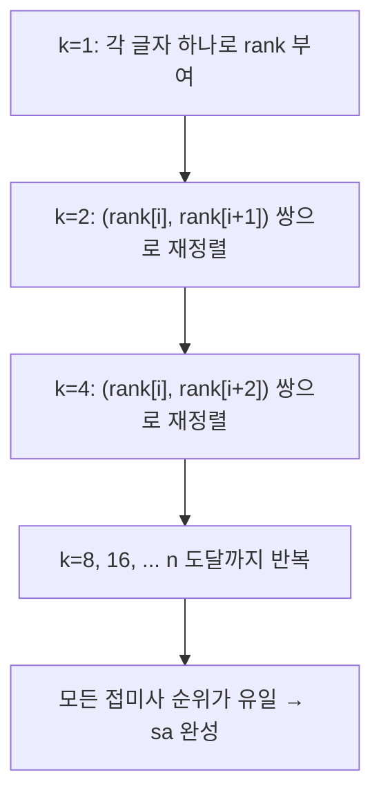

# 오늘의 주제: 접미사 배열 (Suffix Array) + LCP 배열 (Kasai)

> 문자열의 **모든 접미사를 사전순으로 정렬**한 인덱스 배열.
> "이 문자열 안에서 반복되는/서로 다른 부분 문자열"류 문제의 핵심 도구.
> KMP·아호코라식·매내처가 "특정 패턴"을 다뤘다면, 접미사 배열은 **문자열 자기 자신의 모든 부분 문자열**을 한 번에 다룬다.

---

## 1. 접미사 배열이란?

문자열 `S = "banana"` (길이 n=6)의 접미사는 6개:

| 시작 index | 접미사 |
|---|---|
| 0 | banana |
| 1 | anana |
| 2 | nana |
| 3 | ana |
| 4 | na |
| 5 | a |

이 접미사들을 **사전순 정렬**한 뒤, "정렬된 순서대로 시작 index를 나열"한 것이 **접미사 배열 `sa`**:

```
정렬 결과            시작 index
a          →  5
ana        →  3
anana      →  1
banana     →  0
na         →  4
nana       →  2
```

→ `sa = [5, 3, 1, 0, 4, 2]`

**핵심 아이디어**: 어떤 문자열의 모든 부분 문자열(substring)은 **어떤 접미사의 접두사(prefix)** 다. 접미사를 정렬해 두면, 사전순으로 인접한 부분 문자열끼리 뭉쳐서 이분탐색·LCP 활용이 가능해진다.

---

## 2. 왜 정렬을 그냥 `sorted`로 하면 안 되나?

```python
sa = sorted(range(n), key=lambda i: S[i:])   # ❌ 함정
```

`S[i:]` 슬라이싱이 O(n), 비교도 O(n), 정렬 O(n log n) → 최악 **O(n² log n)**.
n=1e5 이상이면 TLE. 그래서 **O(n log n)** 배가(doubling) 기법을 쓴다.

---

## 3. O(n log n) 배가(Doubling) 알고리즘

**아이디어**: 길이 `k` 기준 정렬 순위(rank)를 알고 있으면, 길이 `2k` 정렬은
"(앞 k글자 rank, 뒤 k글자 rank)" 두 정수쌍 비교로 O(1)에 할 수 있다.
k를 1 → 2 → 4 → ... 로 두 배씩 늘리며 log n 번 정렬한다.



각 단계 정렬 O(n log n), 단계 수 O(log n) → 전체 **O(n log² n)**.
(계수 정렬로 바꾸면 O(n log n)이지만, 코테는 log²n 구현으로 대부분 통과.)

### Python 템플릿 — 접미사 배열

```python
def build_suffix_array(s):
    n = len(s)
    sa = list(range(n))
    rank = [ord(c) for c in s]        # k=1: 글자 아스키값이 곧 rank
    tmp = [0] * n
    k = 1
    while k < n:
        # (현재 rank[i], k칸 뒤 rank[i+k]) 쌍으로 정렬. 뒤가 없으면 -1
        key = lambda i: (rank[i], rank[i + k] if i + k < n else -1)
        sa.sort(key=key)
        # 정렬 결과로 새 rank 부여 (같은 쌍이면 같은 rank)
        tmp[sa[0]] = 0
        for i in range(1, n):
            tmp[sa[i]] = tmp[sa[i - 1]] + (key(sa[i]) > key(sa[i - 1]))
        rank = tmp[:]
        if rank[sa[-1]] == n - 1:     # 모든 rank가 유일해지면 종료
            break
        k <<= 1
    return sa
```

- **시간복잡도**: O(n log² n)
- **자주 하는 실수**
  - `i+k < n` 경계 체크 누락 → IndexError 또는 오정렬.
  - 새 rank 부여 시 `key(sa[i]) > key(sa[i-1])`로 "다르면 +1" 처리를 빼먹으면 중복 rank가 안 갈라진다.
  - `rank = tmp[:]` 로 **복사**해야 함. `rank = tmp` 로 두면 다음 루프에서 같은 리스트를 공유해 오염.

---

## 4. LCP 배열 (Kasai 알고리즘, O(n))

**LCP[i]** = 접미사 배열에서 `sa[i]` 와 **바로 앞** `sa[i-1]` 의 **최장 공통 접두사 길이**
(Longest Common Prefix). `LCP[0]`은 정의상 0.

`banana`, `sa = [5,3,1,0,4,2]`:

| i | sa[i] | 접미사 | LCP[i] (앞과 공통 접두사) |
|---|---|---|---|
| 0 | 5 | a | 0 |
| 1 | 3 | ana | 1 (`a`) |
| 2 | 1 | anana | 3 (`ana`) |
| 3 | 0 | banana | 0 |
| 4 | 4 | na | 0 |
| 5 | 2 | nana | 2 (`na`) |

**Kasai의 핵심 통찰**: 원문 index 순서(i, i+1, ...)로 접미사를 훑으면,
"index i 접미사의 LCP는 index i-1 접미사의 LCP보다 최대 1만 줄어든다."
→ 매번 0부터 세지 않고 `h`를 이어받아 총 **O(n)**.

```python
def build_lcp(s, sa):
    n = len(s)
    rank = [0] * n
    for i in range(n):
        rank[sa[i]] = i          # 접미사 i가 sa에서 몇 번째인지
    lcp = [0] * n
    h = 0
    for i in range(n):           # 원문 index 순서로 순회
        if rank[i] > 0:
            j = sa[rank[i] - 1]  # 사전순 바로 앞 접미사의 시작 index
            while i + h < n and j + h < n and s[i + h] == s[j + h]:
                h += 1
            lcp[rank[i]] = h
            if h:
                h -= 1           # 다음 접미사로 넘어갈 때 최대 1 감소
        else:
            h = 0
    return lcp
```

- **시간복잡도**: O(n) — `h`가 전체에서 최대 2n번만 변하므로.
- **왜 `h -= 1`?**: 접미사 `i`가 앞 접미사와 h글자 겹쳤다면, 한 글자 짧은 접미사 `i+1`은 최소 `h-1`글자는 이미 겹침이 보장된다. 그래서 그 지점부터 이어서 세면 된다.

---

## 5. 대표 예제

### 예제 A — BOJ 11656 접미사 배열 (기본)

문자열이 주어지면 접미사를 사전순 정렬해 출력.

```python
import sys
s = sys.stdin.readline().strip()
sa = build_suffix_array(s)
print('\n'.join(s[i:] for i in sa))
```

### 예제 B — BOJ 3033 가장 긴 문자열 (반복되는 최장 부분 문자열)

"두 번 이상 등장하는 가장 긴 부분 문자열의 길이"를 구하라.

**핵심 아이디어**: 두 번 이상 나오는 부분 문자열 = **서로 다른 두 접미사가 공유하는 접두사**.
정렬된 접미사 배열에서 그런 공유 접두사는 반드시 **인접한 두 접미사** 사이에서 최대가 된다.
→ 답은 그냥 `max(LCP)`.

```python
import sys
s = sys.stdin.readline().strip()
sa = build_suffix_array(s)
lcp = build_lcp(s, sa)
print(max(lcp))
```

- 시간복잡도: O(n log² n) (SA 구성이 지배)

### 예제 C — BOJ 11479 서로 다른 부분 문자열의 개수 2

문자열의 **서로 다른 부분 문자열(중복 제외)의 개수**를 구하라.

**핵심 아이디어**:
- 전체 부분 문자열(접두사 관점)의 개수는 각 접미사마다 `(그 접미사 길이)` 개 → 합은 `n + (n-1) + ... + 1 = n(n+1)/2`.
- 하지만 **인접 접미사가 공유하는 접두사(LCP)** 는 중복 계산된 것.
- 따라서 정답 = `n(n+1)/2 - Σ LCP[i]`.

```python
import sys
s = sys.stdin.readline().strip()
n = len(s)
sa = build_suffix_array(s)
lcp = build_lcp(s, sa)
total = n * (n + 1) // 2 - sum(lcp)
print(total)
```

---

## 6. 언제 쓰나 / 정리

- **쓰는 상황**
  - "가장 긴 반복 부분 문자열" → `max(LCP)`
  - "서로 다른 부분 문자열 개수" → `n(n+1)/2 - sum(LCP)`
  - 여러 패턴을 정렬된 접미사에 **이분탐색**으로 검색 (사전 자료구조 대용)
  - 두 문자열의 최장 공통 부분 문자열 (구분자 `$`로 이어 붙인 뒤 서로 다른 원본 출신 인접 접미사의 LCP)
- **주의점**
  - Python 순수 `sort` 기반 O(n log² n)은 n ≤ 약 2~5×10⁵ 에서 안전. 그 이상은 계수정렬 버전이나 PyPy 고려.
  - LCP는 **인접 접미사끼리만** 정의됨. 임의의 두 접미사 LCP는 그 구간 LCP의 **최솟값**(스파스 테이블로 RMQ) — 앞서 배운 희소 배열과 결합 가능.
- **한 줄 요약**: 접미사 배열은 "부분 문자열 세계의 정렬된 목차", LCP는 그 목차의 "이웃 간 겹침"이다.
```

---

## Python 전체 템플릿 (복붙용)

```python
def build_suffix_array(s):
    n = len(s)
    sa = list(range(n))
    rank = [ord(c) for c in s]
    tmp = [0] * n
    k = 1
    while k < n:
        key = lambda i: (rank[i], rank[i + k] if i + k < n else -1)
        sa.sort(key=key)
        tmp[sa[0]] = 0
        for i in range(1, n):
            tmp[sa[i]] = tmp[sa[i - 1]] + (key(sa[i]) > key(sa[i - 1]))
        rank = tmp[:]
        if rank[sa[-1]] == n - 1:
            break
        k <<= 1
    return sa

def build_lcp(s, sa):
    n = len(s)
    rank = [0] * n
    for i in range(n):
        rank[sa[i]] = i
    lcp = [0] * n
    h = 0
    for i in range(n):
        if rank[i] > 0:
            j = sa[rank[i] - 1]
            while i + h < n and j + h < n and s[i + h] == s[j + h]:
                h += 1
            lcp[rank[i]] = h
            if h:
                h -= 1
        else:
            h = 0
    return lcp
```
