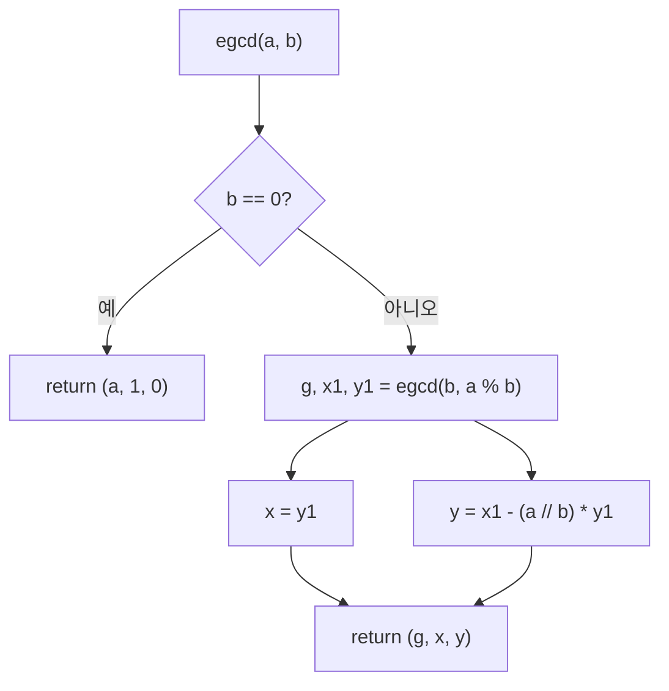

# 오늘의 주제: 모듈러 산술 — 확장 유클리드 · 곱셈 역원 · 중국인의 나머지 정리(CRT)

> 코테 언어: **Python**

정수론의 실전 3종 세트. 나눗셈이 없는 모듈러 세계에서 "나누기"를 하는 법(역원), 그리고 서로 다른 나머지 조건을 하나로 합치는 법(CRT)을 다룬다. 조합론(nCr mod p), 해시, 여러 mod 복원 문제에서 반복적으로 등장한다.

---

## 1. 확장 유클리드 호제법 (Extended Euclidean)

일반 유클리드는 `gcd(a, b)` 값만 구한다. 확장 버전은 **베주 항등식**의 계수까지 구한다:

$$a x + b y = \gcd(a, b)$$

를 만족하는 정수 `(x, y)`를 반환한다.

### 왜 동작하는가
`gcd(a, b) = gcd(b, a mod b)` 라는 재귀 구조를 그대로 계수에 전파한다. 바닥(`b = 0`)에서는 `a·1 + 0·0 = a = gcd` 이 자명하고, 되돌아 올라오면서 계수를 갱신한다.

`gcd(b, a % b) = b·x1 + (a % b)·y1` 이 성립할 때, `a % b = a - (a//b)·b` 를 대입하면:

$$b x_1 + (a - \lfloor a/b \rfloor b) y_1 = a\,y_1 + b\,(x_1 - \lfloor a/b \rfloor y_1)$$

즉 `x = y1`, `y = x1 - (a//b)·y1`.



```python
def egcd(a, b):
    if b == 0:
        return a, 1, 0          # a*1 + 0*0 = a = gcd
    g, x1, y1 = egcd(b, a % b)
    return g, y1, x1 - (a // b) * y1
```

- **시간복잡도:** O(log(min(a, b))) — 유클리드와 동일.
- **자주 하는 실수:** 반환하는 `(x, y)`가 음수일 수 있다. 특정 범위의 해가 필요하면 `x % (b//g)` 로 정규화해야 한다.

---

## 2. 모듈러 곱셈 역원 (Modular Inverse)

`a * x ≡ 1 (mod m)` 을 만족하는 `x`가 `a`의 역원. 존재 조건은 **`gcd(a, m) = 1`** (서로소).

### 방법 A — 확장 유클리드 (m이 소수가 아니어도 OK)
`a·x + m·y = 1` 에서 `x`가 곧 역원.

```python
def modinv(a, m):
    g, x, _ = egcd(a % m, m)
    if g != 1:
        return None             # 역원 없음 (서로소 아님)
    return x % m
```

### 방법 B — 페르마 소정리 (m이 소수일 때만)
`m`이 소수면 `a^(m-1) ≡ 1` 이므로 `a^(m-2)` 가 역원. Python `pow`는 빠른 거듭제곱이 내장.

```python
inv = pow(a, m - 2, m)          # m이 소수일 때
# Python 3.8+ : pow(a, -1, m) 로 서로소면 바로 역원 (m 소수 아니어도 OK)
inv = pow(a, -1, m)
```

> 실전 팁: **Python 3.8+에서는 `pow(a, -1, m)` 한 줄**이면 끝. `egcd`를 손으로 짤 일은 CRT 같은 경우로 줄어든다.

- **자주 하는 실수:** 서로소가 아닌데 역원을 구하려는 것 → `None`/에러 처리 필수. `nCr mod p`에서 `p`가 소수인지 확인하고 페르마를 쓸지 결정.

---

## 3. 중국인의 나머지 정리 (CRT)

여러 개의 합동식을 하나로 합친다:

$$x \equiv r_1 \pmod{m_1}, \quad x \equiv r_2 \pmod{m_2}, \dots$$

각 `m_i`가 **쌍마다 서로소**면, `M = m_1 m_2 \cdots` 에 대해 `[0, M)` 범위에 **유일한 해**가 존재한다.

### 핵심 아이디어 (2개 합치기 → 반복)
두 식 `x ≡ r1 (mod m1)`, `x ≡ r2 (mod m2)` 을 합칠 때:
`x = r1 + m1·t` 로 놓고 두 번째 식에 넣으면 `m1·t ≡ r2 - r1 (mod m2)`.
`t ≡ (r2 - r1)·inv(m1, m2) (mod m2)` 로 풀어 `x`를 얻고, 새 모듈러는 `lcm(m1, m2)`.

```python
def crt(remainders, moduli):
    r0, m0 = 0, 1               # 항등: x ≡ 0 (mod 1)
    for r, m in zip(remainders, moduli):
        g, p, _ = egcd(m0, m)
        diff = r - r0
        if diff % g != 0:
            return None         # 해 없음 (서로소 아니고 조건 충돌)
        lcm = m0 // g * m
        # m0*p ≡ g (mod m) → 보정
        t = (diff // g * p) % (m // g)
        r0 = (r0 + m0 * t) % lcm
        m0 = lcm
    return r0                   # [0, lcm) 의 유일 해
```

- **시간복잡도:** O(k · log M), k는 식의 개수.
- **주의점:** 위 구현은 `m_i`가 서로소가 아니어도 동작한다(일반화된 CRT). 서로소 보장이 있으면 `g == 1`이라 항상 해가 있다. 큰 수는 Python 정수라 오버플로 걱정 없음.

---

## 대표 예제

### 예제 1 — 백준 14565 «역원(Inverse) 구하기»
`N`, `A`가 주어질 때 `A`의 덧셈역원(`N - A`)과 곱셈역원(`A·x ≡ 1 mod N`)을 출력. `N`이 소수라는 보장이 없으므로 **확장 유클리드**를 써야 한다.

```python
import sys
def egcd(a, b):
    if b == 0: return a, 1, 0
    g, x1, y1 = egcd(b, a % b)
    return g, y1, x1 - (a // b) * y1

n, a = map(int, sys.stdin.readline().split())
add_inv = (n - a) % n
_, x, _ = egcd(a, n)
mul_inv = x % n
print(add_inv, mul_inv)
```

### 예제 2 — 백준 1476 «날짜 계산» (CRT의 전형)
지구(E:1~15), 태양(S:1~28), 달(M:1~19) 주기가 각각 주어진 상태로 시작해, 세 조건을 동시에 만족하는 최소 연도를 찾는 문제. 사실상 CRT.

```python
E, S, M = map(int, input().split())
# x ≡ E-1 (mod 15), x ≡ S-1 (mod 28), x ≡ M-1 (mod 19), 답은 x+1
# 15, 28, 19 는 서로소 → 유일해 존재
x = crt([E-1, S-1, M-1], [15, 28, 19])
print(x + 1)
```

(주기가 서로소라 완전탐색으로도 풀리지만, 모듈러가 커지면 CRT가 정석.)

---

## Python 템플릿 (통합)

```python
def egcd(a, b):
    if b == 0:
        return a, 1, 0
    g, x1, y1 = egcd(b, a % b)
    return g, y1, x1 - (a // b) * y1

def modinv(a, m):               # 서로소면 역원, 아니면 None
    g, x, _ = egcd(a % m, m)
    return x % m if g == 1 else None

def crt(rs, ms):                # 일반화 CRT (서로소 아니어도 OK)
    r0, m0 = 0, 1
    for r, m in zip(rs, ms):
        g, p, _ = egcd(m0, m)
        if (r - r0) % g != 0:
            return None
        lcm = m0 // g * m
        r0 = (r0 + m0 * ((r - r0) // g * p % (m // g))) % lcm
        m0 = lcm
    return r0

# 소수 mod 에서는 그냥: pow(a, -1, p)  또는  pow(a, p-2, p)
```

## 한 줄 요약
- **확장 유클리드**: `ax + by = gcd` 계수까지 뽑아낸다. 역원·CRT의 뼈대.
- **역원**: 소수 mod → `pow(a, -1, m)`, 아니면 확장 유클리드.
- **CRT**: 여러 나머지 조건을 `lcm` 하나로 합친다. 서로소면 유일해 보장.
