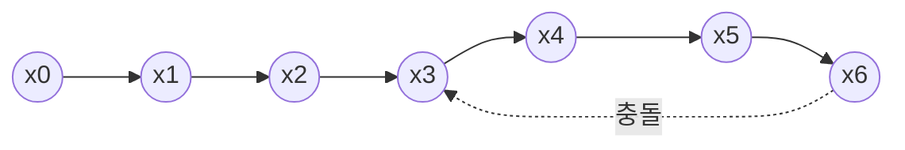

# 밀러-라빈 소수판정 & 폴라드 로 소인수분해

> **오늘의 주제:** 큰 수(최대 약 10^18)에 대한 **확률적 소수판정(Miller-Rabin)** 과 **빠른 소인수분해(Pollard's rho)**.
> 시험용 언어는 **Python**.

---

## 왜 필요한가

- `N`이 10^6 정도면 `2 ~ √N`까지 시험 나눗셈(trial division)으로 소수판정·소인수분해가 충분하다. → O(√N)
- 하지만 `N`이 10^12, 10^18 처럼 커지면 `√N`이 10^6~10^9 이라 시험 나눗셈이 시간 초과.
- 이때 쓰는 게:
  - **밀러-라빈**: "이 수가 소수인가?"를 O(k · log³N) 수준으로 판정 (k = 테스트 밑의 개수).
  - **폴라드 로**: 합성수에서 **하나의 약수(divisor)** 를 기대 O(N^{1/4}) 에 뽑아내는 확률적 분해.

두 개를 조합하면 10^18 짜리도 순식간에 소인수분해된다.

---

## 1. 밀러-라빈 소수판정

### 핵심 아이디어 — 페르마 소정리의 강화판

`p`가 홀수 소수면 `p - 1 = d · 2^s` (d는 홀수)로 쓸 수 있다. 이때 `p`와 서로소인 임의의 `a`에 대해 **둘 중 하나**가 성립한다:

- `a^d ≡ 1 (mod p)`, 또는
- 어떤 `0 ≤ r < s` 에 대해 `a^(d·2^r) ≡ -1 (mod p)`

이는 소수 `p`에서 `x² ≡ 1 (mod p)` 의 해가 `x ≡ ±1` 뿐이라는 사실(제곱근이 ±1만 존재)에서 나온다. 이 조건을 **어기면** `n`은 확실히 합성수. 조건을 만족하는 `a`를 "거짓 증인이 아니다"라고 본다.

### 결정론적으로 만들기

무작위 `a` 대신, **특정 밑들을 고정**하면 일정 범위까지 100% 정확하다:

- `n < 3,317,044,064,679,887,385,961,981` (약 3.3 × 10^24) 까지 → 밑 `[2, 3, 5, 7, 11, 13, 17, 19, 23, 29, 31, 37]` 만 쓰면 **항상 정답**.
- 즉 64비트 정수(10^18) 범위는 이 12개 밑으로 완전 결정론적 판정 가능.

### 정당성/주의점
- 소수는 절대 합성수로 판정되지 않는다(위 밑들로는 오판 없음).
- Python은 큰 정수 곱이 자동으로 다중정밀도라 오버플로 걱정이 없다(C++이면 `__int128` 또는 128비트 곱 필요).
- `n`이 밑 `a`와 같거나 작을 때(`a % n == 0`) 예외 처리를 잊지 말 것.

### 시간복잡도
- 밑 하나당 `pow(a, d, n)` = O(log n) 모듈러 거듭제곱 + 최대 s번 제곱.
- 전체 O(k · log²n) (Python의 pow는 내부적으로 빠르다).

```python
def is_prime(n):
    if n < 2:
        return False
    # 작은 소수로 빠른 컷
    for p in (2, 3, 5, 7, 11, 13, 17, 19, 23, 29, 31, 37):
        if n % p == 0:
            return n == p
    d = n - 1
    s = 0
    while d % 2 == 0:
        d //= 2
        s += 1
    for a in (2, 3, 5, 7, 11, 13, 17, 19, 23, 29, 31, 37):
        x = pow(a, d, n)          # a^d mod n
        if x == 1 or x == n - 1:
            continue              # 이 밑은 통과
        for _ in range(s - 1):
            x = x * x % n
            if x == n - 1:
                break
        else:
            return False          # 한 번도 -1 안 나옴 → 합성수
    return True
```

---

## 2. 폴라드 로 (Pollard's rho)

### 핵심 아이디어 — 생일 역설 + 사이클 탐지

- 함수 `f(x) = (x² + c) mod n` 으로 수열 `x, f(x), f(f(x)), ...` 을 만든다.
- `n`의 미지의 약수 `p`에 대해 값들을 `mod p`로 보면 언젠가 **충돌**(같은 값 재등장)이 생긴다. 생일 역설에 의해 평균 O(√p) ≈ O(N^{1/4}) 스텝 만에.
- 충돌 시 `x_i ≡ x_j (mod p)` 이지만 `mod n`으론 다를 수 있어, `gcd(|x_i - x_j|, n)` 이 `p`의 배수 = **1도 n도 아닌 진짜 약수**가 된다.
- 두 포인터(거북이/토끼, Floyd)로 사이클을 탐지하며 gcd를 계산.

### 아래 그림: 값들이 `mod p`에서 ρ(로) 모양 사이클을 이룬다



꼬리(tail)를 지나 원(cycle)으로 들어가는 모양이 그리스 문자 ρ 를 닮아 "rho".

### 주의점 / 자주 하는 실수
- **`n`이 짝수면** 먼저 2를 빼내야 한다(`f`가 홀짝 사이클에 갇힘). 2뿐 아니라 작은 소수는 미리 나눠두는 게 안전.
- `c` 와 시작값 `x`를 **무작위**로 잡고, 실패(gcd가 n이 되는 경우)하면 재시도해야 한다. 고정 `c=1`은 특정 입력에서 무한 루프.
- 반환된 약수가 소수라는 보장이 없다 → **재귀적으로** 다시 분해해야 한다. 그래서 밀러-라빈으로 소수 여부를 확인하며 분해.

### 시간복잡도
- 약수 하나 뽑기 기대 O(n^{1/4}).
- 전체 소인수분해: 소인수 개수(≤ log n) × O(n^{1/4}). 10^18도 밀리초 단위.

```python
import sys, random
from math import gcd

def pollard_rho(n):
    if n % 2 == 0:
        return 2
    while True:
        c = random.randrange(1, n)
        x = y = random.randrange(2, n)
        d = 1
        while d == 1:
            x = (x * x + c) % n
            y = (y * y + c) % n
            y = (y * y + c) % n          # 토끼는 2배속
            d = gcd(abs(x - y), n)
        if d != n:
            return d                     # 진짜 약수 발견

def factorize(n):
    if n == 1:
        return []
    if is_prime(n):                      # 위 밀러-라빈
        return [n]
    d = pollard_rho(n)
    return factorize(d) + factorize(n // d)
```

---

## 대표 예제

### 예제 1 — BOJ 4149 : 큰 수 소인수분해
> 최대 10^18 이하의 자연수를 소인수분해하여 오름차순 출력.

시험 나눗셈으론 √(10^18)=10^9 라 불가능 → 밀러-라빈 + 폴라드 로 정석 문제.

```python
import sys, random
from math import gcd
input = sys.stdin.readline
sys.setrecursionlimit(10000)

# (is_prime, pollard_rho, factorize 는 위와 동일하게 정의)

def solve():
    n = int(input())
    from collections import Counter
    cnt = Counter(factorize(n))
    for p in sorted(cnt):
        for _ in range(cnt[p]):
            print(p)

solve()
```

- 핵심 아이디어: 소인수를 뽑을 때마다 재귀 분해, 마지막에 정렬 출력.
- 시간복잡도: O(n^{1/4} · log n) 수준.
- 자주 하는 실수: 중복 소인수(예 `12 = 2·2·3`)를 개수만큼 출력해야 함 → `Counter`로 지수 관리.

### 예제 2 — 소수 여부만 빠르게 (밀러-라빈 단독)
> 큰 수 하나가 소수인지 판정. (예: 홀짝·범위 판정 문제, 소수 카운팅 서브루틴)

```python
q = int(input())
for _ in range(q):
    n = int(input())
    print("Prime" if is_prime(n) else "Composite")
```

---

## Python 템플릿 (복붙용)

```python
import sys, random
from math import gcd
from collections import Counter
input = sys.stdin.readline
sys.setrecursionlimit(1 << 20)

def is_prime(n):
    if n < 2: return False
    for p in (2,3,5,7,11,13,17,19,23,29,31,37):
        if n % p == 0: return n == p
    d, s = n - 1, 0
    while d % 2 == 0: d //= 2; s += 1
    for a in (2,3,5,7,11,13,17,19,23,29,31,37):
        x = pow(a, d, n)
        if x in (1, n - 1): continue
        for _ in range(s - 1):
            x = x * x % n
            if x == n - 1: break
        else:
            return False
    return True

def pollard_rho(n):
    if n % 2 == 0: return 2
    while True:
        c = random.randrange(1, n)
        x = y = random.randrange(2, n)
        d = 1
        while d == 1:
            x = (x * x + c) % n
            y = (y * y + c) % n
            y = (y * y + c) % n
            d = gcd(abs(x - y), n)
        if d != n: return d

def factorize(n):
    if n == 1: return []
    if is_prime(n): return [n]
    d = pollard_rho(n)
    return factorize(d) + factorize(n // d)
```

---

## 한눈 정리
- **밀러-라빈**: 밑 12개(2~37) 고정 → 10^18까지 결정론적 소수판정. O(k log²n).
- **폴라드 로**: `f(x)=x²+c mod n` + gcd로 약수 하나 뽑기. 기대 O(n^{1/4}).
- 둘을 엮어 **재귀 소인수분해** → 시험 나눗셈으로 불가능한 큰 수도 처리.
- 함정: 짝수/작은소수 선처리, `c`·시작값 랜덤화 후 재시도, 뽑은 약수 재분해.
