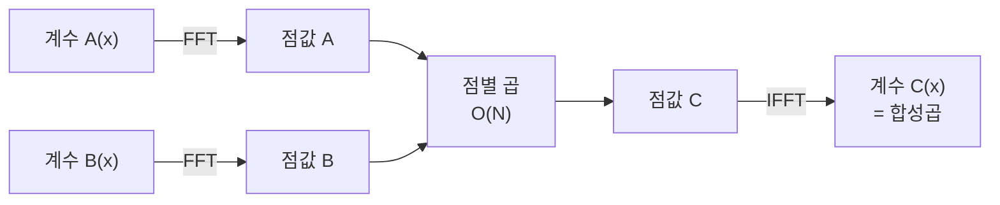

# 오늘의 주제: FFT (고속 푸리에 변환) — 다항식 곱셈 O(N log N)

> 언어: **Python**. 두 다항식(또는 큰 수, 수열)의 **합성곱(convolution)** 을 O(N²) → **O(N log N)** 으로 줄이는 알고리즘.

---

## 1. 무엇을 푸는가

두 수열 `a = [a0, a1, ...]`, `b = [b0, b1, ...]` 의 **합성곱**

```
c[k] = Σ_{i+j=k} a[i] * b[j]
```

이건 다항식 `A(x)·B(x)` 의 계수와 정확히 같다. 소박하게 계산하면 O(N²).
FFT는 이걸 **O(N log N)** 에 끝낸다.

**언제 쓰나:**
- 큰 수의 곱셈(자릿수 수십만 이상)
- "몇 번을 더해서 K를 만들 수 있는가" 같은 **합집합/거리 세기**(BOJ 1067, 10531)
- 문자열 매칭(와일드카드), 히스토그램 상관관계 등

---

## 2. 왜 O(N log N) 인가 — 핵심 아이디어

다항식을 표현하는 두 방식이 있다.

1. **계수 표현**: `[a0, a1, a2, ...]` — 곱셈이 O(N²)
2. **점값 표현**: 서로 다른 점 N개에서의 값 `{(x0, A(x0)), ...}` — 곱셈이 **O(N)** (같은 점끼리 값만 곱하면 됨)

그래서 전략은:

```
계수 A ──(평가)──> 점값 A ┐
                          ├─ 점끼리 곱 O(N) ─> 점값 C ─(보간)─> 계수 C
계수 B ──(평가)──> 점값 B ┘
```

문제는 "평가"와 "보간"이 순진하게 하면 O(N²)라는 것.
**해법: 평가점을 아무거나 쓰지 말고 "1의 거듭제곱근(root of unity)"을 쓴다.**

$\omega_N = e^{2\pi i / N}$ 을 쓰면, 짝수/홀수 항으로 분할했을 때
$\omega_N^2 = \omega_{N/2}$ 라는 성질 덕에 분할정복이 성립 → **O(N log N)**.

- **평가(FFT)**: $\omega_N$ 로 분할정복
- **보간(IFFT)**: $\omega_N^{-1}$ 로 똑같이 돌리고 마지막에 N으로 나눔



**정당성 한 줄:** 1의 N제곱근들은 서로 다른 N개의 점이므로 차수 < N 인 다항식을 유일하게 결정한다. FFT/IFFT는 이 평가↔보간을 반씨(butterfly) 구조로 빠르게 수행할 뿐이다.

---

## 3. Python 반복형(iterative) FFT 템플릿

재귀 FFT는 파이썬에서 함수 호출 오버헤드로 잘 죽는다. **비트반전 + 반복형**을 쓰자.

```python
import cmath

def fft(a, invert=False):
    n = len(a)  # n은 2의 거듭제곱이어야 함
    # 1) 비트반전 순열
    j = 0
    for i in range(1, n):
        bit = n >> 1
        while j & bit:
            j ^= bit
            bit >>= 1
        j ^= bit
        if i < j:
            a[i], a[j] = a[j], a[i]
    # 2) 버터플라이
    length = 2
    while length <= n:
        ang = (2 * cmath.pi / length) * (1 if invert else -1)
        wlen = cmath.exp(1j * ang)
        for i in range(0, n, length):
            w = 1 + 0j
            half = length >> 1
            for k in range(half):
                u = a[i + k]
                v = a[i + k + half] * w
                a[i + k] = u + v
                a[i + k + half] = u - v
                w *= wlen
        length <<= 1
    if invert:
        for i in range(n):
            a[i] /= n
    return a

def multiply(a, b):
    """계수 리스트 a, b의 합성곱(다항식 곱)을 정수 리스트로 반환"""
    n = 1
    need = len(a) + len(b) - 1
    while n < need:
        n <<= 1
    fa = [complex(x) for x in a] + [0j] * (n - len(a))
    fb = [complex(x) for x in b] + [0j] * (n - len(b))
    fft(fa); fft(fb)
    for i in range(n):
        fa[i] *= fb[i]
    fft(fa, invert=True)
    return [round(fa[i].real) for i in range(need)]
```

- **시간복잡도:** O(N log N), 여기서 N은 결과 길이 이상의 2의 거듭제곱.
- **round 필수:** 부동소수 오차 때문에 마지막에 `round`로 정수 복원.

---

## 4. 대표 예제 ①  BOJ 1067 — 이동 (순환 합성곱, 최댓값)

두 수열 X, Y(길이 N). Y를 순환 시프트하며 `Σ X[i]·Y[i]` 의 **최댓값**을 구한다.

**아이디어:** `X` 는 그대로, `Y` 는 **뒤집어서** 자기 자신을 두 번 이어 붙이면(순환 대비),
합성곱의 특정 구간이 각 시프트의 내적이 된다.

```python
import sys, cmath
input = sys.stdin.readline
# fft, multiply 는 위 템플릿 사용

def solve():
    n = int(input())
    x = list(map(int, input().split()))
    y = list(map(int, input().split()))
    y_rev = y[::-1]
    # x를 두 번 이어붙여 순환을 펼침
    conv = multiply(x + x, y_rev)
    # 시프트별 내적은 conv의 index n-1 .. 2n-2 구간
    print(max(conv[n-1 : 2*n-1]))

solve()
```

- 핵심: **"상관(correlation)은 한쪽을 뒤집은 합성곱"** 이라는 관계.
- 시간복잡도: O(N log N).

## 5. 대표 예제 ②  BOJ 10531 — Golf Bot (거리 세기)

로봇이 쏠 수 있는 거리 집합이 있고, **최대 2번** 쏴서 도달 가능한 목표 거리 수를 센다.

**아이디어:** 거리 지시함수 `f`(도달 가능 거리 위치에 1)를 만들고 `f * f`(자기 합성곱)를 하면,
결과의 index d의 값 > 0 이면 "두 번 쏴서 d 도달 가능".

```python
def solve():
    n = int(input())
    poly = [0] * 200001
    poly[0] = 1              # 0번 쏘기(=한 번만 쏘는 경우 포함용)
    for _ in range(n):
        poly[int(input())] = 1
    conv = multiply(poly, poly)   # 최대 2번
    m = int(input())
    cnt = 0
    for _ in range(m):
        d = int(input())
        if d < len(conv) and conv[d] > 0:
            cnt += 1
    print(cnt)
```

- `poly[0]=1` 로 두면 "1번만 쏴서 도달"도 자기 자신×0 항으로 잡힌다.
- 시간복잡도: O(N log N).

---

## 6. 자주 하는 실수 (체크리스트)

- ❌ **길이를 2의 거듭제곱으로 안 맞춤** → 버터플라이가 깨진다. `while n < need: n<<=1` 필수.
- ❌ **결과 배열 크기를 `len(a)+len(b)-1` 미만으로 자름** → 상위 계수 유실.
- ❌ **invert에서 N으로 안 나눔** → IFFT 스케일 틀림.
- ❌ **정수 복원 시 `int()` 로 버림** → 오차로 999.9999가 999 됨. 반드시 `round`.
- ❌ 값이 아주 크면(계수 합이 대략 1e15 넘음) double 정밀도 부족 → 이럴 땐 **NTT(정수 modular FFT)** 를 써야 한다.
- ⚠️ 파이썬 반복형도 N이 100만 넘으면 느릴 수 있음 → PyPy 제출 권장.

---

## 7. NTT 한 줄 요약 (심화)

복소수 대신 **소수 모듈러 `p = 998244353`(원시근 g=3)** 위에서 같은 분할정복을 하면
부동소수 오차 없이 **정수 합성곱을 mod p** 로 정확히 얻는다. 큰 계수/모듈러 답 문제는 NTT.

---

## 요약

- FFT = 계수↔점값 변환을 1의 거듭제곱근으로 빠르게 → 합성곱 **O(N log N)**.
- 상관은 뒤집은 합성곱, 거리 세기는 지시함수 자기 합성곱.
- 정수 복원은 `round`, 길이는 2의 거듭제곱, 정밀도 넘치면 NTT.
