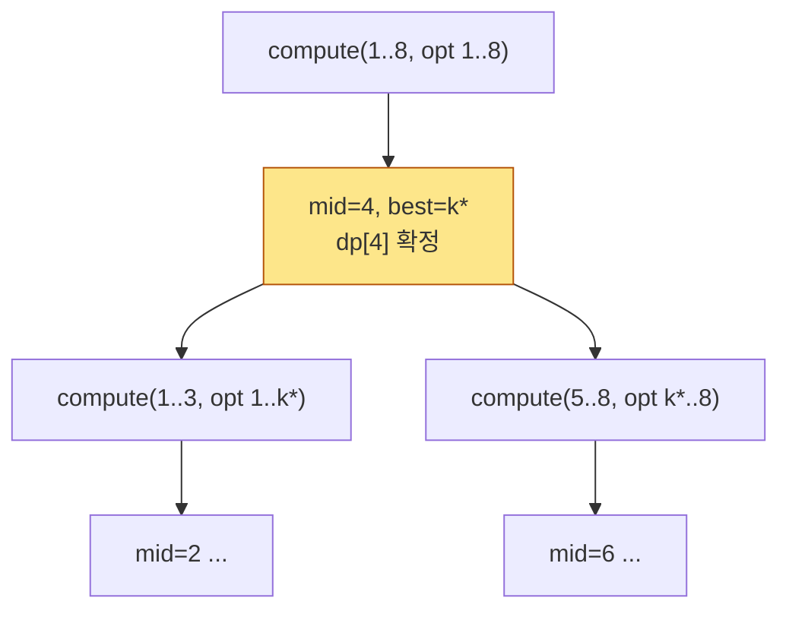

# 오늘의 주제: 분할정복을 이용한 DP 최적화 (Divide & Conquer Optimization)

> `dp[i][j] = min_{k < j} ( dp[i-1][k] + C(k, j) )` 형태의 2차원 DP를,
> **최적 분할점 `opt`의 단조성**을 이용해 층(layer)마다 `O(N log N)`에 계산하는 기법.
> 전체 `O(K · N log N)`. 컨벡스 헐 트릭(CHT)과 함께 대표적인 DP 최적화 도구다.

---

## 1. 어떤 DP에 쓰나?

다음 꼴의 점화식이 대상이다.

```
dp[i][j] = min over k ( dp[i-1][k] + C(k, j) )      (k < j)
```

- `i` : 층(layer). 보통 "그룹 개수 / 단계 수" (예: 경비원 수, 분할 개수).
- `j` : 위치(원소 인덱스).
- `C(k, j)` : 구간 `(k, j]`를 하나로 묶었을 때의 비용.

층별로 순진하게 계산하면 `k`, `j` 이중 루프 → 층당 `O(N^2)`, 전체 `O(K·N^2)`.
여기서 **최적 분할점의 단조성**이 성립하면 층당 `O(N log N)`으로 줄인다.

### 핵심 조건 — opt의 단조성

`opt[i][j]` = `dp[i][j]`를 최소로 만드는 `k`라 하자. 이때

```
opt[i][j] ≤ opt[i][j+1]
```

즉 **j가 커질수록 최적 분할점도 오른쪽으로만 이동**한다면 D&C 최적화가 가능하다.

이 단조성은 비용 함수 `C`가 **사각부등식(Quadrangle Inequality, QI)** 을 만족하면 보장된다.

```
a ≤ b ≤ c ≤ d  ⟹  C(a, c) + C(b, d) ≤ C(a, d) + C(b, c)
```

> **직관:** 구간이 "겹치도록" 나누는 게 "감싸도록" 나누는 것보다 손해가 없다는 성질(볼록성).
> QI ⟹ opt 단조 ⟹ 분할정복으로 탐색 범위를 재활용할 수 있다.
> 대부분의 코테에서는 QI 증명까지 안 하고, **비용이 구간 길이·가중치의 곱처럼 볼록하면 성립한다**고 보고 적용한 뒤 예제로 검증한다.

---

## 2. 왜 O(N log N)인가 — 분할정복 아이디어

한 층 `i`를 고정. `compute(l, r, optl, optr)`:
`j ∈ [l, r]`의 `dp[i][j]`를 계산하되, 그 최적 분할점이 `[optl, optr]` 안에 있음을 알고 있다.

1. 가운데 `mid = (l+r)//2` 를 잡는다.
2. `k ∈ [optl, optr]` 를 **전부** 훑어 `dp[i][mid]`와 그 최적점 `best`를 구한다.
3. 단조성에 의해:
   - `j < mid` 의 최적점은 `[optl, best]` 안에 있다 → `compute(l, mid-1, optl, best)`
   - `j > mid` 의 최적점은 `[best, optr]` 안에 있다 → `compute(mid+1, r, best, optr)`

재귀 깊이 `O(log N)`, 각 깊이에서 훑는 `k`의 총합은 `O(N)` (구간이 `best`에서만 겹침) → **층당 `O(N log N)`**.



> 각 `j`의 탐색 구간이 이전 결과(`best`)를 기준으로만 좌우로 나뉘므로, 같은 `k`를 여러 번 보더라도 층 전체 작업량은 `N log N`을 넘지 않는다.

---

## 3. 대표 예제 — 백준 13261 「탈옥」

**문제 요약:** 일렬로 늘어선 `N`개의 감방, 각 감방 위험도 `w[i]`. 경비원 `G`명을 배치.
한 경비원은 **연속된 구간**을 담당하고, 그 구간의 탈옥 위험도는
`(구간 위험도 합) × (구간 감방 수)`. 모든 감방은 정확히 한 경비원이 맡는다.
**총 위험도의 최솟값**을 구하라. (`N ≤ 8000`, `G ≤ 800`)

### 점화식

`P` = `w`의 누적합. 구간 `(a, b]`의 비용:

```
C(a, b) = (P[b] - P[a]) * (b - a)
```

```
dp[g][j] = min over k<j ( dp[g-1][k] + C(k, j) )
```

- `dp[g][j]` : 앞의 `j`개 감방을 `g`명의 경비원으로 담당할 때 최소 위험도.
- 답: `dp[G][N]`.
- `C`는 (합)×(길이) 꼴로 QI를 만족 → **opt 단조 → D&C 최적화 적용.**
- 순진한 `O(G·N^2) = 800 × 8000^2 ≈ 5×10^13` → 불가. D&C로 `O(G·N log N) ≈ 800 × 8000 × 13 ≈ 8×10^7` → OK.

### 파이썬 풀이

```python
import sys
input = sys.stdin.readline

def solve():
    N, G = map(int, input().split())
    w = [0] + list(map(int, input().split()))
    P = [0] * (N + 1)
    for i in range(1, N + 1):
        P[i] = P[i - 1] + w[i]

    def cost(a, b):                      # 구간 (a, b] 비용
        return (P[b] - P[a]) * (b - a)

    INF = float('inf')
    prev = [0] + [INF] * N               # dp[0][*]: prev[0]=0, 나머지 불가
    cur = [INF] * (N + 1)

    def compute(l, r, optl, optr):
        if l > r:
            return
        mid = (l + r) // 2
        best_val, best_k = INF, optl
        # opt 후보는 [optl, min(mid-1, optr)] 범위만
        for k in range(optl, min(mid - 1, optr) + 1):
            v = prev[k] + cost(k, mid)
            if v < best_val:
                best_val, best_k = v, k
        cur[mid] = best_val
        compute(l, mid - 1, optl, best_k)
        compute(mid + 1, r, best_k, optr)

    for g in range(1, G + 1):
        cur = [INF] * (N + 1)
        compute(1, N, 0, N - 1)          # opt 범위는 [0, N-1]
        prev = cur

    print(prev[N])

solve()
```

- **시간복잡도:** `O(G · N log N)`
- **공간복잡도:** `O(N)` (이전/현재 층만 롤링으로 유지)

> 재귀 깊이가 `log N ≈ 13` 수준이라 파이썬 기본 재귀 한도로 충분하지만,
> 층 반복 내부에서 깊은 재귀가 걱정되면 `sys.setrecursionlimit`을 올리거나
> 반복 스택으로 바꾼다.

---

## 4. 자주 하는 실수

- **opt 범위 경계 오류.** `k < j` 제약을 잊고 `k == mid`까지 훑으면 잘못된 분할.
  위 코드처럼 `min(mid-1, optr)`로 상한을 막아야 한다.
- **단조성 미검증.** `C`가 QI를 만족하지 않는데 D&C를 적용하면 **틀린 답**이 나온다.
  (WA인데 TLE가 아니라 조용히 오답이라 잡기 어렵다.) 작은 입력에서 `O(N^2)` 브루트포스와 대조 검증하자.
- **prev/cur 롤링 실수.** 층마다 `cur`를 `INF`로 초기화하지 않으면 이전 값이 섞인다.
- **누적합 인덱스.** `C(k, j)`가 `(k, j]` 반열린 구간인지 `[k, j]`인지 명확히. 위 정의는 `(k, j]`.
- **크누스 최적화와 혼동.** `dp[i][j] = min(dp[i][k] + dp[k][j]) + C(i,j)` (구간 DP, 층 개념 없음) 꼴은
  **크누스 최적화**(`opt[i][j-1] ≤ opt[i][j] ≤ opt[i+1][j]`, 전체 `O(N^2)`) 대상이다. D&C opt와 조건·구현이 다르다.

---

## 5. 파이썬 템플릿 (층별 D&C 최적화)

```python
import sys
input = sys.stdin.readline
INF = float('inf')

def dc_optimization(N, K, cost):
    """
    dp[i][j] = min_{k<j} dp[i-1][k] + cost(k, j)  꼴을 O(K N log N)에 계산.
    cost: 함수 cost(k, j) -> 구간 (k, j] 비용. opt 단조(QI) 가정.
    반환: dp[K][N]
    """
    prev = [0] + [INF] * N
    for _ in range(K):
        cur = [INF] * (N + 1)
        def compute(l, r, optl, optr):
            if l > r:
                return
            mid = (l + r) // 2
            best_val, best_k = INF, optl
            for k in range(optl, min(mid - 1, optr) + 1):
                v = prev[k] + cost(k, mid)
                if v < best_val:
                    best_val, best_k = v, k
            cur[mid] = best_val
            compute(l, mid - 1, optl, best_k)
            compute(mid + 1, r, best_k, optr)
        compute(1, N, 0, N - 1)
        prev = cur
    return prev[N]
```

---

## 6. 한 줄 요약

- **꼴:** `dp[i][j] = min_k dp[i-1][k] + C(k,j)`, 층 구조 + opt 단조(QI).
- **핵심:** 최적 분할점이 오른쪽으로만 이동 → 분할정복으로 탐색 범위 재활용.
- **복잡도:** `O(K · N log N)` (순진한 `O(K·N^2)`에서 개선).
- **주의:** 단조성 성립 여부를 반드시 확인(작은 입력 브루트포스 대조).
