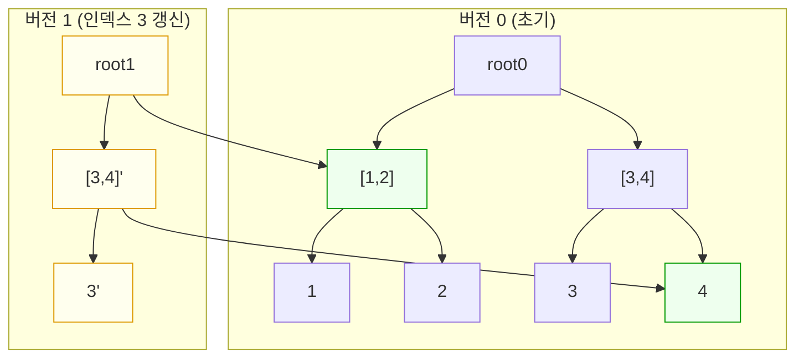

# 오늘의 주제: 퍼시스턴트 세그먼트 트리 (Persistent Segment Tree, PST)

> **한 줄 요약:** 갱신할 때마다 **바뀐 경로의 노드만 새로 복사**해서, 과거의 모든 버전을 통째로 보존하는 세그먼트 트리. 버전 하나당 O(log N) 메모리만 추가로 쓴다.

---

## 1. 핵심 아이디어 — "경로 복사(path copying)"

일반 세그먼트 트리에서 리프 하나를 갱신하면 **루트 → 리프까지의 경로(약 log N개 노드)만** 값이 바뀐다.
나머지 노드는 그대로다. 그러니 **바뀐 log N개만 새로 만들고, 나머지 서브트리는 이전 버전의 노드를 그대로 가리키면(공유하면)** 된다.

- 버전 v를 만들 때 이전 버전 v-1을 기반으로 갱신 → 새 루트 하나 + 경로상의 새 노드 log N개 생성
- 각 버전은 자기만의 **루트 번호**를 가진다. `root[v]` 로 접근
- 버전 간에 안 바뀐 부분은 **물리적으로 같은 노드를 공유** → 그래서 메모리가 O(N + Q log N)로 끝난다



> 버전 1은 인덱스 3만 바꿨다. 그래서 새로 만든 노드는 `root1`, `[3,4]'`, `3'` 세 개뿐.
> 왼쪽 서브트리 `[1,2]`와 리프 `4`는 **버전 0의 노드를 그대로 공유**한다(초록색).

---

## 2. 왜 동작하는가 (정당성)

- 세그먼트 트리는 **불변(immutable) 트리**로 다룬다. 노드를 절대 수정하지 않고, 갱신은 항상 "새 노드 생성"으로만 한다.
- 한 번의 점 갱신이 건드리는 노드는 루트에서 리프까지 정확히 트리 높이 = O(log N)개.
- 각 새 노드는 자식 둘 중 **갱신 경로에 있는 자식만 새 노드**를 가리키고, 나머지 자식은 이전 버전 포인터를 그대로 복사한다.
- 이전 버전의 노드는 아무도 수정하지 않으므로, 몇 개의 버전이 그 노드를 공유하든 항상 옳은 값을 유지한다.

---

## 3. 언제 쓰나

- **구간 K번째 수 (kth smallest in range)** — 가장 대표적. 배열의 `[l, r]` 구간에서 k번째로 작은 값.
- **구간 내 특정 값 이하의 개수 / 특정 값의 등장 횟수** 같은 오프라인/온라인 구간 통계
- **과거 상태로의 롤백**이 필요한 문제 (버전 관리)
- 좌표압축 + 값 축을 세그먼트 트리로, 배열 인덱스를 버전으로 매핑하는 패턴

> 핵심 발상: **"prefix 방향으로 하나씩 원소를 추가한 버전들"** 을 만들어 두면,
> `버전[r] - 버전[l-1]` 로 구간 `[l, r]`의 값 분포를 O(log N)에 얻을 수 있다. (누적합의 세그먼트 트리 버전!)

---

## 4. 대표 예제 — 백준 7469 "K번째 수" / 백준 11228 유형

**문제:** 길이 N 배열이 주어지고, 쿼리 `(l, r, k)` 마다 `[l, r]` 구간에서 **k번째로 작은 수**를 출력하라.

### 아이디어

1. 값들을 **좌표압축**한다 (값 축을 세그먼트 트리의 인덱스로).
2. 버전 i = "앞에서부터 i개 원소를 값 축에 +1 해서 넣은 세그먼트 트리". root[0]은 빈 트리.
3. 구간 `[l, r]`의 값 분포 = `버전[r]`에서 `버전[l-1]`을 뺀 것. 두 버전을 **동시에 내려가며** 왼쪽 서브트리 개수 차이를 보고 k번째를 찾는다.
   - 왼쪽 개수 `cnt = 버전[r].left.cnt - 버전[l-1].left.cnt`
   - `k <= cnt` 면 왼쪽으로, 아니면 `k -= cnt` 하고 오른쪽으로.

### Python 풀이

```python
import sys
input = sys.stdin.readline

def build_pst(n, arr):
    # 값 좌표압축
    srt = sorted(set(arr))
    idx = {v: i for i, v in enumerate(srt)}
    m = len(srt)

    # 세그먼트 트리 노드: left[i], right[i], cnt[i]
    left = [0]; right = [0]; cnt = [0]   # 0번 = null 노드(빈 트리)
    root = [0] * (n + 1)                 # root[i] = i번째 버전의 루트

    def update(prev, s, e, pos):
        # prev 버전을 기반으로 pos 위치 +1 한 새 노드 반환
        cur = len(cnt)
        left.append(left[prev]); right.append(right[prev])
        cnt.append(cnt[prev] + 1)
        if s == e:
            return cur
        mid = (s + e) // 2
        if pos <= mid:
            left[cur] = update(left[prev], s, mid, pos)
        else:
            right[cur] = update(right[prev], mid + 1, e, pos)
        return cur

    for i in range(1, n + 1):
        root[i] = update(root[i - 1], 0, m - 1, idx[arr[i - 1]])

    def query(u, v, s, e, k):
        # 버전 v(=r)와 u(=l-1) 사이에서 k번째 작은 값의 압축 인덱스
        if s == e:
            return s
        mid = (s + e) // 2
        left_cnt = cnt[left[v]] - cnt[left[u]]
        if k <= left_cnt:
            return query(left[u], left[v], s, mid, k)
        else:
            return query(right[u], right[v], mid + 1, e, k - left_cnt)

    return root, m, srt, query

def solve():
    n, mq = map(int, input().split())
    arr = [int(input()) for _ in range(n)]
    root, m, srt, query = build_pst(n, arr)
    out = []
    for _ in range(mq):
        l, r, k = map(int, input().split())
        ci = query(root[l - 1], root[r], 0, m - 1, k)
        out.append(str(srt[ci]))   # 압축 인덱스 → 실제 값 복원
    print('\n'.join(out))

solve()
```

- **시간복잡도:** 빌드 O(N log N), 쿼리당 O(log N) → 전체 O((N + Q) log N)
- **공간복잡도:** O(N log N) — 버전 N개 × 경로 log N개

> 재귀 깊이 주의: Python은 기본 재귀 한도가 낮다. `sys.setrecursionlimit(10**6)` 를 넣거나, log N 깊이라 보통은 괜찮지만 안전하게 올려두자.

---

## 5. Python 템플릿 (배열 기반 노드, 재귀)

```python
import sys
sys.setrecursionlimit(1 << 20)

# 전역 노드 풀: 인덱스 0 = null(빈) 노드
L = [0]; R = [0]; C = [0]

def new_node(l=0, r=0, c=0):
    L.append(l); R.append(r); C.append(c)
    return len(C) - 1

def update(prev, s, e, pos, val=1):
    """prev 버전 위에 pos에 val 더한 새 버전 루트 반환"""
    cur = new_node(L[prev], R[prev], C[prev] + val)
    if s == e:
        return cur
    mid = (s + e) // 2
    if pos <= mid:
        L[cur] = update(L[prev], s, mid, pos, val)
    else:
        R[cur] = update(R[prev], mid + 1, e, pos, val)
    return cur

def kth(u, v, s, e, k):
    """버전 u(제외) ~ v(포함) 구간에서 k번째 작은 값의 인덱스"""
    if s == e:
        return s
    mid = (s + e) // 2
    lc = C[L[v]] - C[L[u]]
    if k <= lc:
        return kth(L[u], L[v], s, mid, k)
    return kth(R[u], R[v], mid + 1, e, k - lc)
```

---

## 6. 자주 하는 실수

- **null 노드(0번)를 공유 기준으로 삼기.** `cnt[0] = 0` 인 빈 노드를 항상 인덱스 0에 두고, 없는 서브트리는 전부 0을 가리키게 한다. 그래야 `cnt[left[v]] - cnt[left[u]]` 가 항상 잘 정의된다.
- **버전 인덱스와 구간 인덱스 혼동.** 구간 `[l, r]` 질의는 `root[l-1]`(제외)과 `root[r]`(포함) **두 버전**을 함께 내려간다. l-1을 빠뜨리면 접두사 전체를 세게 된다.
- **좌표압축 후 값 복원을 잊음.** 쿼리 결과는 압축된 인덱스이므로 `srt[idx]`로 원래 값으로 되돌려야 한다.
- **노드를 in-place로 수정.** PST의 생명은 불변성. 기존 노드의 `L/R/C`를 절대 덮어쓰지 말 것. 항상 `new_node`.
- **메모리 과소 예약(정적 배열 버전 시).** 노드 수는 최대 `N log N + N` 정도. 리스트 append 방식이면 자동 확장이라 안전하지만, 크기를 미리 잡는 언어/방식이면 넉넉히.

---

## 7. 한눈에 보기

| 항목 | 내용 |
|------|------|
| 핵심 연산 | 점 갱신 시 경로(log N)만 복사, 나머지는 이전 버전 공유 |
| 대표 문제 | 구간 K번째 수, 구간 값 통계, 롤백 |
| 빌드 | O(N log N) |
| 쿼리 | O(log N) (두 버전 동시 하강) |
| 메모리 | O(N log N) |
| 불변식 | 노드는 절대 수정 안 함, 갱신 = 새 노드 생성 |

**한 줄 마무리:** *"세그먼트 트리 + 누적합 + 버전 관리"의 결합. `버전[r] - 버전[l-1]`로 구간 분포를 O(log N)에 뽑아낸다.*
