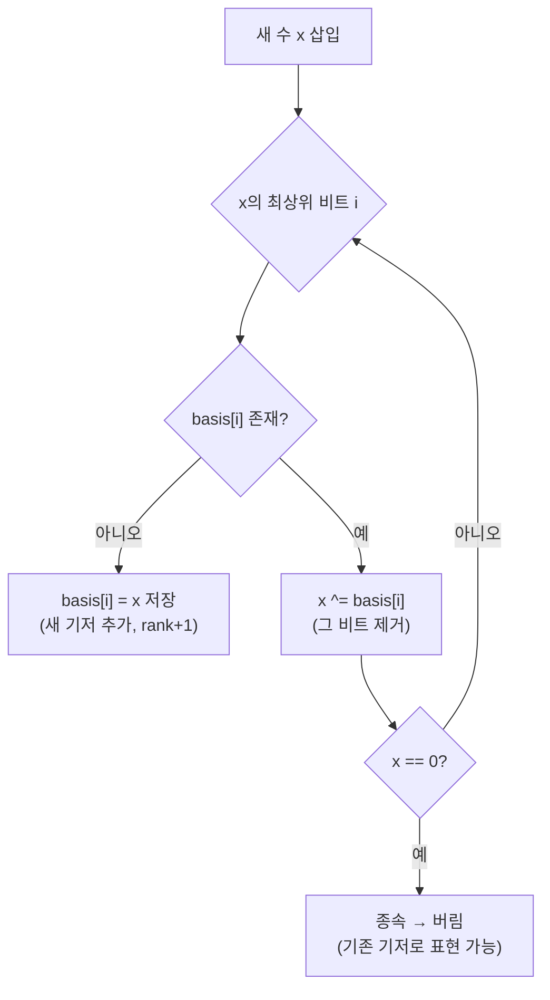

# 오늘의 주제: 선형 기저 (XOR Basis / Linear Basis)

> 언어: **Python**

## 한 줄 요약
주어진 수들을 XOR로 조합해 만들 수 있는 모든 값의 집합을, 최대 **비트 수(약 60)개**의 "기저 벡터"로 압축해서 다루는 자료구조.
XOR을 **GF(2) 위의 벡터 공간**으로 보면, 각 정수는 비트 벡터이고 XOR은 벡터 덧셈이다. 선형대수의 "기저"를 그대로 정수에 적용한 것.

---

## 왜 동작하는가 (핵심 아이디어)

- 정수 하나 = 이진수 = **GF(2)(0/1) 위의 벡터**. `a XOR b`는 자리올림 없는 덧셈이라 벡터 덧셈과 동일.
- 여러 수의 "XOR로 만들 수 있는 모든 값" = 이 벡터들이 **생성(span)** 하는 부분공간.
- 부분공간은 **선형 독립인 기저**로 표현 가능하고, 기저 크기는 비트 수 이하(정수라면 60~63개).
- 그래서 원소가 몇 개든 기저는 최대 ~60개. → 삽입/쿼리가 전부 O(비트수).

핵심 표현: `basis[i]` = "**최상위 비트가 정확히 i번째인** 기저 벡터" (없으면 0). 이 형태를 **행 사다리꼴(reduced echelon)** 로 유지하는 게 전부다.



## 언제 쓰나
- 부분집합의 **XOR 최댓값 / 최솟값** 구하기
- 어떤 값 `k`를 부분집합 XOR로 **만들 수 있는지** 판정
- XOR로 만들 수 있는 **서로 다른 값의 개수** = `2^rank`
- k번째로 작은 XOR 값 등 (기저를 reduced form으로 정리하면 가능)

---

## 예제 1: 부분집합 XOR 최댓값

수열이 주어질 때, 아무 부분집합이나 골라 XOR한 값의 **최댓값**을 구하라.

### 핵심 아이디어
1. 모든 수를 기저에 삽입한다.
2. 답을 0에서 시작해, **높은 비트부터** 내려오며 `answer ^ basis[i] > answer`면 XOR한다.
   - 즉 그 비트를 켤 수 있으면 무조건 켠다 → 그리디가 성립(상위 비트가 항상 우선).

- **시간복잡도:** 삽입 N개 × O(B), 최댓값 쿼리 O(B). (B = 비트 수, 보통 ≤ 60)
- **정당성:** 상위 비트 하나가 하위 비트 전부의 합보다 크므로, 켤 수 있는 최상위 비트를 켜는 그리디가 최적.

```python
import sys
input = sys.stdin.readline

BITS = 60  # 값 범위에 맞춰 조정 (예: 2^60)

class XorBasis:
    def __init__(self):
        self.basis = [0] * BITS  # basis[i]: 최상위 비트가 i인 기저 벡터

    def insert(self, x):
        for i in range(BITS - 1, -1, -1):
            if not (x >> i) & 1:
                continue
            if self.basis[i] == 0:   # 그 비트를 대표하는 기저가 없다 → 추가
                self.basis[i] = x
                return True          # rank 증가
            x ^= self.basis[i]       # 최상위 비트 소거 후 계속
        return False                 # x==0 → 기존 기저로 표현 가능(종속)

    def max_xor(self):
        res = 0
        for i in range(BITS - 1, -1, -1):
            if self.basis[i] and (res ^ self.basis[i]) > res:
                res ^= self.basis[i]
        return res

def main():
    n = int(input())
    b = XorBasis()
    for x in map(int, input().split()):
        b.insert(x)
    print(b.max_xor())

# main()
```

## 예제 2: 특정 값 k를 만들 수 있는가 + 서로 다른 XOR 개수

- **판정:** k를 기저로 소거해 0이 되면 만들 수 있음.
- **개수:** 서로 다른 XOR 결과 = `2^rank` (공집합 포함, 즉 0도 셈). rank = 0이 아닌 basis 원소 수.

```python
def can_make(basis, k):
    for i in range(BITS - 1, -1, -1):
        if (k >> i) & 1 and basis[i]:
            k ^= basis[i]
    return k == 0          # 0으로 소거되면 표현 가능

def count_distinct(basis):
    rank = sum(1 for v in basis if v)
    return 1 << rank       # 2^rank (0 포함)
```

---

## 자주 하는 실수
- **BITS를 값 범위보다 작게 잡음** → 상위 비트가 잘려 오답. 입력 최댓값을 보고 넉넉히(예: 값 ≤ 10^18이면 60~63).
- 삽입 루프에서 **최상위 비트부터(내림차순)** 돌지 않으면 사다리꼴이 깨진다.
- 최댓값 쿼리 시 `>` 비교를 빼먹고 무조건 XOR하면 틀림 — 반드시 "커질 때만" 켠다.
- "부분집합 개수"가 아니라 "**서로 다른 XOR 값 개수**"임에 주의. 서로 다른 부분집합이 같은 XOR을 낼 수 있다(그 배수가 `2^(N-rank)`).
- 공집합(XOR=0)을 셈에 포함할지 문제 조건 확인.

---

## Python 템플릿 (삽입 / 최댓값 / 판정 / 개수)

```python
class XorBasis:
    def __init__(self, bits=60):
        self.bits = bits
        self.basis = [0] * bits

    def insert(self, x):
        for i in range(self.bits - 1, -1, -1):
            if not (x >> i) & 1:
                continue
            if self.basis[i] == 0:
                self.basis[i] = x
                return True
            x ^= self.basis[i]
        return False

    def max_xor(self, start=0):
        res = start
        for i in range(self.bits - 1, -1, -1):
            if self.basis[i] and (res ^ self.basis[i]) > res:
                res ^= self.basis[i]
        return res

    def can_make(self, k):
        for i in range(self.bits - 1, -1, -1):
            if (k >> i) & 1 and self.basis[i]:
                k ^= self.basis[i]
        return k == 0

    @property
    def rank(self):
        return sum(1 for v in self.basis if v)

    def count_distinct(self):
        return 1 << self.rank  # 0 포함
```

## 관련 문제 (BOJ)
- 11191 XOR 최대 (부분집합 XOR 최댓값 — 기저 + 그리디)
- 크게 보면 "선형대수/기저" 계열: GF(2) 가우스 소거와 동일한 사고
