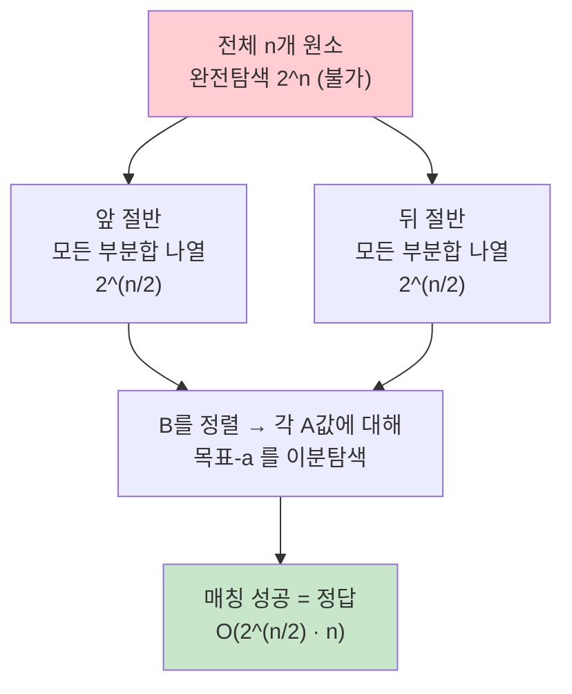

# 오늘의 주제: 중간에서 만나기 (Meet in the Middle, MITM)

> 완전탐색이 **2ⁿ** 이라 안 될 때, 원소를 **절반으로 쪼개** 각각 2^(n/2) 로 나열하고
> 두 결과를 **정렬 + 이분탐색(투포인터)** 으로 합쳐 **O(2^(n/2) · n)** 으로 낮추는 기법.
> `2^40`은 불가능하지만 `2^20 × 2^20` 은 각각 100만 → 충분히 계산 가능. 이게 핵심 트릭이다.

---

## 1. 왜 동작하는가 — 지수를 반으로 쪼개면 제곱근이 된다

부분집합 합/조합 문제에서 완전탐색은 원소 n개에 대해 2ⁿ 개의 조합을 본다.
n=40 이면 2⁴⁰ ≈ 1조 → 시간 초과. 하지만 지수 법칙을 쓰면:

$$
2^n = 2^{n/2} \cdot 2^{n/2}
$$

- 배열을 **앞 절반 A, 뒤 절반 B** 로 나눈다.
- A로 만들 수 있는 모든 부분합(2^(n/2)개), B로 만들 수 있는 모든 부분합(2^(n/2)개)을 **각각** 나열.
- "A에서 하나 + B에서 하나 = 목표" 가 되는 짝을 **합치는 단계에서** 찾는다.
- 나열은 각 2^(n/2), 합치기는 정렬 후 이분탐색이라 전체가 **2^(n/2)** 규모로 줄어든다.

> 곱을 합으로 쪼갠 게 아니라, **탐색 공간의 곱을 두 개의 제곱근 공간으로 분리**한 것.
> 그래서 이름이 "중간에서 만나기" — 양쪽에서 절반씩 좁혀와 가운데서 매칭한다.



---

## 2. 대표 예제 ① — 부분수열의 합 2 (BOJ 1450)

**문제:** n개(≤40)의 물건 무게가 주어질 때, 무게 합이 **C 이하**가 되도록 뽑는 부분집합의 개수.

### 핵심 아이디어
- n≤40 → 2⁴⁰ 완전탐색 불가. 반으로 갈라 각 2²⁰ ≈ 100만 개 부분합 생성.
- 뒤쪽 부분합을 **정렬**해 두고, 앞쪽 부분합 `a` 마다 `C - a` **이하**인 개수를 이분탐색(`bisect_right`)으로 센다.

```python
import sys
from itertools import combinations
from bisect import bisect_right

def all_subset_sums(arr):
    sums = []
    n = len(arr)
    for mask in range(1 << n):          # 2^(n/2) 개
        s = 0
        for i in range(n):
            if mask & (1 << i):
                s += arr[i]
        sums.append(s)
    return sums

def solve():
    n, c = map(int, input().split())
    w = list(map(int, input().split()))
    left, right = w[:n//2], w[n//2:]

    ls = all_subset_sums(left)
    rs = sorted(all_subset_sums(right))  # 정렬해 두고 이분탐색

    ans = 0
    for a in ls:
        if a > c:
            continue
        ans += bisect_right(rs, c - a)   # r <= c-a 인 개수
    print(ans)

solve()
```

- **시간복잡도:** 나열 O(2^(n/2)·(n/2)) + 정렬 O(2^(n/2)·log) + 매칭 O(2^(n/2)·log) = **O(2^(n/2) · n)**.
- n=40 이면 약 100만 × 20 ≈ 2천만 연산 → 통과.

---

## 3. 대표 예제 ② — 정확히 목표값 만들기 (부분합 = target)

"합이 정확히 T가 되는 부분집합이 존재하는가?" 는 뒤쪽을 **set/정렬** 해두고
앞쪽 `a` 마다 `T - a` 가 있는지 확인하면 된다.

```python
def exists_subset_sum(arr, target):
    n = len(arr)
    h = n // 2
    left  = all_subset_sums(arr[:h])
    right = set(all_subset_sums(arr[h:]))   # O(1) 조회
    return any((target - a) in right for a in left)
```

> 개수/최댓값이 필요하면 set 대신 정렬 + 이분탐색, 카운트를 위해 Counter를 쓴다.

---

## 4. 자주 하는 실수

- **빈 부분집합(mask=0) 처리:** 합 0이 포함된다. "적어도 하나 뽑아야" 하는 문제면 mask=0을 빼야 하고, 1450처럼 개수 세기면 포함해도 된다(두 쪽 다 공집합=아무것도 안 뽑음).
- **정렬을 안 하고 이분탐색:** `bisect`는 정렬된 배열 전제. 반드시 `sorted` 후 사용.
- **`이하` vs `미만` vs `정확히`:** `bisect_right`(≤) / `bisect_left`(<) 를 헷갈리면 오답. 경계 조건을 문제에 맞춰라.
- **반을 균등하게 안 쪼갬:** `n//2` 로 갈라야 두 쪽 크기가 비슷해 2^(n/2)가 최소가 된다. 한쪽에 몰면 최악 2^(n-1)로 되돌아간다.
- **적용 조건 착각:** MITM은 **n이 30~45 정도로 애매하게 클 때** 쓴다. n이 작으면 그냥 완전탐색, 아주 크면(수천) DP나 다른 접근이 필요.

---

## 5. Python 템플릿

```python
from itertools import combinations
from bisect import bisect_left, bisect_right

def subset_sums(arr):
    """arr의 모든 부분집합 합 리스트 (2^len 개)."""
    res = [0]
    for x in arr:
        res += [s + x for s in res]      # 원소 추가할 때마다 2배씩 확장
    return res

def count_pairs_leq(arr, target):
    """두 절반의 부분합 짝 중 합 <= target 인 개수."""
    h = len(arr) // 2
    L = subset_sums(arr[:h])
    R = sorted(subset_sums(arr[h:]))
    return sum(bisect_right(R, target - a) for a in L if a <= target)
```

> `subset_sums`의 반복 확장 방식은 비트마스크 이중루프보다 짧고 빠르다(원소 하나씩 붙이며 2배 증식).

---

## 요약

- **언제:** 완전탐색이 2ⁿ 인데 n이 30~45로 애매하게 클 때 (부분합, 조합 매칭).
- **어떻게:** 반으로 쪼개 각각 2^(n/2) 나열 → 한쪽 정렬 → 다른 쪽에서 이분탐색으로 매칭.
- **효과:** O(2ⁿ) → **O(2^(n/2)·n)**. 지수의 절반 = 사실상 제곱근으로 축소.
- **주의:** 공집합 처리, 정렬 전제, 경계(≤/</=), 균등 분할.
