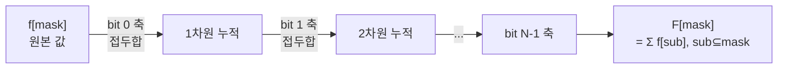

# 오늘의 주제: SOS DP (Sum over Subsets, 부분집합 합 DP)

> 언어: **Python**

각 마스크 `mask`에 대해 **그 부분집합(submask) 전체에 걸친 합/집계**를
`O(N · 2^N)`에 구하는 기법. 비트마스킹 DP의 강력한 확장판이다.

---

## 1. 문제 정의

배열 `f[mask]` (`0 ≤ mask < 2^N`)가 주어졌을 때, 모든 mask에 대해

```
F[mask] = Σ  f[sub]        (sub ⊆ mask, 즉 sub & mask == sub)
```

를 구하고 싶다.

- **naive**: 각 mask마다 부분집합을 순회 → 부분집합 순회 전체 합은 `3^N`.
  `N=20`이면 `3^20 ≈ 3.5×10^9` → TLE.
- **SOS DP**: 차원(비트)별로 나눠 처리 → `O(N · 2^N)`.
  `N=20`이면 `20 × 2^20 ≈ 2×10^7` → 통과.

---

## 2. 핵심 아이디어 — "왜 동작하는가"

부분집합 합을 **N차원 하이퍼큐브의 접두합(prefix sum)** 으로 본다.
각 비트를 하나의 축으로 두고, 축 하나씩 접두합을 누적한다.

- `dp[i][mask]` = mask의 부분집합 중에서 **하위 i개 비트만 다를 수 있는** 것들의 합.
- 비트 `i`가 켜져 있으면: 그 비트를 끈 상태의 결과를 더한다 (부분집합에 포함/미포함 둘 다 커버).

전이:
```
dp[i][mask] = dp[i-1][mask]                        (i번째 비트가 0이면)
dp[i][mask] = dp[i-1][mask] + dp[i-1][mask ^ (1<<i)]  (i번째 비트가 1이면)
```
i 차원을 in-place로 덮어쓰면 배열 하나로 충분하다.



각 비트 축마다 "그 축을 끈 이웃"의 값을 흡수 → N번 반복하면
모든 부분집합이 정확히 한 번씩 더해진다 (중복·누락 없음).

---

## 3. Python 템플릿

```python
# F[mask] = sum of f[sub] for all sub ⊆ mask
def sos_subset(f, N):
    F = f[:]                       # 길이 2^N
    for i in range(N):             # 비트(축)별로
        bit = 1 << i
        for mask in range(1 << N):
            if mask & bit:         # i번째 비트가 켜져 있으면
                F[mask] += F[mask ^ bit]
    return F
```

**초집합(superset) 합** `G[mask] = Σ f[sup] (mask ⊆ sup)` 은 조건만 뒤집으면 된다:

```python
def sos_superset(f, N):
    G = f[:]
    for i in range(N):
        bit = 1 << i
        for mask in range(1 << N):
            if not (mask & bit):   # i번째 비트가 꺼져 있으면
                G[mask] += G[mask | bit]
    return G
```

- **시간복잡도**: `O(N · 2^N)`
- **공간복잡도**: `O(2^N)`

---

## 4. 대표 예제

### 예제 A. 각 마스크의 부분집합 개수 세기

입력 배열 `a`가 있을 때, 각 `mask`에 대해
`a[j] & mask == a[j]` (즉 `a[j]`가 mask의 부분집합)인 원소 개수를 구하라.

```python
def count_submask_elems(a, N):
    cnt = [0] * (1 << N)
    for x in a:
        cnt[x] += 1
    for i in range(N):
        bit = 1 << i
        for mask in range(1 << N):
            if mask & bit:
                cnt[mask] += cnt[mask ^ bit]
    return cnt        # cnt[mask] = a[j] ⊆ mask 인 j 개수
```
**아이디어**: 빈도 배열에 부분집합 합 SOS를 돌리면, `cnt[mask]`가
"mask 안에 완전히 들어가는 값"의 개수가 된다.

### 예제 B. AND 가 0 인 쌍의 개수 (백준 스타일)

배열에서 `a[i] & a[j] == 0` 인 순서쌍 개수. `a[i]`와 겹치는 비트가 없는
값의 개수 = "`a[i]`의 여집합의 부분집합" 개수.

```python
def pairs_and_zero(a, N):
    full = (1 << N) - 1
    cnt = [0] * (1 << N)
    for x in a:
        cnt[x] += 1
    # 부분집합 합 SOS
    for i in range(N):
        bit = 1 << i
        for mask in range(1 << N):
            if mask & bit:
                cnt[mask] += cnt[mask ^ bit]
    total = 0
    for x in a:
        total += cnt[full ^ x]     # x와 AND=0 인 원소 수 (자기 자신 포함 주의)
    return total
```
**핵심**: `x & y == 0  ⇔  y ⊆ (~x)`. 여집합의 부분집합 개수를 SOS로 미리 구해 둔다.

---

## 5. 자주 하는 실수

- **비트 루프와 마스크 루프 순서**를 바꾸면 안 됨. 바깥이 비트(축), 안쪽이 마스크.
  순서를 바꾸면 접두합 누적이 깨진다.
- 부분집합/초집합에서 **조건 방향**(`mask & bit` vs `not mask & bit`)과
  **이웃 계산**(`^ bit` vs `| bit`)을 헷갈리지 말 것.
- **자기 자신 포함**: `F[mask]`에는 `sub == mask`도 포함된다. 쌍 세기 문제에서
  `i == j`나 대칭 중복을 따로 보정해야 할 수 있다.
- `N`이 20을 넘으면 `2^N` 메모리·시간이 급증 → 다른 접근 필요.
- Python은 상수가 크다. `N ≤ 20`, `2^N ≤ 10^6` 규모까지가 현실적. PyPy 권장.

---

## 6. 언제 쓰나

- 각 마스크에 대해 **부분집합/초집합 전체의 집계**가 필요할 때.
- 비트 AND/OR 조건을 만족하는 **쌍·부분집합 카운팅**.
- 포함-배제(inclusion-exclusion), 제타/뫼비우스 변환의 실전 구현.
- OR/AND 컨볼루션의 기반 (제타 변환 = SOS, 역변환 = 뫼비우스).
