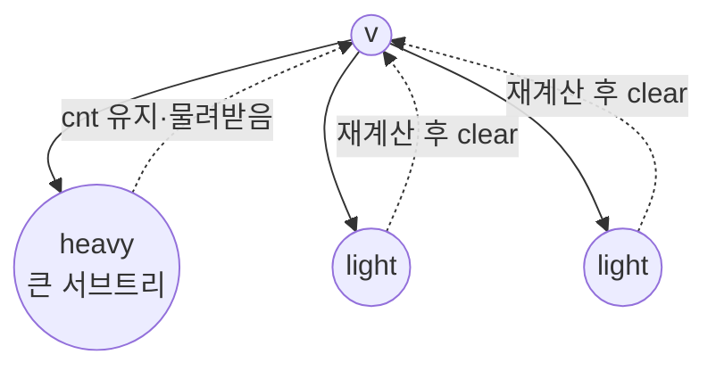

# 오늘의 주제: DSU on tree (Small to Large / Sack)

> 루트 트리에서 **각 정점의 서브트리 전체**에 대한 질의(예: 가장 많이 등장한 색, 색 종류 수, 특정 값 개수)를
> 전체 $O(N \log N)$ 에 오프라인으로 답하는 기법.
> 이름은 "DSU on tree"지만 유니온파인드가 아니라 **작은 집합을 큰 집합에 합치는(small-to-large)** 아이디어가 본질이다.

---

## 1. 문제 상황 — 왜 어려운가

각 정점 $v$ 마다 "$v$ 의 서브트리 안에서 …" 를 물어보는 질의를 생각하자. 예:

- 서브트리에서 **가장 많이 등장하는 색**들의 값 합 (CF600E Lomsat gelral)
- 서브트리 안 **서로 다른 색의 개수**
- 서브트리 안에서 값 $x$ 가 몇 번 나오는가

정점마다 서브트리를 통째로 훑으면 $O(N^2)$. $N=10^5$ 면 터진다.
센트로이드 분할은 "**경로**" 문제에 강하지만, 이건 "**서브트리 집계**" 문제라 결이 다르다. 여기에 딱 맞는 게 small-to-large다.

---

## 2. 핵심 아이디어 — 무거운 자식은 남기고, 가벼운 자식만 다시 센다

DFS로 내려가며 각 정점에서 **현재 서브트리의 집계 상태(cnt 배열 등)** 를 유지한다.
정점 $v$ 를 처리할 때:

1. **가벼운(light) 자식들**을 먼저 재귀 → 답만 기록하고 집계 상태를 **지운다(clear)**.
2. **무거운(heavy) 자식**(서브트리 크기 최대인 자식)을 마지막에 재귀 → 그 집계 상태를 **그대로 물려받는다**.
3. 이제 무거운 자식의 집계가 남아 있으니, **가벼운 자식들의 서브트리 + 자기 자신**만 다시 훑어 cnt에 더한다.
4. 이 시점에 cnt는 정확히 "$v$ 의 서브트리 전체" 상태 → $v$ 의 답을 기록.
5. $v$ 가 부모의 light 자식이면 나중에 clear될 것이고, heavy 자식이면 부모가 물려받는다.

> 무거운 자식의 집계를 **버리지 않고 재사용**하는 게 전부다. 이게 복잡도를 $O(N \log N)$ 으로 만든다.



### 왜 $O(N \log N)$ 인가 (정당성)
한 정점 $u$ 의 데이터가 "다시 훑어지는" 횟수 = 루트→$u$ 경로에서 $u$ 가 **light edge**를 타고 올라가는 횟수.
light edge를 하나 지날 때마다 서브트리 크기가 **최소 2배**가 된다(무거운 자식이 아니었으므로 형제+자기 ≤ 부모 절반).
따라서 각 정점은 최대 $\log N$ 번만 재계산된다 → 총 $O(N \log N)$.

---

## 3. 예제 1 — Lomsat gelral (지배 색 합)

각 정점 색 $c_v$ 가 주어진 루트 트리에서, 각 $v$ 마다
"$v$ 의 서브트리에서 **가장 많이 등장한 색**(동률이면 모두)의 **색 번호 합**"을 구하라. $N \le 10^5$.

**핵심 아이디어**: cnt[색]=등장 횟수를 전역으로 유지. `cnt`를 갱신할 때 현재 최대 등장 횟수 `mx`와 그 합 `sm`을 함께 관리하면, 서브트리 집계가 끝난 순간 답 = `sm`.

```python
import sys
input = sys.stdin.readline

def main():
    N = int(input())
    color = [0] + list(map(int, input().split()))
    g = [[] for _ in range(N + 1)]
    for _ in range(N - 1):
        a, b = map(int, input().split())
        g[a].append(b); g[b].append(a)

    # 1) 서브트리 크기 + heavy 자식 계산 (반복 DFS)
    sz = [1] * (N + 1)
    heavy = [0] * (N + 1)
    par = [0] * (N + 1)
    order = []
    st = [(1, 0)]
    while st:
        v, p = st.pop()
        par[v] = p; order.append(v)
        for nx in g[v]:
            if nx != p:
                st.append((nx, v))
    for v in reversed(order):           # 후위 순서로 크기 합산
        best = 0
        for nx in g[v]:
            if nx != par[v]:
                sz[v] += sz[nx]
                if sz[nx] > best:
                    best = sz[nx]; heavy[v] = nx

    cnt = [0] * (N + 1)
    mx = 0; sm = 0
    ans = [0] * (N + 1)

    def add(v, keep_heavy):
        # v 서브트리 전체를 cnt에 +1 (heavy 자식은 이미 반영됐으면 건너뜀)
        nonlocal mx, sm
        stack = [v]
        while stack:
            u = stack.pop()
            c = color[u]
            cnt[c] += 1
            if cnt[c] > mx:
                mx = cnt[c]; sm = c
            elif cnt[c] == mx:
                sm += c
            for nx in g[u]:
                if nx != par[u] and nx != keep_heavy:
                    stack.append(nx)

    def remove(v):
        nonlocal mx, sm
        stack = [v]
        while stack:
            u = stack.pop()
            cnt[color[u]] -= 1
            for nx in g[u]:
                if nx != par[u]:
                    stack.append(nx)
        mx = 0; sm = 0   # light 서브트리는 통째로 비우므로 리셋

    # 2) small-to-large 본체 (명시적 스택, 두 단계로)
    #    stage 0: 자식들 처리 예약, stage 1: 자기 집계 후 답 기록
    proc = [(1, 0)]
    while proc:
        v, stage = proc.pop()
        if stage == 0:
            # 스택은 LIFO → 나중에 push한 게 먼저 pop.
            # 실행 순서는 반드시 [light들 → heavy → 자기집계]. 따라서 push는 역순:
            proc.append((v, 1))              # 자기집계: 맨 나중 실행 (맨 먼저 push)
            if heavy[v]:
                proc.append((heavy[v], 0))   # heavy: light들보다 나중에 실행 → 상태 유지
            for nx in g[v]:
                if nx != par[v] and nx != heavy[v]:
                    proc.append((nx, 2))     # light: 가장 먼저 실행, 처리 후 clear
        elif stage == 2:                     # light 자식 서브트리: 처리 후 지움
            proc.append((v, 3))
            proc.append((v, 0))
        elif stage == 3:
            remove(v)
        else:  # stage == 1: heavy 상태가 남아있음 → light들 + 자신 추가
            add(v, heavy[v])
            ans[v] = sm

    print(*[ans[i] for i in range(1, N + 1)])

main()
```

- **시간복잡도**: $O(N \log N)$. **공간**: $O(N)$.
- 핵심은 `remove`에서 light 서브트리를 통째로 지우고 `mx,sm`을 리셋한다는 점. heavy 상태를 물려받을 때는 지우지 않는다.

---

## 4. 예제 2 — 서브트리 안 서로 다른 색 개수

각 $v$ 마다 "$v$ 서브트리의 **distinct 색 개수**"를 구하라.
`cnt[c]`가 0→1로 바뀌면 distinct += 1, 1→0이면 distinct -= 1 로 관리하면 동일 골격에 답만 `distinct`로 바꾸면 된다.

```python
# add 안에서:
cnt[c] += 1
if cnt[c] == 1: distinct += 1
# remove 안에서:
cnt[color[u]] -= 1
if cnt[color[u]] == 0: distinct -= 1
# light 리셋 시 distinct = 0
```

> 이렇게 "**갱신 함수(add/remove)만 교체**"하면 대부분의 서브트리 집계 문제에 그대로 재사용된다. 골격은 고정, 집계 로직만 갈아끼운다.

---

## 5. 자주 하는 실수

- **light 서브트리를 안 지움**: 형제로 넘어가기 전 반드시 `remove`로 cnt를 0으로 되돌려야 한다. 안 지우면 옆 서브트리 집계가 오염된다.
- **heavy 자식도 지워버림**: 물려받아야 하는데 지우면 $O(N^2)$ 로 퇴화. `add(v, keep_heavy)`에서 heavy 자식을 건너뛰는 게 포인트.
- **재귀 깊이**: 파이썬 재귀로 짜면 $N=10^5$ 편향 트리에서 스택 오버플로. 위처럼 **명시적 스택**을 쓰거나 `sys.setrecursionlimit(300000)` + 빠른 입출력.
- **mx/sm 갱신 순서**: `add`에서만 최대치를 올리고, light `remove`에서는 리셋만. remove 도중 mx를 감소 추적하려 하면 복잡하고 버그난다(어차피 통째로 비우니 리셋이 안전).
- **heavy 계산 누락**: sz를 후위(post-order)로 정확히 합산해야 heavy 자식이 맞다.
- **cnt 배열 크기**: `cnt`는 **색 값의 최댓값+1** 크기여야 한다. Lomsat gelral은 색이 $1..N$ 이라 `N+1`로 충분하지만, 색이 $10^9$ 같이 크면 먼저 **좌표압축**하고 인덱싱하라.

---

## 6. Python 템플릿 (골격만)

```python
# 준비: sz[], heavy[], par[] 계산 후
cnt = [0]*(MAXV); STAT = 0        # STAT: 문제별 집계값(distinct, sm 등)

def add(v, skip):                 # v 서브트리를 +1 (skip=heavy는 제외)
    for u in subtree(v, skip):
        update_add(color[u])      # cnt 갱신 + STAT 갱신
def remove(v):                    # v 서브트리를 통째로 -1 후 STAT 리셋
    for u in subtree(v):
        cnt[color[u]] -= 1
    reset(STAT)

def solve(v):
    for c in light_children(v): solve(c); remove(c)   # 가벼운 자식: 계산 후 소거
    if heavy[v]: solve(heavy[v])                       # 무거운 자식: 상태 유지
    add(v, heavy[v])                                   # light들 + 자신 추가
    ans[v] = STAT
```

- 언제 쓰나: **정적 루트 트리 + 각 정점의 서브트리에 대한 집계형 오프라인 질의**.
- 안 맞는 경우: 경로 질의(→센트로이드/HLD), 온라인 갱신이 섞인 경우(→오일러투어+세그트리, 머지소트트리, PST).

---

## 7. 한 줄 요약

> **무거운 자식의 집계는 물려받고, 가벼운 자식만 다시 센다.**
> light edge를 지날 때마다 크기가 2배 → 각 원소 재계산 $\le \log N$ 번 → 전체 $O(N \log N)$.
