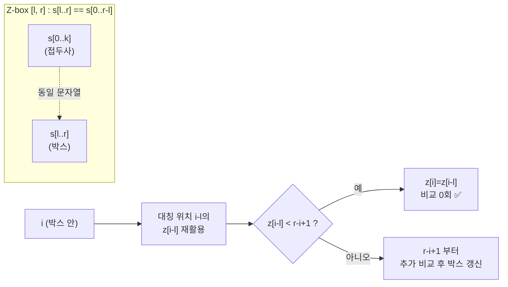

# Z 알고리즘 (Z-function)

> **오늘의 주제: Z 알고리즘 (Z-function / Z-array)**
> 문자열 `s`에 대해, 각 위치 `i`에서 시작하는 부분문자열이 **`s`의 접두사(prefix)와 몇 글자까지 일치하는지**를 한 번의 선형 스캔으로 모두 구하는 알고리즘. `O(N)`.

---

## 1. 정의

문자열 `s` (길이 `n`)에 대해 배열 `z`를 다음과 같이 정의한다.

- `z[i]` = `s`와 `s[i:]`의 **최장 공통 접두사(LCP) 길이**
- 즉 `z[i]` = `s[0..k-1] == s[i..i+k-1]` 를 만족하는 최대 `k`
- 관례상 `z[0] = 0` (또는 `n`으로 두기도 하지만 보통 0으로 두고 무시)

예: `s = "aabxaabxcaabxaabxay"`

```
index : 0 1 2 3 4 5 6 7 8 9 ...
s     : a a b x a a b x c a  a  b  x  a  a  b  x  a  y
z     : 0 1 0 0 4 1 0 0 0 ... (z[4]=4 → "aabx" 일치)
```

**핵심 직관:** `z[i]`가 크다는 것은 "위치 `i`에서 원본의 앞부분이 다시 등장한다"는 뜻. 그래서 **패턴 매칭·주기(period) 판정·문자열 압축** 문제에 바로 쓰인다.

---

## 2. 왜 O(N)인가 — Z-box (핵심 아이디어)

가장 오른쪽까지 뻗은 일치 구간 `[l, r]`을 **Z-box**라 부른다. `s[l..r] == s[0..r-l]` 를 항상 만족하도록 유지한다.

`i`를 계산할 때:

1. **`i <= r` (박스 안):** `i`는 이미 아는 접두사 영역에 대응. 대칭 위치 `i-l`의 값 `z[i-l]`을 재활용한다.
   - 박스를 넘지 않으면(`z[i-l] < r-i+1`): `z[i] = z[i-l]` 로 확정 (비교 0회).
   - 박스 경계에 걸리면: `z[i] = r-i+1` 에서 시작해 추가 비교.
2. **`i > r` (박스 밖):** `z[i] = 0`부터 직접 비교 시작.

그 뒤 `s[z[i]] == s[i+z[i]]` 인 동안 `z[i]`를 늘리고, `i+z[i]-1 > r` 이면 박스 `[l,r]`을 갱신.

> **정당성/복잡도:** 포인터 `r`은 절대 뒤로 가지 않는다. 명시적 문자 비교가 성공할 때마다 `r`이 증가하므로 성공 비교 총합 ≤ `n`. 실패 비교는 각 `i`당 최대 1회. 따라서 전체 **O(N)**.



---

## 3. Python 템플릿

```python
def z_function(s: str) -> list[int]:
    n = len(s)
    z = [0] * n
    l = r = 0                      # 현재 Z-box [l, r]
    for i in range(1, n):
        if i < r:                  # 박스 안 → 대칭값 재활용
            z[i] = min(r - i, z[i - l])
        while i + z[i] < n and s[z[i]] == s[i + z[i]]:
            z[i] += 1              # 박스 경계 넘어 직접 확장
        if i + z[i] > r:           # 더 멀리 뻗었으면 박스 갱신
            l, r = i, i + z[i]
    return z
```

- `z[i] = min(r - i, z[i-l])` 한 줄이 두 경우(박스 안전/경계걸침)를 모두 처리하는 관용구.
- `z[0]`은 0으로 남겨두고 쓰지 않는다.

---

## 4. 대표 예제

### 예제 A. 부분문자열 패턴 매칭 (KMP 대체)

패턴 `p`가 텍스트 `t` 안에서 나타나는 모든 위치를 찾기.
**`s = p + '#' + t`** (구분자 `#`는 `p`,`t`에 없는 문자)로 이어붙인 뒤 Z를 구한다.
`z[i] == len(p)` 인 위치가 매칭 시작점.

```python
def find_all(t: str, p: str) -> list[int]:
    m = len(p)
    s = p + '\x00' + t             # 구분자로 겹침 방지
    z = z_function(s)
    res = []
    for i in range(m + 1, len(s)):
        if z[i] == m:              # 접두사(=패턴 전체)와 완전 일치
            res.append(i - m - 1)  # t 기준 시작 인덱스
    return res
```

- 시간복잡도: `O(n + m)`. KMP와 동일하지만 실패함수 없이 배열 하나로 끝난다.
- 자주 하는 실수: 구분자를 안 넣으면 패턴과 텍스트가 이어져 `z[i] > m`이 나올 수 있음 → 반드시 삽입.

### 예제 B. 문자열의 최소 주기 (period)

`s`를 반복으로 채웠을 때의 최소 반복 단위 길이. 길이 `p`가 주기이려면 `z[p] == n - p` 이면서 `n % p == 0`(완전 반복일 때).

```python
def smallest_period(s: str) -> int:
    n = len(s)
    z = z_function(s)
    for p in range(1, n):
        if p + z[p] == n and n % p == 0:
            return p               # s는 s[:p]의 반복
    return n                       # 주기 없음(자기 자신)
```

- 예: `"abcabcabc"` → 주기 `3`. `"ababab"` → `2`.
- 아이디어: 위치 `p`에서 접두사와 `s` 끝까지(`n-p`글자) 일치하면, 앞뒤가 `p`만큼 어긋나도 겹치므로 `p`가 주기가 된다.

---

## 5. KMP vs Z — 언제 무엇을

| 항목 | Z 알고리즘 | KMP(failure func) |
|------|-----------|------------------|
| 정의 대상 | 각 위치의 **접두사 일치 길이** | 각 위치의 **접두사=접미사 최대 길이** |
| 구현 난이도 | 배열 1개, 짧음 | 실패함수 + 매칭 2단계 |
| 대표 용도 | 매칭, 주기, 중복 접두사 카운트 | 매칭, 오토마타, 접미사링크 |

> 둘은 상호 변환 가능. Z가 더 직관적이라 **"접두사가 어디서 다시 나오나?"** 류 문제엔 Z가 편하다.

---

## 6. 자주 하는 실수 정리

- 구분자 없이 `p+t` 이어붙이기 → 매칭 위치 오류.
- `z[0]`을 실제 값으로 쓰기(0으로 두고 무시할 것).
- 박스 안에서 `min(r-i, z[i-l])` 대신 `z[i-l]`만 쓰기 → 박스를 넘어선 잘못된 값 사용.
- `while` 조건에서 `i + z[i] < n` 경계 검사 누락 → 인덱스 초과.

---

## 관련 문제 (백준)

- 1305 광고 (최소 주기)
- 1786 찾기 (KMP/Z 매칭)
- 13576 Prefix와 Suffix (Z + 접두사 등장 횟수)
