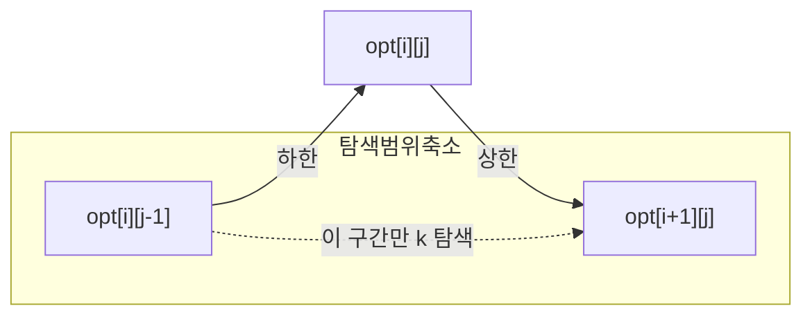

# 오늘의 주제: 크누스 최적화 (Knuth Optimization, DP 최적화)

구간 병합형 DP `dp[i][j] = min_{i≤k<j} (dp[i][k] + dp[k+1][j]) + C[i][j]` 를
**O(N³) → O(N²)** 로 줄이는 기법. **최적 분할점의 단조성**을 이용한다.

D&C 최적화 · 컨벡스 헐 트릭과 함께 "DP 최적화 3종 세트"를 이룬다.
- **CHT**: 선형 전이 `dp[j] = min(a[k]·x + b[k])`
- **D&C opt**: `dp[t][i] = min_k dp[t-1][k] + C[k][i]` (레이어 분리형)
- **Knuth**: `dp[i][j] = min_k dp[i][k]+dp[k+1][j] + C[i][j]` (구간형) ← 오늘

---

## 언제 쓰는가 — 적용 조건

점화식이 위 구간 병합 형태이고, 비용 `C`가 두 조건을 만족할 때:

1. **사각부등식 (Quadrangle Inequality, QI)**
   `C[a][c] + C[b][d] ≤ C[a][d] + C[b][c]`  (a ≤ b ≤ c ≤ d)
2. **단조성 (Monotonicity)**
   `C[b][c] ≤ C[a][d]`  (a ≤ b ≤ c ≤ d, 즉 구간이 포함되면 비용도 작거나 같음)

이 두 조건이 성립하면 최적 분할점 `opt[i][j]` 가 다음을 만족한다:

> **opt[i][j-1] ≤ opt[i][j] ≤ opt[i+1][j]**

즉 `k` 를 항상 `1..j` 전체가 아니라 `opt[i][j-1] .. opt[i+1][j]` 좁은 구간만 탐색하면 된다.

### 왜 O(N²)인가 (정당성)
길이 `len = j-i` 를 바깥 루프로 돌리면, 같은 `len`에서
분할점 탐색 범위의 합이 **텔레스코핑**으로 `O(N)`이 된다:
`Σ_i (opt[i+1][j] - opt[i][j-1]) = opt[..] 텔레스코핑 ≈ N`.
따라서 `len` 종류 N개 × O(N) = **O(N²)**.

> **핵심 포인트**: 구현 자체는 O(N³) 삼중 루프에서 안쪽 `k` 범위만
> `opt` 로 바꾸면 끝. 어려운 건 "이 문제에 Knuth를 써도 되는가"의 판별이다.
> 대표 신호 → **파일/돌 합치기, 최적 BST, 인접한 것만 병합하는 비용 최소화**.

---

## 사각부등식 판별 팁 (자주 하는 실수)
- 비용이 **누적합 구간합** `C[i][j] = S[j]-S[i-1]` 형태면 QI가 등호로 성립(합치는 순서 무관 비용)이라 거의 항상 적용 가능.
- 조건을 증명하기 애매하면 **작은 N에서 O(N³) 완전탐색과 결과를 비교**해 실험적으로 확인하고 제출.
- `opt` 배열을 **초기화/갱신하는 순서**를 틀리면 범위가 깨진다 → 반드시 `len` 오름차순으로 채운다.

---

## 대표 예제 1 — 파일 합치기 (BOJ 11066)

인접한 두 파일만 합칠 수 있고, 합치는 비용은 두 파일 크기의 합.
전체를 하나로 합칠 때의 **최소 비용**. (T개의 테스트, N ≤ 500)

- **점화식**: `dp[i][j] = min_{i≤k<j}(dp[i][k]+dp[k+1][j]) + (S[j]-S[i-1])`
- 비용이 구간합이라 QI·단조성 성립 → Knuth 적용, O(N²).
- 시간복잡도: 테스트당 **O(N²)** (naive는 O(N³)).

```python
import sys
input = sys.stdin.readline

def solve():
    n = int(input())
    a = [0] + list(map(int, input().split()))   # 1-indexed
    S = [0] * (n + 1)
    for i in range(1, n + 1):
        S[i] = S[i-1] + a[i]

    INF = float('inf')
    dp  = [[0]*(n+1) for _ in range(n+1)]
    opt = [[0]*(n+1) for _ in range(n+1)]
    for i in range(1, n+1):
        opt[i][i] = i          # 길이 1: 자기 자신이 분할점

    # len = 구간 길이 (2..n), 반드시 짧은 것부터
    for length in range(2, n+1):
        for i in range(1, n - length + 2):
            j = i + length - 1
            dp[i][j] = INF
            lo, hi = opt[i][j-1], opt[i+1][j]      # 좁힌 탐색 범위
            for k in range(lo, hi + 1):
                cost = dp[i][k] + dp[k+1][j]
                if cost < dp[i][j]:
                    dp[i][j] = cost
                    opt[i][j] = k
            dp[i][j] += S[j] - S[i-1]              # 병합 비용은 항상 더해짐
    print(dp[1][n])

for _ in range(int(input())):
    solve()
```

- **자주 하는 실수**: `dp[i][j] += 구간합` 을 min 루프 **안**에서 더하면 안 됨(상수라 밖에서 한 번). `opt[i][i]=i` 초기화 누락 시 첫 `lo` 가 0이 됨.

---

## 대표 예제 2 — 최적 이진 검색 트리 (Optimal BST) 골자

키 `i..j` 로 만드는 BST 탐색 비용 최소화. 루트를 `k`로 잡으면
`dp[i][j] = min_k (dp[i][k-1] + dp[k+1][j]) + Σ_{i≤t≤j} freq[t]`.

빈도 구간합이 QI를 만족 → 동일하게 Knuth로 **O(N²)**.
(위 코드에서 `dp[i][k]+dp[k+1][j]` 를 `dp[i][k-1]+dp[k+1][j]` 로,
분할점 범위를 루트 후보로 바꾸면 됨.)

---

## 최적 분할점 단조성 직관 (다이어그램)



구간을 오른쪽으로 한 칸 넓히거나(`j-1→j`) 왼쪽을 한 칸 줄이면(`i→i+1`)
최적 분할점은 **왼쪽으로 가지 않는다**. 그래서 각 셀의 탐색 구간을
`[opt[i][j-1], opt[i+1][j]]` 로 가둘 수 있다.

---

## Python 템플릿 (요약)

```python
# dp[i][j] = min_{lo..hi} dp[i][k]+dp[k+1][j] + cost(i,j)
# 조건: cost가 사각부등식 + 단조성 만족  →  O(N^2)
for i in range(1, n+1):
    opt[i][i] = i
for length in range(2, n+1):
    for i in range(1, n-length+2):
        j = i + length - 1
        dp[i][j] = INF
        for k in range(opt[i][j-1], opt[i+1][j] + 1):  # 핵심: 좁힌 범위
            c = dp[i][k] + dp[k+1][j]
            if c < dp[i][j]:
                dp[i][j], opt[i][j] = c, k
        dp[i][j] += cost(i, j)                          # 상수항은 밖에서
```

---

## 정리
- **꼴 인식**: 구간 병합형 `dp[i][j] = min_k dp[i][k]+dp[k+1][j] + C[i][j]`.
- **적용 근거**: `C` 가 사각부등식 + 단조성 ⇒ `opt[i][j-1] ≤ opt[i][j] ≤ opt[i+1][j]`.
- **효과**: 안쪽 `k` 루프를 `opt` 범위로 좁혀 O(N³) → **O(N²)**.
- **실전 신호**: "인접한 것만 합치는 비용 최소화" = 파일/돌 합치기, 최적 BST.
