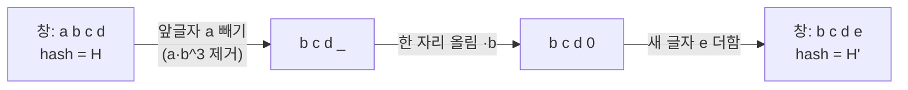

# 롤링 해시 (Rolling Hash / Rabin-Karp)

> **오늘의 주제:** 문자열을 **정수(다항식 값)로 바꿔서** 부분문자열 비교를 `O(1)`에 하는 **롤링 해시**. 패턴 매칭·최장반복부분문자열·회문 판별 등에서 KMP/Z가 애매할 때 만능 카드로 쓴다.

---

## 1. 핵심 아이디어 — 문자열을 base b 진법 수로

문자열 `s`를 base `b`, 소수 mod `p` 위의 **다항식 해시**로 본다.

```
H(s) = ( s[0]·b^(n-1) + s[1]·b^(n-2) + ... + s[n-1]·b^0 )  mod p
```

즉 문자열을 하나의 큰 수로 압축한다. 두 문자열이 같으면 해시도 반드시 같다. 해시가 다르면 문자열은 확실히 다르다. (해시가 같아도 다를 수 있음 → **충돌**, 아래 참고)

**왜 강력한가?** prefix hash를 미리 계산해 두면, 임의 구간 부분문자열의 해시를 `O(1)`에 꺼낼 수 있다.

### prefix hash 로 구간 해시 O(1)

`H[0]=0`, `H[i] = H[i-1]·b + s[i-1]  (mod p)` 로 누적하면,
부분문자열 `s[l..r)` (길이 `r-l`, 0-indexed) 의 해시는:

```
hash(l, r) = ( H[r] - H[l]·b^(r-l) )  mod p
```

파이썬은 음수 `%` 가 자동으로 양수로 나오므로 보정 불필요.

---

## 2. Rabin-Karp — 슬라이딩 창으로 굴리기

길이 `m` 고정 창을 한 칸씩 밀 때, 새 해시를 `O(1)`에 갱신한다.
맨 앞 글자를 빼고(`·b^(m-1)`), 전체를 한 자리 올리고(`·b`), 새 글자를 더한다.

```
new = ( (old - s[i-m]·b^(m-1))·b + s[i] )  mod p
```



전체 텍스트 길이 `n`, 패턴 길이 `m` → **전체 매칭 O(n + m)**.

---

## 3. 충돌과 더블 해싱 (실전 필수)

서로 다른 문자열이 우연히 같은 해시를 가질 수 있다(생일 역설). mod 하나(약 10^9)면 문제 데이터에서 뚫리는 경우가 있다.
→ **서로 다른 두 (base, mod) 쌍으로 해시를 2개 만들어 둘 다 같을 때만 일치**로 판정하면 충돌 확률이 사실상 0에 수렴한다.

- `base` 는 알파벳 크기보다 크게 (예: 131, 137, 31)
- `mod` 는 큰 소수 (예: 1_000_000_007, 998_244_353)

---

## 4. 예제 1 — BOJ 15829 Hashing (해시값 계산 기본)

소문자 문자열의 해시값 `Σ (c_i)·a^i mod M` 를 구한다. (`a=31`, `M=1234567891`, `c=글자-'a'+1`)
가중치가 **낮은 자리부터** `a^0, a^1, ...` 로 붙는 버전.

```python
import sys
input = sys.stdin.readline

n = int(input())
s = input().strip()
M, a = 1234567891, 31

h, p = 0, 1
for ch in s:
    h = (h + (ord(ch) - ord('a') + 1) * p) % M
    p = (p * a) % M
print(h)
```

- **아이디어:** 자리 가중치 `p = a^i` 를 매 글자마다 곱해 누적. 미리 pow 계산 불필요.
- **시간복잡도:** `O(n)`

---

## 5. 예제 2 — BOJ 16916 부분 문자열 (P가 S의 부분문자열인가)

문자열 `S` 안에 `P` 가 부분문자열로 존재하면 1, 아니면 0. KMP 정석 문제지만 **롤링 해시로도 O(N)** 에 풀린다. 충돌 방지를 위해 **더블 해싱** 사용.

```python
import sys

def solve():
    S = sys.stdin.readline().strip()
    P = sys.stdin.readline().strip()
    n, m = len(S), len(P)
    if m > n:
        print(0); return

    M1, M2 = 1_000_000_007, 998_244_353
    b1, b2 = 131, 137

    # 패턴 해시
    hp1 = hp2 = 0
    for c in P:
        hp1 = (hp1 * b1 + ord(c)) % M1
        hp2 = (hp2 * b2 + ord(c)) % M2

    pw1, pw2 = pow(b1, m - 1, M1), pow(b2, m - 1, M2)  # 최고차 가중치

    # 첫 창(윈도우) 해시
    h1 = h2 = 0
    for i in range(m):
        h1 = (h1 * b1 + ord(S[i])) % M1
        h2 = (h2 * b2 + ord(S[i])) % M2
    if h1 == hp1 and h2 == hp2:
        print(1); return

    # 창을 한 칸씩 굴리기
    for i in range(m, n):
        h1 = ((h1 - ord(S[i - m]) * pw1) * b1 + ord(S[i])) % M1
        h2 = ((h2 - ord(S[i - m]) * pw2) * b2 + ord(S[i])) % M2
        if h1 == hp1 and h2 == hp2:
            print(1); return
    print(0)

solve()
```

- **아이디어:** 패턴 해시 1번 계산 → 텍스트 창을 굴리며 매칭. 두 해시가 모두 같으면 일치.
- **시간복잡도:** `O(n + m)`
- **정당성:** 다항식 해시는 문자열이 같으면 반드시 같다. 더블 해싱으로 우연한 충돌 확률을 무시할 만큼 낮춘다.

---

## 6. Python 템플릿 — prefix hash (구간 비교용)

```python
class Hasher:
    def __init__(self, s, b=131, mod=1_000_000_007):
        self.b, self.mod = b, mod
        n = len(s)
        self.H = [0] * (n + 1)      # 누적 해시
        self.P = [1] * (n + 1)      # b^i
        for i, ch in enumerate(s):
            self.H[i + 1] = (self.H[i] * b + ord(ch)) % mod
            self.P[i + 1] = (self.P[i] * b) % mod

    def get(self, l, r):            # s[l..r) 해시, O(1)
        return (self.H[r] - self.H[l] * self.P[r - l]) % self.mod
```

- **활용:** 두 부분문자열이 같은지 `hasher.get(l1, r1) == hasher.get(l2, r2)` 로 O(1) 비교.
- **응용 문제:** 최장 중복 부분문자열(길이 이분탐색 + 해시), 회문 판별(정방향/역방향 해시), 문자열 주기 판정 등.

---

## 7. 자주 하는 실수

- **base 를 알파벳 크기보다 작게** 잡음 → 서로 다른 글자가 겹쳐 충돌 급증. `b ≥ 128` 권장.
- **mod 하나만** 쓰다 저격 데이터에 충돌. 안전하게 가려면 **더블 해싱**.
- prefix 공식에서 **`b^(r-l)` 의 지수(구간 길이)** 를 헷갈림. 항상 `길이 = r - l`.
- 첫 창을 만들 때와 굴릴 때의 **누적 방향(높은 자리 vs 낮은 자리)** 을 섞어 씀 → 한 컨벤션으로 통일.
- (C/C++ 한정) 음수 mod 보정 필요. **파이썬은 `%` 가 이미 양수** 라 신경 안 써도 됨.
